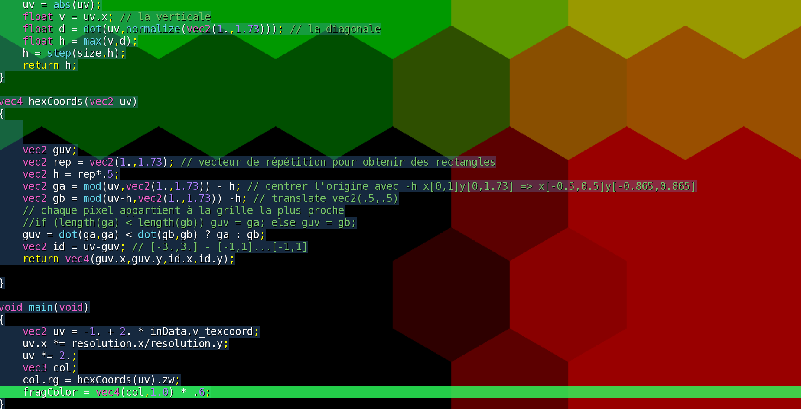
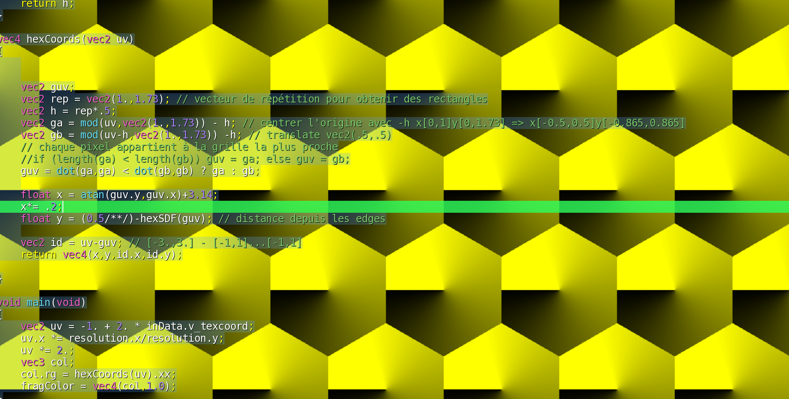

# SDF d'un hexagone
Première chose à remarquer: la symétrie en $X$ et en $Y$.


On peut diviser la forme en 4 quadrants, et du coup se concentrer sur un seul quadrant.


On remarque 2 lignes, les pixels qui appartiennent à l'hexagone se situent à la fois:
- **à gauche de la ligne verticale**
- **et**
- **en dessous de la ligne diagonale**


## Ligne verticale
C'est assez simple, on la détermine grâce à la position du pixel en $X$.


## Ligne diagonale
Pour obtenir n'importe quelle ligne arbitraire on peut utiliser le produit scalaire `dot(vector1,vector2)`.
On peut par exemple demander le produit scalaire entre un point de l'espace et un angle, qui sera exprimé par un ratio en $X$ et $Y$.
```cpp
float c = dot(uv, vec2(1.,1.)); // donnera un angle de 45°
```


Pour une valeur plus juste, il faut penser à normaliser le vecteur, car en l'état le vecteur à une longueur de $\sqrt{2}$.


Pour trouver la bonne valeur de l'angle, il faut s'intéresser aux propriétés de l'hexagone.
En effet, dans le cas de l'hexagone, l'angle que l'on recherche ne vaut pas $45°$.


Si on fait pivoter le triangle rectangle du schéma ci-dessus on met en évidence le vecteur que l'on recherche (celui décrit par l'hypothénuse)


Il faut donc trouver le ratio $X / Y$ du premier triangle, et ensuite inverser les composantes pour trouver le bon angle. On ne s'intéresse pas tellement aux valeurs exactes de $X$ et $Y$ car à la fin le vecteur sera normalisé.


Pour cela, on va doubler la taille du triangle, et considérer l'hexagone particulier tel que $Y=1$ (cela n'influera pas le résultat, car encore une fois il sera normalisé, de plus on ne s'intéresse qu'au rapport entre $X$ et $Y$).


Ce que l'on remarque, c'est que si $Y = 1$, alors chaque côté de l'hexagone vaut $1$.
On peut donc en déduire que l'hypoténuse du grand triangle vaut $2$.


On fait alors appel au théorème de Pythagore pour trouver la valeur de $X$:

$$
\begin{aligned}
X^2 + 1^2 = 2^2 \\\\
X^2 + 1 = 4 \\\\
X^2 = 3 \\\\
X = \sqrt{3} \approx 1.73
\end{aligned}
$$

Pour retrouver le ratio que l'on cherchait au départ, il faut inverser les composantes $X$ et $Y$.
On trouve donc le ratio `vec2(1.,1.73)`.


Et voici le résultat lorsque l'on applique la symétrie:


Il suffit maintenant de calculer l'intersection entre la verticale et la diagonale en utilisant la fonction `max`:


Il ne reste plus qu'à rassembler tout ça dans une fonction:
```cpp
float hexSDF(vec2 uv, float size)
{
    uv = abs(uv);
    float v = uv.x; // la verticale
    float d = dot(uv,normalize(vec2(1.,1.73))); // la diagonale
    float h = max(v,d);
    h = step(size,h);
    return h;
}
```


# Pavage hexagonal
Commençons par dessiner un pavage classique composé de carrés:


On va dessiner un deuxième pavage de telle manière que chaque centre des carrés du deuxième pavage se situera dans le coin supérieur droit de chaque carré du premier pavage.
Comme les coordonnées sont centrées, il suffit de décaler la position des pixels de $0.5$ unités en $X$ et en $Y$.


On centre l'origine au milieu de chaque carré grâce à un offset de $0.5$.


Maintenant, pour chaque pixel de l'écran, on détermine de quelle grille nous sommes le plus proche.


On peut écrire aussi:
```cpp
vec2 guv = dot(ga,ga) < dot(gb,gb) ? ga : gb;
```

Ce que l'on remarque, c'est que l'on obtient des losanges et non des hexagones.
En effet, un hexagone n'a pas une largeur égale à sa hauteur.
Donc lorsque l'on réalise un offset de $0.5$ en $X$ et $Y$ les hexagones vont se superposer, ce qui est incorrect.


Aussi, si on fait un offset de $1.0$ seulement en $Y$ on aura aussi une superposition.


Il faudrait donc décaler en $Y$ de telle manière qu'il y ait assez de place pour caler un autre hexagone (décalé de $0.5$ en $X$).


On remarque que ce n'est pas d'une grille carrée dont on a besoin, mais plutôt d'une grille rectangulaire:


On constate que le vecteur de translation avec cette grille rectangulaire est le même que celui que l'on a déterminé pour la SDF de l'hexagone. On aura donc le même ratio `vec2(1.,1.73)`.

Pour obtenir la grille rectangulaire, il faut utiliser la fonction `mod` pour répéter l'espace de manière arbitraire. (la fonction `fract` correspond à **modulo 1**).


Si on choisit la grille la plus proche pour chaque pixel on obtient nos hexagones avec le repère cartésien *classique*.


Maintenant rassemblons tout cela dans une fonction, mais en plus de renvoyer le nouvel espace, on retournera un id qui renverra aussi l'id des cellules hexagonales pour savoir dans quelle cellule on se situe.
La fonction contient donc 4 informations: elle renvoie un `vec4`.


Pour l'id, on remarque que l'espace des grilles `ga` et `gb` est répété au même rythme. Pour obtenir un identifiant unique on soustrait l'espace hexagonal à l'espace originel `uv`.


On multiplie par un nombre plus petit que 1 pour mieux visualiser:



Les coordonnées cartésiennes que l'on vient créer sont pratiques pour dessiner dessus, mais pas adaptées si on veut fusionner les cellules.
On aurait besoin d'une information qui nous indique la distance qui nous sépare soit du centre, soit des *edges* (côtés) de l'hexagone.
Pour cela on peut réutiliser la SDF de l'hexagone qui détermine la distance qui nous sépare du centre de l'hexagone.


Pour obtenir la distance depuis les edges, on soustrait la distance à $0.5$ car on sait que c'est la distance qui nous sépare du centre des rectangles des edges.


On pourrait aussi transmettre l'information qui permet de connaître l'angle du pixel dans le cercle trigonométrique dans la première composante du `vec4` grâce à la fonction `atan`.


Pour mieux visualiser et éliminer le noir:



## Mise en pratique


## Code GLSL
```cpp
#version 150

uniform float time;
uniform vec2 resolution;
uniform vec2 mouse;
uniform vec3 spectrum;

uniform sampler2D texture0;
uniform sampler2D texture1;
uniform sampler2D texture2;
uniform sampler2D texture3;
uniform sampler2D prevFrame;
uniform sampler2D prevPass;

in VertexData
{
    vec4 v_position;
    vec3 v_normal;
    vec2 v_texcoord;
} inData;

out vec4 fragColor;

float hexSDF(vec2 uv)
{
    uv = abs(uv);
    float v = uv.x; // la verticale
    float d = dot(uv,normalize(vec2(1.,1.73))); // la diagonale
    float h = max(v,d);
    
    return h;
}

vec4 hexCoords(vec2 uv)
{
    
    
    vec2 guv;
    vec2 rep = vec2(1.,1.73); // vecteur de répétition pour obtenir des rectangles
    vec2 h = rep*.5;
    vec2 ga = mod(uv,vec2(1.,1.73)) - h; // centrer l'origine avec -h x[0,1]y[0,1.73] => x[-0.5,0.5]y[-0.865,0.865]
    vec2 gb = mod(uv-h,vec2(1.,1.73)) -h; // translate vec2(.5,.5)
    // chaque pixel appartient à la grille la plus proche
    //if (length(ga) < length(gb)) guv = ga; else guv = gb;
    guv = dot(ga,ga) < dot(gb,gb) ? ga : gb;
    
    float x = atan(guv.y,guv.x);
    
    float y = (0.5/**/)-hexSDF(guv); // distance depuis les edges
    
    vec2 id = uv-guv; // [-3.,3.] - [-1,1]...[-1,1]
    return vec4(x,y,id.x,id.y);

}

void main(void)
{
    vec2 uv = -1. + 2. * inData.v_texcoord;
    uv.x *= resolution.x/resolution.y;
    uv *= 2.;
    vec3 col;
    vec4 hc = hexCoords(uv); // hex coordinates
    float c = smoothstep(0.02,.025, hc.y*sin(hc.z+time)*sin(hc.w+time));
    col+= c;
    fragColor = vec4(col,1.0);
}
```


# Vidéo originale
- https://youtu.be/VmrIDyYiJBA (the art of code)

