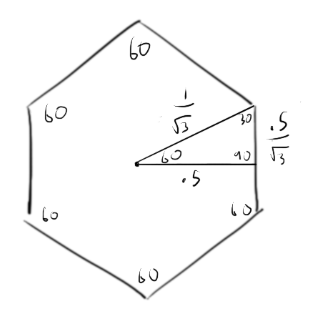
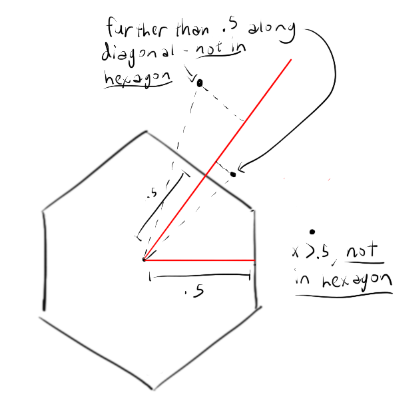
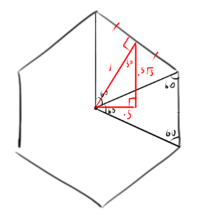
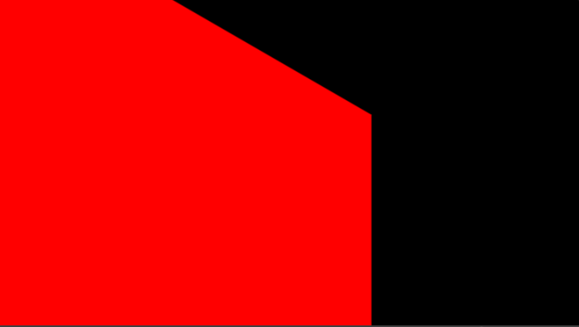
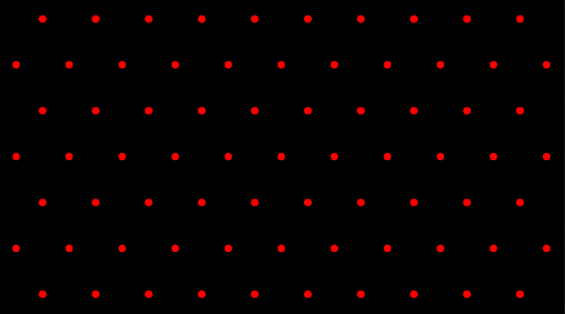
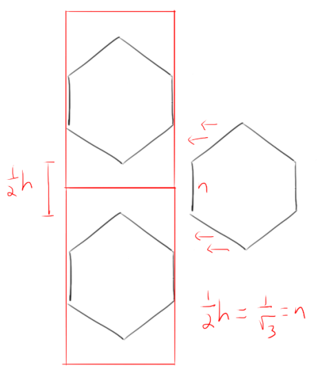
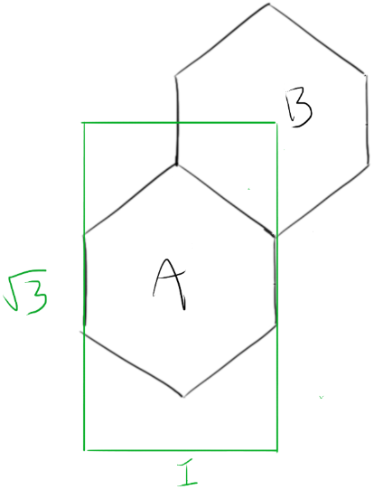
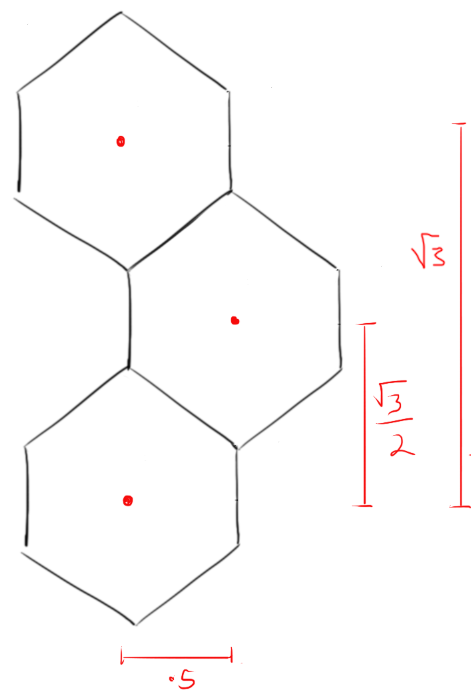

# Tutoriel de graphisme procédural : Effets hexagonaux
J'ai remarqué récemment que beaucoup d'effets 2D vraiment intéressants sur [shadertoy.com](https://www.shadertoy.com/) impliquent des motifs répétitifs et des grilles d'une sorte ou d'une autre. **Les grilles cartésiennes standard, les grilles triangulaires et les grilles hexagonales semblent être les plus courantes.** Les hexagones en particulier ont un aspect très cool et futuriste, ce qui explique que des motifs hexagonaux apparaissent dans de nombreux fonds d'écran et dessins de science-fiction.

Voici quelques effets que j'ai créés récemment en utilisant cette technique (cliquez sur les gifs pour voir le code) :


Nous allons explorer deux façons particulièrement élégantes de rendre les hexagones. **La première technique est mieux adaptée au rendu d'un seul hexagone. La seconde technique génère une grille hexagonale.** Ces deux techniques sont utiles si vous souhaitez obtenir une large gamme d'effets hexagonaux et sont toutes deux utilisées dans les effets que j'ai montrés ci-dessus. Elles sont loin d'être les seules techniques de rendu hexagonal existantes, mais elles sont propres, rapides, et ce sont les premières que j'ai rencontrées. Avant d'entrer dans le vif du sujet, je dois rendre à César ce qui lui appartient : j'ai appris ces techniques mathématiques en étudiant [ce shader](https://www.shadertoy.com/view/Xljczw) de [Shane](https://www.shadertoy.com/user/Shane), un utilisateur de shadertoy (je vous encourage d'ailleurs à consulter le reste de son travail - ce type est un magicien des shaders).

Pour les deux algorithmes ci-dessous, supposons que notre but est de rendre un hexagone (ou une grille d'hexagones) où chaque hexagone a exactement **1 unité de large**. **Nous aurons affaire à des hexagones à sommet pointu** plutôt qu'à des hexagones à sommet plat, et nous aurons affaire à **des grilles hexagonales qui sont décalées par ligne plutôt que par colonne.**

Avant de poursuivre, il est également utile de connaître la hauteur de l'hexagone, que nous pouvons facilement calculer en fonction de sa largeur :



> La hauteur de l'hexagone est $2 / \sqrt{3}$ car elle est égale à 2 * la longueur de l'hypoténuse calculée ci-dessus.

# Méthode 1 : Fonction de distance hexagonale
Pour rendre un hexagone unique, nous utiliserons [une fonction de distance signée](http://jamie-wong.com/2016/07/15/ray-marching-signed-distance-functions/#signed-distance-functions) (**SDF** en abrégé). **Une SDF permet de décrire une forme à l'aide d'une fonction mathématique.** Typiquement, **une SDF renvoie la distance d'un point donné par rapport à la limite de la forme.** **Les valeurs positives indiquent que le point est à l'extérieur de la forme, les valeurs négatives indiquent que le point est à l'intérieur de la forme, et une valeur de zéro indique que le point est à la limite de la forme.**

Si nous voulions, par exemple, dessiner un hexagone rouge sur un fond noir, nous mettrions en œuvre une fonction de distance pour l'hexagone, puis nous attribuerions une couleur rouge aux pixels situés à l'intérieur de la forme et une couleur noire aux pixels situés à l'extérieur de la forme. Voici la fonction de distance pour un hexagone.

```cpp
float calcHexDistance(vec2 p)
{
     const float hexHalfWidth= .5;
     // 1.7320508 is sqrt(3)
     const float s = vec2(1, 1.7320508);
     p = abs(p);
     return max(dot(p, s * .5), p.x) - hexHalfWidth;
}
```

[Voici un shader](https://www.shadertoy.com/view/MsVBWt) qui utilise cette formule pour rendre un simple hexagone. Il s'agit simplement de calculer la distance à l'aide de la fonction ci-dessus, puis de colorer le pixel en fonction de cette distance.

## Comment tout cela fonctionne-t-il ?

Tout d'abord, **considérons le quadrant supérieur droit de l'hexagone**. Pour un hexagone de largeur 1, tout point situé à plus de 0,5 unité du centre le long de l'axe des x se trouve à l'extérieur de l'hexagone. C'est pourquoi `p.x` apparaît à l'intérieur de la fonction `max` dans l'instruction de retour. 

Un point est également à l'extérieur de l'hexagone s'il se trouve à plus de $0.5$ unité le long de la ligne diagonale illustrée ci-dessous (ne vous préoccupez pas des points dans les autres quadrants pour l'instant - c'est à cela que sert l'appel à la fonction `abs`) :



Pour savoir à quelle distance un point se trouve de cette diagonale, il suffit de faire le produit scalaire du point par un vecteur unitaire pointant dans la même direction que la diagonale. Vous pouvez trouver cette diagonale en profitant du fait que les hexagones sont composés de triangles équilatéraux reliés au centre. Nous allons le faire avec un hexagone générique dont la diagonale susmentionnée est de longueur 1, puisque nous avons besoin qu'elle soit un vecteur unitaire pour que le produit de points nous donne le déplacement :



> L'angle le plus à gauche du cercle rouge est de 60 degrés car les vecteurs rouges rayonnant à partir du centre coupent tous deux des angles de 60 degrés. 30 + 30 = 60.

Comme illustré ci-dessus, pour trouver la diagonale pertinente, nous formons un triangle 30-60-90 à partir de la bissectrice perpendiculaire de la diagonale, puis nous calculons la longueur des côtés pour créer un `vec2` (en utilisant la moitié de la largeur de l'hexagone, 0,5, et en tirant parti de la relation entre les longueurs des côtés des triangles 30-60-90 qui ont toujours les mêmes rapports les uns par rapport aux autres).

La constante "s", multipliée par 0,5, représente cette diagonale (1,7320508 est la racine carrée de 3). L'appel à la fonction `max` nous donne donc le maximum des déplacements du point courant le long des deux axes qui nous intéressent (l'axe horizontal et la diagonale).

Vous remarquerez que nous opérons sur la valeur absolue de p plutôt que sur p. En effet, sans la ligne "``p = abs(p)``", nous obtiendrions la forme suivante :




Pour obtenir un véritable hexagone, nous devons appliquer la logique aux quatre quadrants. En prenant la valeur absolue de p, tous les points sont placés dans le quadrant 1, ce qui nous permet d'utiliser le même calcul. Ainsi, nous n'avons pas besoin de vérifier le déplacement horizontal du point dans la direction négative, ni de trouver le déplacement le long des trois autres diagonales.

Enfin, nous soustrayons $0.5$ de la valeur obtenue pour compléter la fonction de distance. **Avec cette soustraction, tout fragment qui s'étend au-delà de 0,5 dans n'importe quelle direction horizontale ou qui s'étend au-delà de 0,5 dans la direction diagonale (dans n'importe lequel des quatre quadrants) sera considéré comme étant à l'extérieur du "polygone".** Ceux qui ne dépassent pas 0,5 ou plus dans ces directions seront considérés comme étant à l'intérieur du "polygone".

La valeur renvoyée par cette fonction vous donne la distance du fragment par rapport à la limite de l'hexagone. Vous pouvez l'utiliser pour ombrer l'hexagone (en colorant tous les pixels ayant une valeur de distance non positive) d'une certaine couleur, comme cela est fait dans l'exemple. **Avec quelques ajustements, vous pouvez également l'utiliser pour dessiner des hexagones/isolines concentriques, comme le fait Shane dans son shader**. Je laisserai au lecteur le soin d'implémenter cette méthode.

# Méthode 2 : Grille hexagonale
Il est intéressant de noter que la méthode suivante de rendu d'une grille dont je vais parler ne repose pas du tout sur la formule du champ de distance que j'ai décrite plus haut. En effet, nous pouvons tirer parti d'une propriété intéressante des hexagones : **si vous disposez d'une grille de points échelonnés, comme illustré ci-dessous, l'ensemble des pixels pour lesquels un point donné est le point le plus proche forme un hexagone !**



Si vous choisissez simplement une couleur pour chaque pixel en fonction du point le plus proche, vous obtenez automatiquement et gratuitement une grille hexagonale colorée :


[Voici un exemple de shader](https://www.shadertoy.com/view/ll3yW7) qui fait exactement cela. Voyons comment il fonctionne.

À un niveau élevé, c'est ce que nous faisons :

- **Tout d'abord, nous divisons l'espace en deux grilles cartésiennes différentes - l'une dont les centres des cellules représentent les points non décalés décrits ci-dessus et l'autre dont les centres des cellules représentent les points décalés (rappelons que ces points représentent les centres des hexagones)**. Il en résulte deux grilles cartésiennes décalées qui, si l'on examine collectivement chaque centre de cellule (le centre de chaque "carré de la grille" dans la grille cartésienne), nous donnent le motif en pointillés illustré ci-dessus dans l'image avec les points rouges et noirs.
- **Ensuite, nous déterminons le centre de l'hexagone le plus proche du fragment en comparant la distance du centre de la cellule la plus proche dans chacune des deux grilles** (la grille décalée et la grille non décalée).
- Enfin, nous renvoyons l'ID unique (dans ce cas, nous utilisons simplement la position) du centre de l'hexagone le plus proche dans les composantes `.zw` du vec4 renvoyé et nous renvoyons la distance du centre de l'hexagone le plus proche dans les composantes `.xy` du vec4 renvoyé. Nous pourrons ensuite utiliser cet identifiant unique pour colorer chaque hexagone de manière unique et nous pourrons utiliser la distance pour dessiner des isolignes et rendre des hexagones plus petits à l'intérieur de chaque cellule.

La magie opère dans la fonction `calcHexInfo`, affichée ci-dessous.

```cpp
vec4 calcHexInfo(vec2 uv)
{
     // remember, s is vec2(1, sqrt(3))
     vec4 hexCenter = round(vec4(uv, uv - vec2(.5, 1.)) / s.xyxy);
     vec4 offset = vec4(uv - hexCenter.xy * s, uv - (hexCenter.zw + .5) * s);
     return dot(offset.xy, offset.xy) < dot(offset.zw, offset.zw) ? 
          vec4(offset.xy, hexCenter.xy) : vec4(offset.zw, hexCenter.zw);
}
```

**Examinons-le ligne par ligne.**

**La première ligne divise essentiellement l'espace en une grille de carrés de taille** `(1, sqrt(3))`, en divisant la coordonnée UV par `s.xy`, et en utilisant `round` pour déterminer quel est le carré de la grille le plus proche. **La valeur résultante, stockée dans hexCenter, est l'index du carré le plus proche**. Mais pourquoi la grille est-elle constituée de carrés de taille `(1, sqrt(3))` ?

Les carrés de la grille contiennent les rangées non décalées de la grille hexagonale (dans notre grille hexagonale, une rangée sur deux sera décalée). **La taille de ces carrés doit être telle que les hexagones soient complètement serrés les uns contre les autres horizontalement, tout en laissant suffisamment d'espace entre les hexagones pour qu'ils puissent s'insérer dans la rangée en quinconce.** La largeur de cellule de 1 est évidente - nos hexagones (comme nous l'avons décidé au début de l'article) ont une largeur de 1. Nous utilisons une hauteur de `sqrt(3)` parce que `sqrt(3)` est exactement $3/2$ de la hauteur de chaque hexagone que nous rendons (rappelez-vous que la hauteur de chaque hexagone est $2 / \sqrt{3}$). Cela nous permet d'échelonner parfaitement les rangées, puisque la hauteur $3 / 2 * hexHeight$ nous donne exactement assez d'espace entre chaque hexagone aligné verticalement pour insérer un hexagone en quinconce. Voir le diagramme ci-dessous pour comprendre pourquoi c'est le cas :



> $1/2 * h$ doit être égal à $n$ pour que la rangée d'hexagones en quinconce soit parfaitement ajustée. Nous savons que $n$ est égal à $1 / \sqrt{3}$ - voir le premier diagramme de cet article pour comprendre pourquoi (il suffit de doubler le côté $.5 / \sqrt{3}$). Nous savons également que $h$ est égal à $2 / \sqrt{3}$. Donc $1/2 * h = n$.

Parlons maintenant du code. Remarquez que nous passons un `vec4` dans la fonction `round`. Considérez ce `vec4` comme deux `vec2` concaténés ensemble - nous les plaçons dans un seul `vec4` sur une seule ligne pour des raisons de commodité. Dans les composants `xy`, nous stockons simplement la valeur **UV** du point. Les composants `zw` stockent un ensemble différent de coordonnées qui sont utilisées pour les rangées en quinconce. Vous verrez comment ces coordonnées sont utilisées à l'étape suivante, mais pour l'instant, il suffit de savoir que nous soustrayons $(.5, 1)$ afin de nous assurer que le résultat arrondi de la ligne contient, dans la composante `zw`, la cellule $1$ par $\sqrt{3}$ située immédiatement en bas à gauche de tout point situé dans l'un des hexagones en quinconce. Le nombre $(.5, 1)$ est quelque peu arbitraire - il aurait pu s'agir de n'importe quel `vec2` garantissant que tous les points de l'hexagone décalé (étiqueté "B") illustré ci-dessous se trouvent dans la région indiquée par le rectangle vert après l'avoir soustrait de la position du fragment :




Pour tout point d'un hexagone non décalé, vous verrez que la valeur `zw` n'est pas pertinente et qu'elle sera rejetée par la suite.

La division par `s.xyxy` et l'arrondi consistent essentiellement à prendre chaque point (l'UV original et la valeur UV décalée vers le bas à gauche) et à vous donner le centre de la cellule le plus proche.

**Dans la ligne suivante, nous calculons le décalage du fragment par rapport au centre de cellule le plus proche et à la coordonnée de cellule décalée immédiatement en haut à droite du centre de cellule le plus proche à "fragment moins $(.5, 1)$".** 

Cette dernière coordonnée vous donnera toujours le centre de cellule correct pour les fragments dans les cellules hexagonales décalées - pour ceux qui ne sont pas dans des cellules hexagonales décalées, cette coordonnée n'aura pas de sens et finira par être ignorée parce que nous comparons les décalages et rejetons celui qui est le plus éloigné. Nous obtenons ces décalages en soustrayant simplement les positions des centres hexagonaux respectifs des coordonnées `uv`. Le centre de la cellule stocké dans `hexCenter.xy` est facile à calculer - il suffit de le multiplier par la taille de la cellule (la fonction `round` nous a donné l'index de la cellule hexagonale, pas la position réelle). Le centre de la cellule décalée est calculé en décalant la cellule de la moitié de la taille de la cellule `s` :



Nous vérifions ensuite quelle cellule est la plus proche du point (la cellule décalée ou la cellule non décalée) en comparant les distances au carré. Enfin, nous renvoyons le décalage et l'ID unique (en fait, l'index arrondi) de l'hexagone le plus proche.

# Utilisation de ces fonctions
Armé de ces fonctions, vous avez maintenant tout ce qu'il vous faut pour créer des effets uniques à base d'hexagones. Par exemple, l'effet d'hexagone de science-fiction que j'ai montré au début de cet article utilise la fonction de grille hexagonale pour colorer aléatoirement les hexagones dans différentes nuances de bleu. Les lignes rotatives à l'intérieur de chaque hexagone ne sont que des contours hexagonaux, rendus à l'aide de l'algorithme de la fonction de distance, qui sont coupés par des masques rotatifs dont les rotations sont décalées par un nombre aléatoire et par le temps actuel.

Bonne rédaction de shaders ! La seule limite est votre imagination. Et votre capacité à coder.

# Ressources
- https://andrewhungblog.wordpress.com/2018/07/28/shader-art-tutorial-hexagonal-grids/ (article original)
- https://www.youtube.com/watch?v=VmrIDyYiJBA (the art of code)
- https://www.twitch.tv/videos/395570942?collection=8xzkI-QfSxbsBw (Flopine)