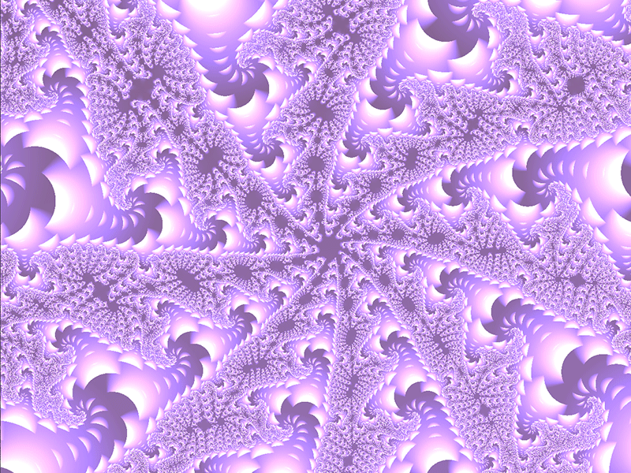

# Rendu de l'ensemble de Mandelbrot avec des shaders (avec OpenGL et GLSL)

## Introduction

Une bonne façon de commencer à coder des shaders est de rendre des fractales avec eux.

Dans ce billet, je vais vous guider dans la création d'une application simple d'exploration de l'ensemble de Mandelbrot que j'ai construite en utilisant des shaders GLSL.

Si vous voulez commencer à apprendre à coder des shaders, je vous suggère de jeter un coup d'œil à Shadertoy. ShaderToy est un site web où vous pouvez coder vos propres shaders dès le départ, sans avoir à vous soucier d'établir une application de niveau inférieur pour gérer les entrées, les bibliothèques d'écran et d'autres étapes qui pourraient vous démotiver dès le début. Vous pouvez également partager vos créations et il existe quelques tutoriels utiles qui vous permettront d'apprendre et d'explorer des shaders étonnants !

Si vous vous sentez aventureux ou si vous ne pouvez pas compter sur une connexion internet, vous pouvez cloner ce dépôt git où j'héberge une application C++ et OpenGL de base qui vous permet de plonger directement dans le codage de shaders localement sur votre machine.

L'application que nous construisons dans ce billet est également disponible dans un dépôt [github](https://github.com/Arukiap/Mandelbrot). Vous pouvez la cloner librement et vous amuser !

Je vous encourage également à visiter le site web d'[Inigo Quilez](https://www.iquilezles.org/www/articles/ftrapsgeometric/ftrapsgeometric.htm) si vous êtes intéressé par les techniques de rendu fractal et l'excellente explication que The Art of Code donne dans sa vidéo d'introduction à la fractale de Mandelbrot. J'ai largement basé mon développement et mon apprentissage sur ces deux plateformes.

## L'ensemble de Mandelbrot

Si l'on reprend la définition de la page [Wikipedia](https://www.shadertoy.com/), l'ensemble de Mandelbrot est un ensemble de nombres complexes $c$ pour lequel la fonction:

$$
f_c(z) = z^2 + 2
$$

reste limitée à une certaine plage de valeurs lorsqu'il est itéré à partir de $z = 0$.

### Les nombres complexes

**Ne vous laissez pas effrayer par les nombres complexes**. Un nombre complexe est, comme vous le savez peut-être, un nombre qui a deux composantes distinctes : une réelle et une imaginaire. Nous pouvons donc représenter un nombre complexe à l'aide d'un vecteur à deux dimensions, dont la composante $x$ représente la partie réelle du nombre et la composante $y$ la partie imaginaire. Nous utiliserons $z$ pour désigner notre nombre complexe.

$$
z = x + yi
$$

$$
z = vec2(x,y)
$$

Maintenant, la seule chose dont nous devons nous préoccuper lorsque nous faisons des calculs sur les nombres imaginaires est la propriété suivante pour cet ensemble :

$$
i^2 = -1
$$

Essayons de remplacer le nombre complexe $z$ par la fonction de l'ensemble de Mandelbrot :

$$
f_c(z)= z^2 + c = (x+yi)^2 +c = (x^2 + y^2i^2) + c = x^2 - y^2 + 2xyi + c
$$

Et en utilisant la représentation vectorielle bidimensionnelle pour le système des nombres complexes, nous avons :

$$
f_c((x,y)_z)) = (x^2 - y^2,2xy)_z + (x,y)_c
$$

Nous avons maintenant tout ce qu'il faut pour commencer à rendre l'ensemble de Mandelbrot. Il ne nous reste plus qu'à itérer cette fonction et à voir quelles sont les valeurs qui restent limitées en:

$$
|z_n+1| \leq 2
$$

ou, en d'autres termes, en l'appliquant à la représentation vectorielle

$$
|(x,y)_z| \leq 2
$$

## Rendre l'ensemble

Maintenant que nous avons compris nos mathématiques, ouvrons notre fragment shader et écrivons la fonction principale de notre application : l'itération sur la fonction qui définit l'ensemble de Mandelbrot.

```cpp
vec2 squareImaginary(vec2 number){
	return vec2(
		pow(number.x,2)-pow(number.y,2),
		2*number.x*number.y
	);
}

float iterateMandelbrot(vec2 coord){
	vec2 z = vec2(0,0);
	for(int i=0;i<maxIterations;i++){
		z = squareImaginary(z) + coord;
		if(length(z)>2) return i/maxIterations;
	}
	return maxIterations;
}
```

Cette fonction s'exécute une fois pour chaque pixel de l'écran. Le vecteur 2D `coord` représente les coordonnées du pixel sélectionné. Cela fonctionne très bien car dans les diagrammes de Mandelbrot, l'axe $y$ représente la partie imaginaire du nombre complexe et l'axe $x$ la partie réelle.

Nous suivons simplement la définition exacte de la fonction que nous avons énumérée précédemment, et renvoyons une valeur entre 0 et 1 en fonction de la proximité de nos étapes d'itération par rapport au nombre maximum d'itérations. Cette valeur est utilisée pour attribuer une certaine teinte à chaque pixel de l'écran.

Cela produit l'image suivante (nombre maximal d'itérations = 100) :


## Zoomer à l'intérieur de l'ensemble

En implémentant une interaction simple consistant à zoomer et à explorer l'ensemble, nous pouvons déjà commencer à voir la complexité et la beauté de cet ensemble.


Mais nous ne voulons certainement pas nous arrêter là. Bien que ces images soient magnifiques et mystérieuses, la représentation graphique de cet ensemble peut être encore plus belle si nous la colorons sur la base de règles mathématiques.

## Orbit trap coloring

Pour colorer notre graphique de Mandelbrot, nous allons utiliser une technique populaire utilisée pour colorer les fractales, appelée *orbit trap*. Cette technique consiste à stocker le minimum, la moyenne, le maximum ou d'autres types de fonctions mathématiques appliquées à la distance entre le point actuel qui est itéré tout au long de notre fonction itérative et un certain point, une ligne ou une courbe dans notre système de coordonnées. Nous pouvons ensuite colorer nos pixels en fonction de ces valeurs.

Un point commun auquel comparer la distance est l'origine $. Ce faisant, nous obtenons la coloration suivante de notre ensemble :





Comme il s'agit généralement d'un art, vous pouvez colorier la fractale comme bon vous semble. N'hésitez pas à expérimenter : la plupart des images que j'ai affichées ici ont nécessité beaucoup d'essais et d'erreurs pour obtenir une coloration correcte.

Si vous êtes intéressé par les techniques de piégeage d'orbite, vous pouvez en apprendre davantage à ce sujet [ici]https://www.iquilezles.org/www/articles/ftrapsgeometric/ftrapsgeometric.htm.

## Le problème de nombres flottants

Parce que les GPU sont typiquement conçus pour travailler sur de grandes quantités de données groupées dans le vertex shader, ils n'aiment pas vraiment travailler avec des calculs en virgule flottante de haute précision. La précision maximale que vous pouvez obtenir avec un shader GLSL normal est une virgule flottante de 16 bits et même pour cela, vous devez faire la déclaration suivante dans votre code de shader.

```cpp
precision highp float;
```
C'est une limitation extrême pour l'application que je voulais écrire : un zoom presque infini dans l'ensemble de Mandelbrot. Pour cette raison, si je continue à zoomer dans mon application après 10 à 15 secondes, j'obtiens les rendus suivants.


**Il ne s'agit pas d'une image compressée**, mais exactement du rendu que j'obtiens lorsque je zoome trop, en raison des limites de représentation des nombres à virgule flottante dans le GPU.

Par conséquent, pour plonger plus profondément dans cet incroyable monde fractal, il faudrait une implémentation de niveau inférieur qui permettrait une précision illimitée des nombres à virgule flottante. Cela n'entre pas dans le cadre de cette expérimentation.

## Conclusions

La création de cette application expérimentale a non seulement été un excellent moyen de plonger dans le monde des fractales, mais aussi de comprendre les limites fondamentales du développement des shaders. J'encourage vivement tous ceux qui s'intéressent aux techniques de calcul graphique à s'essayer à l'ensemble de Mandelbrot. Il vous prépare à travailler avec les coordonnées des pixels de l'écran, la coloration et l'ombrage, qui sont des composants essentiels du développement des shaders. De plus, les rendus que vous pouvez produire sont étonnants. Jetez un coup d'œil à [cette vidéo](https://www.youtube.com/watch?v=VPHbgHVxLYY) produite par un logiciel disponible sur Internet pour effectuer un rendu et un zoom sur l'ensemble de Mandelbrot avec des millions d'itérations !

J'espère que vous avez apprécié cette lecture et je suis toujours ouvert à vos questions et à vos commentaires.

Je vous souhaite une excellente journée !


# Article original
[Arukiap](https://arukiap.github.io/fractals/2019/06/02/rendering-the-mandelbrot-set-with-shaders.html)


