# Textures
Nous avons appris que pour ajouter plus de détails à nos objets, nous pouvons utiliser des couleurs pour chaque sommet afin de créer des images intéressantes. Cependant, pour obtenir un certain réalisme, nous devons avoir beaucoup de sommets afin de pouvoir spécifier un grand nombre de couleurs. Cela représente un surcoût considérable, car chaque modèle nécessite beaucoup plus de sommets et, pour chacun d'eux, un attribut de couleur.

Les artistes et les programmeurs préfèrent généralement utiliser une texture. **Une texture est une image 2D (il existe même des textures 1D et 3D) utilisée pour ajouter des détails à un objet**. Pensez à une texture comme à un morceau de papier avec une belle image de brique (par exemple) pliée proprement sur votre maison 3D pour donner l'impression que votre maison a un extérieur en pierre. Comme nous pouvons insérer beaucoup de détails dans une seule image, nous pouvons donner l'illusion que l'objet est extrêmement détaillé sans avoir à spécifier des sommets supplémentaires.

>	Outre les images, les textures peuvent également être utilisées pour stocker une grande collection de données arbitraires à envoyer aux shaders, mais nous laisserons cela pour un autre sujet.

Vous trouverez ci-dessous une image de texture d'un [mur de briques](https://learnopengl.com/img/textures/wall.jpg) mappée sur le triangle du chapitre précédent.
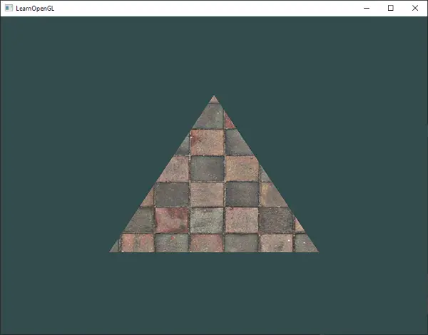
Afin d'appliquer une texture au triangle, nous devons indiquer à chaque sommet du triangle à quelle partie de la texture il correspond. **Chaque sommet doit donc être associé à une coordonnée de texture qui spécifie la partie de l'image de texture à échantillonner.** **L'interpolation des fragments fait ensuite le reste pour les autres fragments.**

**Les coordonnées de texture sont comprises entre 0 et 1 sur les axes x et y (n'oubliez pas que nous utilisons des images de texture en 2D). L'extraction de la couleur de la texture à l'aide des coordonnées de la texture s'appelle l'échantillonnage (ou sampling)**. Les coordonnées de texture commencent à (0,0) pour le coin inférieur gauche d'une image de texture et à (1,1) pour le coin supérieur droit d'une image de texture. L'image suivante montre comment nous faisons correspondre les coordonnées de texture au triangle :
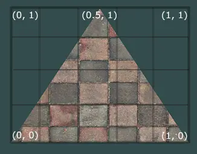
Nous spécifions 3 points de coordonnées de texture pour le triangle. Nous voulons que le côté inférieur gauche du triangle corresponde au côté inférieur gauche de la texture. Nous utilisons donc la coordonnée de texture (0,0) pour le sommet inférieur gauche du triangle. Il en va de même pour le côté inférieur droit avec une coordonnée de texture (1,0). Le sommet du triangle doit correspondre au centre supérieur de l'image de texture, nous prenons donc (0.5,1.0) comme coordonnée de texture. **Il suffit de transmettre 3 coordonnées de texture au vertex shader, qui les transmet ensuite au fragment shader qui interpole proprement toutes les coordonnées de texture pour chaque fragment.**

Les coordonnées de texture résultantes ressembleraient alors à ceci :
```cpp
float texCoords[] = {
    0.0f, 0.0f,  // lower-left corner  
    1.0f, 0.0f,  // lower-right corner
    0.5f, 1.0f   // top-center corner
};
```

L'échantillonnage des textures est interprété de manière très large et peut être réalisé de différentes manières. C'est donc à nous de dire à OpenGL comment il doit échantillonner ses textures.
## Texture wrapping (emballage de la texture)
**Les coordonnées de texture sont généralement comprises entre (0,0) et (1,1), mais que se passe-t-il si nous spécifions des coordonnées en dehors de cette plage ? Le comportement par défaut d'OpenGL est de répéter les images de texture** (nous ignorons la partie entière de la coordonnée de texture en virgule flottante), mais OpenGL offre d'autres options :
- `GL_REPEAT` : Comportement par défaut pour les textures. Répète l'image de la texture.
- `GL_MIRRORED_REPEAT` : Identique à GL_REPEAT mais l'image est répétée à chaque fois.
- `GL_CLAMP_TO_EDGE` : Fixe les coordonnées entre `0` et `1`. Le résultat est que les coordonnées les plus élevées sont collées au bord, ce qui donne un motif de bord étiré.
- `GL_CLAMP_TO_BORDER` : Les coordonnées en dehors de la plage reçoivent maintenant une couleur de bordure spécifiée par l'utilisateur.

Chacune de ces options a un rendu visuel différent lorsque l'on utilise des coordonnées de texture en dehors de la plage par défaut. Voyons ce que cela donne sur un exemple d'image de texture (image originale de Hólger Rezende) :

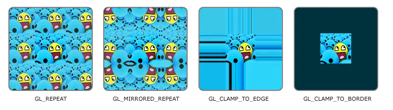
Chacune des options susmentionnées peut être définie par axe de coordonnées (s, t (et r si vous utilisez des textures 3D) équivalent à x,y,z) avec la fonction `glTexParameter*` :
```cpp
glTexParameteri(GL_TEXTURE_2D, GL_TEXTURE_WRAP_S, GL_MIRRORED_REPEAT);
glTexParameteri(GL_TEXTURE_2D, GL_TEXTURE_WRAP_T, GL_MIRRORED_REPEAT);
```
Le premier argument spécifie la cible de texture ; nous travaillons avec des textures 2D, la cible de texture est donc `GL_TEXTURE_2D`.
Le deuxième argument nous demande d'indiquer l'option que nous voulons définir et pour quel axe de texture ; nous voulons le configurer pour les axes S et T.
Le dernier argument nous demande de passer le mode d'habillage de la texture que nous souhaitons et dans ce cas, OpenGL définira son option d'habillage de la texture sur la texture active avec `GL_MIRRORED_REPEAT`.

Si nous choisissons l'option `GL_CLAMP_TO_BORDER`, nous devons également spécifier une couleur de bordure. Ceci est fait en utilisant l'équivalent `fv` de la fonction `glTexParameter` avec `GL_TEXTURE_BORDER_COLOR` comme option où nous passons un tableau de flottants de la valeur de la couleur de la bordure :

```cpp
float borderColor[] = { 1.0f, 1.0f, 0.0f, 1.0f };
glTexParameterfv(GL_TEXTURE_2D, GL_TEXTURE_BORDER_COLOR, borderColor); 
```
## Texture filtering (filtrage des textures)
Les coordonnées de la texture ne dépendent pas de la résolution mais peuvent être n'importe quelle valeur à virgule flottante. OpenGL doit donc déterminer à quel pixel de la texture (également connu sous le nom de **texel**) mapper les coordonnées de la texture. Cela devient particulièrement important si vous avez un objet très grand et une texture à faible résolution. Vous avez probablement deviné qu'OpenGL dispose également d'options pour le filtrage de la texture. Il y a plusieurs options disponibles, mais pour l'instant nous allons discuter des options les plus importantes : `GL_NEAREST` et `GL_LINEAR`.

`GL_NEAREST` (également connu sous le nom de plus proche voisin ou de filtrage ponctuel) est la méthode de filtrage de texture par défaut d'OpenGL. Lorsqu'il est réglé sur `GL_NEAREST`, OpenGL sélectionne le texel dont le centre est le plus proche de la coordonnée de la texture. Ci-dessous, vous pouvez voir 4 pixels où la croix représente la coordonnée exacte de la texture. Le texel en haut à gauche a son centre le plus proche de la coordonnée de texture et est donc choisi comme couleur échantillonnée :
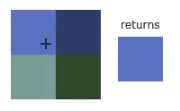
`GL_LINEAR` (également connu sous le nom de filtrage (bi)linéaire) prend une valeur interpolée à partir des texels voisins de la coordonnée de texture, approximant une couleur entre les texels. Plus la distance entre la coordonnée de texture et le centre d'un texel est faible, plus la couleur de ce texel contribue à la couleur échantillonnée. Ci-dessous, nous pouvons voir qu'une couleur mélangée des pixels voisins est renvoyée :
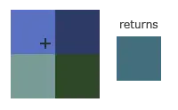
Mais quel est l'effet visuel d'une telle méthode de filtrage des textures ? Voyons comment ces méthodes fonctionnent lorsqu'on utilise une texture de faible résolution sur un objet de grande taille (la texture est donc mise à l'échelle vers le haut et les texels individuels sont perceptibles) :

`GL_NEAREST` produit des motifs bloqués où l'on peut clairement voir les pixels qui forment la texture, tandis que `GL_LINEAR` produit un motif plus lisse où les pixels individuels sont moins visibles. `GL_LINEAR` produit un résultat plus réaliste, mais certains développeurs préfèrent un aspect plus 8 bits et choisissent donc l'option `GL_NEAREST`.

Le filtrage des textures peut être défini pour les opérations d'agrandissement et de réduction (lors de la mise à l'échelle vers le haut ou vers le bas). Vous pouvez donc, par exemple, utiliser le filtrage du plus proche voisin lorsque les textures sont mises à l'échelle vers le bas et le filtrage linéaire pour les textures mises à l'échelle vers le haut. Nous devons donc spécifier la méthode de filtrage pour les deux options via `glTexParameter*`. Le code devrait ressembler à la définition de la méthode de wrapping :
```cpp
glTexParameteri(GL_TEXTURE_2D, GL_TEXTURE_MIN_FILTER, GL_NEAREST);
glTexParameteri(GL_TEXTURE_2D, GL_TEXTURE_MAG_FILTER, GL_LINEAR);
```
## Mipmaps
Imaginons que nous ayons une grande pièce avec des milliers d'objets, chacun avec une texture attachée. Il y aura des objets très éloignés qui auront la même texture haute résolution que les objets proches de l'observateur. **Puisque les objets sont éloignés et ne produisent probablement que quelques fragments, OpenGL a des difficultés à récupérer la bonne valeur de couleur pour son fragment à partir de la texture haute résolution, puisqu'il doit choisir une couleur de texture pour un fragment qui s'étend sur une grande partie de la texture**. **Cela produira des artefacts visibles sur les petits objets, sans parler du gaspillage de la bande passante de la mémoire en utilisant des textures à haute résolution sur de petits objets.**

**Pour résoudre ce problème, OpenGL utilise un concept appelé mipmaps**, qui est en fait **une collection d'images de texture où chaque texture suivante est deux fois plus petite que la précédente**. L'idée derrière les mipmaps devrait être facile à comprendre : après un certain seuil de distance de l'observateur, OpenGL utilisera une texture mipmap différente qui correspond le mieux à la distance de l'objet. Comme l'objet est éloigné, la résolution plus faible ne sera pas perceptible par l'utilisateur. OpenGL est alors capable d'échantillonner les bons texels, et il y a moins de mémoire cache impliquée dans l'échantillonnage de cette partie des mipmaps. Regardons de plus près à quoi ressemble une texture mipmap :
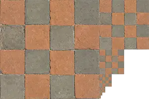
Créer une collection de textures mipmap pour chaque image de texture est lourd à faire manuellement, mais **heureusement OpenGL est capable de faire tout le travail pour nous avec un seul appel à `glGenerateMipmap` après que nous ayons créé une texture**.

Lorsque l'on passe d'un niveau de mipmap à l'autre pendant le rendu, OpenGL peut montrer des artefacts comme des bords nets visibles entre les deux couches de mipmap. **Tout comme le filtrage normal des textures, il est également possible de filtrer entre les niveaux de mipmap en utilisant les filtres `NEAREST` et `LINEAR` pour passer d'un niveau de mipmap à l'autre.** Pour spécifier la méthode de filtrage entre les niveaux des mipmaps, nous pouvons remplacer les méthodes de filtrage originales par l'une des quatre options suivantes :
- `GL_NEAREST_MIPMAP_NEAREST` : prend la mipmap la plus proche de la taille du pixel et utilise l'interpolation du plus proche voisin pour l'échantillonnage de la texture.
- `GL_LINEAR_MIPMAP_NEAREST` : prend le niveau de mipmap le plus proche et échantillonne ce niveau par interpolation linéaire.
- `GL_NEAREST_MIPMAP_LINEAR` : interpole linéairement entre les deux mipmaps les plus proches de la taille d'un pixel et échantillonne le niveau interpolé par interpolation du plus proche voisin.
- `GL_LINEAR_MIPMAP_LINEAR` : interpole linéairement entre les deux cartes les plus proches et échantillonne le niveau interpolé par interpolation linéaire.
Tout comme pour le filtrage des textures, nous pouvons définir la méthode de filtrage sur l'une des quatre méthodes susmentionnées à l'aide de `glTexParameteri` :
```cpp
glTexParameteri(GL_TEXTURE_2D, GL_TEXTURE_MIN_FILTER, GL_LINEAR_MIPMAP_LINEAR);
glTexParameteri(GL_TEXTURE_2D, GL_TEXTURE_MAG_FILTER, GL_LINEAR);
```
Une erreur courante consiste à définir l'une des options de filtrage mipmap comme filtre d'agrandissement. Cela n'a aucun effet puisque les mipmaps sont principalement utilisées lorsque les textures sont mises à l'échelle : l'agrandissement de texture n'utilise pas les mipmaps et lui donner une option de filtrage mipmap générera un code d'erreur OpenGL `GL_INVALID_ENUM`.
## Charger et créer des textures
La première chose à faire pour utiliser les textures est de les charger dans notre application. Les images de textures peuvent être stockées dans des dizaines de formats de fichiers, chacun ayant sa propre structure et son propre ordre de données. Une solution serait de choisir un format de fichier que nous aimerions utiliser, par exemple `.PNG`, et d'écrire notre propre chargeur d'images pour convertir le format d'image en un grand tableau d'octets. Bien qu'il ne soit pas très difficile d'écrire son propre chargeur d'images, cela reste encombrant et que se passe-t-il si l'on souhaite prendre en charge d'autres formats de fichiers ? Vous devrez alors écrire un chargeur d'images pour chaque format que vous souhaitez prendre en charge.

**Une autre solution, probablement la meilleure, est d'utiliser une bibliothèque de chargement d'images qui supporte plusieurs formats populaires et qui fait tout le travail à notre place. Une bibliothèque comme `stb_image.h`.**

### stb_image.h
`stb_image.h` est une bibliothèque de chargement d'images à en-tête unique très populaire de Sean Barrett, capable de charger les formats de fichiers les plus courants et facile à intégrer dans vos projets. `stb_image.h` peut être téléchargé à partir d'[ici](https://github.com/nothings/stb/blob/master/stb_image.h). Téléchargez simplement le fichier d'en-tête, ajoutez-le à votre projet en tant que `stb_image.h`, et créez un fichier C++ supplémentaire avec le code suivant :
```cpp
#define STB_IMAGE_IMPLEMENTATION
#include "stb_image.h"
```
En définissant `STB_IMAGE_IMPLEMENTATION`, le préprocesseur modifie le fichier d'en-tête de manière à ce qu'il ne contienne que le code source de la définition concernée, transformant ainsi le fichier d'en-tête en fichier `.cpp`, et c'est à peu près tout. Il suffit maintenant d'inclure `stb_image.h` quelque part dans votre programme et de compiler.

Pour les sections suivantes sur les textures, nous allons utiliser l'image d'un conteneur en bois. Pour charger une image à l'aide de `stb_image.h`, nous utilisons la fonction `stbi_load` :
```cpp
int width, height, nrChannels;
unsigned char *data = stbi_load("container.jpg", &width, &height, &nrChannels, 0);
```

La fonction prend d'abord en entrée l'emplacement d'un fichier image. Elle s'attend ensuite à ce que vous donniez trois ints comme deuxième, troisième et quatrième argument que `stb_image.h` remplira avec la largeur, la hauteur et le nombre de canaux de couleur de l'image résultante. Nous avons besoin de la largeur et de la hauteur de l'image pour générer des textures plus tard. 

### Générer une texture
Comme tous les objets précédents d'OpenGL, les textures sont référencées par un ID ; créons-en un :
```cpp
unsigned int texture;
glGenTextures(1, &texture);  
```
La fonction `glGenTextures` prend d'abord en entrée le nombre de textures que nous voulons générer et les stocke dans un tableau `unsigned int` donné comme second argument (dans notre cas, un seul unsigned int). Comme pour les autres objets, nous devons lier les textures afin que toute commande de texture ultérieure configure la texture actuellement liée :
```cpp
glBindTexture(GL_TEXTURE_2D, texture);  
```
Maintenant que la texture est liée, nous pouvons commencer à générer une texture en utilisant les données de l'image précédemment chargée. Les textures sont générées avec `glTexImage2D` :
```cpp
glTexImage2D(GL_TEXTURE_2D, 0, GL_RGB, width, height, 0, GL_RGB, GL_UNSIGNED_BYTE, data);
glGenerateMipmap(GL_TEXTURE_2D);
```
Il s'agit d'une fonction importante qui comporte un certain nombre de paramètres, nous allons donc les examiner étape par étape :
- Le premier argument spécifie la cible de la texture ; mettre ceci à GL_TEXTURE_2D signifie que cette opération va générer une texture sur l'objet de texture actuellement lié à la même cible (donc toutes les textures liées aux cibles GL_TEXTURE_1D ou GL_TEXTURE_3D ne seront pas affectées).
- Le second argument spécifie le niveau de mipmap pour lequel nous voulons créer une texture, si vous voulez définir chaque niveau de mipmap manuellement, mais nous le laisserons au niveau de base qui est `0`.
- Le troisième argument indique à OpenGL dans quel type de format nous voulons stocker la texture. Notre image n'a que des valeurs `RGB`, donc nous stockerons la texture avec des valeurs `RGB` également.
- Les 4ème et 5ème arguments définissent la largeur et la hauteur de la texture résultante. Nous les avons stockés plus tôt lors du chargement de l'image, nous utiliserons donc les variables correspondantes.
- L'argument suivant devrait toujours être `0` (quelques trucs anciens).
- Les 7ème et 8ème arguments spécifient le format et le type de données de l'image source. Nous avons chargé l'image avec des valeurs `RGB` et les avons stockées sous forme de `char`s (octets), nous allons donc passer les valeurs correspondantes.
- Le dernier argument est la donnée réelle de l'image.

Une fois que `glTexImage2D` est appelée, l'objet de texture actuellement lié a maintenant l'image de texture attachée à lui. Cependant, il n'a actuellement que le niveau de base de l'image de texture chargée et si nous voulons utiliser des mipmaps, nous devons spécifier toutes les images différentes manuellement (en incrémentant continuellement le deuxième argument) ou nous pourrions appeler `glGenerateMipmap` après avoir généré la texture. Cela génèrera automatiquement toutes les images mipmap requises pour la texture actuellement liée.

Après avoir généré la texture et les mipmaps correspondants, il est bon de libérer la mémoire de l'image :
```cpp
stbi_image_free(data);
```
 L'ensemble du processus de génération d'une texture se présente donc comme suit :
```cpp
unsigned int texture;
glGenTextures(1, &texture);
glBindTexture(GL_TEXTURE_2D, texture);
// set the texture wrapping/filtering options (on the currently bound texture object)
glTexParameteri(GL_TEXTURE_2D, GL_TEXTURE_WRAP_S, GL_REPEAT);	
glTexParameteri(GL_TEXTURE_2D, GL_TEXTURE_WRAP_T, GL_REPEAT);
glTexParameteri(GL_TEXTURE_2D, GL_TEXTURE_MIN_FILTER, GL_LINEAR_MIPMAP_LINEAR);
glTexParameteri(GL_TEXTURE_2D, GL_TEXTURE_MAG_FILTER, GL_LINEAR);
// load and generate the texture
int width, height, nrChannels;
unsigned char *data = stbi_load("container.jpg", &width, &height, &nrChannels, 0);
if (data)
{
    glTexImage2D(GL_TEXTURE_2D, 0, GL_RGB, width, height, 0, GL_RGB, GL_UNSIGNED_BYTE, data);
    glGenerateMipmap(GL_TEXTURE_2D);
}
else
{
    std::cout << "Failed to load texture" << std::endl;
}
stbi_image_free(data);
```

## Appliquer les textures
Pour les sections suivantes, nous utiliserons le rectangle dessiné avec `glDrawElements` dans la dernière partie du chapitre [03_hello triangle](03_hello%20triangle.md). Nous devons informer OpenGL de la manière d'échantillonner la texture, nous devrons donc mettre à jour les données des vertex avec les coordonnées de la texture : 
```cpp
float vertices[] = {
    // positions          // colors           // texture coords
     0.5f,  0.5f, 0.0f,   1.0f, 0.0f, 0.0f,   1.0f, 1.0f,   // top right
     0.5f, -0.5f, 0.0f,   0.0f, 1.0f, 0.0f,   1.0f, 0.0f,   // bottom right
    -0.5f, -0.5f, 0.0f,   0.0f, 0.0f, 1.0f,   0.0f, 0.0f,   // bottom left
    -0.5f,  0.5f, 0.0f,   1.0f, 1.0f, 0.0f,   0.0f, 1.0f    // top left 
};
```
Puisque nous avons ajouté un attribut de sommet supplémentaire, nous devons à nouveau informer OpenGL du nouveau format de sommet : 
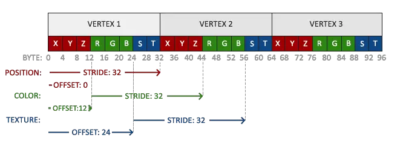
```cpp
glVertexAttribPointer(2, 2, GL_FLOAT, GL_FALSE, 8 * sizeof(float), (void*)(6 * sizeof(float)));
glEnableVertexAttribArray(2); 
```
Notez que nous devons également ajuster le paramètre **stride** des deux attributs de vertex précédents à `8 * sizeof(float)`.

Ensuite, nous devons modifier le vertex shader pour qu'il accepte les coordonnées de texture en tant qu'attribut de vertex et qu'il transmette ensuite les coordonnées au fragment shader :
```cpp
#version 330 core
layout (location = 0) in vec3 aPos;
layout (location = 1) in vec3 aColor;
layout (location = 2) in vec2 aTexCoord;

out vec3 ourColor;
out vec2 TexCoord;

void main()
{
    gl_Position = vec4(aPos, 1.0);
    ourColor = aColor;
    TexCoord = aTexCoord;
}
```
Le fragment shader doit alors accepter la variable de sortie `TexCoord` comme variable d'entrée.  
  
Le fragment shader doit également avoir accès à l'objet texture, mais comment transmettre l'objet texture au fragment shader ? GLSL dispose d'un type de données intégré pour les objets de texture, appelé **sampler**, qui prend comme postfixe le type de texture souhaité, par exemple `sampler1D`, `sampler3D` ou, dans notre cas, `sampler2D`. Nous pouvons alors ajouter une texture au fragment shader en déclarant simplement un `sampler2D` uniforme auquel nous assignerons plus tard notre texture.
```cpp
#version 330 core
out vec4 FragColor;
  
in vec3 ourColor;
in vec2 TexCoord;

uniform sampler2D ourTexture;

void main()
{
    FragColor = texture(ourTexture, TexCoord);
}
```
Pour échantillonner la couleur d'une texture, nous utilisons la fonction `texture` intégrée de GLSL qui prend comme premier argument un sample de texture et comme second argument les coordonnées de la texture correspondante. La fonction de texture échantillonne ensuite la valeur de couleur correspondante en utilisant les paramètres de texture que nous avons définis plus tôt. La sortie de ce fragment shader est alors la couleur (filtrée) de la texture à la coordonnée de texture (interpolée).  
  
Il ne reste plus qu'à lier la texture avant d'appeler `glDrawElements`, qui affectera automatiquement la texture à sample du fragment shader :
```cpp
glBindTexture(GL_TEXTURE_2D, texture);
glBindVertexArray(VAO);
glDrawElements(GL_TRIANGLES, 6, GL_UNSIGNED_INT, 0);
```
Si vous avez tout fait correctement, vous devriez voir l'image suivante : 
 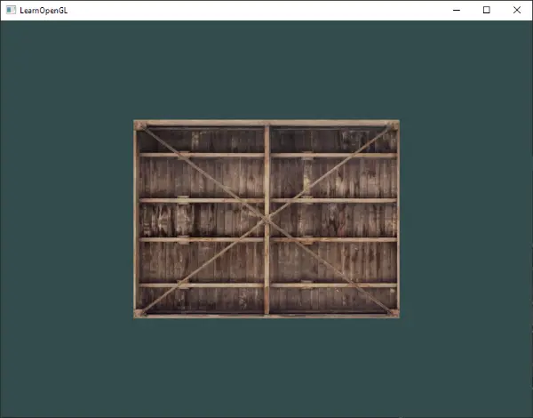
Si votre rectangle est complètement blanc ou noir, vous avez probablement commis une erreur en cours de route. Vérifiez les journaux des shaders et essayez de comparer votre code avec le [code source](https://learnopengl.com/code_viewer_gh.php?code=src/1.getting_started/4.1.textures/textures.cpp) de l'application.

> Si votre code de texture ne fonctionne pas ou s'il est complètement noir, continuez à lire et travaillez jusqu'au dernier exemple qui devrait fonctionner. Sur certains pilotes, il est nécessaire d'assigner une unité de texture à chaque uniforme d'échantillonneur, ce dont nous parlerons plus loin dans ce chapitre.

Pour un peu d'originalité, nous pouvons également mélanger la couleur de texture résultante avec les couleurs de vertex. Nous multiplions simplement la couleur de texture résultante avec la couleur de vertex dans le fragment shader pour mélanger les deux couleurs :
```cpp
FragColor = texture(ourTexture, TexCoord) * vec4(ourColor, 1.0);  
```
Le résultat doit être un mélange de la couleur du sommet et de la couleur de la texture : 
 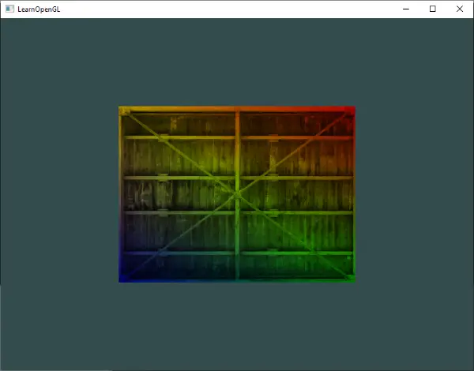
On peut dire que notre conteneur aime la disco.

## Unités de texture (unit textures)
Vous vous êtes probablement demandé pourquoi la variable **sampler2D** est un uniforme si nous ne lui avons pas assigné de valeur avec `glUniform`. En utilisant `glUniform1i`, nous pouvons en fait assigner une valeur d'emplacement à l'échantillonneur de texture afin de pouvoir définir plusieurs textures à la fois dans un fragment shader. **L'emplacement d'une texture est plus communément appelé unité de texture**. **L'unité de texture par défaut pour une texture est 0, qui est l'unité de texture active par défaut, de sorte que nous n'avons pas eu besoin d'assigner un emplacement dans la section précédente** ; notez que tous les pilotes graphiques n'assignent pas une unité de texture par défaut, de sorte que la section précédente n'a peut-être pas été rendue pour vous.  
  
**L'objectif principal des unités de texture est de nous permettre d'utiliser plus d'une texture dans nos shaders**. En assignant des unités de texture aux samplers, nous pouvons lier plusieurs textures à la fois, à condition d'activer d'abord l'unité de texture correspondante. Tout comme `glBindTexture`, nous pouvons activer les unités de texture en utilisant `glActiveTexture` en passant par l'unité de texture que nous souhaitons utiliser :
```cpp
glActiveTexture(GL_TEXTURE0); // activate the texture unit first before binding texture
glBindTexture(GL_TEXTURE_2D, texture);
```
Après avoir activé une unité de texture, un appel ultérieur à `glBindTexture` liera cette texture à l'unité de texture actuellement active. L'unité de texture `GL_TEXTURE0` est toujours activée par défaut, de sorte que nous n'avons pas eu à activer d'unités de texture dans l'exemple précédent lors de l'utilisation de `glBindTexture`.

> OpenGL devrait avoir un minimum de 16 unités de texture que vous pouvez activer en utilisant `GL_TEXTURE0` à `GL_TEXTURE15`. Elles sont définies dans l'ordre, de sorte que nous pouvons également obtenir `GL_TEXTURE8` via `GL_TEXTURE0 + 8` par exemple, ce qui est utile lorsque nous devons passer en boucle sur plusieurs unités de texture. 

Il nous reste cependant à modifier le fragment shader pour qu'il accepte un autre sampler. Cela devrait être relativement simple maintenant : 
```cpp
version 330 core
...

uniform sampler2D texture1;
uniform sampler2D texture2;

void main()
{
    FragColor = mix(texture(texture1, TexCoord), texture(texture2, TexCoord), 0.2);
}
```
La couleur de sortie finale est maintenant la combinaison de deux textures. La fonction de mélange intégrée à GLSL (`mix`) prend deux valeurs en entrée et interpole linéairement entre elles sur la base de son troisième argument. Si la troisième valeur est 0.0, elle renvoie la première entrée ; si elle est 1.0, elle renvoie la deuxième valeur d'entrée. Une valeur de 0,2 renverra 80 % de la première couleur d'entrée et 20 % de la seconde, ce qui donnera un mélange de nos deux textures.  
  
Nous voulons maintenant charger et créer une autre texture ; vous devriez maintenant être familier avec les étapes. Assurez-vous de créer un autre objet texture, de charger l'image et de générer la texture finale à l'aide de glTexImage2D. Pour la seconde texture, nous utiliserons une image de [votre expression faciale pendant l'apprentissage d'OpenGL](https://learnopengl.com/img/textures/awesomeface.png) :

```cpp
unsigned char *data = stbi_load("awesomeface.png", &width, &height, &nrChannels, 0);
if (data)
{
    glTexImage2D(GL_TEXTURE_2D, 0, GL_RGB, width, height, 0, GL_RGBA, GL_UNSIGNED_BYTE, data);
    glGenerateMipmap(GL_TEXTURE_2D);
}
```
Notez que nous chargeons maintenant une image `.png` qui inclut un canal alpha (transparence). Cela signifie que nous devons maintenant spécifier que les données de l'image contiennent également un canal alpha en utilisant `GL_RGBA` ; **sinon OpenGL interprétera incorrectement les données de l'image.**  
  
Pour utiliser la seconde texture (et la première), nous devons modifier la procédure de rendu en liant les deux textures à l'unité de texture correspondante : 
```cpp
glActiveTexture(GL_TEXTURE0);
glBindTexture(GL_TEXTURE_2D, texture1);
glActiveTexture(GL_TEXTURE1);
glBindTexture(GL_TEXTURE_2D, texture2);

glBindVertexArray(VAO);
glDrawElements(GL_TRIANGLES, 6, GL_UNSIGNED_INT, 0); 
```
Nous devons également indiquer à OpenGL à quelle unité de texture appartient chaque échantillonneur de shader en définissant chaque échantillonneur à l'aide de `glUniform1i`. Nous ne devons le faire qu'une seule fois, donc nous pouvons le faire avant d'entrer dans la boucle de rendu : 
```cpp
ourShader.use(); // don't forget to activate the shader before setting uniforms!  
glUniform1i(glGetUniformLocation(ourShader.ID, "texture1"), 0); // set it manually
ourShader.setInt("texture2", 1); // or with shader class
  
while(...) 
{
    [...]
}
```
En définissant les échantillonneurs via `glUniform1i`, nous nous assurons que chaque échantillonneur uniforme correspond à l'unité de texture appropriée. Vous devriez obtenir le résultat suivant : 
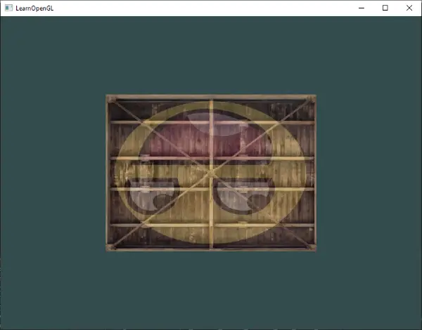
Vous avez probablement remarqué que la texture est inversée ! Cela se produit parce qu'OpenGL s'attend à ce que la coordonnée 0.0 sur l'axe des y soit en bas de l'image, mais les images ont généralement 0.0 en haut de l'axe des y. Heureusement pour nous, `stb_image.h` peut inverser l'axe des y pendant le chargement de l'image en ajoutant la déclaration suivante avant de charger une image :
```cpp
stbi_set_flip_vertically_on_load(true);  
```
Après avoir demandé à `stb_image.h` d'inverser l'axe des ordonnées lors du chargement des images, vous devriez obtenir le résultat suivant : 
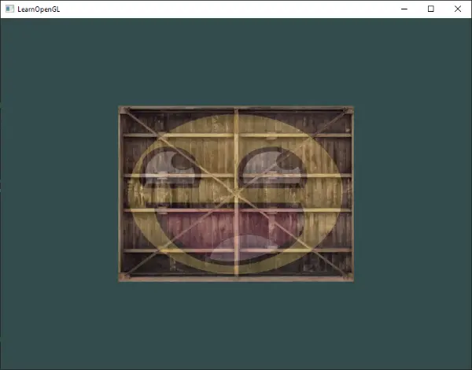
Si vous voyez un conteneur heureux, c'est que vous avez bien fait les choses. Vous pouvez le comparer avec le [code source](https://learnopengl.com/code_viewer_gh.php?code=src/1.getting_started/4.2.textures_combined/textures_combined.cpp). 