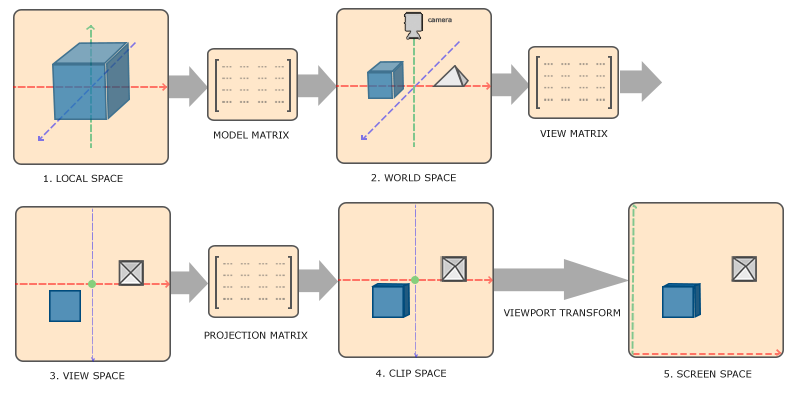
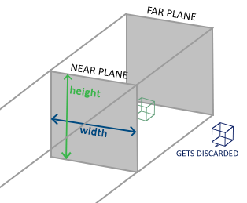
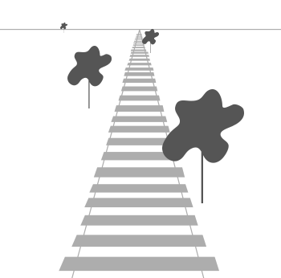
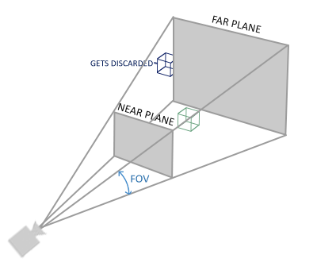
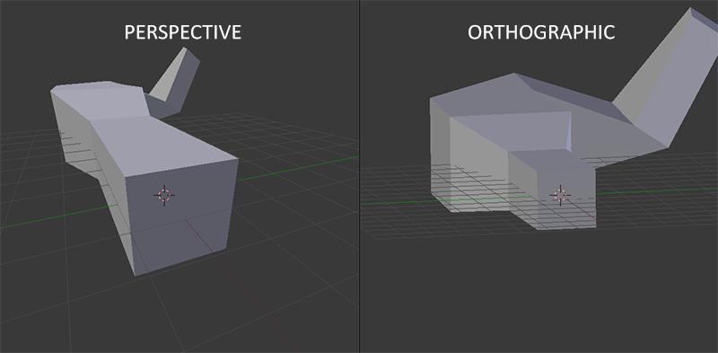
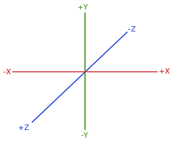
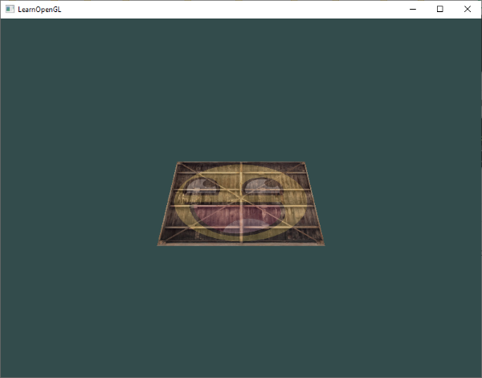
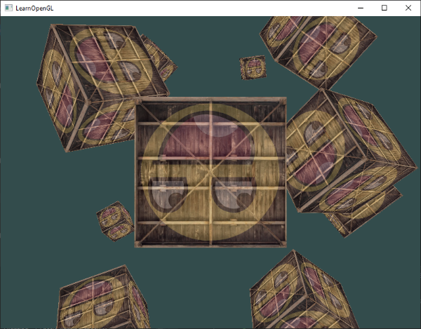

# Systèmes de coordonnées
Dans le dernier chapitre, nous avons appris comment utiliser les matrices à notre avantage en transformant tous les sommets avec des matrices de transformation. OpenGL s'attend à ce que tous les sommets, que nous voulons rendre visibles, soient en coordonnées normalisées après chaque exécution du vertex shader. C'est-à-dire que les coordonnées $x$, $y$ et $z$ de chaque sommet doivent être comprises entre $-1.0$ et $1.0$ ; les coordonnées en dehors de cette plage ne seront pas visibles. Ce que nous faisons habituellement, c'est spécifier les coordonnées dans une plage (ou un espace) que nous déterminons nous-mêmes et, dans le vertex shader, transformer ces coordonnées en coordonnées normalisées (NDC: normalized device coordinates). Ces NDC sont ensuite transmises au rasterizer qui les transforme en coordonnées 2D/pixels sur votre écran.  
  
La transformation des coordonnées en NDC s'effectue généralement étape par étape, en transformant les sommets d'un objet en plusieurs systèmes de coordonnées avant de les transformer en NDC. **L'avantage de les transformer en plusieurs systèmes de coordonnées intermédiaires est que certaines opérations/calculs sont plus faciles dans certains systèmes de coordonnées**, comme nous le verrons bientôt. Il existe au total 5 systèmes de coordonnées différents qui nous intéressent :  
  
- Espace local (ou espace objet) (local space / object space)  
- Espace mondial  (world space)
- Espace de vue (ou espace de l'œil)  (view space)
- Espace du clip  (clip space)
- Espace de l'écran  (screen space)
  
Ce sont tous des états différents dans lesquels nos sommets seront transformés avant d'aboutir à des fragments.  
  
Vous ne savez probablement plus très bien ce qu'est un espace ou un système de coordonnées. Nous allons donc les expliquer à un niveau plus élevé en montrant d'abord l'image globale et ce que chaque espace spécifique représente.

## L'image globale
**Pour transformer les coordonnées d'un espace à l'autre, nous utiliserons plusieurs matrices de transformation, dont les plus importantes sont les matrices de modèle, de vue et de projection.** Les coordonnées de nos sommets commencent d'abord dans l'espace local en tant que coordonnées locales, puis sont transformées en coordonnées mondiales, coordonnées de vue, coordonnées de clip et enfin en coordonnées d'écran. L'image suivante illustre le processus et montre ce que fait chaque transformation :

1. Les coordonnées locales sont les coordonnées de votre objet par rapport à son origine locale ; ce sont les coordonnées de départ de votre objet.  
2. L'étape suivante consiste à transformer les coordonnées locales en coordonnées de l'espace mondial, c'est-à-dire en coordonnées par rapport à un monde plus vaste. Ces coordonnées sont relatives à une origine globale du monde, ainsi qu'à de nombreux autres objets également placés par rapport à l'origine de ce monde.  
3. Ensuite, nous transformons les coordonnées mondiales en coordonnées de l'espace visuel de manière à ce que chaque coordonnée soit vue du point de vue de la caméra ou de l'observateur.  
4. Une fois que les coordonnées sont dans l'espace de vue, nous voulons les projeter en coordonnées de clip. Les coordonnées du clip sont traitées dans la plage `-1.0` et `1.0` et déterminent les sommets qui se retrouveront à l'écran. **La projection vers les coordonnées de l'espace-clip peut ajouter de la perspective si l'on utilise la projection en perspective.**  
5. Enfin, nous transformons les coordonnées du clip en coordonnées d'écran par un processus appelé **viewport transform** qui transforme les coordonnées de `-1.0` et `1.0` en coordonnées définies par `glViewport`. **Les coordonnées résultantes sont ensuite envoyées au rasterizer pour les transformer en fragments.**

Vous avez probablement une petite idée de l'utilisation de chaque espace. **La raison pour laquelle nous transformons nos sommets dans tous ces espaces différents est que certaines opérations ont plus de sens ou sont plus faciles à utiliser dans certains systèmes de coordonnées.** **Par exemple, lorsque vous modifiez votre objet, il est plus logique de le faire dans l'espace local, tandis que le calcul de certaines opérations sur l'objet par rapport à la position d'autres objets a plus de sens dans les coordonnées mondiales, et ainsi de suite.** Si nous le voulons, nous pouvons définir une matrice de transformation qui va de l'espace local à l'espace de clip en une seule fois, mais cela nous laisse moins de flexibilité.

Nous examinerons chaque système de coordonnées plus en détail ci-dessous. 

## Local space
L'espace local est l'espace de coordonnées qui est local à votre objet, c'est-à-dire l'endroit où votre objet commence. Imaginez que vous ayez créé votre cube dans un logiciel de modélisation (comme Blender). L'origine de votre cube se situe probablement à $(0,0,0)$, même si votre cube peut se retrouver à un autre endroit dans votre application finale. Tous les modèles que vous avez créés ont probablement pour position initiale $(0,0,0)$. **Tous les sommets de votre modèle sont donc dans l'espace local : ils sont tous locaux à votre objet.**  
  
Les sommets du conteneur que nous avons utilisé ont été spécifiés sous la forme de coordonnées comprises entre $-0.5$ et $0.5$, avec $0.0$ comme origine. Il s'agit de coordonnées locales.

## World space
Si nous importions tous nos objets directement dans l'application, ils seraient probablement tous positionnés les uns dans les autres à l'origine du monde $(0,0,0)$, ce qui n'est pas ce que nous voulons. Nous voulons définir une position pour chaque objet afin de les positionner dans un monde plus vaste. Les coordonnées dans l'espace mondial sont exactement ce qu'elles semblent être : les coordonnées de tous vos sommets par rapport à un monde (un jeu par exemple). Il s'agit de l'espace de coordonnées dans lequel vous souhaitez que vos objets soient transformés de manière à ce qu'ils soient tous dispersés (de préférence de manière réaliste). **Les coordonnées de votre objet sont transformées de l'espace local à l'espace mondial ; cette transformation est réalisée à l'aide de la matrice de modèle.**  
  
**La matrice de modèle est une matrice de transformation qui traduit, met à l'échelle et/ou fait pivoter votre objet afin de le placer dans le monde à un endroit/orientation qui lui appartient.** Imaginez que vous transformiez une maison en la mettant à l'échelle (elle était un peu trop grande dans l'espace local), en la translatant dans une ville de banlieue et en la faisant pivoter un peu vers la gauche sur l'axe des ordonnées afin qu'elle s'intègre parfaitement aux maisons voisines. Vous pouvez considérer la matrice du chapitre précédent pour positionner le conteneur dans toute la scène comme une sorte de matrice de modèle ; nous avons transformé les coordonnées locales du conteneur en un endroit différent de la scène/du monde.

## View space
L'espace de vue est ce que l'on appelle généralement la caméra d'OpenGL (il est également connu sous le nom d'espace de caméra ou d'espace oculaire (eye space)). L'espace de vue est le résultat de la transformation des coordonnées de l'espace-monde en coordonnées qui sont en face de la vue de l'utilisateur. L'espace de vue est donc l'espace vu depuis le point de vue de la caméra.
Pour ce faire, on utilise généralement une combinaison de translations et de rotations afin de translater/rotationner la scène de manière à ce que certains éléments soient transformés en face de la caméra. **Ces transformations combinées sont généralement stockées dans une matrice de vue (view matrix) qui transforme les coordonnées du monde en espace de vue.** Dans le prochain chapitre, nous verrons en détail comment créer une telle matrice de vue pour simuler une caméra.

## Clip space
**À la fin de chaque exécution du vertex shader, OpenGL s'attend à ce que les coordonnées soient comprises dans une plage spécifique et toute coordonnée qui se trouve en dehors de cette plage est coupée**. Les coordonnées qui sont coupées sont éliminées, de sorte que les coordonnées restantes se retrouveront sous forme de fragments visibles à l'écran. C'est également de là que vient le nom de clip space.  
  
Comme il n'est pas vraiment intuitif de spécifier que toutes les coordonnées visibles sont comprises entre $-1.0$ et $1.0$, nous spécifions notre propre jeu de coordonnées pour travailler et les reconvertir en NDC comme OpenGL l'attend.  
  
**Pour transformer les coordonnées des vertex de la vue à l'espace-clip, nous définissons une matrice de projection qui spécifie une plage de coordonnées**, par exemple $-1000$ et $1000$ dans chaque dimension. **La matrice de projection convertit ensuite les coordonnées dans cet intervalle spécifié en coordonnées normalisées $(-1.0, 1.0)$** (pas directement, une étape appelée Division de la Perspective (perspective division) se situe entre les deux). Toutes les coordonnées situées en dehors de cette plage ne seront pas mappées entre $-1.0$ et $1.0$ et seront donc coupées. Avec cette plage que nous avons spécifiée dans la matrice de projection, une coordonnée de $(1250, 500, 750)$ ne serait pas visible, car la coordonnée x est hors de la plage et est donc convertie en une coordonnée supérieure à 1,0 dans le NDC et est donc coupée.

> Notez que si seule une partie d'une primitive, par exemple un triangle, se trouve en dehors du volume d'écrêtage (clipping volume), OpenGL reconstruira le triangle sous la forme d'un ou de plusieurs triangles pour qu'il s'inscrive dans l'espace d'écrêtage (clip space). 

**Cette boîte de visualisation (viewing box) créée par une matrice de projection est appelée frustum et chaque coordonnée qui se trouve à l'intérieur de ce frustum se retrouvera sur l'écran de l'utilisateur**. L'ensemble du processus de conversion des coordonnées dans une plage spécifiée en coordonnées normalisées qui peuvent facilement être mises en correspondance avec les coordonnées 2D de l'espace de visualisation est appelé **projection**, car **la matrice de projection projette les coordonnées 3D vers les coordonnées normalisées du device, faciles à mettre en correspondance avec les coordonnées 2D.**  
  
Une fois que tous les sommets sont transformés en clip space, une dernière opération appelée **division de la perspective** est effectuée. **Elle consiste à diviser les composantes $x$, $y$ et $z$ des vecteurs de position par la composante homogène $w$ du vecteur ; la division de la perspective est ce qui transforme les coordonnées de l'espace-clip 4D en coordonnées normalisées de l'appareil 3D. Cette étape est exécutée automatiquement à la fin de l'étape du vertex shader.**  
  
C'est après cette étape que les coordonnées résultantes sont mappées en coordonnées d'écran (screen space) (en utilisant les paramètres de `glViewport`) et transformées en fragments.  
  
La matrice de projection permettant de transformer les coordonnées de la vue en coordonnées du clip prend généralement deux formes différentes, chaque forme définissant son propre frustum. Nous pouvons créer une matrice de projection **orthographique** ou une matrice de projection en **perspective**.

## Projection orthographique
Une matrice de projection orthographique définit une boîte de frustum cubique qui définit l'espace de clipping où chaque sommet situé à l'extérieur de cette boîte est exclu. Lors de la création d'une matrice de projection orthographique, nous spécifions la largeur, la hauteur et la longueur du frustum visible. Toutes les coordonnées à l'intérieur de ce tronc se retrouveront dans la plage NDC après avoir été transformées par sa matrice et ne seront donc pas clippées. Le frustum ressemble un peu à un conteneur :

Le frustum définit les coordonnées visibles et est spécifié par une largeur, une hauteur et un plan proche et lointain. Toute coordonnée située devant le plan proche est coupée et il en va de même pour les coordonnées situées derrière le plan éloigné. Le frustum orthographique mappe directement toutes les coordonnées à l'intérieur du frustum en coordonnées normalisées du device sans aucun effet secondaire particulier puisqu'il ne touche pas à la composante $w$ du vecteur transformé ; si la composante $w$ reste égale à 1,0, la division de la perspective ne changera pas les coordonnées.
Pour créer une matrice de projection orthographique, nous utilisons la fonction intégrée `glm::ortho` de GLM : 
```cpp
glm::ortho(0.0f, 800.0f, 0.0f, 600.0f, 0.1f, 100.0f);
```
Les deux premiers paramètres spécifient les coordonnées gauche et droite du frustum et les troisième et quatrième paramètres spécifient les parties inférieure et supérieure du frustum. Avec ces quatre points, nous avons défini la taille des plans proche et lointain et les cinquième et sixième paramètres définissent ensuite les distances entre les plans proche et lointain. Cette matrice de projection spécifique transforme toutes les coordonnées comprises entre ces valeurs $x$, $y$ et $z$ en coordonnées normalisées du device.  
  
Une matrice de projection orthographique fait directement correspondre les coordonnées au plan 2D qu'est votre écran, mais en réalité une projection directe produit des résultats irréalistes puisque la projection ne tient pas compte de la perspective. La matrice de projection perspective corrige ce problème pour nous.

## Projection en perspective
Si vous appréciez les graphismes de la *vie réelle*, vous remarquerez que les objets les plus éloignés paraissent beaucoup plus petits. Cet effet étrange s'appelle la **perspective**. La perspective est particulièrement visible lorsque l'on regarde le bout d'une autoroute ou d'une voie ferrée infinie, comme le montre l'image suivante :

Comme vous pouvez le constater, grâce à la perspective, les lignes semblent coïncider à une distance suffisante. C'est exactement l'effet que la projection en perspective tente d'imiter, en utilisant une matrice de projection en perspective. La matrice de projection fait correspondre un frustum donné au clip space, mais manipule également la valeur $w$ de chaque coordonnée de sommet de telle sorte que plus une coordonnée de sommet est éloignée de l'observateur, plus la composante $w$ est élevée. Une fois que les coordonnées sont transformées en clipping space, elles sont comprises entre $-w$ et $w$ (tout ce qui se trouve en dehors de cette plage est écrêté). OpenGL exige que les coordonnées visibles se situent entre $-1.0$ et $1.0$ comme sortie finale du vertex shader, donc une fois que les coordonnées sont dans l'espace clip, la division de perspective est appliquée aux coordonnées de l'espace clip :
$$
out =
\begin{pmatrix}
x/w\\
y/w\\
z/w
\end{pmatrix}
$$
Chaque composante de la coordonnée du sommet est divisée par sa composante $w$, ce qui donne des coordonnées de sommet d'autant plus petites que le sommet est éloigné de l'observateur. **C'est une autre raison pour laquelle la composante $w$ est importante, puisqu'elle nous aide dans la projection en perspective**. Les coordonnées résultantes sont alors dans l'espace normalisé du device. Si vous souhaitez savoir comment les matrices de projection orthographique et perspective sont calculées (et que les mathématiques ne vous effraient pas trop), je vous recommande cet [excellent article](http://www.songho.ca/opengl/gl_projectionmatrix.html) de Songho.  
  
Une matrice de projection perspective peut être créée dans GLM comme suit :
```cpp
glm::mat4 proj = glm::perspective(glm::radians(45.0f), (float)width/(float)height, 0.1f, 100.0f);
```
Ce que fait glm::perspective est de créer un grand frustum qui définit l'espace visible, tout ce qui se trouve en dehors du frustum ne se retrouvera pas dans le volume de l'espace de découpage et sera donc découpé. Un frustum de perspective peut être visualisé comme une boîte de forme non uniforme à partir de laquelle chaque coordonnée à l'intérieur de cette boîte sera mappée à un point dans l'espace de clipping. Une image d'un frustum de perspective est présentée ci-dessous :

Son premier paramètre définit la valeur **fov**, qui signifie **field of view** (champ de vision) et définit la taille de l'espace de vision. **Pour une vue réaliste, il est généralement fixé à 45 degrés, mais pour des résultats différents, vous pouvez le fixer à une valeur plus élevée**.
Le deuxième paramètre définit le rapport d'aspect (**aspect ratio**), qui est calculé en divisant la largeur de la fenêtre de visualisation par sa hauteur.
Les troisième et quatrième paramètres définissent les plans proche et lointain du frustum. Nous fixons généralement la distance proche à $0.1$ et la distance lointaine à $100.0$. Tous les vertices situés entre les plans proche et lointain et à l'intérieur du frustum seront rendus.

> 	Lorsque la valeur proche de votre matrice de perspective est trop élevée (comme $10.0$), OpenGL coupe toutes les coordonnées proches de la caméra (entre $0.0$ et $10.0$), ce qui peut donner un résultat visuel que vous avez peut-être déjà vu dans des jeux vidéo où vous pouviez voir à travers certains objets lorsque vous vous déplaciez inconfortablement près d'eux.

Lors de l'utilisation de la projection orthographique, chaque coordonnée de sommet est directement mappée dans l'espace clip sans aucune division de perspective fantaisiste (il y a toujours une division de perspective, mais la composante w n'est pas manipulée (elle reste à 1) et n'a donc pas d'effet). **Comme la projection orthographique n'utilise pas la projection en perspective, les objets plus éloignés ne semblent pas plus petits, ce qui produit un résultat visuel étrange. C'est pourquoi la projection orthographique est principalement utilisée pour les rendus 2D et pour certaines applications architecturales ou d'ingénierie où l'on préfère que les vertices ne soient pas déformés par la perspective**. Les applications comme Blender, qui sont utilisées pour la modélisation 3D, utilisent parfois la projection orthographique pour la modélisation, car elle représente plus précisément les dimensions de chaque objet. Vous trouverez ci-dessous une comparaison des deux méthodes de projection dans Blender :

Vous pouvez constater qu'avec la projection en perspective, les sommets les plus éloignés apparaissent beaucoup plus petits, alors qu'avec la projection orthographique, chaque sommet a la même distance par rapport à l'utilisateur.

## La mise en place de l'ensemble
Nous créons une matrice de transformation pour chacune des étapes susmentionnées : modèle, vue et matrice de projection. Les coordonnées d'un sommet sont ensuite transformées en coordonnées de clip comme suit :
$$
V_{clip}=M_{projection}⋅M_{view}⋅M_{model}⋅V_{local}
$$
Notez que l'ordre de multiplication de la matrice est inversé (rappelez-vous que nous devons lire la multiplication de la matrice de droite à gauche). Le vertex résultant doit alors être assigné à `gl_Position` dans le vertex shader et OpenGL effectuera alors automatiquement la division de la perspective et le clipping. 

>**Et ensuite ?**  
	La sortie du vertex shader nécessite que les coordonnées soient dans l'espace-clip, ce que nous venons de faire avec les matrices de transformation. OpenGL effectue ensuite une division de perspective sur les coordonnées de l'espace-clip pour les transformer en coordonnées normalisées de l'appareil. OpenGL utilise ensuite les paramètres de `glViewPort` pour mapper les coordonnées normalisées du device en coordonnées d'écran où chaque coordonnée correspond à un point de l'écran (dans notre cas, un écran 800x600). Ce processus est appelé transformation du point de vue (viewport transform).

Il s'agit d'un sujet difficile à comprendre, donc si vous n'êtes pas encore sûr de l'utilisation de chaque espace, ne vous inquiétez pas. Vous verrez ci-dessous comment utiliser ces espaces de coordonnées à bon escient et d'autres exemples suivront dans les chapitres suivants. 

## Passer à la 3D
Maintenant que nous savons comment transformer des coordonnées 3D en coordonnées 2D, nous pouvons commencer à rendre de vrais objets 3D au lieu du plan 2D boiteux que nous avons montré jusqu'à présent.  
  
Pour commencer à dessiner en 3D, nous allons d'abord créer une matrice de modèle. **La matrice de modèle consiste en des translations, des mises à l'échelle et/ou des rotations que nous souhaitons appliquer pour transformer tous les sommets de l'objet dans l'espace monde global.** Transformons un peu notre plan en le faisant pivoter sur l'axe des x pour qu'il ait l'air d'être posé sur le sol. La matrice du modèle ressemble alors à ceci :
```cpp
glm::mat4 model = glm::mat4(1.0f);
model = glm::rotate(model, glm::radians(-55.0f), glm::vec3(1.0f, 0.0f, 0.0f)); 
```
En multipliant les coordonnées des sommets par cette matrice de modèle, nous transformons les coordonnées des sommets en coordonnées mondiales. Notre plan qui est légèrement sur le sol représente donc le plan dans le monde global. 
Ensuite, nous devons créer une matrice de vue. Nous voulons nous déplacer légèrement en arrière dans la scène pour que l'objet devienne visible (alors que dans l'espace mondial, nous sommes situés à l'origine `(0,0,0)`). Pour vous déplacer dans la scène, pensez à ce qui suit :  
  
- **Déplacer une caméra vers l'arrière revient à déplacer toute la scène vers l'avant.**  
  
C'est exactement ce que fait une matrice de vue, nous déplaçons la scène entière à l'inverse de l'endroit où nous voulons que la caméra se déplace.    
Parce que nous voulons nous déplacer vers l'arrière et qu'OpenGL est un système droitier, **nous devons nous déplacer dans l'axe positif $z$**. Nous le faisons en translatant la scène vers l'arrière. Pour ce faire, nous translatons la scène vers l'axe z négatif. Cela donne l'impression que nous nous déplaçons en arrière.

>**Système main droite**
	Par convention, OpenGL est un système main droite. Cela signifie que l'axe $x$  positif est à votre droite, l'axe $y$ positif est vers le haut et l'axe $z$ positif est vers l'arrière. Imaginez que votre écran est le centre des trois axes et que l'axe z positif traverse votre écran dans votre direction. Les axes sont dessinés comme suit :


>Pour comprendre pourquoi on parle de droitier, procédez comme suit :   
>
	- Tendez votre bras droit le long de l'axe positif des y, la main en haut.  
	- Laissez votre pouce pointer vers la droite.  
	- Laissez votre index pointer vers le haut.  
	- Pliez ensuite votre majeur vers le bas à 90 degrés.  
>	
>	Si vous avez bien fait, votre pouce devrait pointer vers l'axe x positif, votre doigt pointé vers l'axe y positif et votre majeur vers l'axe z positif. Si vous faites la même chose avec votre bras gauche, vous verrez que l'axe z est inversé. C'est ce que l'on appelle un système main gauche, couramment utilisé par DirectX. **Notez qu'en coordonnées normalisées, OpenGL utilise en fait un système main gauche (la matrice de projection modifie la position de la main).**

Nous verrons plus en détail comment se déplacer dans la scène dans le prochain chapitre. Pour l'instant, la matrice de vue ressemble à ceci :
```cpp
glm::mat4 view = glm::mat4(1.0f);
// note that we're translating the scene in the reverse direction of where we want to move
view = glm::translate(view, glm::vec3(0.0f, 0.0f, -3.0f)); 
```
La dernière chose que nous devons définir est la matrice de projection. Nous voulons utiliser la projection en perspective pour notre scène, nous allons donc déclarer la matrice de projection comme ceci : 
```cpp
glm::mat4 projection;
projection = glm::perspective(glm::radians(45.0f), 800.0f / 600.0f, 0.1f, 100.0f);
```
Maintenant que nous avons créé les matrices de transformation, nous devons les passer à nos shaders. Tout d'abord, déclarons les matrices de transformation en tant qu'uniformes dans le vertex shader et multiplions-les avec les coordonnées des vertex :

```cpp
#version 330 core
layout (location = 0) in vec3 aPos;
...
uniform mat4 model;
uniform mat4 view;
uniform mat4 projection;

void main()
{
    // note that we read the multiplication from right to left
    gl_Position = projection * view * model * vec4(aPos, 1.0);
    ...
}
```
Nous devons également envoyer les matrices au shader (cela se fait généralement à chaque image car les matrices de transformation ont tendance à changer beaucoup) :
```cpp
int modelLoc = glGetUniformLocation(ourShader.ID, "model");
glUniformMatrix4fv(modelLoc, 1, GL_FALSE, glm::value_ptr(model));
... // same for View Matrix and Projection Matrix
```
Maintenant que les coordonnées des sommets sont transformées par le modèle, la vue et la matrice de projection, l'objet final devrait être :

- incliné vers l'arrière par rapport au sol.
- Un peu plus éloigné de nous.
- Être affiché avec une perspective (il devrait être plus petit, plus ses sommets sont éloignés).

Vérifions si le résultat répond effectivement à ces exigences :

On a effectivement l'impression que le plan est un plan 3D qui repose sur un sol imaginaire. Si vous n'obtenez pas le même résultat, comparez votre code avec le [code source](https://learnopengl.com/code_viewer_gh.php?code=src/1.getting_started/6.1.coordinate_systems/coordinate_systems.cpp) complet.

## Plus de 3D
Jusqu'à présent, nous avons travaillé avec un plan 2D, même dans un espace 3D. Prenons donc la route de l'aventure et étendons notre plan 2D à un cube 3D. Pour rendre un cube, nous avons besoin d'un total de 36 sommets (6 faces * 2 triangles * 3 sommets chacun). 36 sommets, c'est beaucoup à résumer, vous pouvez donc les récupérer [ici](https://learnopengl.com/code_viewer.php?code=getting-started/cube_vertices).  
  
Pour le plaisir, nous allons laisser le cube tourner dans le temps :
```cpp
model = glm::rotate(model, (float)glfwGetTime() * glm::radians(50.0f), glm::vec3(0.5f, 1.0f, 0.0f));  
```
Ensuite, nous allons dessiner le cube en utilisant `glDrawArrays` (puisque nous n'avons pas spécifié d'indices), mais cette fois-ci avec un nombre de 36 sommets. 
```cpp
glDrawArrays(GL_TRIANGLES, 0, 36);
```
Vous devriez obtenir quelque chose de similaire à ce qui suit : 


Il ressemble légèrement à un cube, mais quelque chose ne va pas. Certains côtés du cube sont dessinés par-dessus d'autres côtés du cube. **Cela se produit parce que lorsqu'OpenGL dessine votre cube triangle par triangle, fragment par fragment, il écrase toute couleur de pixel qui aurait déjà été dessinée auparavant**. Comme OpenGL ne donne aucune garantie sur l'ordre des triangles rendus (au sein d'un même appel de dessin), certains triangles sont dessinés les uns sur les autres, même si l'un d'entre eux devrait clairement se trouver devant l'autre.
  
Heureusement, **OpenGL stocke les informations de profondeur dans un tampon appelé **z-buffer** qui permet à OpenGL de décider quand dessiner sur un pixel et quand ne pas le faire**. En utilisant le z-buffer, nous pouvons configurer OpenGL pour qu'il effectue un test de profondeur.

### Z-buffer
OpenGL stocke toutes ses informations de profondeur dans un z-buffer, également connu sous le nom de tampon de profondeur (depth buffer). GLFW crée automatiquement un tel buffer pour vous (tout comme il a un color buffer qui stocke les couleurs de l'image de sortie). La profondeur est stockée dans chaque fragment (en tant que valeur z du fragment) et chaque fois que le fragment veut sortir sa couleur, OpenGL compare ses valeurs de profondeur avec le z-buffer. Si le fragment courant est derrière l'autre fragment, il est rejeté, sinon il est écrasé. Ce processus est appelé test de profondeur (depth testing) et est effectué automatiquement par OpenGL.

Cependant, si nous voulons nous assurer qu'OpenGL effectue effectivement le test de profondeur, nous devons d'abord dire à OpenGL que nous voulons activer le test de profondeur ; il est désactivé par défaut. Nous pouvons activer le test de profondeur en utilisant `glEnable`. Les fonctions `glEnable` et `glDisable` nous permettent d'activer/désactiver certaines fonctionnalités d'OpenGL. Cette fonctionnalité est alors activée/désactivée jusqu'à ce qu'un autre appel soit effectué pour la désactiver/activer. Pour l'instant, nous voulons activer le test de profondeur en activant `GL_DEPTH_TEST` :
```cpp
glEnable(GL_DEPTH_TEST);  
```
Puisque nous utilisons un buffer de profondeur, nous voulons également effacer le buffer de profondeur avant chaque itération de rendu (sinon les informations de profondeur de l'image précédente restent dans le tampon).  Tout comme pour le buffer de couleur, nous pouvons effacer le buffer de profondeur en spécifiant le bit `DEPTH_BUFFER_BIT` dans la fonction `glClear`: 

```cpp
glClear(GL_COLOR_BUFFER_BIT | GL_DEPTH_BUFFER_BIT);
```
 Exécutons à nouveau notre programme et voyons si OpenGL effectue maintenant des tests de profondeur :
 
Nous y voilà !  Un cube entièrement texturé avec des tests de profondeur appropriés qui tourne avec le temps. Consultez le code source [ici](https://learnopengl.com/code_viewer_gh.php?code=src/1.getting_started/6.2.coordinate_systems_depth/coordinate_systems_depth.cpp). 

## Plus de cubes!
Supposons que nous voulions afficher 10 de nos cubes à l'écran. **Chaque cube aura la même apparence mais ne différera que par son emplacement dans le monde, avec une rotation différente pour chacun d'entre eux**. La disposition graphique du cube étant déjà définie, nous n'avons pas besoin de modifier nos tampons ou nos tableaux d'attributs lors du rendu d'autres objets. **La seule chose que nous devons changer pour chaque objet est sa matrice de modèle où nous transformons les cubes dans le monde**.  
  
Tout d'abord, définissons un vecteur de translation pour chaque cube qui spécifie sa position dans l'espace mondial. Nous allons définir 10 positions de cubes dans un tableau `glm::vec3` :
```cpp
glm::vec3 cubePositions[] = {
    glm::vec3( 0.0f,  0.0f,  0.0f), 
    glm::vec3( 2.0f,  5.0f, -15.0f), 
    glm::vec3(-1.5f, -2.2f, -2.5f),  
    glm::vec3(-3.8f, -2.0f, -12.3f),  
    glm::vec3( 2.4f, -0.4f, -3.5f),  
    glm::vec3(-1.7f,  3.0f, -7.5f),  
    glm::vec3( 1.3f, -2.0f, -2.5f),  
    glm::vec3( 1.5f,  2.0f, -2.5f), 
    glm::vec3( 1.5f,  0.2f, -1.5f), 
    glm::vec3(-1.3f,  1.0f, -1.5f)  
};
```
**Maintenant, dans la boucle de rendu, nous voulons appeler `glDrawArrays` 10 fois, mais cette fois-ci en envoyant une matrice de modèle différente au vertex shader à chaque fois avant d'envoyer l'appel de dessin**. Nous allons créer une petite boucle dans la boucle de rendu qui rendra notre objet 10 fois avec une matrice de modèle différente à chaque fois. Notez que nous ajoutons également une petite rotation unique à chaque conteneur.
```cpp
glBindVertexArray(VAO);
for(unsigned int i = 0; i < 10; i++)
{
    glm::mat4 model = glm::mat4(1.0f);
    model = glm::translate(model, cubePositions[i]);
    float angle = 20.0f * i; 
    model = glm::rotate(model, glm::radians(angle), glm::vec3(1.0f, 0.3f, 0.5f));
    ourShader.setMat4("model", model);

    glDrawArrays(GL_TRIANGLES, 0, 36);
}
```
Ce bout de code mettra à jour la matrice du modèle à chaque fois qu'un nouveau cube sera dessiné, et ce 10 fois au total.  En ce moment, nous devrions voir un monde rempli de 10 cubes bizarrement tournés :

Parfait !  On dirait que notre conteneur a trouvé des amis qui partagent les mêmes idées. Si vous êtes bloqué, comparez votre code avec le [code source](https://learnopengl.com/code_viewer_gh.php?code=src/1.getting_started/6.3.coordinate_systems_multiple/coordinate_systems_multiple.cpp). 
