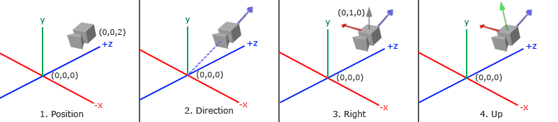
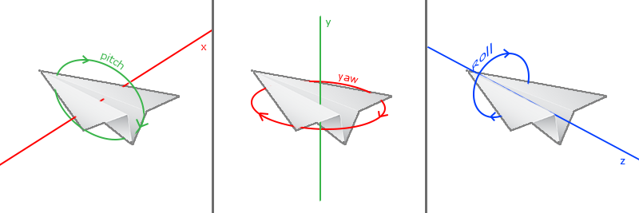
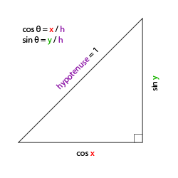
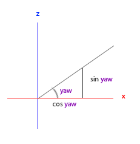
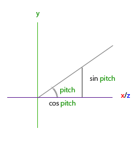

# Camera
Dans le chapitre précédent, nous avons discuté de la matrice de vue et de la façon dont nous pouvons l'utiliser pour nous déplacer dans la scène (nous avons un peu reculé). **OpenGL n'est pas familier avec le concept de caméra, mais nous pouvons essayer d'en simuler une en déplaçant tous les objets de la scène dans le sens inverse, donnant l'illusion que nous nous déplaçons.**  
  
Dans ce chapitre, nous verrons comment mettre en place une caméra dans OpenGL. Nous parlerons d'une caméra de type "**fly**" qui vous permet de vous déplacer librement dans une scène 3D. Nous aborderons également les entrées clavier et souris et terminerons par une classe de caméra personnalisée.
## Camera / view space
**Lorsque nous parlons de l'espace caméra/vue, nous parlons de toutes les coordonnées des sommets vues du point de vue de la caméra en tant qu'origine de la scène** : la matrice de vue transforme toutes les coordonnées du monde en coordonnées de vue qui sont relatives à la position et à la direction de la caméra.
**Pour définir une caméra, nous avons besoin de sa position dans l'espace monde, de la direction vers laquelle elle regarde, d'un vecteur pointant vers la droite et d'un vecteur pointant vers le haut à partir de la caméra**. Un lecteur attentif remarquera que nous allons en fait créer **un système de coordonnées avec 3 axes unitaires perpendiculaires, la position de la caméra étant l'origine.**

### Position de la caméra
Obtenir la position de la caméra est facile. La position de la caméra est un vecteur dans l'espace monde qui pointe vers la position de la caméra. Nous plaçons la caméra à la même position que dans le chapitre précédent :
```cpp
glm::vec3 cameraPos = glm::vec3(0.0f, 0.0f, 3.0f);  
```
> 	N'oubliez pas que l'axe $z$ positif traverse l'écran vers vous. Si nous voulons que la caméra recule, nous nous déplaçons le long de l'axe $z$ positif. 

### Direction de la caméra
Le vecteur suivant requis est la **direction** de la caméra, c'est-à-dire **la direction vers laquelle elle pointe**. Pour l'instant, nous laissons la caméra pointer vers l'origine de notre scène : $(0,0,0)$. Vous vous souvenez que **si l'on soustrait deux vecteurs l'un de l'autre, on obtient un vecteur qui est la différence de ces deux vecteurs** ? **En soustrayant le vecteur de position de la caméra du vecteur d'origine de la scène, on obtient donc le vecteur de direction souhaité.** Pour le système de coordonnées de la matrice de vue, nous voulons que son axe z soit positif et parce que par convention (dans OpenGL) la caméra pointe vers l'axe z négatif, nous voulons annuler le vecteur de direction. **Si nous inversons l'ordre de soustraction, nous obtenons un vecteur pointant vers l'axe z positif de la caméra** :
```cpp
glm::vec3 cameraTarget = glm::vec3(0.0f, 0.0f, 0.0f);
glm::vec3 cameraDirection = glm::normalize(cameraPos - cameraTarget);
```
> 	Le vecteur de direction du nom n'est pas le nom le mieux choisi, puisqu'il pointe en fait dans la direction inverse de ce qu'il vise.

### Axe droite (right axis)
Le vecteur suivant dont nous avons besoin est un vecteur vers la droite qui représente l'axe $x$ positif de l'espace de la caméra. Pour obtenir le vecteur vers la droite, nous utilisons une petite astuce en spécifiant d'abord un vecteur qui pointe vers le haut (dans l'espace monde). Nous effectuons ensuite un produit vectoriel sur le vecteur qui pointe vers le haut et le vecteur de direction de l'étape précédente. Comme le résultat d'un produit vectoriel est un vecteur perpendiculaire aux deux vecteurs, nous obtiendrons un vecteur qui pointe dans la direction de l'axe $x$ positif (si nous inversions l'ordre du produit en croix, nous obtiendrions un vecteur qui pointe dans la direction de l'axe $x$ négatif) :
```cpp
glm::vec3 up = glm::vec3(0.0f, 1.0f, 0.0f); 
glm::vec3 cameraRight = glm::normalize(glm::cross(up, cameraDirection));
```
### Axe vers le haut (up axis)
Maintenant que nous disposons du vecteur de l'axe des $x$ et du vecteur de l'axe des $z$, il est relativement facile de retrouver le vecteur qui pointe vers l'axe positif des $y$ de la caméra : nous prenons le produit vectoriel du vecteur vers la droite et du vecteur de la direction :
```cpp
glm::vec3 cameraUp = glm::cross(cameraDirection, cameraRight);
```
À l'aide du produit vectoriel et de quelques astuces, nous avons pu créer tous les vecteurs qui forment l'espace vue/caméra.Pour les lecteurs plus enclins aux mathématiques, ce processus est connu sous le nom de **processus de [Gram-Schmidt](http://en.wikipedia.org/wiki/Gram%E2%80%93Schmidt_process)** en algèbre linéaire. En utilisant ces vecteurs de caméra, nous pouvons maintenant créer une matrice `LookAt` qui s'avère très utile pour créer une caméra. 
### LookAt (matrice)
**L'avantage des matrices est que si vous définissez un espace de coordonnées à l'aide de 3 axes perpendiculaires (ou non linéaires), vous pouvez créer une matrice avec ces 3 axes plus un vecteur de translation et vous pouvez transformer n'importe quel vecteur dans cet espace de coordonnées en le multipliant avec cette matrice**. C'est exactement ce que fait la matrice `LookAt` et maintenant que nous avons 3 axes perpendiculaires et un vecteur de position pour définir l'espace de la caméra, nous pouvons créer notre propre matrice `LookAt` :

$$
LookAt=
\begin{bmatrix}
R_x & R_y & R_z & 0 \\\\
U_x & U_y & U_z & 0 \\\\
D_x & D_y & D_z & 0 \\\\
0 & 0 & 0 & 1 \\\\
\end{bmatrix}
\cdot
\begin{bmatrix}
1 & 0 & 0 & -P_x \\\\
0 & 1 & 0 & -P_y \\\\
0 & 0 & 1 & -P_z \\\\
0 & 0 & 0 & 1 \\\\
\end{bmatrix}
$$

Où $R$ est le vecteur qui pointe vers la droite, $U$ est le vecteur qui point vers le haut, $D$ est le vecteur de direction et $P$ est le vecteur de position de la caméra. **Notez que les parties rotation (matrice gauche) et translation (matrice droite) sont inversées (transposées et opposées respectivement) puisque nous voulons faire pivoter et translater le monde dans la direction opposée à celle où nous voulons que la caméra se déplace.**
L'utilisation de cette matrice `LookAt` comme matrice de vue transforme effectivement toutes les coordonnées du monde dans l'espace de vue que nous venons de définir. **La matrice `LookAt` fait alors exactement ce qu'elle dit : elle crée une matrice de vue qui regarde une cible donnée.**
**Heureusement pour nous, le GLM fait déjà tout ce travail pour nous**. Il nous suffit de spécifier la position de la caméra, la position de la cible et un vecteur qui représente le vecteur qui pointe vers le haut dans l'espace monde (le vecteur vers me haut que nous avons utilisé pour calculer le vecteur qui pointe vers la droite). GLM crée ensuite la matrice `LookAt` que nous pouvons utiliser comme matrice de vue :
```cpp
glm::mat4 view;
view = glm::lookAt(glm::vec3(0.0f, 0.0f, 3.0f), 
  		   glm::vec3(0.0f, 0.0f, 0.0f), 
  		   glm::vec3(0.0f, 1.0f, 0.0f));
```
La fonction `glm::LookAt` nécessite respectivement un vecteur de position, un vecteur de cible et un vecteur qui pointe vers le haut (up vector). Cet exemple crée une matrice de vue identique à celle que nous avons créée dans le chapitre précédent.  
  
Avant d'aborder l'entrée utilisateur, nous allons d'abord nous amuser un peu en faisant tourner la caméra autour de notre scène.Nous gardons la cible de la scène à $(0,0,0)$. Nous utilisons un peu de trigonométrie pour créer des coordonnées $x$ et $z$ à chaque image qui représentent un point sur un cercle et nous les utiliserons pour la position de la caméra. En recalculant les coordonnées $x$ et $y$ au fil du temps, nous parcourons tous les points d'un cercle et la caméra tourne donc autour de la scène. Nous agrandissons ce cercle d'un rayon prédéfini et créons une nouvelle matrice de vue à chaque image en utilisant la fonction $glfwGetTime$ de GLFW :

```cpp
const float radius = 10.0f;
float camX = sin(glfwGetTime()) * radius;
float camZ = cos(glfwGetTime()) * radius;
glm::mat4 view;
view = glm::lookAt(glm::vec3(camX, 0.0, camZ), glm::vec3(0.0, 0.0, 0.0), glm::vec3(0.0, 1.0, 0.0)); 
```
 Si vous exécutez ce code, vous devriez obtenir quelque chose comme ceci : 
 
Avec ce petit bout de code, la caméra tourne autour de la scène au fil du temps. N'hésitez pas à expérimenter avec les paramètres de rayon et de position/direction pour vous faire une idée du fonctionnement de cette matrice `LookAt`. Consultez également le [code source](https://learnopengl.com/code_viewer_gh.php?code=src/1.getting_started/7.1.camera_circle/camera_circle.cpp) si vous êtes bloqué.
## Se déplacer avec la caméra
Faire tourner la caméra autour d'une scène est amusant, mais il est encore plus amusant de faire tous les mouvements nous-mêmes ! Tout d'abord, nous devons mettre en place un système de caméra, il est donc utile de définir quelques variables de caméra au début de notre programme :
```cpp
glm::vec3 cameraPos   = glm::vec3(0.0f, 0.0f,  3.0f);
glm::vec3 cameraFront = glm::vec3(0.0f, 0.0f, -1.0f);
glm::vec3 cameraUp    = glm::vec3(0.0f, 1.0f,  0.0f);
```
La fonction `LookAt` devient alors:
```cpp
view = glm::lookAt(cameraPos, cameraPos + cameraFront, cameraUp);
```
Tout d'abord, nous définissons la position de la caméra en fonction du paramètre cameraPos défini précédemment. La direction est la position actuelle + le vecteur de direction que nous venons de définir. Cela permet de s'assurer que, quel que soit notre mouvement, la caméra continue de regarder dans la direction cible. Jouons un peu avec ces variables en mettant à jour le vecteur `cameraPos` lorsque nous appuyons sur certaines touches.  
  
Nous avons déjà défini une fonction `processInput` pour gérer les entrées clavier de GLFW, alors ajoutons quelques commandes supplémentaires : 
```cpp
void processInput(GLFWwindow *window)
{
    ...
    const float cameraSpeed = 0.05f; // adjust accordingly
    if (glfwGetKey(window, GLFW_KEY_W) == GLFW_PRESS)
        cameraPos += cameraSpeed * cameraFront;
    if (glfwGetKey(window, GLFW_KEY_S) == GLFW_PRESS)
        cameraPos -= cameraSpeed * cameraFront;
    if (glfwGetKey(window, GLFW_KEY_A) == GLFW_PRESS)
        cameraPos -= glm::normalize(glm::cross(cameraFront, cameraUp)) * cameraSpeed;
    if (glfwGetKey(window, GLFW_KEY_D) == GLFW_PRESS)
        cameraPos += glm::normalize(glm::cross(cameraFront, cameraUp)) * cameraSpeed;
}
```
Chaque fois que nous appuyons sur l'une des touches **WASD**, la position de la caméra est mise à jour en conséquence. Si nous voulons avancer ou reculer, nous ajoutons ou soustrayons le vecteur de direction du vecteur de position à l'échelle d'une certaine valeur de vitesse. Si nous voulons nous déplacer latéralement, nous effectuons un produit vectoriel pour créer un vecteur vers la droite et nous nous déplaçons le long du vecteur droit en conséquence. Cela permet d'obtenir l'effet familier de **strafe** lors de l'utilisation de la caméra.

>Notez que nous normalisons le vecteur vers la droite résultant. Si nous ne normalisions pas ce vecteur, le produit vectoriel résultant pourrait renvoyer des vecteurs de tailles différentes en fonction de la variable `cameraFront`. **Si nous ne normalisions pas le vecteur, nous nous déplacerions lentement ou rapidement en fonction de l'orientation de la caméra au lieu d'avoir une vitesse de déplacement constante.**

À ce stade, vous devriez déjà être en mesure de déplacer la caméra, bien qu'à une vitesse spécifique au système, vous devrez peut-être ajuster `cameraSpeed`.
## Rapidité du mouvement (movement speed)
Actuellement, nous utilisons une valeur constante pour la vitesse de déplacement lorsque l'on se déplace dans la scène. En théorie, cela semble correct, mais **en pratique, les machines des utilisateurs ont des puissances de traitement différentes et il en résulte que certaines personnes sont capables de rendre beaucoup plus d'images que d'autres chaque seconde**. Lorsqu'un utilisateur rend plus d'images qu'un autre, il appelle `processInput` plus souvent. **Il en résulte que certaines personnes se déplacent très rapidement et d'autres très lentement, en fonction de leur configuration**. Lorsque vous livrez votre application, vous voulez vous assurer qu'elle fonctionne de la même manière sur tous les types de matériel.  
  
Les applications graphiques et les jeux gardent généralement la trace d'une variable `deltatime` qui stocke le temps qu'il a fallu pour rendre la dernière image. Nous multiplions ensuite toutes les vitesses par cette valeur `deltaTime`. Ainsi, lorsque le `deltaTime` d'une image est élevé, ce qui signifie que la dernière image a pris plus de temps que la moyenne, la vitesse de cette image sera également un peu plus élevée afin d'équilibrer le tout. Avec cette approche, peu importe que vous ayez un ordinateur très rapide ou très lent, la vitesse de la caméra sera équilibrée en conséquence, de sorte que chaque utilisateur aura la même expérience.  
  
Pour calculer la valeur `deltaTime`, nous gardons la trace de 2 variables globales :
```cpp
float deltaTime = 0.0f;	// Time between current frame and last frame
float lastFrame = 0.0f; // Time of last frame
```
Pour chaque image, nous calculons la nouvelle valeur `deltaTime` en vue d'une utilisation ultérieure :
```cpp
float currentFrame = glfwGetTime();
deltaTime = currentFrame - lastFrame;
lastFrame = currentFrame;  
```
Maintenant que nous avons le `deltaTime`, nous pouvons le prendre en compte dans le calcul des vitesses : 
```cpp
void processInput(GLFWwindow *window)
{
    float cameraSpeed = 2.5f * deltaTime;
    [...]
}
```
Puisque nous utilisons `deltaTime`, la caméra se déplacera à une vitesse constante de $2.5$ unités par seconde. Avec la section précédente, nous devrions maintenant avoir un système de caméra beaucoup plus fluide et cohérent pour se déplacer dans la scène :

Et maintenant, nous avons une caméra qui se déplace et regarde aussi rapidement quel que soit le système. Encore une fois, consultez le [code source](https://learnopengl.com/code_viewer_gh.php?code=src/1.getting_started/7.2.camera_keyboard_dt/camera_keyboard_dt.cpp) si vous êtes bloqué. Nous verrons que la valeur `deltaTime` revient fréquemment avec tout ce qui concerne le mouvement. 

## Regarder autour de soi
Le fait de n'utiliser que les touches du clavier pour se déplacer n'est pas très intéressant. D'autant plus que l'on ne peut pas se retourner, ce qui rend les mouvements assez restreints. **C'est là que la souris entre en jeu !**  
  
Pour regarder autour de la scène, nous devons changer le vecteur `cameraFront` en fonction de l'entrée de la souris. Cependant, changer le vecteur de direction en fonction des rotations de la souris est un peu compliqué et nécessite un peu de trigonométrie. Si vous ne comprenez pas la trigonométrie, ne vous inquiétez pas, vous pouvez simplement passer aux sections de code et les coller dans votre code ; vous pourrez toujours revenir plus tard si vous voulez en savoir plus.

### Angles d'Euler
**Les angles d'Euler sont trois valeurs qui peuvent représenter n'importe quelle rotation en 3D**. Ils ont été définis par Leonhard Euler dans les années 1700. **Il existe trois angles d'Euler : le tangage (pitch), le lacet (yaw) et le roulis (roll)**. L'image suivante leur donne une signification visuelle :

Le tangage (pitch) est l'angle qui indique à quel point nous regardons vers le haut ou vers le bas, comme le montre la première image.
La deuxième image montre la valeur de lacet (yaw) qui représente l'ampleur de notre regard vers la gauche ou vers la droite.
L'angle de roulis (roll) représente l'ampleur du mouvement de roulis, comme c'est souvent le cas pour les caméras des vols spatiaux.
**Chacun des angles d'Euler est représenté par une valeur unique et la combinaison des trois permet de calculer n'importe quel vecteur de rotation en 3D.** 
  
**Pour notre système de caméra, seules les valeurs de lacet et de tangage nous intéressent, nous ne parlerons donc pas ici de la valeur de roulis.** **Étant donné une valeur de tangage et une valeur de lacet, nous pouvons les convertir en un vecteur 3D qui représente un nouveau vecteur de direction.** Le processus de conversion des valeurs de lacet et de tangage en un vecteur de direction nécessite un peu de trigonométrie, et nous commençons par un cas de base :  
  
Commençons par un petit rappel et vérifions le cas général du triangle droit (avec un côté à un angle de 90 degrés) :

Si nous définissons l'hypoténuse comme étant de longueur 1, nous savons, grâce à la trigonométrie (soh cah toa), que **la longueur du côté adjacent est $cos x/h=cos x/1=cos x$ et que la longueur du côté opposé est $sin y/h=sin y/1=sin y$.**  
  
Cela nous donne des formules générales pour calculer la longueur des côtés $x$ et $y$ des triangles rectangles, en fonction de l'angle donné. Utilisons ces formules pour calculer les composantes du vecteur directionnel.  
  
Imaginons ce même triangle, mais en le regardant d'un point de vue supérieur, les côtés adjacents et opposés étant parallèles aux axes $x$ et $z$ de la scène (comme si l'on regardait vers le bas sur l'axe $y$).

Si l'on considère que l'angle de lacet est l'angle dans le sens inverse des aiguilles d'une montre à partir du côté $x$, on peut voir que la longueur du côté $x$ est liée à $cos(yaw)$. De même, la longueur du côté $z$ est liée à $sin(yaw)$.

Si nous prenons ces connaissances et une valeur de lacet donnée, nous pouvons les utiliser pour créer un vecteur de direction de la caméra :
```cpp
glm::vec3 direction;
direction.x = cos(glm::radians(yaw)); // Note that we convert the angle to radians first
direction.z = sin(glm::radians(yaw));
```
Cela permet d'obtenir un vecteur de direction 3D à partir d'une valeur de lacet, mais le tangage doit également être pris en compte. Regardons maintenant le côté de l'axe des $y$ comme si nous étions assis sur le plan $XZ$ :

De même, ce triangle nous permet de constater que la composante $y$ de la direction est égale à $sin(pitch)$ :
```cpp
direction.y = sin(glm::radians(pitch));  
```
Cependant, à partir du triangle de tangage, nous pouvons également voir que les côtés $xz$ sont influencés par $cos(pitch)$, nous devons donc nous assurer que cela fait également partie du vecteur de direction. En tenant compte de ces éléments, nous obtenons le vecteur directionnel final traduit à partir des angles d'Euler de lacet et de tangage : 
```cpp
direction.x = cos(glm::radians(yaw)) * cos(glm::radians(pitch));
direction.y = sin(glm::radians(pitch));
direction.z = sin(glm::radians(yaw)) * cos(glm::radians(pitch));
```
Cela nous donne une formule pour convertir les valeurs de lacet et de tangage en un vecteur de direction tridimensionnel que nous pouvons utiliser pour regarder autour de nous.  
  
Nous avons configuré l'univers de la scène de manière à ce que tout soit positionné dans la direction de l'axe z négatif. Cependant, si nous regardons le triangle de lacet $x$ et $z$, nous voyons qu'un $θ$ de $0$ fait que le vecteur de direction de la caméra pointe vers l'axe $x$ positif. **Pour s'assurer que la caméra pointe par défaut vers l'axe $z$ négatif, nous pouvons donner au mouvement de lacet une valeur par défaut de 90 degrés dans le sens des aiguilles d'une montre**. Les degrés positifs entraînent une rotation dans le sens inverse des aiguilles d'une montre, c'est pourquoi nous définissons la valeur de lacet par défaut à :
```cpp
yaw = -90.0f;
```
Vous vous êtes probablement déjà posé la question : comment définir et modifier ces valeurs de lacet et de tangage ?

### Mouse input (entrée souris)
Les valeurs de lacet et de tangage sont obtenues à partir du mouvement de la souris (ou du contrôleur/joystick), le mouvement horizontal de la souris affectant le lacet et le mouvement vertical de la souris affectant le tangage. L'idée est de stocker les positions de la souris de la dernière image et de calculer dans l'image actuelle l'ampleur de la variation des valeurs de la souris. Plus la différence horizontale ou verticale est importante, plus nous mettons à jour la valeur de tangage ou de lacet et donc plus la caméra doit se déplacer.  
  
Tout d'abord, nous allons indiquer à GLFW qu'il doit cacher le curseur et le capturer. **Capturer un curseur signifie qu'une fois que l'application a le focus, le curseur de la souris reste au centre de la fenêtre** (à moins que l'application ne perde le focus ou ne soit quittée). Pour ce faire, il suffit d'un simple appel à la configuration :
```cpp
glfwSetInputMode(window, GLFW_CURSOR, GLFW_CURSOR_DISABLED);  
```
Après cet appel, chaque fois que nous déplacerons la souris, elle ne sera pas visible et ne devrait pas quitter la fenêtre. C'est parfait pour un système de caméra FPS.

Pour calculer les valeurs de tangage et de lacet, nous devons dire à GLFW d'écouter les événements de mouvement de la souris. Pour ce faire, nous créons une fonction de rappel avec le prototype suivant :
```cpp
void mouse_callback(GLFWwindow* window, double xpos, double ypos);
```
Ici, `xpos` et `ypos` représentent les positions actuelles de la souris. Dès que nous enregistrons la fonction de callback auprès de GLFW à chaque fois que la souris se déplace, la fonction `mouse_callback` est appelée : 
```cpp
glfwSetCursorPosCallback(window, mouse_callback);  
```
Lorsque l'on gère l'entrée de la souris pour une caméra de type fly, il y a plusieurs étapes à suivre avant de pouvoir calculer complètement le vecteur de direction de la caméra :  
  
1. Calculer le décalage de la souris depuis la dernière image.  
2. Ajouter les valeurs de décalage aux valeurs de lacet et de tangage de la caméra.  
3. Ajouter des contraintes aux valeurs de tangage minimum/maximum.  
4. Calculer le vecteur de direction.  
  
La première étape consiste à calculer le décalage de la souris depuis la dernière image. Nous devons d'abord stocker les dernières positions de la souris dans l'application, que nous initialisons pour être au centre de l'écran (la taille de l'écran est de `800` par `600`) initialement : 
```cpp
float lastX = 400, lastY = 300;
```
 Ensuite, dans la fonction callback de la souris, nous calculons le décalage entre la dernière image et l'image actuelle :
 ```cpp
float xoffset = xpos - lastX;
float yoffset = lastY - ypos; // reversed since y-coordinates range from bottom to top
lastX = xpos;
lastY = ypos;

const float sensitivity = 0.1f;
xoffset *= sensitivity;
yoffset *= sensitivity;
```
Notez que nous multiplions les valeurs de décalage par une valeur de sensibilité. Si nous omettons cette multiplication, le mouvement de la souris sera beaucoup trop fort ; jouez avec la valeur de sensibilité à votre convenance.

Ensuite, nous ajoutons les valeurs de décalage aux valeurs de tangage et de lacet déclarées globalement :
```cpp
yaw   += xoffset;
pitch += yoffset;  
```
Dans la troisième étape, nous aimerions ajouter quelques contraintes à la caméra afin que les utilisateurs ne puissent pas faire des mouvements de caméra bizarres (cela provoque également un retournement de `LookAt` dès que le vecteur de direction est parallèle à la direction du monde vers le haut). Le pitch doit être contraint de manière à ce que les utilisateurs ne puissent pas regarder plus haut que 89 degrés (à 90 degrés, nous obtenons le `LookAt` flip) et également pas en dessous de -89 degrés. Cela garantit que l'utilisateur pourra regarder vers le ciel ou vers ses pieds, mais pas plus loin. Les contraintes fonctionnent en remplaçant la valeur d'Euler par sa valeur de contrainte chaque fois qu'elle enfreint la contrainte :
```cpp
if(pitch > 89.0f)
  pitch =  89.0f;
if(pitch < -89.0f)
  pitch = -89.0f;
```
Notez que nous ne fixons aucune contrainte sur la valeur de lacet puisque nous ne voulons pas contraindre l'utilisateur à une rotation horizontale. Cependant, il est tout aussi facile d'ajouter une contrainte sur la valeur de lacet si vous le souhaitez.

La quatrième et dernière étape consiste à calculer le vecteur de direction actuel en utilisant la formule de la section précédente :
```cpp
glm::vec3 direction;
direction.x = cos(glm::radians(yaw)) * cos(glm::radians(pitch));
direction.y = sin(glm::radians(pitch));
direction.z = sin(glm::radians(yaw)) * cos(glm::radians(pitch));
cameraFront = glm::normalize(direction);
```
Ce vecteur de direction calculé contient alors toutes les rotations calculées à partir du mouvement de la souris. Comme le vecteur `cameraFront` est déjà inclus dans la fonction `lookAt` de **glm**, nous sommes prêts à partir.  
  
Si vous exécutez maintenant le code, vous remarquerez que la caméra fait un grand saut soudain lorsque la fenêtre reçoit pour la première fois le focus du curseur de votre souris. **La cause de ce saut soudain est que dès que votre curseur entre dans la fenêtre, la fonction de callback de la souris est appelée avec une position `xpos` et `ypos` égale à l'emplacement à partir duquel votre souris est entrée dans l'écran**. Cette position est souvent très éloignée du centre de l'écran, ce qui entraîne des décalages importants et donc un saut de mouvement important.
Nous pouvons contourner ce problème en définissant une variable globale `bool` pour vérifier si c'est la première fois que nous recevons une entrée de souris. Si c'est la première fois, nous mettons à jour les positions initiales de la souris avec les nouvelles valeurs `xpos` et `ypos`. Les mouvements de souris résultants utiliseront alors les coordonnées de position de la souris nouvellement saisies pour calculer les décalages :
```cpp
if (firstMouse) // initially set to true
{
    lastX = xpos;
    lastY = ypos;
    firstMouse = false;
}
```
 Le code final devient alors :
```cpp
void mouse_callback(GLFWwindow* window, double xpos, double ypos)
{
    if (firstMouse)
    {
        lastX = xpos;
        lastY = ypos;
        firstMouse = false;
    }
  
    float xoffset = xpos - lastX;
    float yoffset = lastY - ypos; 
    lastX = xpos;
    lastY = ypos;

    float sensitivity = 0.1f;
    xoffset *= sensitivity;
    yoffset *= sensitivity;

    yaw   += xoffset;
    pitch += yoffset;

    if(pitch > 89.0f)
        pitch = 89.0f;
    if(pitch < -89.0f)
        pitch = -89.0f;

    glm::vec3 direction;
    direction.x = cos(glm::radians(yaw)) * cos(glm::radians(pitch));
    direction.y = sin(glm::radians(pitch));
    direction.z = sin(glm::radians(yaw)) * cos(glm::radians(pitch));
    cameraFront = glm::normalize(direction);
}  
```
### Zoom
Pour compléter le système de caméra, nous allons également implémenter une interface de zoom. Dans le chapitre précédent, nous avons dit que le champ de vision (fov: field of view) définit en grande partie ce que nous pouvons voir de la scène. Lorsque le champ de vision se réduit, l'espace projeté de la scène se réduit. Cet espace plus petit est projeté sur le même NDC, ce qui donne l'illusion d'un zoom avant. Pour effectuer un zoom avant, nous allons utiliser la molette de la souris. Comme pour le mouvement de la souris et la saisie au clavier, nous disposons d'une fonction de callback pour le scroll de la souris :
```cpp
void scroll_callback(GLFWwindow* window, double xoffset, double yoffset)
{
    fov -= (float)yoffset;
    if (fov < 1.0f)
        fov = 1.0f;
    if (fov > 45.0f)
        fov = 45.0f; 
}
```
Lors du scrolling, la valeur `yoffset` nous indique la quantité de scroll vertical. Lorsque la fonction `scroll_callback` est appelée, nous modifions le contenu de la variable `fov` déclarée globalement. Puisque `45.0` est la valeur par défaut de `fov`, nous voulons contraindre le niveau de zoom entre `1.0` et `45.0`.  
  
Nous devons maintenant charger la matrice de projection perspective vers le GPU à chaque image, mais cette fois avec la variable `fov` comme champ de vision :
```cpp
projection = glm::perspective(glm::radians(fov), 800.0f / 600.0f, 0.1f, 100.0f); 
```
Enfin, n'oubliez pas d'enregistrer la fonction de callback du scroll : 
```cpp
glfwSetScrollCallback(window, scroll_callback); 
```
Et voilà. Nous avons mis en place un système de caméra simple qui permet de se déplacer librement dans un environnement 3D. 


 N'hésitez pas à expérimenter un peu et, si vous êtes bloqué, comparez votre code avec le [code source](https://learnopengl.com/code_viewer_gh.php?code=src/1.getting_started/7.3.camera_mouse_zoom/camera_mouse_zoom.cpp).

## Classe Camera
Dans les prochains chapitres, nous utiliserons toujours une caméra pour regarder facilement les scènes et voir les résultats sous tous les angles. Cependant, **comme le code de la caméra peut prendre beaucoup de place dans chaque chapitre, nous allons nous abstraire un peu de ses détails et créer notre propre objet caméra qui fait la plupart du travail pour nous avec quelques petits extras sympathiques**. Contrairement au chapitre sur les shaders, nous ne vous guiderons pas dans la création de la classe caméra, mais nous vous fournirons le code source (entièrement commenté) si vous souhaitez en connaître les rouages.  
  
Comme pour l'objet Shader, nous définissons la classe caméra entièrement dans un seul fichier d'en-tête. Vous pouvez trouver la classe caméra [ici](https://learnopengl.com/code_viewer_gh.php?code=includes/learnopengl/camera.h) ; vous devriez être en mesure de comprendre le code après ce chapitre. Il est conseillé d'essayer au moins une fois la classe comme exemple de la façon dont vous pouvez créer votre propre système de caméra.

>Le système de caméra que nous avons introduit est une caméra de type "fly" qui convient à la plupart des usages et fonctionne bien avec les angles d'Euler, **mais soyez prudent lorsque vous créez des systèmes de caméra différents comme une caméra FPS, ou une caméra de simulation de vol.** **Chaque système de caméra a ses propres astuces et bizarreries, alors assurez-vous de vous renseigner à leur sujet**. Par exemple, cette caméra de vol ne permet pas des valeurs de tangage supérieures ou égales à 90 degrés et un vecteur statique vers le haut de (0,1,0) ne fonctionne pas lorsque nous prenons en compte les valeurs de roulis.

La version mise à jour du code source utilisant le nouvel objet caméra est disponible [ici](https://learnopengl.com/code_viewer_gh.php?code=src/1.getting_started/7.4.camera_class/camera_class.cpp). 