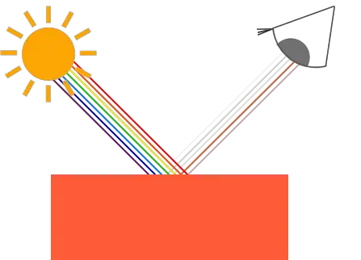
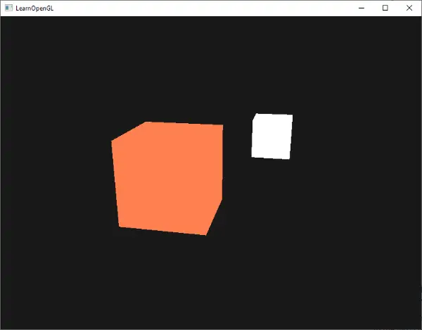

# Couleurs
Nous avons brièvement utilisé et manipulé les couleurs dans les chapitres précédents, mais nous ne les avons jamais définies correctement. Nous allons ici discuter de ce que sont les couleurs et commencer à construire la scène pour les prochains chapitres sur l'éclairage.  
  
Dans le monde réel, les couleurs peuvent prendre n'importe quelle valeur connue, chaque objet ayant sa propre couleur. Dans le monde numérique, nous devons convertir les couleurs réelles (infinies) en valeurs numériques (limitées) et, par conséquent, toutes les couleurs du monde réel ne peuvent pas être représentées numériquement. Les couleurs sont représentées numériquement à l'aide d'une composante rouge, verte et bleue, communément abrégée en RVB. En utilisant différentes combinaisons de ces trois valeurs, dans une plage de `[0,1]`, nous pouvons représenter presque toutes les couleurs. Par exemple, pour obtenir une couleur corail, nous définissons un vecteur de couleur comme suit :
```cpp
glm::vec3 coral(1.0f, 0.5f, 0.31f);   
```
**La couleur d'un objet que nous voyons dans la vie réelle n'est pas la couleur qu'il a réellement, mais la couleur réfléchie par l'objet**. Les couleurs qui ne sont pas absorbées (rejetées) par l'objet sont celles que nous percevons. Par exemple, la lumière du soleil est perçue comme une lumière blanche qui est la somme combinée de nombreuses couleurs différentes (comme vous pouvez le voir sur l'image). Si nous éclairons un jouet bleu avec cette lumière blanche, il absorbera toutes les sous-couleurs de la couleur blanche, à l'exception de la couleur bleue. Comme le jouet n'absorbe pas la partie bleue, la lumière est réfléchie. Cette lumière réfléchie pénètre dans notre œil, ce qui donne l'impression que le jouet a une couleur bleue. L'image suivante illustre ce phénomène pour un jouet de couleur corail qui reflète plusieurs couleurs avec une intensité variable :

Vous pouvez voir que la lumière blanche du soleil est un ensemble de toutes les couleurs visibles et que l'objet absorbe une grande partie de ces couleurs. Il ne reflète que les couleurs qui représentent la couleur de l'objet et c'est la combinaison de ces couleurs que nous percevons (dans ce cas, une couleur corail). 

Techniquement, c'est un peu plus compliqué, mais nous y reviendrons dans les chapitres consacrés au PBR (physical based renderer).

Ces règles de réflexion des couleurs s'appliquent directement au domaine graphique. Lorsque nous définissons une source de lumière dans OpenGL, nous voulons lui donner une couleur. Dans le paragraphe précédent, nous avions une couleur blanche, nous allons donc donner à la source de lumière une couleur blanche également. Si nous multiplions ensuite la couleur de la source lumineuse avec la valeur de la couleur d'un objet, la couleur résultante sera la couleur réfléchie de l'objet (et donc sa couleur perçue). Reprenons notre jouet (cette fois avec une valeur corail) et voyons comment nous pourrions calculer sa couleur perçue dans le monde graphique. Nous obtenons le vecteur de couleur résultant en effectuant une multiplication par composantes entre les vecteurs de couleur de la lumière et de l'objet :

```cpp
glm::vec3 lightColor(1.0f, 1.0f, 1.0f);
glm::vec3 toyColor(1.0f, 0.5f, 0.31f);
glm::vec3 result = lightColor * toyColor; // = (1.0f, 0.5f, 0.31f);
```

Nous pouvons voir que la couleur du jouet absorbe une grande partie de la lumière blanche, mais reflète plusieurs valeurs de rouge, de vert et de bleu en fonction de sa propre valeur de couleur. **Il s'agit d'une représentation de la manière dont les couleurs fonctionnent dans la vie réelle.** Nous pouvons donc définir la couleur d'un objet comme la quantité de chaque composante de couleur qu'il reflète à partir d'une source lumineuse. Que se passerait-il si nous utilisions une lumière verte ?

```cpp
glm::vec3 lightColor(0.0f, 1.0f, 0.0f);
glm::vec3 toyColor(1.0f, 0.5f, 0.31f);
glm::vec3 result = lightColor * toyColor; // = (0.0f, 0.5f, 0.0f);
```

Comme nous pouvons le voir, le jouet n'a pas de lumière rouge et bleue à absorber et/ou à réfléchir. Le jouet absorbe également la moitié de la valeur verte de la lumière, mais réfléchit également la moitié de la valeur verte de la lumière. La couleur du jouet que nous percevons est donc une couleur vert foncé. Nous pouvons constater que si nous utilisons une lumière verte, seules les composantes de la couleur verte peuvent être réfléchies et donc perçues ; les couleurs rouge et bleue ne sont pas perçues. Par conséquent, l'objet corail devient soudainement un objet de couleur vert foncé. Essayons un autre exemple avec une lumière vert olive foncé :
```cpp
glm::vec3 lightColor(0.33f, 0.42f, 0.18f);
glm::vec3 toyColor(1.0f, 0.5f, 0.31f);
glm::vec3 result = lightColor * toyColor; // = (0.33f, 0.21f, 0.06f);
```
Comme vous pouvez le constater, il est possible d'obtenir des couleurs intéressantes à partir d'objets en utilisant différentes couleurs de lumière. Il n'est pas difficile d'être créatif avec les couleurs.

Mais assez parlé de couleurs, commençons à construire une scène dans laquelle nous pourrons expérimenter. 

## Une scène éclairée

Dans les prochains chapitres, nous créerons des images intéressantes en simulant l'éclairage du monde réel et en faisant un usage intensif des couleurs. Puisque nous allons utiliser des sources de lumière, nous voulons les afficher en tant qu'objets visuels dans la scène et ajouter au moins un objet pour simuler l'éclairage.  
  
La première chose dont nous avons besoin est un objet sur lequel projeter la lumière et nous utiliserons le fameux cube conteneur des chapitres précédents. Nous aurons également besoin d'un objet lumière pour montrer où se trouve la source de lumière dans la scène 3D. Pour des raisons de simplicité, nous représenterons la source de lumière par un cube (nous avons déjà les données des vertex, n'est-ce pas ?).  
  
Remplir un objet tampon de vertex (VBO), définir des pointeurs d'attributs de vertex et tout le reste devrait vous être familier maintenant, nous n'allons donc pas vous guider à travers ces étapes. Si vous n'avez toujours aucune idée de ce qui se passe, je vous suggère de revoir les chapitres précédents, et de travailler sur les exercices si possible, avant de continuer.  
  
La première chose dont nous avons besoin est un vertex shader pour dessiner le conteneur. Les positions des vertex du conteneur restent les mêmes (bien que nous n'ayons pas besoin des coordonnées de texture cette fois-ci), le code n'a donc rien de nouveau. Nous utiliserons une version simplifiée du vertex shader des derniers chapitres :

```cpp
#version 330 core
layout (location = 0) in vec3 aPos;

uniform mat4 model;
uniform mat4 view;
uniform mat4 projection;

void main()
{
    gl_Position = projection * view * model * vec4(aPos, 1.0);
} 
```
Veillez à mettre à jour les données de vertex et les pointeurs d'attributs pour qu'ils correspondent au nouveau vertex shader (si vous le souhaitez, vous pouvez garder les données de texture et les pointeurs d'attributs actifs ; nous ne les utilisons pas pour l'instant).  
  
Comme nous allons également effectuer le rendu d'un cube de source lumineuse, nous voulons générer un nouveau **VAO** spécifiquement pour la source lumineuse. Nous pourrions effectuer le rendu de la source lumineuse avec le même **VAO**, puis **effectuer** quelques transformations de la position de la lumière sur la matrice du modèle, mais dans les prochains chapitres, nous modifierons assez souvent les données de vertex et les pointeurs d'attributs de l'objet conteneur et nous ne voulons pas que ces changements se propagent à l'objet source lumineuse (nous ne nous soucions que des positions de vertex du cube lumineux), nous allons donc créer un nouveau **VAO** : 

```cpp
unsigned int lightVAO;
glGenVertexArrays(1, &lightVAO);
glBindVertexArray(lightVAO);
// we only need to bind to the VBO, the container's VBO's data already contains the data.
glBindBuffer(GL_ARRAY_BUFFER, VBO);
// set the vertex attribute 
glVertexAttribPointer(0, 3, GL_FLOAT, GL_FALSE, 3 * sizeof(float), (void*)0);
glEnableVertexAttribArray(0);
```
Le code devrait être relativement simple. Maintenant que nous avons créé le conteneur et le cube de la source lumineuse, il ne reste plus qu'à définir le fragment shader pour le conteneur et la source lumineuse : 

```cpp
#version 330 core
out vec4 FragColor;
  
uniform vec3 objectColor;
uniform vec3 lightColor;

void main()
{
    FragColor = vec4(lightColor * objectColor, 1.0);
}
```

Le fragment shader accepte à la fois une couleur d'objet et une couleur de lumière à partir d'une variable uniforme. Ici, nous multiplions la couleur de la lumière avec la couleur de l'objet (réfléchie) comme nous l'avons vu au début de ce chapitre. Encore une fois, ce shader devrait être facile à comprendre. Réglons la couleur de l'objet sur la couleur corail de la dernière section avec une lumière blanche : 

```cpp
// don't forget to use the corresponding shader program first (to set the uniform)
lightingShader.use();
lightingShader.setVec3("objectColor", 1.0f, 0.5f, 0.31f);
lightingShader.setVec3("lightColor",  1.0f, 1.0f, 1.0f);
```

Une chose à noter est que lorsque nous commencerons à mettre à jour ces shaders d'éclairage dans les prochains chapitres, le cube de la source de lumière sera également affecté et ce n'est pas ce que nous voulons. Nous ne voulons pas que la couleur de l'objet source de lumière soit affectée par les calculs d'éclairage, mais plutôt que la source de lumière soit isolée du reste. **Nous voulons que la source de lumière ait une couleur claire constante, non affectée par les autres changements de couleur (cela donne l'impression que le cube de la source de lumière est vraiment la source de la lumière).**  
  
**Pour ce faire, nous devons créer un deuxième ensemble de shaders que nous utiliserons pour dessiner le cube de la source lumineuse, à l'abri de toute modification des shaders d'éclairage.** Le vertex shader est le même que le vertex shader d'éclairage, vous pouvez donc simplement copier le code source. **Le fragment shader du cube source de lumière s'assure que la couleur du cube reste claire en définissant une couleur blanche constante sur la lampe** :

```cpp
#version 330 core
out vec4 FragColor;

void main()
{
    FragColor = vec4(1.0); // set all 4 vector values to 1.0
}
```

Lorsque nous voulons effectuer un rendu, nous voulons effectuer un rendu de l'objet conteneur (ou éventuellement de nombreux autres objets) en utilisant le shader d'éclairage que nous venons de définir, et lorsque nous voulons dessiner la source de lumière, nous utilisons les shaders de la source de lumière. Au cours des chapitres consacrés à l'éclairage, nous mettrons progressivement à jour les shaders d'éclairage afin d'obtenir des résultats plus réalistes.  
  
L'objectif principal du cube de la source lumineuse est de montrer d'où vient la lumière. Nous définissons généralement la position d'une source de lumière quelque part dans la scène, mais il s'agit simplement d'une position qui n'a aucune signification visuelle. Pour montrer où se trouve réellement la source de lumière, nous créons un cube au même endroit que la source de lumière. Nous effectuons le rendu de ce cube avec le shader cube source de lumière pour nous assurer que le cube reste toujours blanc, quelles que soient les conditions de luminosité de la scène.  
  
Déclarons donc une variable globale `vec3` qui représente l'emplacement de la source lumineuse dans les coordonnées world space :
```cpp
glm::vec3 lightPos(1.2f, 1.0f, 2.0f);
```

 Nous traduisons ensuite le cube de la source lumineuse en fonction de la position de la source lumineuse et nous le réduisons à l'échelle avant d'effectuer le rendu : 
```cpp
model = glm::mat4(1.0f);
model = glm::translate(model, lightPos);
model = glm::scale(model, glm::vec3(0.2f)); 
```

Le code de rendu résultant pour le cube de la source lumineuse devrait alors ressembler à ceci : 
```cpp
lightCubeShader.use();
// set the model, view and projection matrix uniforms
[...]
// draw the light cube object
glBindVertexArray(lightCubeVAO);
glDrawArrays(GL_TRIANGLES, 0, 36);	
```
L'injection de tous les fragments de code à leurs emplacements appropriés aboutirait alors à une application OpenGL propre, correctement configurée pour expérimenter l'éclairage. Si tout se compile, cela devrait ressembler à ceci : 


Il n'y a pas grand-chose à voir pour l'instant, mais je vous promets que cela deviendra plus intéressant dans les prochains chapitres.  
  
Si vous avez des difficultés à trouver où tous les extraits de code s'intègrent dans l'application dans son ensemble, consultez le code source [ici](https://learnopengl.com/code_viewer_gh.php?code=src/2.lighting/1.colors/colors.cpp) et travaillez soigneusement dans le code/commentaires.  
  
Maintenant que nous avons acquis quelques connaissances sur les couleurs et que nous avons créé une scène de base pour expérimenter l'éclairage, nous pouvons passer au chapitre suivant où la vraie magie commence. 
