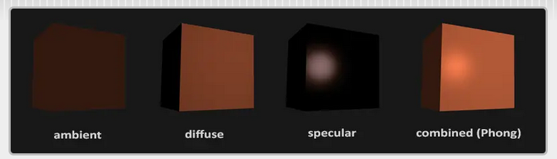
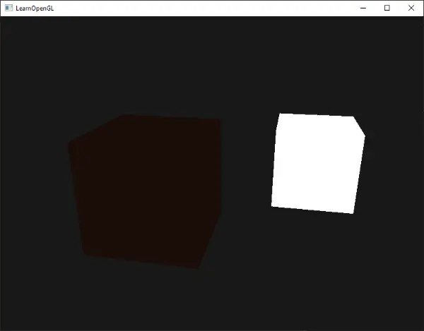
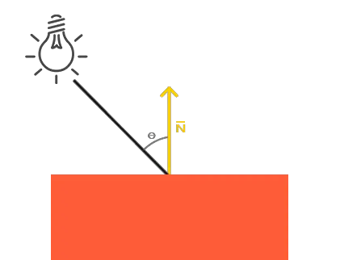
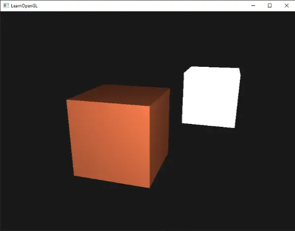
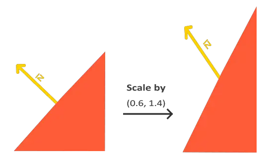
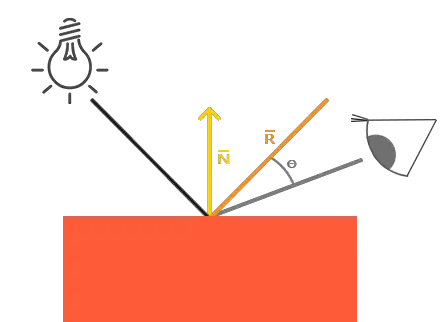
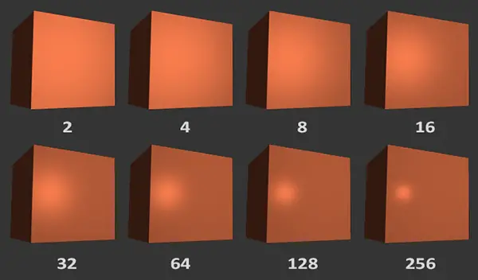
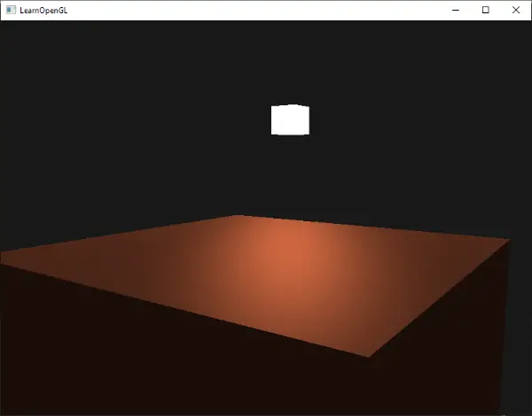

# Basic lighting
L'éclairage dans le monde réel est extrêmement compliqué et dépend de beaucoup trop de facteurs, ce que nous ne pouvons pas nous permettre de calculer avec la puissance de traitement limitée dont nous disposons. L'éclairage dans OpenGL est donc basé sur des approximations de la réalité en utilisant des modèles simplifiés qui sont beaucoup plus faciles à traiter et relativement similaires. Ces modèles d'éclairage sont basés sur la physique de la lumière telle que nous la comprenons. L'un de ces modèles est appelé le modèle d'éclairage Phong (*Phong lighting model*). Les principales composantes du modèle d'éclairage Phong sont au nombre de trois : l'éclairage **ambiant**, l'éclairage **diffus** et l'éclairage **spéculaire**. Vous pouvez voir ci-dessous à quoi ressemblent ces composants d'éclairage, seuls ou combinés :



- **ambiant** : même lorsqu'il fait sombre, il reste généralement de la lumière quelque part dans le monde (la lune, une lumière lointaine), de sorte que les objets ne sont presque jamais complètement sombres. Pour simuler cela, nous utilisons une constante d'éclairage ambiant qui donne toujours de la couleur à l'objet.
- **diffuse** : simule l'impact directionnel d'un objet lumineux sur un objet. Il s'agit de la composante la plus visuellement significative du modèle d'éclairage. Plus une partie d'un objet est orientée vers la source de lumière, plus elle devient lumineuse.
- **specular** : simule le point lumineux d'une lumière qui apparaît sur les objets brillants. Les reflets spéculaires sont davantage liés à la couleur de la lumière qu'à celle de l'objet.

Pour créer des scènes visuellement intéressantes, nous voulons au moins simuler ces trois composantes de l'éclairage. Nous commencerons par la plus simple : l'éclairage ambiant.

## Ambiant
La lumière ne provient généralement pas d'une source lumineuse unique, mais de nombreuses sources lumineuses dispersées tout autour de nous, même lorsqu'elles ne sont pas immédiatement visibles. **L'une des propriétés de la lumière est qu'elle peut se disperser et rebondir dans de nombreuses directions**, atteignant des endroits qui ne sont pas directement visibles ; la lumière peut donc se refléter sur d'autres surfaces et avoir un impact indirect sur l'éclairage d'un objet. **Les algorithmes qui prennent cela en considération sont appelés algorithmes d'illumination globale, mais ils sont compliqués et coûteux à calculer.**

Comme nous ne sommes pas de grands amateurs d'algorithmes compliqués et coûteux, **nous commencerons par utiliser un modèle très simpliste d'illumination globale, à savoir l'éclairage ambiant**. Comme vous l'avez vu dans la section précédente, nous utilisons une petite couleur constante (claire) que nous **ajoutons** à la couleur finale des fragments de l'objet, ce qui donne l'impression qu'il y a toujours un peu de lumière diffuse même lorsqu'il n'y a pas de source de lumière directe.

Ajouter un éclairage ambiant à la scène est très simple. Nous prenons la couleur de la lumière, nous la multiplions avec un petit facteur ambiant constant, nous la multiplions avec la couleur de l'objet et nous l'utilisons comme couleur du fragment dans le shader de l'objet cube :

```cpp
void main()
{
    float ambientStrength = 0.1;
    vec3 ambient = ambientStrength * lightColor;

    vec3 result = ambient * objectColor;
    FragColor = vec4(result, 1.0);
}  
```

Si vous exécutez maintenant le programme, vous remarquerez que la première étape de l'éclairage est maintenant appliquée avec succès à l'objet. L'objet est assez sombre, mais pas complètement puisque l'éclairage ambiant est appliqué (notez que le cube de lumière n'est pas affecté car nous utilisons un shader différent). L'objet devrait ressembler à ceci :


## Diffuse
L'éclairage ambiant en lui-même ne produit pas les résultats les plus intéressants, mais l'éclairage diffus commence à avoir un impact visuel significatif sur l'objet. L'éclairage diffus donne à l'objet plus de luminosité au fur et à mesure que ses fragments sont alignés sur les rayons lumineux d'une source de lumière. Pour mieux comprendre l'éclairage diffus, regardez l'image suivante :

À gauche, nous trouvons une source lumineuse dont le rayon lumineux est dirigé vers un seul fragment de notre objet. Nous devons mesurer l'angle sous lequel le rayon lumineux touche le fragment. Si le rayon lumineux est perpendiculaire à la surface de l'objet, l'impact de la lumière est maximal. Pour mesurer l'angle entre le rayon lumineux et le fragment, nous utilisons ce que l'on appelle un vecteur normal, c'est-à-dire un vecteur perpendiculaire à la surface du fragment (représenté ici par une flèche jaune) ; nous y reviendrons plus tard. L'angle entre les deux vecteurs peut alors être facilement calculé à l'aide du produit de points.

Vous vous souvenez peut-être du chapitre sur les transformations que, plus l'angle entre deux vecteurs unitaires est faible, plus le produit de points tend vers une valeur de 1. Lorsque l'angle entre les deux vecteurs est de 90 degrés, le produit de points est égal à 0. Il en va de même pour θ: plus θ est grand, moins la lumière devrait avoir d'impact sur la couleur du fragment.

Notez que pour obtenir (uniquement) le cosinus de l'angle entre les deux vecteurs, nous travaillerons avec des vecteurs unitaires (vecteurs de longueur 1). Nous devons donc nous assurer que tous les vecteurs sont normalisés, sinon le produit point renvoie plus que le cosinus (voir Transformations).

Le produit de points résultant renvoie donc un scalaire que nous pouvons utiliser pour calculer l'impact de la lumière sur la couleur du fragment, ce qui donne des fragments éclairés différemment en fonction de leur orientation par rapport à la lumière.

De quoi avons-nous besoin pour calculer l'éclairage diffus ?

- Vecteur normal : vecteur perpendiculaire à la surface du sommet.
- Le rayon lumineux dirigé : un vecteur de direction qui est le vecteur de différence entre la position de la lumière et la position du fragment. Pour calculer ce rayon lumineux, nous avons besoin du vecteur position de la lumière et du vecteur position du fragment.

## Vecteur normal (normale à la surface)

Un vecteur normal est un vecteur (**unitaire**) **perpendiculaire** à la surface d'un sommet. Étant donné qu'un sommet n'a pas de surface en soi (c'est juste un point dans l'espace), **nous récupérons un vecteur normal en utilisant les sommets qui l'entourent pour déterminer la surface du sommet.** Nous pouvons utiliser une petite astuce pour calculer les vecteurs normaux pour tous les sommets du cube en utilisant le produit en croix, mais comme un cube 3D n'est pas une forme compliquée, nous pouvons simplement les ajouter manuellement aux données des sommets. Le tableau de données des sommets mis à jour se trouve ici. Essayez de visualiser que les normales sont bien des vecteurs perpendiculaires à la surface de chaque plan (un cube est constitué de 6 plans).

Puisque nous avons ajouté des données supplémentaires au tableau de vertex, nous devons mettre à jour le vertex shader du cube :
```cpp
#version 330 core
layout (location = 0) in vec3 aPos;
layout (location = 1) in vec3 aNormal;
```
Maintenant que nous avons ajouté un vecteur normal à chacun des sommets et mis à jour le vertex shader, nous devons également mettre à jour les pointeurs d'attributs de sommets. Notez que le cube de la source lumineuse utilise le même tableau de vertex pour ses données de vertex, mais que le shader de la lampe n'utilise pas les vecteurs de normalité nouvellement ajoutés. Nous n'avons pas besoin de mettre à jour les shaders ou les configurations d'attributs de la lampe, mais nous devons au moins modifier les pointeurs d'attributs de vertex pour refléter la nouvelle taille du tableau de vertex :
```
glVertexAttribPointer(0, 3, GL_FLOAT, GL_FALSE, 6 * sizeof(float), (void*)0);
glEnableVertexAttribArray(0);
```
Nous ne voulons utiliser que les 3 premiers flottants de chaque sommet et ignorer les 3 derniers flottants. Il nous suffit donc de mettre à jour le paramètre stride à 6 fois la taille d'un flottant et le tour est joué.

Il peut sembler inefficace d'utiliser des données de vertex qui ne sont pas complètement utilisées par le shader de la lampe, mais les données de vertex sont déjà stockées dans la mémoire du GPU à partir de l'objet conteneur, de sorte que nous n'avons pas besoin de stocker de nouvelles données dans la mémoire du GPU. Nous n'avons donc pas besoin de stocker de nouvelles données dans la mémoire du GPU. Cela est plus efficace que d'allouer un nouveau VBO (vertex buffer object) spécifiquement pour la lampe.

Tous les calculs d'éclairage sont effectués dans le fragment shader, nous devons donc transmettre les vecteurs normaux du vertex shader au fragment shader. C'est ce que nous allons faire :

```cpp
out vec3 Normal;

void main()
{
    gl_Position = projection * view * model * vec4(aPos, 1.0);
    Normal = aNormal;
} 
```

Ce qu'il nous reste à faire est de déclarer la variable d'entrée correspondante dans le fragment shader.
```cpp
in vec3 Normal;  
```
## Calculer la couleur de diffuse
Nous avons maintenant le vecteur normal pour chaque sommet, mais nous avons encore besoin du vecteur de position de la lumière et du vecteur de position du fragment. Comme la position de la lumière est une variable statique unique, nous pouvons la déclarer comme uniforme dans le fragment shader :
```cpp
uniform vec3 lightPos;  
```
Puis nous mettons à jour l'uniforme dans la boucle de rendu (ou en dehors puisqu'il ne change pas par image). Nous utilisons le vecteur **lightPos** déclaré dans le chapitre précédent comme emplacement de la source de lumière diffuse :
```cpp
lightingShader.setVec3("lightPos", lightPos);  
```
La dernière chose dont nous avons besoin est la position du fragment. Nous allons effectuer tous les calculs d'éclairage dans le world space, nous voulons donc une position de sommet qui soit d'abord dans le world space. Nous pouvons y parvenir en multipliant l'attribut de position du sommet avec la matrice du modèle uniquement (pas la matrice de vue et de projection) pour le transformer en coordonnées de world space. Cela peut être facilement réalisé dans le vertex shader, déclarons donc une variable de sortie et calculons ses coordonnées dans le world space :
```cpp
out vec3 FragPos;  
out vec3 Normal;
  
void main()
{
    gl_Position = projection * view * model * vec4(aPos, 1.0);
    FragPos = vec3(model * vec4(aPos, 1.0));
    Normal = aNormal;
}
```
Enfin, ajoutez la variable d'entrée correspondante au fragment shader :
```cpp
in vec3 FragPos;  
```
Cette variable `in` sera interpolée à partir des 3 vecteurs du world space du triangle pour former le vecteur `FragPos` qui est la position en coordonnées world space par fragment. Maintenant que toutes les variables requises sont définies, nous pouvons commencer les calculs d'éclairage.  
  
La première chose que nous devons calculer est le vecteur de direction entre la source de lumière et la position du fragment. La section précédente nous a appris que le vecteur de direction de la lumière est le vecteur de différence entre le vecteur de position de la lumière et le vecteur de position du fragment. Comme vous vous en souvenez peut-être dans le chapitre sur les transformations, nous pouvons facilement calculer cette différence en soustrayant les deux vecteurs l'un de l'autre. Nous voulons également nous assurer que tous les vecteurs pertinents sont des vecteurs unitaires, c'est pourquoi nous normalisons à la fois la normale et le vecteur de direction résultant : 

```cpp
vec3 norm = normalize(Normal);
vec3 lightDir = normalize(lightPos - FragPos);
```

Lorsque l'on calcule l'éclairage, on ne se préoccupe généralement pas de la magnitude d'un vecteur ou de sa position, mais uniquement de sa direction. Comme nous ne nous intéressons qu'à leur direction, presque tous les calculs sont effectués avec des vecteurs unitaires, car cela simplifie la plupart des calculs (comme le produit scalaire). Par conséquent, lorsque vous effectuez des calculs d'éclairage, veillez à **toujours normaliser les vecteurs** concernés afin de vous assurer qu'il s'agit bien de vecteurs unitaires. **Oublier de normaliser un vecteur est une erreur courante.**

Ensuite, nous devons calculer l'impact diffus de la lumière sur le fragment actuel en effectuant le produit scalaire entre les vecteurs norm et lightDir. La valeur obtenue est ensuite multipliée par la couleur de la lumière pour obtenir la composante diffuse, qui est d'autant plus sombre que l'angle entre les deux vecteurs est grand : 

```cpp
float diff = max(dot(norm, lightDir), 0.0);
vec3 diffuse = diff * lightColor;
```

Si l'angle entre les deux vecteurs est supérieur à 90 degrés, le résultat du produit de points devient négatif et nous obtenons une composante diffuse négative. C'est pourquoi nous utilisons la fonction `max`, qui renvoie la valeur la plus élevée de ses deux paramètres, afin de nous assurer que la composante diffuse (et donc les couleurs) ne devient jamais négative. L'éclairage pour les couleurs négatives n'est pas vraiment défini, il est donc préférable d'éviter cela, à moins que vous ne soyez l'un de ces artistes excentriques.  
  
Maintenant que nous avons une composante ambiante et une composante diffuse, nous ajoutons les deux couleurs l'une à l'autre, puis nous multiplions le résultat avec la couleur de l'objet pour obtenir la couleur de sortie du fragment résultant : 

```cpp
vec3 result = (ambient + diffuse) * objectColor;
FragColor = vec4(result, 1.0);
```

 Si votre application (et vos shaders) ont été compilés avec succès, vous devriez voir quelque chose comme ceci : 
 

Vous pouvez voir qu'avec un éclairage diffus, le cube recommence à ressembler à un vrai cube. Essayez de visualiser les vecteurs normaux dans votre tête et déplacez la caméra autour du cube pour voir que plus l'angle entre le vecteur normal et le vecteur de direction de la lumière est grand, plus le fragment devient sombre.  
  
N'hésitez pas à comparer votre code source avec le code source complet [ici](https://learnopengl.com/code_viewer_gh.php?code=src/2.lighting/2.1.basic_lighting_diffuse/basic_lighting_diffuse.cpp) si vous êtes bloqué.

## Une dernière chose
Dans la section précédente, nous avons transmis le vecteur normal directement du vertex shader au fragment shader. Cependant, les calculs dans le fragment shader sont tous effectués dans le world space, donc ne devrions-nous pas transformer les vecteurs normaux en coordonnées world space également ? En principe, oui, mais ce n'est pas aussi simple que de les multiplier par une matrice de modèle.  
  
Tout d'abord, les vecteurs normaux ne sont que des vecteurs de direction et ne représentent pas une position spécifique dans l'espace. Deuxièmement, les vecteurs normaux n'ont pas de coordonnée homogène (la composante *w* de la position d'un sommet). Cela signifie que les translations ne devraient pas avoir d'effet sur les vecteurs normaux. Par conséquent, si nous voulons multiplier les vecteurs normaux avec une matrice de modèle, nous voulons supprimer la partie de la matrice relative à la translation en prenant la matrice 3x3 supérieure gauche de la matrice de modèle (notez que nous pourrions également fixer la composante w d'un vecteur normal à 0 et la multiplier avec la matrice 4x4).  
  
Deuxièmement, si la matrice du modèle effectue une mise à l'échelle non uniforme, les sommets seront modifiés de telle sorte que le vecteur normal ne sera plus perpendiculaire à la surface. L'image suivante montre l'effet d'une telle matrice de modèle (avec une échelle non uniforme) sur un vecteur normal :  



Lorsque nous appliquons une échelle non uniforme (note : une échelle uniforme ne modifie que la magnitude de la normale, pas sa direction, ce qui est facilement corrigé en la normalisant), les vecteurs normaux ne sont plus perpendiculaires à la surface correspondante, ce qui déforme l'éclairage.  
  
L'astuce pour corriger ce comportement consiste à utiliser une matrice de modèle différente, spécialement conçue pour les vecteurs normaux. Cette matrice est appelée matrice normale et utilise quelques opérations algébriques linéaires pour supprimer l'effet de la mise à l'échelle erronée des vecteurs normaux. Si vous souhaitez savoir comment cette matrice est calculée, je vous conseille de lire l'[article suivant](http://www.lighthouse3d.com/tutorials/glsl-tutorial/the-normal-matrix/).  
  
**La matrice normale est définie comme "la transposée de l'inverse de la partie supérieure gauche 3x3 de la matrice du modèle".** Si vous ne comprenez pas vraiment ce que cela signifie, ne vous inquiétez pas ; nous n'avons pas encore abordé les matrices inverse et transposée. Notez que la plupart des ressources définissent la matrice normale comme dérivée de la matrice modèle-vue, mais comme nous travaillons dans l'espace mondial (et non dans l'espace de vue), nous la déduirons de la matrice du modèle.  
  
Dans le vertex shader, nous pouvons générer la matrice normale en utilisant les fonctions inverse et transposée du vertex shader qui fonctionnent sur n'importe quel type de matrice. Notez que nous avons transformé la matrice en une matrice 3x3 pour nous assurer qu'elle perd ses propriétés de translation et qu'elle peut se multiplier avec le vecteur normal `vec3` : 

```cpp
Normal = mat3(transpose(inverse(model))) * aNormal;  
```

L'inversion des matrices est une opération coûteuse pour les shaders, donc dans la mesure du possible, essayez d'éviter les opérations d'inversion puisqu'elles doivent être effectuées sur chaque vertex de votre scène. Pour l'apprentissage, c'est parfait, mais pour une application efficace, vous voudrez probablement calculer la matrice normale sur le processeur et l'envoyer aux shaders via un uniforme avant de dessiner (tout comme la matrice de modèle).   

Dans la section sur l'éclairage diffus, l'éclairage était bon parce que nous n'avons pas mis l'objet à l'échelle, de sorte qu'il n'était pas vraiment nécessaire d'utiliser une matrice normale et que nous aurions pu simplement multiplier les normales avec la matrice du modèle. Cependant, si vous effectuez une mise à l'échelle non uniforme, il est essentiel de multiplier vos vecteurs normaux avec la matrice normale.

# Specular
Si vous n'êtes pas déjà épuisé par toutes ces discussions sur l'éclairage, nous pouvons commencer à terminer le modèle d'éclairage du Phong en ajoutant des reflets spéculaires.  
  
Comme l'éclairage diffus, **l'éclairage spéculaire est basé sur le vecteur de direction de la lumière et les vecteurs de normalité de l'objet, mais cette fois, il est également basé sur la direction de la vue, c'est-à-dire la direction à partir de laquelle l'observateur regarde le fragment.**L'éclairage spéculaire est basé sur les propriétés réfléchissantes des surfaces. **Si nous considérons la surface de l'objet comme un miroir, l'éclairage spéculaire est le plus fort là où nous voyons la lumière se refléter sur la surface.** Vous pouvez voir cet effet dans l'image suivante : 

Nous calculons un vecteur de réflexion en réfléchissant la direction de la lumière autour du vecteur normal. Nous calculons ensuite la distance angulaire entre ce vecteur de réflexion et la direction de la vue. Plus l'angle entre les deux est proche, plus l'impact de la lumière spéculaire est important. L'effet résultant est que nous voyons une sorte de surbrillance lorsque nous regardons la direction de la lumière réfléchie par la surface.  
  
**Le vecteur de vue est la seule variable supplémentaire dont nous avons besoin pour l'éclairage spéculaire.** Nous pouvons le calculer en utilisant la position de l'observateur dans le world space et la position du fragment. Nous calculons ensuite l'intensité de l'éclairage spéculaire, la multiplions par la couleur de la lumière et l'ajoutons aux composantes ambiantes et diffuses.  

Nous avons choisi de faire les calculs d'éclairage dans le world space, mais la plupart des gens préfèrent faire l'éclairage dans le visual space. L'avantage du visual space est que la position de l'observateur est toujours à (0,0,0), donc vous avez déjà la position de l'observateur gratuitement. Cependant, je trouve que le calcul de l'éclairage dans le world space est plus intuitif à des fins d'apprentissage. Si vous souhaitez toujours calculer l'éclairage dans le view space, vous devez transformer tous les vecteurs pertinents avec la matrice de vue (n'oubliez pas de modifier la matrice normale également).

Pour obtenir les coordonnées du spectateur dans l'espace mondial, nous prenons simplement le vecteur de position de l'objet caméra (qui est bien sûr le spectateur). Ajoutons donc un autre uniforme au fragment shader et passons le vecteur de position de la caméra au shader : 
```cpp
uniform vec3 viewPos;
```
```cpp
lightingShader.setVec3("viewPos", camera.Position); 
```
Maintenant que nous disposons de toutes les variables nécessaires, nous pouvons calculer l'intensité spéculaire. Nous définissons tout d'abord une valeur d'intensité spéculaire pour donner à la surbrillance spéculaire une couleur moyennement lumineuse afin qu'elle n'ait pas trop d'impact : 
```cpp
float specularStrength = 0.5;
```
Si nous réglions cette intensité à `1.0f`, nous obtiendrions une composante spéculaire très brillante, ce qui est un peu trop pour un cube de corail. Dans le prochain chapitre, nous parlerons du réglage correct de toutes ces intensités d'éclairage et de la façon dont elles affectent les objets. Ensuite, nous calculons le vecteur de direction de la vue et le vecteur de réflexion correspondant le long de l'axe normal : 
```cpp
vec3 viewDir = normalize(viewPos - FragPos);
vec3 reflectDir = reflect(-lightDir, norm);  
```
Notez que nous rendons négatif le vecteur `lightDir`. La fonction `reflect` s'attend à ce que le premier vecteur pointe de la source lumineuse vers la position du fragment, mais le vecteur `lightDir` pointe actuellement dans l'autre sens : du fragment vers la source lumineuse (cela dépend de l'ordre de soustraction utilisé plus tôt lorsque nous avons calculé le vecteur lightDir). Pour être sûr d'obtenir le bon vecteur reflect, nous inversons sa direction en annulant d'abord le vecteur lightDir. Le deuxième argument attend un vecteur normal, nous fournissons donc le vecteur normalisé.  
  
Il ne reste plus qu'à calculer la composante spéculaire. Cette opération est réalisée à l'aide de la formule suivante : 
```cpp
float spec = pow(max(dot(viewDir, reflectDir), 0.0), 32);
vec3 specular = specularStrength * spec * lightColor;  
```

Nous calculons d'abord le produit de points entre la direction de la vue et la direction du reflet (et nous nous assurons qu'il n'est pas négatif), puis nous l'élevons à la puissance 32. Cette valeur de **32 correspond à la valeur de brillance de la mise en évidence**.** Plus la valeur de brillance d'un objet est élevée, plus il réfléchit correctement la lumière au lieu de la disperser tout autour de lui, et plus la zone de surbrillance est petite**. L'image ci-dessous montre l'impact visuel de différentes valeurs de brillance : 

Nous ne voulons pas que la composante spéculaire soit trop gênante, c'est pourquoi nous maintenons l'exposant à 32. Il ne reste plus qu'à l'ajouter aux composantes ambiante et diffuse et à multiplier le résultat combiné par la couleur de l'objet :
```cpp
vec3 result = (ambient + diffuse + specular) * objectColor;
FragColor = vec4(result, 1.0);
```

Nous avons maintenant calculé tous les composants d'éclairage du modèle d'éclairage Phong. En fonction de votre point de vue, vous devriez voir quelque chose comme ceci : 


Vous pouvez trouver le code source complet de l'application [ici](https://learnopengl.com/code_viewer_gh.php?code=src/2.lighting/2.2.basic_lighting_specular/basic_lighting_specular.cpp). 

## Remarques

Dans les premiers temps des lighting shaders, les développeurs avaient l'habitude d'implémenter le modèle d'éclairage Phong dans le vertex shader. L'avantage de l'éclairage dans le vertex shader est qu'il est beaucoup plus efficace car il y a généralement beaucoup moins de sommets que de fragments, de sorte que les calculs d'éclairage (coûteux) sont effectués moins souvent. Cependant, la valeur de couleur résultante dans le vertex shader est la couleur d'éclairage résultante de ce sommet uniquement et les valeurs de couleur des fragments environnants sont alors le résultat des couleurs d'éclairage interpolées. Il en résulte que l'éclairage n'est pas très réaliste à moins d'utiliser un grand nombre de sommets.

Vous devriez maintenant commencer à voir à quel point les shaders sont puissants. Avec peu d'informations, les shaders sont capables de calculer comment l'éclairage affecte les couleurs du fragment pour tous nos objets. Dans les prochains chapitres, nous approfondirons ce que nous pouvons faire avec le modèle d'éclairage. 