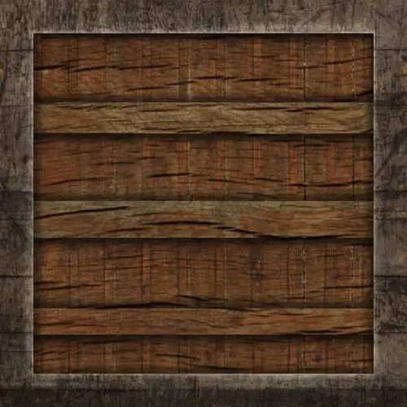
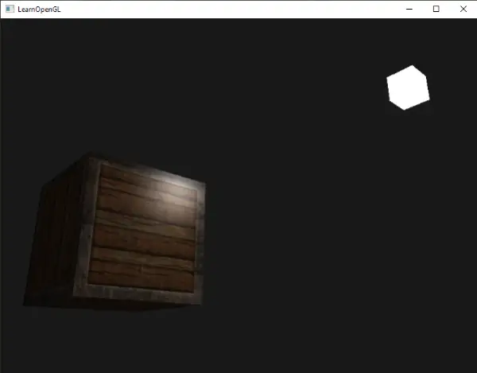
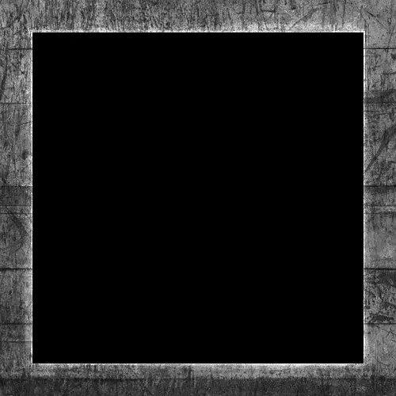
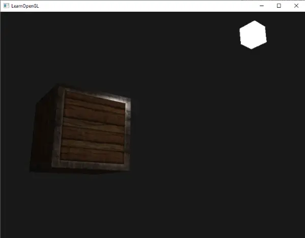

# Lighting Maps
Dans le chapitre précédent, nous avons évoqué la possibilité de doter chaque objet d'un matériau unique qui réagit différemment à la lumière. Cela permet de donner à chaque objet un aspect unique par rapport aux autres objets, mais n'offre pas encore beaucoup de flexibilité sur le rendu visuel d'un objet.  
  
Dans le chapitre précédent, nous avons défini un matériau pour l'ensemble d'un objet. **Cependant, dans le monde réel, les objets ne sont généralement pas constitués d'un seul matériau, mais de plusieurs matériaux.** Pensez à une voiture : son extérieur est constitué d'un métal brillant, elle a des fenêtres qui reflètent partiellement l'environnement, ses pneus sont tout sauf brillants et n'ont donc pas de reflets spéculaires, et ses jantes sont super brillantes (si vous avez bien lavé votre voiture). La voiture a également des couleurs diffuses et ambiantes qui ne sont pas les mêmes pour l'ensemble de l'objet ; une voiture affiche de nombreuses couleurs ambiantes/diffuses différentes. Dans l'ensemble, un tel objet possède des propriétés matérielles différentes pour chacune de ses parties.  
  
**Le système de matériaux du chapitre précédent n'est donc pas suffisant pour tous les modèles, sauf les plus simples,** et nous devons donc l'étendre en introduisant des maps de diffuse et de spéculaires. Celles-ci nous permettent d'influencer la composante diffuse (et indirectement la composante ambiante puisqu'elles devraient être identiques de toute façon) et la composante spéculaire d'un objet avec beaucoup plus de précision.

## Diffuse Maps
Ce que nous voulons, c'est un moyen de définir les couleurs diffuses d'un objet pour chaque fragment individuel. Une sorte de système où nous pouvons récupérer une valeur de couleur basée sur la position du fragment sur l'objet ?  
  
Tout cela devrait vous sembler familier et nous utilisons un tel système depuis un certain temps déjà. Cela ressemble aux textures dont nous avons longuement parlé dans l'un des chapitres précédents et c'est justement cela : une texture. **Nous utilisons simplement un nom différent pour le même principe sous-jacent : utiliser une image enroulée autour d'un objet que nous pouvons indexer pour obtenir des valeurs de couleur uniques par fragment.** Dans les scènes éclairées, on parle généralement de diffuse map (c'est ainsi que les artistes 3D les appelaient avant le PBR: Physical Bases Rendering), car une image de texture représente toutes les couleurs diffuses de l'objet.  
  
Pour démontrer les maps diffuse, nous allons utiliser l'image suivante d'un conteneur en bois avec une bordure en acier :

L'utilisation d'une map de diffuse dans les shaders se fait exactement comme nous l'avons montré dans le chapitre sur les textures. Cette fois-ci, nous stockons la texture sous la forme d'un sampler2D à l'intérieur de la structure Material. Nous remplaçons le vecteur de couleur diffuse `vec3` défini précédemment par la diffuse map.

Gardez à l'esprit que `sampler2D` est un type dit opaque, ce qui signifie que nous ne pouvons pas instancier ces types, mais seulement les définir en tant qu'uniformes. Si la structure est instanciée autrement qu'en tant qu'uniforme (comme un paramètre de fonction), GLSL peut générer des erreurs étranges ; la même chose s'applique donc à toute structure contenant de tels types opaques. 

Nous supprimons également le vecteur de couleur du matériau ambiant puisque la couleur ambiante est de toute façon égale à la couleur diffuse maintenant que nous contrôlons l'ambiance avec la lumière. Il n'est donc pas nécessaire de le stocker séparément : 

```cpp
struct Material {
    sampler2D diffuse;
    vec3      specular;
    float     shininess;
}; 
...
in vec2 TexCoords;
```
Si vous êtes un peu têtu et que vous voulez toujours régler les couleurs ambiantes sur une valeur différente (autre que la valeur diffuse), vous pouvez conserver le `vec3 ambiant`, mais les couleurs ambiantes resteront alors les mêmes pour l'ensemble de l'objet. Pour obtenir des valeurs ambiantes différentes pour chaque fragment, il faudrait utiliser une autre texture pour les seules valeurs ambiantes.

Notez que nous aurons à nouveau besoin des coordonnées de la texture dans le fragment shader, c'est pourquoi nous avons déclaré une variable d'entrée supplémentaire. Ensuite, nous échantillonnons simplement la texture pour récupérer la valeur de la couleur diffuse du fragment: 
```cpp
vec3 diffuse = light.diffuse * diff * vec3(texture(material.diffuse, TexCoords));  
```
N'oubliez pas non plus de régler la couleur du matériau ambiant sur la couleur du matériau diffus :
```cpp
vec3 ambient = light.ambient * vec3(texture(material.diffuse, TexCoords));
```
C'est tout ce qu'il faut pour utiliser une carte diffuse. Comme vous pouvez le constater, il n'y a rien de nouveau, mais la qualité visuelle s'en trouve considérablement améliorée. Pour que cela fonctionne, nous devons mettre à jour les données de vertex avec les coordonnées de la texture, les transférer en tant qu'attributs de vertex au fragment shader, charger la texture et lier la texture à l'unité de texture appropriée.  
  
Les données de vertex mises à jour se trouvent ici. Les données de vertex comprennent désormais les positions de vertex, les vecteurs de narmales et les coordonnées de texture pour chacun des sommets du cube. Mettons à jour le vertex shader pour qu'il accepte les coordonnées de texture en tant qu'attribut de sommet et les transmette au fragment shader :
```cpp
#version 330 core
layout (location = 0) in vec3 aPos;
layout (location = 1) in vec3 aNormal;
layout (location = 2) in vec2 aTexCoords;
...
out vec2 TexCoords;

void main()
{
    ...
    TexCoords = aTexCoords;
} 
```
Veillez à mettre à jour les pointeurs d'attributs de vertex des deux VAO (Vertex Array Object) pour qu'ils correspondent aux nouvelles données de vertex et chargez l'image du conteneur en tant que texture.
Avant de rendre le cube, nous voulons assigner la bonne unité de texture à l'échantillonneur uniforme `material.diffuse` et lier la texture du conteneur à cette unité de texture : 
```cpp
lightingShader.setInt("material.diffuse", 0);
...
glActiveTexture(GL_TEXTURE0);
glBindTexture(GL_TEXTURE_2D, diffuseMap);
```
En utilisant maintenant une diffuse map, nous obtenons à nouveau une augmentation considérable de détails et, cette fois, le conteneur commence vraiment à briller (littéralement). Votre conteneur doit maintenant ressembler à ceci : 

Le code source est disponible [ici](https://learnopengl.com/code_viewer_gh.php?code=src/2.lighting/4.1.lighting_maps_diffuse_map/lighting_maps_diffuse.cpp).

## Specular Maps
Vous avez probablement remarqué que la surbrillance spéculaire est un peu étrange puisque l'objet est un conteneur composé principalement de bois et que le bois n'a pas de telles surbrillances spéculaires. Nous pouvons résoudre ce problème en réglant le matériau spéculaire de l'objet sur `vec3(0.0)`, mais cela signifierait que les bords en acier du conteneur cesseraient d'afficher des reflets spéculaires, alors que l'acier doit afficher des reflets spéculaires. Nous aimerions contrôler les parties de l'objet qui doivent présenter une surbrillance spéculaire d'intensité variable. Ce problème me semble familier. Coïncidence ? Je ne pense pas.  
  
Nous pouvons également utiliser une texture map uniquement pour les reflets spéculaires. Cela signifie que nous devons générer une texture en noir et blanc (ou en couleurs si vous le souhaitez) qui définit les intensités spéculaires de chaque partie de l'objet. L'image suivante est un exemple de carte spéculaire : 

L'intensité du reflet spéculaire provient de la luminosité de chaque pixel de l'image. Chaque pixel de la carte spéculaire peut être affiché sous la forme d'un vecteur de couleur où le noir représente le vecteur de couleur `vec3(0,0)` et le gris le vecteur de couleur `vec3(0,5)` par exemple. Dans le fragment shader, nous échantillonnons la valeur de couleur correspondante et la multiplions par l'intensité spéculaire de la lumière. Plus un pixel est "blanc", plus le résultat de la multiplication est élevé et plus la composante spéculaire d'un objet est lumineuse.  
  
**Étant donné que le conteneur est principalement constitué de bois, et que le bois en tant que matériau ne devrait pas avoir de reflets spéculaires, toute la partie en bois de la texture diffuse a été convertie en noir** : les parties noires n'ont pas de reflets spéculaires. **La bordure en acier du conteneur présente des intensités spéculaires variables**, **l'acier lui-même étant relativement sensible aux reflets spéculaires alors que les fissures ne le sont pas.**

Techniquement, le bois présente également des reflets spéculaires, mais avec une valeur de brillance beaucoup plus faible (plus de diffusion de la lumière) et un impact moindre, mais pour les besoins de l'apprentissage, nous pouvons faire comme si le bois n'avait aucune réaction à la lumière spéculaire. 

À l'aide d'outils tels que *Photoshop* ou *Gimp*, **il est relativement facile de transformer une texture diffuse en une image spéculaire comme celle-ci** en découpant certaines parties, en la transformant en noir et blanc et en augmentant la luminosité/le contraste.

## Échantillonnage des specular maps
Une map spéculaire est comme n'importe quelle autre texture, le code est donc similaire à celui de la carte diffuse. Assurez-vous de charger correctement l'image et de générer un objet texture. Puisque nous utilisons un autre échantillonneur de texture dans le même fragment shader, nous devons utiliser une unité de texture différente (voir Textures) pour la map de spéculaire, alors lions-la à l'unité de texture appropriée avant le rendu :
```cpp
lightingShader.setInt("material.specular", 1);
...
glActiveTexture(GL_TEXTURE1);
glBindTexture(GL_TEXTURE_2D, specularMap);  
```
 Mettez ensuite à jour les propriétés matérielles du fragment shader pour accepter un `sampler2D` comme composante spéculaire au lieu d'un `vec3` :
```cpp
struct Material {
    sampler2D diffuse;
    sampler2D specular;
    float     shininess;
}; 
``` 
 Enfin, nous voulons échantillonner la map de spéculaire pour récupérer l'intensité spéculaire correspondante du fragment : 
```cpp
vec3 ambient  = light.ambient  * vec3(texture(material.diffuse, TexCoords));
vec3 diffuse  = light.diffuse  * diff * vec3(texture(material.diffuse, TexCoords));  
vec3 specular = light.specular * spec * vec3(texture(material.specular, TexCoords));
FragColor = vec4(ambient + diffuse + specular, 1.0); 
```
L'utilisation d'une map de spéculaire permet de spécifier de manière extrêmement détaillée les parties d'un objet qui présentent des propriétés de brillance et même de contrôler l'intensité correspondante. Les cartes spéculaires nous donnent une couche supplémentaire de contrôle sur l'éclairage, en plus de la carte diffuse. 

Si vous ne voulez pas être trop "mainstream", vous pouvez également utiliser les couleurs réelles dans la carte spéculaire pour définir non seulement l'intensité spéculaire de chaque fragment, mais aussi la couleur de la surbrillance spéculaire. **De manière réaliste, cependant, la couleur de la surbrillance spéculaire est principalement déterminée par la source lumineuse elle-même**, ce qui ne permettrait pas de générer des images réalistes (**c'est pourquoi les images sont généralement en noir et blanc : seule l'intensité nous intéresse**). 

Si vous exécutez maintenant l'application, vous pouvez clairement voir que le matériau du conteneur ressemble maintenant étroitement à celui d'un véritable conteneur en bois avec des cadres en acier :

Vous pouvez trouver le code source complet de l'application [ici](https://learnopengl.com/code_viewer_gh.php?code=src/2.lighting/4.2.lighting_maps_specular_map/lighting_maps_specular.cpp).  
  
En utilisant les maps de diffusion et de spéculaire, nous pouvons vraiment ajouter une quantité énorme de détails dans des objets relativement simples. Nous pouvons même ajouter plus de détails aux objets en utilisant d'autres maps de texture comme les normal maps/bump maps et/ou les reflection maps, mais c'est quelque chose que nous réserverons pour les chapitres suivants. Montrez votre conteneur à tous vos amis et à votre famille et réjouissez-vous du fait que notre conteneur peut un jour devenir encore plus beau qu'il ne l'est déjà ! 