# Projecteurs de lumière
Tous les éclairages que nous avons utilisés jusqu'à présent provenaient d'une source unique, c'est-à-dire d'un seul point dans l'espace. Cela donne de bons résultats, mais dans le monde réel, nous avons plusieurs types de lumière qui agissent chacun différemment. **Une source de lumière qui projette de la lumière sur des objets est appelée un projecteur de lumière** (light caster). Dans ce chapitre, nous aborderons plusieurs types de projecteurs de lumière. Apprendre à simuler différentes sources de lumière est un outil de plus dans votre boîte à outils pour enrichir vos environnements.  
  
Nous parlerons d'abord d'une lumière directionnelle (*directional light*) , puis d'une lumière ponctuelle (*point light*), qui est une extension de ce que nous avions précédemment, et enfin des spots (*spotlights*). Dans le prochain chapitre, nous combinerons plusieurs de ces différents types de lumière dans une même scène.

# Lumière directionnelle (directional light)
Lorsqu'une source lumineuse est éloignée, les rayons lumineux qui en proviennent sont presque parallèles les uns aux autres. **Il semble que tous les rayons lumineux proviennent de la même direction, quel que soit l'endroit où se trouve l'objet et/ou l'observateur.** Lorsqu'une source lumineuse est modélisée comme étant infiniment éloignée, **on parle de lumière directionnelle, car tous ses rayons lumineux ont la même direction, indépendamment de l'emplacement de la source lumineuse.**  
  
**Un bon exemple de source de lumière directionnelle est le soleil tel que nous le connaissons.** Le soleil n'est pas infiniment loin de nous, mais il est si loin que nous pouvons le percevoir comme étant infiniment loin dans les calculs d'éclairage.
Tous les rayons lumineux provenant du soleil sont alors modélisés comme des rayons lumineux parallèles, comme le montre l'image suivante :
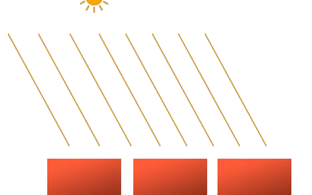
Comme tous les rayons lumineux sont parallèles, la relation entre chaque objet et la position de la source lumineuse n'a pas d'importance puisque la direction de la lumière reste la même pour chaque objet de la scène. Comme le vecteur de direction de la lumière reste le même, les calculs d'éclairage seront similaires pour chaque objet de la scène.  
  
Nous pouvons modéliser une telle lumière directionnelle en définissant un vecteur de direction de la lumière au lieu d'un vecteur de position. Les calculs du shader restent en grande partie les mêmes, sauf que cette fois nous utilisons directement le vecteur de `direction` de la lumière au lieu de calculer le vecteur `lightDir` en utilisant le vecteur de `position` de la lumière :   
```cpp
struct Light {
    // vec3 position; // no longer necessary when using directional lights.
    vec3 direction;
  
    vec3 ambient;
    vec3 diffuse;
    vec3 specular;
};
[...]
void main()
{
  vec3 lightDir = normalize(-light.direction);
  [...]
}
```
Notez que nous commençons par rendre négatif le vecteur `light.direction`. Les calculs d'éclairage que nous avons utilisés jusqu'à présent s'attendent à ce que la direction de la lumière soit une direction du fragment vers la source de lumière, mais les gens préfèrent généralement spécifier une lumière directionnelle comme une direction globale pointant vers la source de lumière. Par conséquent, nous devons rendre négatif le vecteur de direction globale de la lumière pour changer sa direction ; il s'agit maintenant d'un vecteur de direction pointant vers la source de lumière. Veillez également à normaliser le vecteur, car il n'est pas judicieux de supposer que le vecteur d'entrée est un vecteur unitaire.  
  
Le vecteur `lightDir` résultant est ensuite utilisé comme précédemment dans les calculs de diffusion et de spéculaire.  
  
Pour démontrer clairement qu'une lumière directionnelle a le même effet sur plusieurs objets, nous reviendrons sur la scène de la fête du conteneur à la fin du chapitre sur les systèmes de coordonnées. Au cas où vous auriez manqué la fête, nous avons défini 10 positions différentes pour les conteneurs et généré une matrice de modèle différente pour chaque conteneur, chaque matrice de modèle contenant les transformations locales vers world appropriées :
```cpp
for(unsigned int i = 0; i < 10; i++)
{
    glm::mat4 model = glm::mat4(1.0f);
    model = glm::translate(model, cubePositions[i]);
    float angle = 20.0f * i;
    model = glm::rotate(model, glm::radians(angle), glm::vec3(1.0f, 0.3f, 0.5f));
    lightingShader.setMat4("model", model);

    glDrawArrays(GL_TRIANGLES, 0, 36);
}
```
 N'oubliez pas non plus de spécifier la direction de la source lumineuse (notez que nous définissons la direction comme une direction à partir de la source lumineuse ; vous pouvez rapidement voir que la direction de la lumière pointe vers le bas) :
```cpp
lightingShader.setVec3("light.direction", -0.2f, -1.0f, -0.3f); 	    
```
Depuis un certain temps, nous transmettons les vecteurs de position et de direction de la lumière sous forme de `vec3`, mais certaines personnes préfèrent que tous les vecteurs soient définis sous forme de `vec4`. Lorsque l'on définit des vecteurs de position en tant que `vec4`, il est important de fixer la composante `w` à `1,0` pour que la translation et les projections soient correctement appliquées. Cependant, lorsqu'on définit un vecteur de direction comme un `vec4`, on ne veut pas que les translations aient un effet (puisqu'elles ne représentent que des directions, rien de plus) ; on définit donc la composante `w` à `0.0`.  
  
Les vecteurs de direction peuvent alors être représentés comme : `vec4(-0.2f, -1.0f, -0.3f, 0.0f)`. Cela peut également servir à vérifier facilement les types de lumière : vous pouvez vérifier si la composante `w` est égale à `1.0` pour voir que nous avons maintenant un vecteur de position de la lumière et si `w` est égal à `0.0`, nous avons un vecteur de direction de la lumière ; ajustez donc les calculs en fonction de cela :   

```cpp
if(lightVector.w == 0.0) // note: be careful for floating point errors
  // do directional light calculations
else if(lightVector.w == 1.0)
  // do light calculations using the light's position (as in previous chapters)  
```
 Si vous compilez maintenant l'application et que vous parcourez la scène, vous aurez l'impression qu'une source de lumière semblable à un soleil éclaire tous les objets. Voyez-vous que les composantes diffuse et spéculaire réagissent toutes comme s'il y avait une source de lumière quelque part dans le ciel ? Cela ressemble à quelque chose comme ça : 
 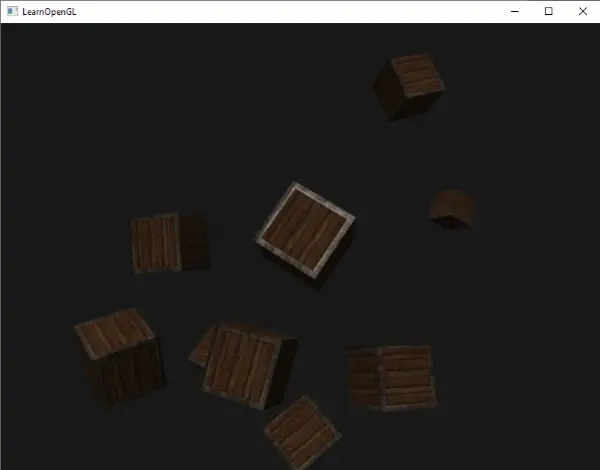

Vous trouverez le code source [ici](https://learnopengl.com/code_viewer_gh.php?code=src/2.lighting/5.1.light_casters_directional/light_casters_directional.cpp).

## Lumière ponctuelle (point light)
Les lumières directionnelles sont parfaites pour les lumières globales qui éclairent toute la scène, mais nous voulons généralement aussi plusieurs lumières ponctuelles disséminées dans la scène. **Une lumière ponctuelle est une source de lumière ayant une position donnée quelque part dans le monde, qui éclaire dans toutes les directions et dont les rayons lumineux s'estompent avec la distance**. Les ampoules et les torches sont des projecteurs de lumière qui agissent comme des lumières ponctuelles.

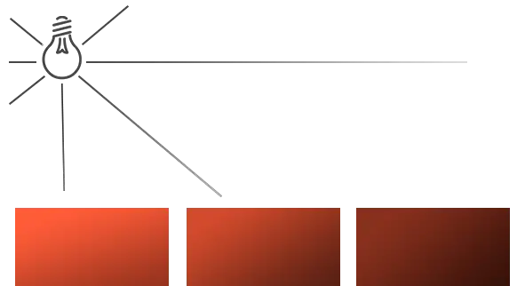
Dans les chapitres précédents, nous avons travaillé avec une lumière ponctuelle simpliste. Nous avions une source de lumière à une position donnée qui diffuse la lumière dans toutes les directions à partir de cette position. Cependant, la source de lumière que nous avons définie simulait des rayons lumineux qui ne s'estompaient jamais, ce qui donnait l'impression que la source de lumière était extrêmement puissante. Dans la plupart des applications 3D, nous aimerions simuler une source de lumière qui n'éclaire qu'une zone proche de la source de lumière et non l'ensemble de la scène.  
  
Si vous ajoutez les 10 conteneurs à la scène d'éclairage des chapitres précédents, vous remarquerez que le conteneur situé tout au fond est éclairé avec la même intensité que le conteneur situé devant la lumière ; il n'y a pas encore de logique qui diminue la lumière en fonction de la distance. Nous voulons que le conteneur situé à l'arrière ne soit que légèrement éclairé par rapport aux conteneurs situés à proximité de la source lumineuse.

## Atténuation
La réduction de l'intensité de la lumière sur la distance parcourue par un rayon lumineux est généralement appelée atténuation. Une façon de réduire l'intensité de la lumière sur la distance est d'utiliser une équation linéaire. Une telle équation réduirait linéairement l'intensité de la lumière sur la distance, de sorte que les objets situés à une certaine distance seraient moins lumineux. Cependant, une telle fonction linéaire a tendance à paraître un peu fausse. Dans le monde réel, les lumières sont généralement très brillantes lorsqu'elles sont proches, mais la luminosité d'une source lumineuse diminue rapidement à une certaine distance ; l'intensité lumineuse restante diminue ensuite lentement avec la distance. Nous avons donc besoin d'une équation différente pour réduire l'intensité de la lumière.  
  
Heureusement, des personnes intelligentes l'ont déjà calculé pour nous. La formule suivante calcule une valeur d'atténuation basée sur la distance d'un fragment à la source lumineuse, que nous multiplions ensuite par le vecteur d'intensité de la lumière :

$$
F_{att} = {1.0 \over (K_c + K_l * d + K_q * d^2)}
$$
Ici, *d* représente la distance entre le fragment et la source lumineuse. Ensuite, pour calculer la valeur d'atténuation, nous définissons trois termes (configurables) : un terme constant *Kc*, un terme linéaire *Kl* et un terme quadratique *Kq*.

- $K_c$ : Le terme constant est généralement maintenu à `1.0`, principalement pour s'assurer que le dénominateur n'est jamais inférieur à `1`, car cela augmenterait l'intensité avec certaines distances, ce qui n'est pas l'effet que nous recherchons.  
- $K_l$ : Le terme linéaire est multiplié par la valeur de la distance qui réduit l'intensité de façon linéaire.  
- $K_q$ : Le terme quadratique est multiplié par le quadrant de la distance et définit une diminution quadratique de l'intensité de la source lumineuse. **Le terme quadratique est moins important que le terme linéaire lorsque la distance est faible, mais il devient beaucoup plus important lorsque la distance augmente.**

En raison du terme quadratique, la lumière diminuera principalement de manière linéaire jusqu'à ce que la distance devienne suffisamment grande pour que le terme quadratique dépasse le terme linéaire et que l'intensité lumineuse diminue beaucoup plus rapidement. L'effet résultant est que la lumière est assez intense lorsqu'elle est proche, mais qu'elle perd rapidement sa luminosité sur la distance jusqu'à ce qu'elle finisse par perdre sa luminosité à un rythme plus lent. Le graphique suivant montre l'effet d'une telle atténuation sur une distance de 100 :
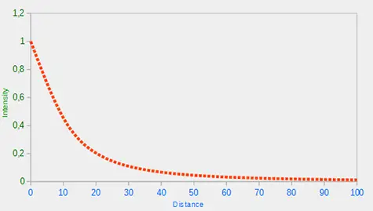
Vous pouvez voir que la lumière a l'intensité la plus élevée lorsque la distance est faible, mais dès que la distance augmente, son intensité diminue de manière significative et atteint lentement une intensité de 0 à une distance d'environ 100. C'est exactement ce que nous voulons. 

### Choisir les bonnes valeurs
Mais à quelles valeurs devons-nous fixer ces trois termes ? Le choix des bonnes valeurs dépend de nombreux facteurs : l'environnement, la distance à parcourir, le type de lumière, etc. Dans la plupart des cas, il s'agit simplement d'une question d'expérience et d'un ajustement modéré.
Le tableau suivant montre quelques-unes des valeurs que ces termes pourraient prendre pour simuler une (sorte de) source lumineuse réaliste qui couvre un rayon (une distance) spécifique. La première colonne indique la distance que la lumière couvrira avec les termes donnés. Ces valeurs sont de bons points de départ pour la plupart des lumières, avec l'aimable autorisation du [wiki d'Ogre3D](http://www.ogre3d.org/tikiwiki/tiki-index.php?page=-Point+Light+Attenuation) : 

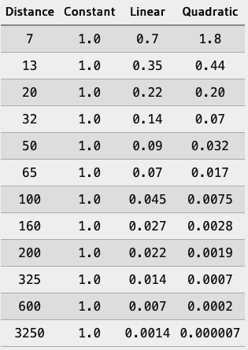

Comme vous pouvez le constater, le terme constant $K_c$ est maintenu à $1.0$ dans tous les cas. Le terme linéaire $K_l$ est généralement assez petit pour couvrir des distances plus importantes et le terme quadratique $K_q$ est encore plus petit. Essayez d'expérimenter un peu avec ces valeurs pour voir leur effet dans votre implémentation. Dans notre environnement, une distance de 32 à 100 est généralement suffisante pour la plupart des lumières.

### Implémenter l'atténuation
Pour mettre en œuvre l'atténuation, nous aurons besoin de 3 valeurs supplémentaires dans le fragment shader : à savoir les termes constant, linéaire et quadratique de l'équation. Il est préférable de les stocker dans la structure Light que nous avons définie plus tôt. Notez que nous devons calculer lightDir à nouveau en utilisant la position car il s'agit d'une lumière ponctuelle (comme nous l'avons fait dans le chapitre précédent) et non d'une lumière directionnelle.
```cpp
struct Light {
    vec3 position;  
  
    vec3 ambient;
    vec3 diffuse;
    vec3 specular;
	
    float constant;
    float linear;
    float quadratic;
}; 
```
 Ensuite, nous définissons les termes de notre application : nous voulons que la lumière couvre une distance de 50, nous utiliserons donc les termes constants, linéaires et quadratiques appropriés du tableau : 
```cpp
lightingShader.setFloat("light.constant",  1.0f);
lightingShader.setFloat("light.linear",    0.09f);
lightingShader.setFloat("light.quadratic", 0.032f);	
```
L'implémentation de l'atténuation dans le fragment shader est relativement simple : nous calculons simplement une valeur d'atténuation basée sur l'équation et la multiplions avec les composantes ambiante, diffuse et spéculaire.  
  
Pour que l'équation fonctionne, nous avons besoin de la distance de la source lumineuse. Vous souvenez-vous de la façon dont nous pouvons calculer la longueur d'un vecteur ? Nous pouvons récupérer le terme de distance en calculant le vecteur de différence entre le fragment et la source lumineuse et en prenant la longueur du vecteur résultant. Nous pouvons utiliser la fonction de longueur intégrée de GLSL à cette fin :
```cpp
float distance    = length(light.position - FragPos);
float attenuation = 1.0 / (light.constant + light.linear * distance + 
    		    light.quadratic * (distance * distance));    
```
Nous incluons ensuite cette valeur d'atténuation dans les calculs d'éclairage en la multipliant par les couleurs ambiantes, diffuses et spéculaires. 

Nous pourrions ne pas tenir compte de la composante ambiante afin que l'éclairage ambiant ne diminue pas en fonction de la distance, mais si nous devions utiliser plus d'une source lumineuse, toutes les composantes ambiantes commenceraient à s'empiler. Dans ce cas, nous voulons également atténuer l'éclairage ambiant. Il vous suffit d'essayer ce qui convient le mieux à votre environnement. 

```cpp
ambient  *= attenuation; 
diffuse  *= attenuation;
specular *= attenuation;   
```
 Si vous exécutez l'application, vous obtiendrez quelque chose comme ceci : 
 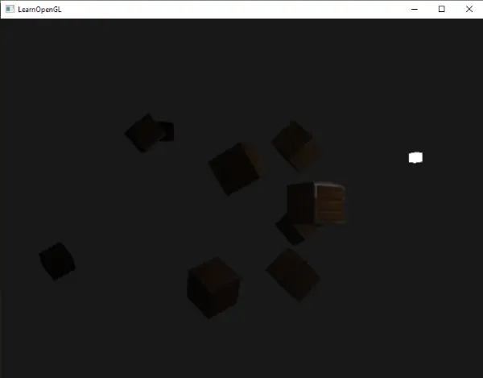
Vous pouvez voir que, pour l'instant, seuls les conteneurs situés à l'avant sont éclairés, le conteneur le plus proche étant le plus lumineux. Les conteneurs situés à l'arrière ne sont pas éclairés du tout car ils sont trop éloignés de la source lumineuse. Vous pouvez trouver le code source de l'application [ici](https://learnopengl.com/code_viewer_gh.php?code=src/2.lighting/5.2.light_casters_point/light_casters_point.cpp).  
  
Une lumière ponctuelle est donc une source lumineuse dont l'emplacement est configurable et dont l'atténuation est appliquée à ses calculs d'éclairage. Un type de lumière supplémentaire pour notre arsenal d'éclairage.

## Spotlight
Le dernier type de lumière dont nous allons parler est le spotlight. Un spotlight est une source lumineuse située quelque part dans l'environnement qui, au lieu d'envoyer des rayons lumineux dans toutes les directions, ne les envoie que dans une direction spécifique. Il en résulte que seuls les objets situés dans un certain rayon de la direction du projecteur sont éclairés et que tous les autres restent dans l'obscurité. Un bon exemple de projecteur serait un lampadaire ou une lampe de poche (ou encore une lampe torche).  
  
Une spotlight dans OpenGL est représenté par une position dans le world space, une direction et un angle de coupure (*cutoff angle*) qui spécifie le rayon du spot. Pour chaque fragment, nous calculons si le fragment se trouve entre les directions de coupure du projecteur (donc dans son cône) et si c'est le cas, nous éclairons le fragment en conséquence. L'image suivante vous donne une idée du fonctionnement d'un projecteur :
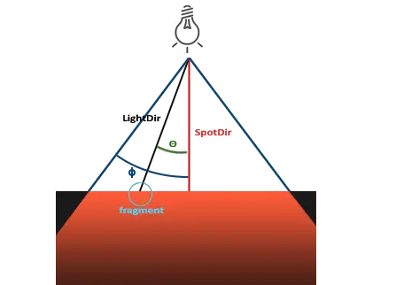
- `LightDir` : le vecteur pointant du fragment vers la source lumineuse.  
- `SpotDir` : la direction vers laquelle pointe le spot.  
- `Phi` ϕ : l'angle de coupure (*cutoff*) qui spécifie le rayon du spot. Tout ce qui se trouve en dehors de cet angle n'est pas éclairé par le spot.  
- `Theta` θ : l'angle entre le vecteur LightDir et le vecteur SpotDir. La valeur θ doit être inférieure à Φ pour être à l'intérieur du projecteur.

Ce qu'il nous faut donc faire, c'est calculer le produit scalaire (le cosinus de l'angle entre deux vecteurs unitaires) entre le vecteur `LightDir` et le vecteur `SpotDir` et le comparer à l'angle de coupure ϕ. Maintenant que vous avez (en quelque sorte) compris ce qu'est une spotlight, nous allons en créer un sous la forme d'une lampe de poche. 

## Lampe de poche (flashlight)
Une lampe de poche (*flashlight*) est un projecteur situé à la position de l'observateur et généralement orienté vers l'avant du point de vue de l'observateur. Une lampe torche est en fait un projecteur normal, mais dont la position et la direction sont continuellement mises à jour en fonction de la position et de l'orientation du joueur.  
  
Les valeurs dont nous aurons besoin pour le fragment shader sont donc le vecteur de position du spot (pour calculer le vecteur de direction fragment-lumière), le vecteur de direction du spot et l'angle de coupure (cutoff). Nous pouvons stocker ces valeurs dans la structure Light :
```cpp
struct Light {
    vec3  position;
    vec3  direction;
    float cutOff;
    ...
};  
```
 Ensuite, nous transmettons les valeurs appropriées au shader :
```cpp
lightingShader.setVec3("light.position",  camera.Position);
lightingShader.setVec3("light.direction", camera.Front);
lightingShader.setFloat("light.cutOff",   glm::cos(glm::radians(12.5f)));
``` 
Comme vous pouvez le voir, nous ne définissons pas un angle pour la valeur de coupure, mais nous calculons la valeur du cosinus sur la base d'un angle et nous transmettons le résultat du cosinus au fragment shader.
La raison en est que dans le fragment shader, nous calculons le produit scalaire entre le vecteur `LightDir` et le vecteur `SpotDir` et que le produit scalaire renvoie une valeur de cosinus et non un angle ; et nous ne pouvons pas comparer directement un angle avec une valeur de cosinus. **Pour obtenir l'angle dans le shader, nous devons calculer l'inverse du cosinus du résultat du produit scalaire**, ce qui est une opération **coûteuse**.
Ainsi, pour gagner en performance, nous calculons au préalable la valeur du cosinus d'un angle de coupure donné et transmettons ce résultat au fragment shader. Puisque les deux angles sont maintenant représentés par des cosinus, nous pouvons les comparer directement sans opérations coûteuses.  
  
Il ne reste plus qu'à calculer la valeur de thêta $\theta$ et de la comparer à la valeur de coupure $\phi$ pour déterminer si nous sommes dans ou en dehors du spotlight :
```cpp
float theta = dot(lightDir, normalize(-light.direction));
    
if(theta > light.cutOff) 
{       
  // do lighting calculations
}
else  // else, use ambient light so scene isn't completely dark outside the spotlight.
  color = vec4(light.ambient * vec3(texture(material.diffuse, TexCoords)), 1.0);
```
Nous commençons par calculer le produit scalaire entre le vecteur `lightDir` et le vecteur de direction négatif (négatif, car nous voulons que les vecteurs pointent vers la source lumineuse, au lieu de s'en éloigner). Veillez à normaliser tous les vecteurs concernés. 

Vous vous demandez peut-être pourquoi il y a un signe $>$ au lieu d'un signe $<$ dans la condition du if.
Theta ne devrait-il pas être plus petit que la valeur de coupure de la lumière pour être à l'intérieur du projecteur ?
C'est exact, mais n'oubliez pas que les valeurs d'angle sont représentées par des valeurs de cosinus et qu'un angle de 0 degré est représenté par la valeur de cosinus de $1.0$ tandis qu'un angle de 90 degrés est représenté par la valeur de cosinus de $0.0$, comme vous pouvez le voir ici :
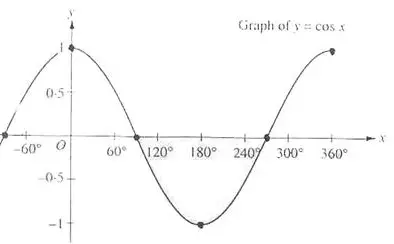
Vous pouvez maintenant voir que plus la valeur du cosinus est proche de $1.0$, plus l'angle est petit. On comprend maintenant pourquoi theta doit être plus grand que la valeur de coupure. La valeur de coupure est actuellement fixée au cosinus de $12.5$, qui est égal à $0.976$. Une valeur de cosinus thêta comprise entre $0.976$ et $1.0$ aurait pour effet d'éclairer le fragment comme s'il se trouvait à l'intérieur d'un projecteur.

En exécutant l'application, on obtient un projecteur qui n'éclaire que les fragments se trouvant directement dans le cône du projecteur. Cela ressemblera à quelque chose comme ceci :
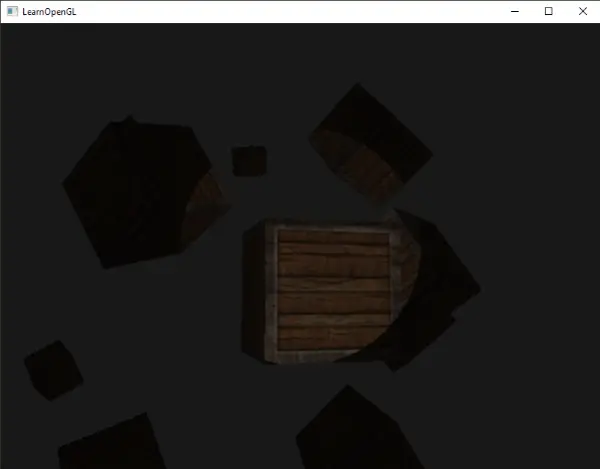


Vous pouvez trouver le code source complet [ici](https://learnopengl.com/code_viewer_gh.php?code=src/2.lighting/5.3.light_casters_spot/light_casters_spot.cpp).

Le résultat est cependant un peu **faux**, principalement parce que le projecteur a des bords durs. **Chaque fois qu'un fragment atteint le bord du cône du projecteur, il s'éteint complètement au lieu de s'éteindre doucement.** **Un projecteur réaliste réduirait progressivement la lumière sur ses bords.** 

## Bords Lisses (Smooth/Soft edges)
Pour créer l'effet d'une spotlight aux bords arrondis, nous voulons simuler une spotlight dotée d'un cône intérieur et d'un cône extérieur. Nous pouvons définir le cône intérieur comme le cône défini dans la section précédente, mais nous voulons également un cône extérieur qui atténue progressivement la lumière de l'intérieur vers les bords du cône extérieur.

Pour créer un cône extérieur, il suffit de définir une autre valeur de cosinus qui représente l'angle entre le vecteur de direction du projecteur et le vecteur du cône extérieur (égal à son rayon). Ensuite, si un fragment se trouve entre le cône intérieur et le cône extérieur, il doit calculer une valeur d'intensité comprise entre 0,0 et 1,0. Si le fragment se trouve à l'intérieur du cône intérieur, son intensité est égale à 1,0 et à 0,0 si le fragment se trouve à l'extérieur du cône extérieur.

Nous pouvons calculer cette valeur à l'aide de l'équation suivante :
$$
I = {{\theta - \gamma}\over \epsilon}
$$
Ici, $\epsilon$ (epsilon) est la différence de cosinus entre le cône intérieur ($\theta$) et le cône extérieur ($\gamma$) ($\epsilon=\theta-\gamma$). La valeur $I$ qui en résulte est alors l'intensité de la lumière du projecteur sur le fragment actuel.

Il est un peu difficile de visualiser le fonctionnement de cette formule, alors essayons-la avec quelques exemples de valeurs :

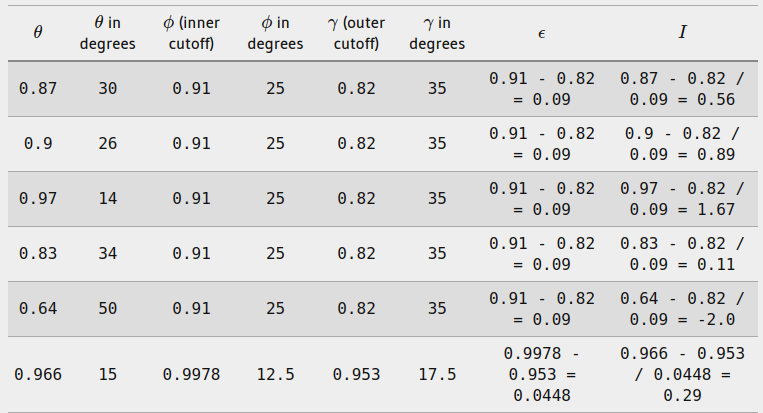

Comme vous pouvez le voir, nous interpolons essentiellement entre le cosinus extérieur et le cosinus intérieur sur la base de la valeur $\theta$.
Si vous ne comprenez toujours pas ce qui se passe, ne vous inquiétez pas, vous pouvez simplement considérer la formule comme acquise et revenir ici lorsque vous serez plus âgé et plus sage.

Nous avons maintenant une valeur d'intensité qui est soit négative à l'extérieur du projecteur, soit supérieure à $1.0$ à l'intérieur du cône intérieur, et quelque part entre les deux sur les bords. Si nous bloquons correctement les valeurs, nous n'avons plus besoin d'un if-else dans le fragment shader et nous pouvons simplement multiplier les composantes de la lumière avec la valeur d'intensité calculée :
```cpp
float theta     = dot(lightDir, normalize(-light.direction));
float epsilon   = light.cutOff - light.outerCutOff;
float intensity = clamp((theta - light.outerCutOff) / epsilon, 0.0, 1.0);    
...
// we'll leave ambient unaffected so we always have a little light.
diffuse  *= intensity;
specular *= intensity;
...
```
Notez que nous utilisons la fonction `clamp` qui fixe son premier argument entre les valeurs $0.0$ et $1.0$. Cela permet de s'assurer que les valeurs d'intensité ne sortiront pas de la plage $[0, 1]$.

Veillez à ajouter la valeur `outerCutOff` à la structure Light et à définir sa valeur uniforme dans l'application. Pour l'image suivante, un angle de cutoff interne de `12.5` et un angle de cutoff externe de `17.5` ont été utilisés :
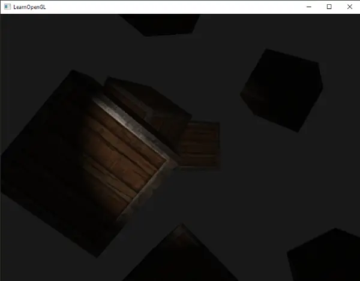
Ah, c'est beaucoup mieux. Jouez avec les angles de cutoff intérieur et extérieur et essayez de créer un projecteur qui réponde mieux à vos besoins. Vous pouvez trouver le code source de l'application [ici](https://learnopengl.com/code_viewer_gh.php?code=src/2.lighting/5.4.light_casters_spot_soft/light_casters_spot_soft.cpp).

Ce type de lampe est parfait pour les jeux d'horreur et, combiné à des lumières directionnelles et ponctuelles, l'environnement commencera vraiment à s'illuminer.

