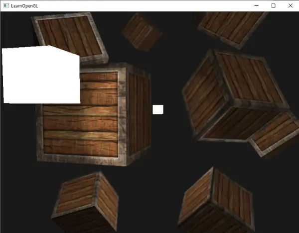
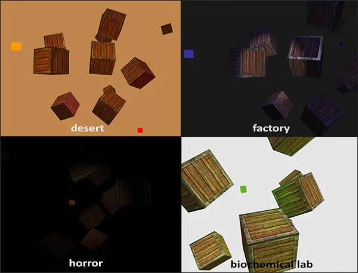

# Plusieurs lumières
Dans les chapitres précédents, nous avons beaucoup appris sur l'éclairage en OpenGL. Nous avons découvert l'ombrage Phong (*Phong shading*), les matériaux, les maps d'éclairage et les différents types de projecteurs de lumière. Dans ce chapitre, nous allons combiner toutes les connaissances acquises précédemment en créant une scène entièrement éclairée avec 6 sources de lumière actives. Nous allons simuler une lumière semblable à celle du soleil comme source de lumière directionnelle, 4 lumières ponctuelles dispersées dans la scène et nous ajouterons également une lampe de poche.  
  
Pour utiliser plus d'une source de lumière dans la scène, nous voulons encapsuler les calculs d'éclairage dans des fonctions GLSL. La raison en est que le code devient rapidement désagréable lorsque nous effectuons des calculs d'éclairage avec plusieurs types de lumière, chacun nécessitant des calculs différents. Si nous devions effectuer tous ces calculs dans la seule fonction principale, le code deviendrait rapidement difficile à comprendre.  
  
Les fonctions en GLSL sont exactement comme les fonctions C. Nous avons un nom de fonction, un retour, un nom de fichier et un nom d'utilisateur. Nous avons un nom de fonction, un type de retour et nous devons déclarer un prototype au début du fichier de code si la fonction n'a pas encore été déclarée avant la fonction principale. Nous allons créer une fonction différente pour chaque type de lumière : les lumières directionnelles, les lumières ponctuelles et les projecteurs.  
  
Lorsque l'on utilise plusieurs lumières dans une scène, l'approche est généralement la suivante : nous avons un seul vecteur de couleur qui représente la couleur de sortie du fragment. Pour chaque lumière, la contribution de la lumière au fragment est ajoutée à ce vecteur de couleur de sortie. Ainsi, chaque lumière de la scène calculera son impact individuel et contribuera à la couleur de sortie finale. Une structure générale pourrait ressembler à ceci :
```cpp
out vec4 FragColor;
  
void main()
{
  // define an output color value
  vec3 output = vec3(0.0);
  // add the directional light's contribution to the output
  output += someFunctionToCalculateDirectionalLight();
  // do the same for all point lights
  for(int i = 0; i < nr_of_point_lights; i++)
  	output += someFunctionToCalculatePointLight();
  // and add others lights as well (like spotlights)
  output += someFunctionToCalculateSpotLight();
  
  FragColor = vec4(output, 1.0);
}  
```
Le code réel sera probablement différent selon l'implémentation, mais la structure générale reste la même. Nous définissons plusieurs fonctions qui calculent l'impact de chaque source lumineuse et ajoutent la couleur résultante à un vecteur de couleur de sortie. Si, par exemple, deux sources lumineuses sont proches du fragment, leur contribution combinée se traduira par un fragment plus lumineux que le fragment éclairé par une seule source lumineuse.

# Lumière directionnelle
Nous voulons définir une fonction dans le fragment shader qui calcule la contribution d'une lumière directionnelle sur le fragment correspondant : une fonction qui prend quelques paramètres et renvoie la couleur de l'éclairage directionnel calculé.

Tout d'abord, nous devons définir les variables nécessaires dont nous avons minimalement besoin pour une source de lumière directionnelle. Nous pouvons stocker les variables dans une structure appelée `DirLight` et la définir comme un uniforme. Les variables de la structure devraient vous être familières grâce au chapitre précédent :
```cpp
struct DirLight {
    vec3 direction;
  
    vec3 ambient;
    vec3 diffuse;
    vec3 specular;
};  
uniform DirLight dirLight;
```
Nous pouvons ensuite transmettre l'uniforme `dirLight` à une fonction avec le prototype suivant :
```cpp
vec3 CalcDirLight(DirLight light, vec3 normal, vec3 viewDir);  
```
Just like C and C++, when we want to call a function (in this case inside the main function) the function should be defined somewhere before the caller's line number. In this case we'd prefer to define the functions below the main function so this requirement doesn't hold. Therefore we declare the function's prototypes somewhere above the main function, just like we would in C.

You can see that the function requires a `DirLight` struct and two other vectors required for its computation. If you successfully completed the previous chapter then the content of this function should come as no surprise:

```cpp
vec3 CalcDirLight(DirLight light, vec3 normal, vec3 viewDir)
{
    vec3 lightDir = normalize(-light.direction);
    // diffuse shading
    float diff = max(dot(normal, lightDir), 0.0);
    // specular shading
    vec3 reflectDir = reflect(-lightDir, normal);
    float spec = pow(max(dot(viewDir, reflectDir), 0.0), material.shininess);
    // combine results
    vec3 ambient  = light.ambient  * vec3(texture(material.diffuse, TexCoords));
    vec3 diffuse  = light.diffuse  * diff * vec3(texture(material.diffuse, TexCoords));
    vec3 specular = light.specular * spec * vec3(texture(material.specular, TexCoords));
    return (ambient + diffuse + specular);
}  
```
Nous avons essentiellement copié le code du chapitre précédent et utilisé les vecteurs donnés comme arguments de la fonction pour calculer le vecteur de contribution de la lumière directionnelle. Les contributions ambiante, diffuse et spéculaire résultantes sont ensuite renvoyées sous la forme d'un seul vecteur de couleur.

# Lumière ponctuelle (point light)
Comme pour les lumières directionnelles, nous voulons également définir une fonction qui calcule la contribution d'une lumière ponctuelle sur le fragment donné, y compris son atténuation. Tout comme pour les lumières directionnelles, nous voulons définir une structure qui spécifie toutes les variables requises pour une lumière ponctuelle :

```cpp
struct PointLight {    
    vec3 position;
    
    float constant;
    float linear;
    float quadratic;  

    vec3 ambient;
    vec3 diffuse;
    vec3 specular;
};  
#define NR_POINT_LIGHTS 4  
uniform PointLight pointLights[NR_POINT_LIGHTS];
```
Comme vous pouvez le voir, nous avons utilisé une directive de pré-processeur en GLSL pour définir le nombre de lumières ponctuelles que nous voulons avoir dans notre scène. Nous utilisons ensuite cette constante `NR_POINT_LIGHTS` pour créer un tableau de structures `PointLight`. Les tableaux en GLSL sont comme les tableaux en C et peuvent être créés en utilisant deux crochets. Pour l'instant, nous avons 4 structures `PointLight` à remplir avec des données.

Le prototype de la fonction `PointLight` est le suivant :
```cpp
vec3 CalcPointLight(PointLight light, vec3 normal, vec3 fragPos, vec3 viewDir);  
```
La fonction prend toutes les données dont elle a besoin comme arguments et renvoie un `vec3` qui représente la contribution de la couleur de ce point lumineux spécifique sur le fragment. Une fois de plus, un copier-coller intelligent permet d'obtenir la fonction suivante :
```cpp
vec3 CalcPointLight(PointLight light, vec3 normal, vec3 fragPos, vec3 viewDir)
{
    vec3 lightDir = normalize(light.position - fragPos);
    // diffuse shading
    float diff = max(dot(normal, lightDir), 0.0);
    // specular shading
    vec3 reflectDir = reflect(-lightDir, normal);
    float spec = pow(max(dot(viewDir, reflectDir), 0.0), material.shininess);
    // attenuation
    float distance    = length(light.position - fragPos);
    float attenuation = 1.0 / (light.constant + light.linear * distance + 
  			     light.quadratic * (distance * distance));    
    // combine results
    vec3 ambient  = light.ambient  * vec3(texture(material.diffuse, TexCoords));
    vec3 diffuse  = light.diffuse  * diff * vec3(texture(material.diffuse, TexCoords));
    vec3 specular = light.specular * spec * vec3(texture(material.specular, TexCoords));
    ambient  *= attenuation;
    diffuse  *= attenuation;
    specular *= attenuation;
    return (ambient + diffuse + specular);
}
```
L'abstraction de cette fonctionnalité dans une fonction comme celle-ci présente l'avantage de nous permettre de calculer facilement l'éclairage de plusieurs lumières ponctuelles sans avoir besoin de dupliquer le code. Dans la fonction principale, nous créons simplement une boucle qui itère sur le tableau des lumières ponctuelles et qui appelle `CalcPointLight` pour chaque lumière ponctuelle.

# Tout assembler ensemble
Maintenant que nous avons défini une fonction pour les lumières directionnelles et une fonction pour les lumières ponctuelles, nous pouvons tout regrouper dans la fonction principale.
```cpp
void main()
{
    // properties
    vec3 norm = normalize(Normal);
    vec3 viewDir = normalize(viewPos - FragPos);

    // phase 1: Directional lighting
    vec3 result = CalcDirLight(dirLight, norm, viewDir);
    // phase 2: Point lights
    for(int i = 0; i < NR_POINT_LIGHTS; i++)
        result += CalcPointLight(pointLights[i], norm, FragPos, viewDir);    
    // phase 3: Spot light
    //result += CalcSpotLight(spotLight, norm, FragPos, viewDir);    
    
    FragColor = vec4(result, 1.0);
}
```

Chaque type de lumière ajoute sa contribution à la couleur de sortie résultante jusqu'à ce que toutes les sources de lumière soient traitées. La couleur résultante contient l'impact de la couleur de toutes les sources lumineuses de la scène combinées. Nous laissons la fonction `CalcSpotLight` en guise d'exercice pour le lecteur.

Il y a beaucoup de calculs dupliqués dans cette approche, répartis sur les fonctions de type lumière (par exemple, le calcul du vecteur de réflexion, les termes diffus et spéculaire, et l'échantillonnage des textures matérielles), il y a donc de la place pour l'optimisation ici.

Définir les uniformes pour la structure de lumière directionnelle ne devrait pas être trop difficile, mais vous vous demandez peut-être comment définir les valeurs uniformes des lumières ponctuelles puisque l'uniforme de la lumière ponctuelle est en fait un tableau de structs `PointLight`. Nous n'avons jamais abordé ce sujet auparavant.

Heureusement pour nous, ce n'est pas trop compliqué. La définition des valeurs uniformes d'un tableau de structures fonctionne de la même manière que la définition des uniformes d'une seule structure, bien que cette fois-ci nous devions également définir l'index approprié lors de l'interrogation de l'emplacement de l'uniforme :
```cpp
lightingShader.setFloat("pointLights[0].constant", 1.0f);
```
Ici, nous indexons la première structure `PointLight` dans le tableau `pointLights` et nous récupérons en interne l'emplacement de sa variable constante, que nous fixons à $1.0$.

N'oublions pas que nous devons également définir un vecteur de position pour chacune des 4 lumières ponctuelles, alors répartissons-les un peu dans la scène. Nous allons définir un autre tableau `glm::vec3` contenant les positions des lumières ponctuelles :
```cpp
glm::vec3 pointLightPositions[] = {
	glm::vec3( 0.7f,  0.2f,  2.0f),
	glm::vec3( 2.3f, -3.3f, -4.0f),
	glm::vec3(-4.0f,  2.0f, -12.0f),
	glm::vec3( 0.0f,  0.0f, -3.0f)
};  
```
Nous indexons ensuite la structure `PointLight` correspondante à partir du tableau `pointLights` et définissons son attribut de position comme l'une des positions que nous venons de définir. Veillez également à dessiner 4 cubes de lumière au lieu d'un seul. Créez simplement une matrice de modèle différente pour chacun des objets de lumière, comme nous l'avons fait pour les conteneurs.

Si vous utilisez également une lampe de poche, le résultat de toutes les lumières combinées ressemble à ceci :

Comme vous pouvez le voir, il semble y avoir une forme de lumière globale (comme un soleil) quelque part dans le ciel, nous avons 4 lumières dispersées dans la scène et une lampe de poche est visible du point de vue du joueur. Ça a l'air plutôt sympa, non ?

Vous pouvez trouver le code source complet de l'application finale [ici](https://learnopengl.com/code_viewer_gh.php?code=src/2.lighting/6.multiple_lights/multiple_lights.cpp).

L'image montre toutes les sources de lumière définies avec les propriétés de lumière par défaut que nous avons utilisées dans les chapitres précédents, mais si vous jouez avec ces valeurs, vous pouvez obtenir des résultats assez intéressants. Les artistes et les concepteurs de niveaux modifient généralement toutes ces variables d'éclairage dans un grand éditeur pour s'assurer que l'éclairage correspond à l'environnement. En utilisant notre environnement simple, vous pouvez déjà créer des visuels assez intéressants simplement en modifiant les attributs des lumières :



Nous avons également modifié la couleur de la lumière pour qu'elle reflète mieux l'éclairage. Vous pouvez voir qu'en ajustant simplement certains paramètres d'éclairage, vous pouvez créer des atmosphères complètement différentes.

Vous devriez maintenant avoir une bonne compréhension de l'éclairage dans OpenGL. Avec les connaissances acquises jusqu'à présent, nous pouvons déjà créer des environnements et des atmosphères intéressants et visuellement riches. Essayez de jouer avec les différentes valeurs pour créer vos propres atmosphères.