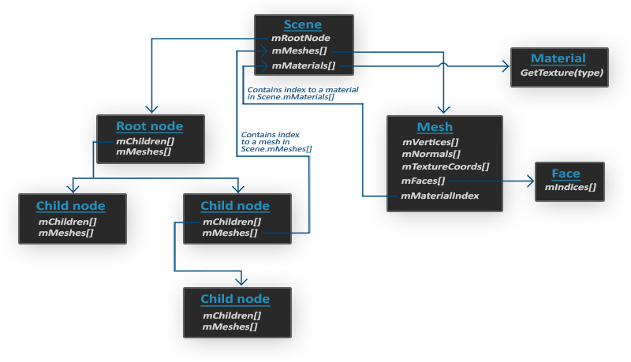

# Assimp
Dans toutes les scènes présentées jusqu'à présent, nous avons beaucoup joué avec notre petit ami le conteneur, mais avec le temps, même nos meilleurs amis peuvent devenir un peu ennuyeux. Dans les applications graphiques plus importantes, il y a généralement beaucoup de modèles compliqués et intéressants qui sont beaucoup plus jolis à regarder qu'un conteneur statique. Cependant, contrairement à l'objet conteneur, nous ne pouvons pas vraiment définir manuellement tous les sommets, les normales et les coordonnées de texture de formes compliquées telles que des maisons, des véhicules ou des personnages humains. **Ce que nous voulons, c'est importer ces modèles dans l'application ; des modèles qui ont été soigneusement conçus par des artistes 3D dans des outils tels que Blender, 3DS Max ou Maya.**  
  
Ces outils de modélisation 3D permettent aux artistes de créer des formes complexes et de leur appliquer des textures grâce à un processus appelé **uv-mapping**. **Les outils génèrent ensuite automatiquement toutes les coordonnées des sommets, les normales des sommets et les coordonnées des textures, tout en les exportant dans un format de fichier de modèle que nous pouvons utiliser.** De cette manière, les artistes disposent d'une vaste boîte à outils pour créer des modèles de haute qualité sans avoir à se préoccuper des détails techniques. Tous les aspects techniques sont cachés dans le fichier de modèle exporté. En tant que programmeurs graphiques, nous devons cependant nous préoccuper de ces détails techniques.  
  
**C'est notre travail d'analyser ces fichiers de modèles exportés et d'en extraire toutes les informations pertinentes afin de les stocker dans un format compréhensible par OpenGL**. **Un problème commun est qu'il existe des douzaines de formats de fichiers différents où chacun exporte les données du modèle d'une manière unique**. Les formats de modèle comme le `obj `de Wavefront ne contiennent que des données de modèle avec des informations matérielles mineures comme les couleurs du modèle et les cartes diffuse/spéculaire, alors que les formats de modèle comme le format de [fichier Collada](http://en.wikipedia.org/wiki/COLLADA) basé sur `XML` sont extrêmement complets et contiennent des modèles, des lumières, de nombreux types de matériaux, des données d'animation, des caméras, des informations complètes sur la scène, et bien plus encore. Le format d'objet Wavefront est généralement considéré comme un format de modèle facile à analyser. Il est recommandé de visiter la page wiki de Wavefront au moins une fois pour voir comment les données d'un tel format de fichier sont structurées. Cela devrait vous donner une idée de la façon dont les formats de fichier de modèle sont généralement structurés.  
  
Dans l'ensemble, il existe de nombreux formats de fichiers différents pour lesquels il n'existe généralement pas de structure générale commune. **Par conséquent, si nous voulons importer un modèle à partir de ces formats de fichiers, nous devons écrire nous-mêmes un importateur pour chacun des formats de fichiers que nous voulons importer. Heureusement pour nous, il existe une bibliothèque pour cela.**

## Une bibliothèque de chargement de modèles
Une bibliothèque de chargement de modèles très populaire s'appelle **Assimp** (Open Asset Import Library). Assimp est capable d'importer des dizaines de formats de fichiers de modèles différents (et d'exporter vers certains d'entre eux également) en chargeant toutes les données du modèle dans les structures de données généralisées d'Assimp. Dès qu'Assimp a chargé le modèle, nous pouvons récupérer toutes les données dont nous avons besoin dans les structures de données d'Assimp. **Comme la structure de données d'Assimp reste la même, quel que soit le type de format de fichier importé, elle fait abstraction de tous les formats de fichiers existants.**  
  
Lors de l'importation d'un modèle via Assimp, le modèle entier est chargé dans un objet scène qui contient toutes les données du modèle/de la scène importé(e). Assimp dispose alors d'une collection de nœuds où chaque nœud contient des indices vers les données stockées dans l'objet scène et où chaque nœud peut avoir un nombre quelconque d'enfants. Un modèle (simpliste) de la structure d'Assimp est présenté ci-dessous :

- Toutes les données de la scène/modèle sont contenues dans l'objet `Scene`, comme tous les matériaux et les maillages. Il contient également une référence au nœud racine de la scène.  
- Le nœud racine de la scène peut contenir des nœuds enfants (comme tous les autres nœuds) et peut avoir un ensemble d'indices qui pointent vers des données de maillage (mesh data) dans le tableau `mMeshes` de l'objet scène. Le tableau `mMeshes` de la scène contient les objets Mesh proprement dits, les valeurs du tableau `mMeshes` d'un nœud ne sont que des indices pour le tableau des Meshes de la scène.  
- Un objet `Mesh` contient toutes les données nécessaires au rendu : positions des vertex, vecteurs normaux, coordonnées de texture, faces et matériau de l'objet.  
- Un mesh contient plusieurs faces. Une `Face` représente une primitive de rendu de l'objet (triangles, carrés, points). Une `Face` contient les indices des sommets qui forment une primitive. Comme les sommets et les indices sont séparés, il est facile d'effectuer le rendu via un buffer d'index (voir [03_hello triangle](../01_Getting_Started/03_hello%20triangle.md)).
- Enfin, un mesh est également lié à un objet `Material` qui héberge plusieurs fonctions permettant de récupérer les propriétés matérielles d'un objet. Pensez aux couleurs et/ou aux maps de texture (comme les maps diffuse et spéculaire).

Ce que nous voulons faire, c'est d'abord charger un objet dans un objet `Scene`, récupérer récursivement les objets `Mesh` correspondants à partir de chacun des nœuds (nous recherchons récursivement les enfants de chaque nœud), et traiter chaque objet `Mesh` pour récupérer les données des vertex, les indices et les propriétés de ses matériaux. Le résultat est alors une collection de données de maillage (data mesh) que nous voulons contenir dans un seul objet `Model`.

>**Mesh**  
	Lorsqu'ils modélisent des objets dans des outils de modélisation, les artistes ne créent généralement pas un modèle entier à partir d'une seule forme. En général, chaque modèle se compose de plusieurs sous-modèles/formes. Chacune de ces formes est appelée un **mesh**. Prenons l'exemple d'un personnage humain : les artistes modélisent généralement la tête, les membres, les vêtements et les armes en tant qu'éléments distincts, et le résultat combiné de tous ces meshes représente le modèle final. Un mesh unique est la représentation minimale de ce dont nous avons besoin pour dessiner un objet dans OpenGL (données des sommets, indices et propriétés des matériaux). Un modèle est (généralement) constitué de plusieurs meshes.

Dans les prochains chapitres, nous créerons nos propres classes `Model` et `Mesh` qui chargeront et stockeront les modèles importés en utilisant la structure que nous venons de décrire. **Si nous voulons ensuite dessiner un modèle, nous ne rendons pas le modèle dans son ensemble, mais nous rendons tous les meshes individuels dont le modèle est composé**. Cependant, avant de pouvoir commencer à importer des modèles, nous devons d'abord inclure Assimp dans notre projet.

## Building Assimp
Vous pouvez télécharger Assimp depuis leur page [GitHub](https://github.com/assimp/assimp/blob/master/Build.md) et choisir la version correspondante. Pour cet article, la version d'Assimp utilisée est la version `3.1.1`. Il est conseillé de compiler les bibliothèques par vous-même, car les bibliothèques précompilées ne fonctionnent pas toujours sur tous les systèmes. Relisez le chapitre [Création d'une fenêtre](../01_Getting_Started/01_creating%20a%20window.md) si vous avez oublié comment compiler une bibliothèque par vous-même via CMake.

Quelques problèmes peuvent survenir lors de la construction d'Assimp, je vais donc les noter ici avec leurs solutions au cas où l'un d'entre vous obtiendrait les mêmes erreurs :

- CMake donne continuellement des erreurs lors de la récupération de la liste de configuration à propos de bibliothèques **DirectX** manquantes, des messages comme :
```
Could not locate DirectX
CMake Error at cmake-modules/FindPkgMacros.cmake:110 (message):
Required library DirectX not found! Install the library (including dev packages) 
and try again. If the library is already installed, set the missing variables 
manually in cmake.
```
Ici la solution consiste à installer le SDK DirectX au cas où vous ne l'auriez pas encore fait. Vous pouvez télécharger le SDK [ici](http://www.microsoft.com/en-us/download/details.aspx?id=6812).
- Lors de l'installation du SDK DirectX, un code d'erreur `s1023` peut apparaître. Dans ce cas, vous devez d'abord désinstaller le(s) paquet(s) C++ Redistributable avant d'installer le SDK.

Une fois la configuration terminée, vous pouvez générer un fichier de solution, l'ouvrir et compiler les bibliothèques (soit en version release, soit en version debug, comme vous le souhaitez). Assurez-vous de compiler en 64 bits car tout le code LearnOpenGL est en 64 bits.

La configuration par défaut construit Assimp comme une bibliothèque dynamique, nous devons donc inclure la `DLL` résultante nommée `assimp.dll` (ou avec un post-fix) avec les binaires de l'application. Vous pouvez simplement copier la `DLL` dans le même dossier que l'exécutable de votre application.

Après avoir compilé la solution générée, la bibliothèque et le fichier `DLL` résultants se trouvent dans le dossier `code/Debug` ou `code/Release`. Il vous suffit ensuite de déplacer la librairie et la `DLL` à leur emplacement approprié, de les lier à votre solution et de veiller à copier les en-têtes d'Assimp dans votre répertoire `include` (les fichiers d'en-tête se trouvent dans le dossier `include` des fichiers téléchargés d'Assimp).

Vous devriez maintenant avoir compilé Assimp et l'avoir lié à votre application. Si vous avez encore reçu une erreur non signalée, n'hésitez pas à demander de l'aide dans les commentaires.

