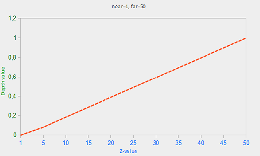
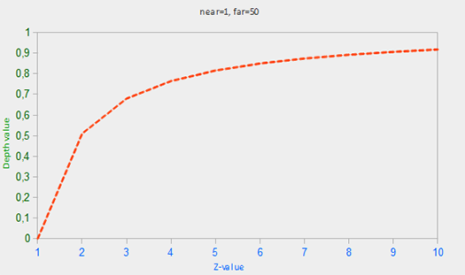
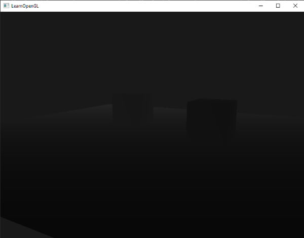

# Test de profondeur (depth testing)

Dans le chapitre sur les [systèmes de coordonnées](../01_Getting_Started/07_coordinate%20systems.md) , nous avons effectué le rendu d'un conteneur 3D et utilisé un tampon de profondeur (depth buffer) pour éviter que des triangles ne soient rendus à l'avant alors qu'ils sont censés se trouver derrière d'autres triangles. Dans ce chapitre, nous allons développer un peu plus les valeurs de profondeur que le tampon de profondeur (ou tampon z : z-buffer) stocke et la manière dont il détermine si un fragment est à l'avant.  
  
Le tampon de profondeur est un tampon qui, tout comme le tampon de couleur (qui stocke toutes les couleurs des fragments : la sortie visuelle), stocke des informations par fragment et **a la même largeur et la même hauteur que le tampon de couleur**. Le tampon de profondeur est automatiquement créé par le système de fenêtrage et stocke ses valeurs de profondeur sous forme de valeurs flottantes de 16, 24 ou 32 bits. **Dans la plupart des systèmes, vous verrez un tampon de profondeur avec une précision de 24 bits.**  
  
**Lorsque le test de profondeur est activé, OpenGL teste la valeur de profondeur d'un fragment par rapport au contenu du tampon de profondeur.** **OpenGL effectue un test de profondeur et si ce test réussit, le fragment est rendu et le tampon de profondeur est mis à jour avec la nouvelle valeur de profondeur. Si le test de profondeur échoue, le fragment est rejeté.**  
  
Le test de profondeur est effectué dans le screen space après l'exécution du shader de fragment (et après le stencil test que nous aborderons dans le chapitre suivant). Les coordonnées du screen space sont directement liées à la fenêtre définie par la fonction `glViewport` d'OpenGL et sont accessibles via la variable intégrée `gl_FragCoord` de GLSL dans le shader de fragment. Les composantes x et y de `gl_FragCoord` représentent les coordonnées du fragment dans l'espace-écran (avec (0,0) le coin inférieur gauche). La variable `gl_FragCoord` contient également une composante z qui contient la valeur de profondeur du fragment. Cette valeur z est la valeur qui est comparée au contenu du tampon de profondeur.

>Aujourd'hui, la plupart des GPU prennent en charge une fonction matérielle appelée test de profondeur anticipé. Le test de profondeur anticipé permet d'exécuter le test de profondeur avant l'exécution du shader de fragment. Lorsqu'il est clair qu'un fragment ne sera pas visible (il se trouve derrière d'autres objets), nous pouvons l'éliminer prématurément.  
  
>Les shaders de fragments sont généralement assez coûteux, c'est pourquoi nous devons éviter de les exécuter chaque fois que c'est possible. Une restriction sur le fragment shader pour le test de profondeur anticipé est que vous ne devez pas écrire dans la valeur de profondeur du fragment. Si un shader de fragment écrit dans sa valeur de profondeur, le test de profondeur anticipé est impossible ; OpenGL ne sera pas capable de déterminer la valeur de profondeur à l'avance.

 Le test de profondeur est désactivé par défaut. Pour l'activer, il faut utiliser l'option `GL_DEPTH_TEST` :
```cpp
glEnable(GL_DEPTH_TEST);
```
Une fois activé, OpenGL stocke automatiquement les fragments avec leurs valeurs z dans le tampon de profondeur s'ils ont passé le test de profondeur et se débarrasse des fragments s'ils ont échoué le test de profondeur en conséquence. Si vous avez activé le test de profondeur, vous devez également vider le tampon de profondeur avant chaque image en utilisant `GL_DEPTH_BUFFER_BIT` ; sinon vous serez bloqué avec les valeurs de profondeur de la dernière image :
```cpp
glClear(GL_COLOR_BUFFER_BIT | GL_DEPTH_BUFFER_BIT);  
```
Il existe certains scénarios imaginables dans lesquels vous souhaitez effectuer le test de profondeur sur tous les fragments et les écarter en conséquence, mais sans mettre à jour le tampon de profondeur. En fait, vous utilisez (temporairement) un tampon de profondeur en lecture seule. OpenGL nous permet de désactiver l'écriture dans le tampon de profondeur en définissant son masque de profondeur à `GL_FALSE` :
```cpp
glDepthMask(GL_FALSE);  
```
Notez que cela n'a d'effet que si le test de profondeur est activé. 

## Fonction du test de profondeur
OpenGL nous permet de modifier les opérateurs de comparaison qu'il utilise pour le test de profondeur. Cela nous permet de contrôler quand OpenGL doit passer ou rejeter des fragments et quand mettre à jour le tampon de profondeur. Nous pouvons définir l'opérateur de comparaison (ou la fonction de profondeur) en appelant `glDepthFunc` :
```cpp
glDepthFunc(GL_LESS);  
```
La fonction accepte plusieurs opérateurs de comparaison qui sont énumérés dans le tableau ci-dessous :

|FUNCTION|DESCRIPTION|
|-|-|
|`GL_ALWAYS`|Le test de profondeur est toujours réussi|
|`GL_NEVER`|Le test de profondeur n'est jamais réussi|
								|`GL_LESS`|Passe si la valeur de la profondeur du fragment est inférieure à la valeur de la profondeur stockée.|
|`GL_EQUAL`|Passe si la valeur de la profondeur du fragment est égale à la valeur de la profondeur stockée.|
|`GL_LEQUAL`|Passe si la valeur de la profondeur du fragment est inférieure  ou égale à la valeur de la profondeur stockée.|
|`GL_GREATER`|Passe si la valeur de la profondeur du fragment est supérieure à la valeur de la profondeur stockée.|
|`GL_NOTEQUAL`|Passe si la valeur de la profondeur du fragment n'est pas égale à la valeur de la profondeur stockée.|
|`GL_GEQUAL`|Passe si la valeur de la profondeur du fragment est supérieure ou égale à la valeur de la profondeur stockée.|

Par défaut, la fonction de profondeur `GL_LESS` est utilisée et écarte tous les fragments dont la valeur de profondeur est supérieure ou égale à la valeur du tampon de profondeur actuel.  
  
Montrons l'effet de la modification de la fonction de profondeur sur la sortie visuelle. Nous utiliserons un nouveau code qui affiche une scène basique avec deux cubes texturés assis sur un sol texturé sans éclairage. Vous trouverez le code source [ici](https://learnopengl.com/code_viewer_gh.php?code=src/4.advanced_opengl/1.1.depth_testing/depth_testing.cpp).  
  
Dans le code source, nous avons changé la fonction de profondeur en `GL_ALWAYS` :
```cpp
glEnable(GL_DEPTH_TEST);
glDepthFunc(GL_ALWAYS); 
```
Cela simule le même comportement que nous obtiendrions si nous n'activions pas le test de profondeur. Le test de profondeur réussit toujours, de sorte que les fragments dessinés en dernier sont rendus devant les fragments dessinés avant, même s'ils auraient dû se trouver à l'avant. Puisque nous avons dessiné le plan du sol en dernier, les fragments du plan écrasent chacun des fragments du conteneur écrits précédemment :

En rétablissant la valeur `GL_LESS`, nous obtenons le type de scène auquel nous sommes habitués :

## Précision de la valeur de la profondeur
Le tampon de profondeur contient des valeurs de profondeur comprises entre 0,0 et 1,0 et compare son contenu aux valeurs z de tous les objets de la scène vus par le spectateur. Ces valeurs z dans l'espace visuel peuvent être n'importe quelle valeur entre le plan proche et le plan lointain de la projection-frustum. Nous avons donc besoin d'un moyen pour transformer ces valeurs z de l'espace de vision dans l'intervalle \[0,1] et l'un des moyens consiste à les transformer linéairement. L'équation (linéaire) suivante transforme la valeur z en une valeur de profondeur comprise entre 0,0 et 1,0 :

$$
F_{depth} = { {z - near} \over {far - near} }
$$

Ici, $near$ et $far$ sont les valeurs proches et lointaines que nous avons fournies à la matrice de projection pour définir le frustum visible (voir [Systèmes de coordonnées](../01_Getting_Started/07_coordinate%20systems.md)). L'équation prend une valeur de profondeur z à l'intérieur du frustum et la transforme dans l'intervalle [0,1]. La relation entre la valeur z et la valeur de profondeur correspondante est présentée dans le graphique suivant :

> Notez que toutes les équations donnent une valeur de profondeur proche de 0,0 lorsque l'objet est proche et une valeur de profondeur proche de 1,0 lorsque l'objet est proche du plan éloigné. 

**Dans la pratique, cependant, un tampon de profondeur linéaire comme celui-ci n'est presque jamais utilisé**. En raison des propriétés de projection, **on utilise une équation de profondeur non linéaire qui est proportionnelle à $1/z$. Le résultat est que nous obtenons une précision énorme lorsque z est petit et beaucoup moins de précision lorsque z est éloigné.**  
  
Comme la fonction non linéaire est proportionnelle à $1/z$, des valeurs de z comprises entre 1,0 et 2,0 donneraient des valeurs de profondeur comprises entre 1,0 et 0,5, soit la moitié de la plage $[0,1]$, ce qui nous donne une précision énorme pour les petites valeurs de z. Les valeurs Z comprises entre 50,0 et 100,0 ne représenteraient que 2 % de la plage [0,1]. Une telle équation, qui prend également en compte les distances proches et lointaines, est donnée ci-dessous :

$$
F_{depth} = { {1/z - 1/near} \over {1/far - 1/near} }
$$

Ne vous inquiétez pas si vous ne savez pas exactement ce qui se passe avec cette équation. Ce qu'il faut retenir, c'est que les valeurs du tampon de profondeur ne sont pas linéaires dans l'espace-clip (elles sont linéaires dans l'espace-vue avant l'application de la matrice de projection). Une valeur de 0,5 dans le tampon de profondeur ne signifie pas que la valeur z du pixel se trouve à mi-chemin dans le frustum ; la valeur z du sommet est en fait assez proche du plan proche ! Vous pouvez voir la relation non linéaire entre la valeur z et la valeur du tampon de profondeur dans le graphique suivant :

Comme vous pouvez le constater, les valeurs de profondeur sont largement déterminées par les petites valeurs z, ce qui nous donne une grande précision de profondeur pour les objets proches. L'équation permettant de transformer les valeurs z (du point de vue de l'observateur) est intégrée à la matrice de projection. Ainsi, lorsque nous transformons les coordonnées des vertex de la vue au clip, puis à l'espace écran, l'équation non linéaire est appliquée.  
  
L'effet de cette équation non linéaire devient rapidement apparent lorsque nous essayons de visualiser le tampon de profondeur.

## Visualisation du tampon de profondeur
Nous savons que la valeur z du vecteur `gl_FragCoord` intégré dans le shader de fragment contient la valeur de profondeur de ce fragment particulier. Si nous devions afficher cette valeur de profondeur du fragment sous forme de couleur, nous pourrions afficher les valeurs de profondeur de tous les fragments de la scène : 
```cpp
void main()
{             
    FragColor = vec4(vec3(gl_FragCoord.z), 1.0);
}  
```
**Si vous exécutez ensuite le programme, vous remarquerez probablement que tout est blanc**, ce qui donne l'impression que toutes nos valeurs de profondeur correspondent à la valeur de profondeur maximale de 1,0. **Pourquoi certaines valeurs de profondeur ne sont-elles pas plus proches de 0,0 et donc plus sombres ?**  
  
Dans la section précédente, nous avons décrit que les valeurs de profondeur dans l'espace de l'écran ne sont pas linéaires, c'est-à-dire qu'elles ont une très grande précision pour les petites valeurs de z et une faible précision pour les grandes valeurs de z. La valeur de profondeur du fragment augmente rapidement. La valeur de profondeur du fragment augmente rapidement en fonction de la distance, de sorte que presque tous les sommets ont des valeurs proches de 1,0. Si l'on se rapproche prudemment d'un objet, on peut voir les couleurs s'assombrir et les valeurs z se réduire :

Cela montre clairement la non-linéarité de la valeur de profondeur. Les objets proches ont un effet beaucoup plus important sur la valeur de profondeur que les objets éloignés. Il suffit de se déplacer de quelques centimètres pour que les couleurs passent de l'obscurité au blanc complet. 

Nous pouvons cependant transformer les valeurs de profondeur non linéaires du fragment en son équivalent linéaire. Pour ce faire, nous devons inverser le processus de projection pour les seules valeurs de profondeur. Cela signifie que nous devons d'abord retransformer les valeurs de profondeur de l'intervalle $[0,1]$ en coordonnées normalisées du device dans l'intervalle $[-1,1]$. Ensuite, nous voulons inverser l'équation non linéaire (équation 2) comme dans la matrice de projection et appliquer cette équation inversée à la valeur de profondeur résultante. Le résultat est alors une valeur de profondeur linéaire.  
  
Tout d'abord, nous transformons la valeur de profondeur en NDC, ce qui n'est pas trop difficile :
```cpp
float ndc = depth * 2.0 - 1.0; 
```
Nous prenons ensuite la valeur NDC obtenue et appliquons la transformation inverse pour récupérer sa valeur de profondeur linéaire : 
```cpp
float linearDepth = (2.0 * near * far) / (far + near - ndc * (far - near));	
```
Cette équation est dérivée de la matrice de projection pour la non-linéarisation des valeurs de profondeur, qui renvoie des valeurs de profondeur entre le proche et le lointain. Cet [article très mathématique](http://www.songho.ca/opengl/gl_projectionmatrix.html) explique la matrice de projection de manière très détaillée pour le lecteur intéressé ; il montre également d'où viennent les équations.  
  
Le fragment shader complet qui transforme la profondeur non linéaire dans l'espace de l'écran en une valeur de profondeur linéaire est alors le suivant :

```cpp
#version 330 core
out vec4 FragColor;

float near = 0.1; 
float far  = 100.0; 
  
float LinearizeDepth(float depth) 
{
    float z = depth * 2.0 - 1.0; // back to NDC 
    return (2.0 * near * far) / (far + near - z * (far - near));	
}

void main()
{             
    float depth = LinearizeDepth(gl_FragCoord.z) / far; // divide by far for demonstration
    FragColor = vec4(vec3(depth), 1.0);
}
```
Étant donné que les valeurs de profondeur linéarisées vont de près à loin, la plupart d'entre elles seront supérieures à 1,0 et affichées comme étant complètement blanches. En divisant la valeur de profondeur linéaire par la distance dans la fonction principale, nous convertissons la valeur de profondeur linéaire dans la plage $[0, 1]$. De cette manière, nous pouvons voir la scène devenir progressivement plus lumineuse au fur et à mesure que les fragments se rapprochent du plan éloigné du tronc de projection, ce qui est plus efficace pour la visualisation.  
  
Si nous exécutons maintenant l'application, nous obtenons des valeurs de profondeur qui sont linéaires en fonction de la distance. Essayez de vous déplacer dans la scène pour voir les valeurs de profondeur changer de manière linéaire.

Les couleurs sont principalement noires parce que les valeurs de profondeur varient linéairement du plan proche (0.1) au plan lointain (100), qui est encore assez éloigné de nous. Le résultat est que nous sommes relativement proches du plan proche et que nous obtenons donc des valeurs de profondeur plus faibles (plus sombres). 

## Z-fighting
Un artefact visuel courant peut se produire lorsque deux plans ou triangles sont si étroitement alignés l'un sur l'autre que le tampon de profondeur n'a pas assez de précision pour déterminer laquelle des deux formes se trouve devant l'autre. **Le résultat est que les deux formes semblent continuellement changer d'ordre, ce qui provoque des motifs bizarres**. **C'est ce qu'on appelle le z-fighting, parce qu'on a l'impression que les formes se battent pour savoir qui est au sommet.**  
  
Dans la scène que nous avons utilisée jusqu'à présent, il y a quelques endroits où le z-fighting peut être remarqué. Les conteneurs ont été placés à la hauteur exacte du sol, ce qui signifie que le plan inférieur du conteneur est coplanaire avec le plan du sol. Les valeurs de profondeur des deux plans sont donc identiques, de sorte que le test de profondeur résultant n'a aucun moyen de déterminer lequel est le bon.  
  
Si vous déplacez la caméra à l'intérieur d'un des conteneurs, les effets sont clairement visibles : la partie inférieure du conteneur passe constamment du plan du conteneur au plan du sol dans un motif en zigzag :

Le Z-fighting est un problème courant avec les tampons de profondeur et elle est généralement plus visible lorsque les objets sont plus éloignés (parce que le tampon de profondeur a moins de précision à des valeurs de z plus élevées). Le Z-fighting ne peut pas être complètement évité, mais il existe quelques astuces qui permettront d'atténuer ou d'empêcher complètement le Z-fighting dans votre scène. 

### Prévenir le Z-fighting
**La première astuce, et la plus importante, consiste à ne jamais placer les objets trop près les uns des autres de manière à ce que certains de leurs triangles se chevauchent étroitement.** En créant un petit décalage entre deux objets, vous pouvez complètement supprimer la lutte en z entre les deux objets. Dans le cas des conteneurs et de l'avion, nous aurions pu facilement déplacer les conteneurs légèrement vers le haut dans la direction y positive. Ce petit changement de position des conteneurs ne serait probablement pas perceptible du tout et réduirait complètement la lutte en z. Cependant, cela nécessite une intervention manuelle sur chacun des objets et des tests approfondis pour s'assurer qu'aucun objet d'une scène ne produit de lutte z.  
  
**Une deuxième astuce consiste à régler le plan proche le plus loin possible.** Dans l'une des sections précédentes, nous avons vu que la précision est extrêmement grande lorsqu'elle est proche du plan rapproché, de sorte que si nous éloignons le plan rapproché de l'observateur, nous aurons une précision nettement supérieure sur tout le range du frustum. Cependant, si le plan proche est trop éloigné, les objets proches risquent d'être clippés. **Il s'agit donc généralement d'une question d'ajustement et d'expérimentation pour trouver la meilleure distance proche pour votre scène.**  
  
**Une autre bonne astuce, au prix de quelques performances, consiste à utiliser un tampon de profondeur de plus haute précision**. La plupart des tampons de profondeur ont une précision de 24 bits, mais la plupart des GPU supportent aujourd'hui des tampons de profondeur de 32 bits, ce qui augmente la précision de manière significative. Ainsi, au prix de quelques performances, vous obtiendrez beaucoup plus de précision avec les tests de profondeur, ce qui réduira la lutte contre les z.  
  
Les trois techniques que nous venons d'évoquer sont les plus courantes et les plus faciles à mettre en œuvre pour lutter contre le z-fighting. Il existe d'autres techniques qui nécessitent beaucoup plus de travail et qui ne désactivent pas complètement le Z-fighting. Le Z-fighting est un problème courant, mais si vous utilisez la bonne combinaison des techniques énumérées, vous n'aurez probablement pas à vous préoccuper du le Z-fighting.
