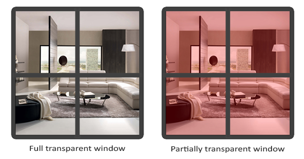

# Blending (transparence/blending)

Le blending dans OpenGL est communément connu comme la technique pour implémenter la transparence dans les objets. **La transparence consiste à ce que les objets (ou des parties d'objets) n'aient pas une couleur unie, mais une combinaison de couleurs provenant de l'objet lui-même et de tout autre objet situé derrière lui, avec une intensité variable**. Une fenêtre en verre coloré est un objet transparent ; le verre a sa propre couleur, mais la couleur résultante contient également les couleurs de tous les objets situés derrière le verre. C'est aussi de là que vient le nom de blending, puisque nous blendingons plusieurs couleurs de pixels (provenant d'objets différents) en une seule couleur. La transparence nous permet donc de voir à travers les objets.

**Les objets transparents peuvent être complètement transparents (ils laissent passer toutes les couleurs) ou partiellement transparents (ils laissent passer les couleurs, mais aussi certaines de leurs propres couleurs)**. Le degré de transparence d'un objet est défini par la valeur alpha de sa couleur. La valeur alpha d'une couleur est la quatrième composante d'un vecteur de couleur que vous avez probablement vu assez souvent maintenant. Jusqu'à ce chapitre, nous avons toujours maintenu cette quatrième composante à **une valeur de 1,0, ce qui donne à l'objet une transparence de 0,0. Une valeur alpha de 0,0 signifie que l'objet est totalement transparent. Une valeur alpha de 0,5 indique que la couleur de l'objet est composée à 50 % de sa propre couleur et à 50 % des couleurs situées derrière l'objet.**  
  
Les textures que nous avons utilisées jusqu'à présent étaient toutes composées de trois composantes de couleur : rouge, vert et bleu, mais **certaines textures ont également un canal alpha intégré qui contient une valeur alpha par texel**. Cette valeur alpha nous indique exactement quelles parties de la texture sont transparentes et de combien. Par exemple, la texture de fenêtre suivante a une valeur alpha de 0,25 dans sa partie vitrée et une valeur alpha de 0,0 dans ses coins. La partie vitrée devrait normalement être complètement rouge, mais comme elle est transparente à 75 %, elle laisse largement transparaître l'arrière-plan de la page, ce qui la rend beaucoup moins rouge :

 Nous ajouterons bientôt cette texture fenêtrée à la scène du chapitre sur les tests de profondeur, mais nous allons d'abord discuter d'une technique plus simple pour mettre en œuvre la transparence pour les pixels qui sont soit totalement transparents, soit totalement opaques. 
## Ecarter des fragments
Certains effets ne se soucient pas de la transparence partielle, mais veulent montrer quelque chose ou rien du tout en fonction de la valeur de la couleur d'une texture. Pensez à l'herbe ; **pour créer quelque chose comme de l'herbe avec peu d'effort, vous collez généralement une texture d'herbe sur un carré 2D et vous placez ce carré dans votre scène. Cependant, l'herbe n'a pas exactement la forme d'un carré 2D et vous ne voulez donc afficher que certaines parties de la texture d'herbe et ignorer les autres.**

La [texture]https://learnopengl.com/img/textures/grass.png suivante est exactement une texture de ce type : soit elle est totalement opaque (valeur alpha de 1,0), soit elle est totalement transparente (valeur alpha de 0,0), et rien ne se situe entre les deux. Vous pouvez voir que là où il n'y a pas d'herbe, l'image affiche la couleur d'arrière-plan de la page au lieu de la sienne. 

Ainsi, lorsque nous ajoutons de la végétation à une scène, nous ne voulons pas voir une image carrée d'herbe, mais seulement l'herbe réelle et voir à travers le reste de l'image. Nous voulons jeter les fragments qui montrent les parties transparentes de la texture, sans stocker ce fragment dans le tampon de couleur.  
  
Avant d'en arriver là, nous devons d'abord apprendre à charger une texture transparente. `stb_image` charge automatiquement le canal alpha d'une image s'il est disponible, mais nous devons indiquer à OpenGL que notre texture utilise désormais un canal alpha dans la procédure de génération de la texture : 
```cpp
glTexImage2D(GL_TEXTURE_2D, 0, GL_RGBA, width, height, 0, GL_RGBA, GL_UNSIGNED_BYTE, data);  
```
Veillez également à récupérer les 4 composantes de couleur de la texture dans le fragment shader, et pas seulement les composantes RVB : 

```cpp
void main()
{
    // FragColor = vec4(vec3(texture(texture1, TexCoords)), 1.0);
    FragColor = texture(texture1, TexCoords);
}
```
Maintenant que nous savons comment charger des textures transparentes, il est temps de les mettre à l'épreuve en ajoutant plusieurs de ces feuilles d'herbe dans la scène de base présentée dans le chapitre sur les tests de profondeur.

Nous créons un petit tableau de vecteurs dans lequel nous ajoutons plusieurs vecteurs `glm::vec3` pour représenter l'emplacement des feuilles d'herbe : 

```cpp
vector<glm::vec3> vegetation;
vegetation.push_back(glm::vec3(-1.5f,  0.0f, -0.48f));
vegetation.push_back(glm::vec3( 1.5f,  0.0f,  0.51f));
vegetation.push_back(glm::vec3( 0.0f,  0.0f,  0.7f));
vegetation.push_back(glm::vec3(-0.3f,  0.0f, -2.3f));
vegetation.push_back(glm::vec3( 0.5f,  0.0f, -0.6f));  
```
Chaque objet d'herbe est rendu sous la forme d'un seul quad avec la texture d'herbe qui lui est attachée. Ce n'est pas une représentation 3D parfaite de l'herbe, mais c'est beaucoup plus efficace que le chargement et le rendu d'un grand nombre de modèles complexes. Avec quelques astuces, comme l'ajout de rotations et d'échelles aléatoires, vous pouvez obtenir des résultats assez convaincants avec les quads.  
  
Comme la texture de l'herbe sera affichée sur un objet quadratique, nous devrons créer un autre `VAO`, remplir le `VBO` et définir les pointeurs d'attributs de vertex appropriés. Après avoir rendu le sol et les deux cubes, nous allons rendre les feuilles d'herbe :

```cpp
glBindVertexArray(vegetationVAO);
glBindTexture(GL_TEXTURE_2D, grassTexture);  
for(unsigned int i = 0; i < vegetation.size(); i++) 
{
    model = glm::mat4(1.0f);
    model = glm::translate(model, vegetation[i]);				
    shader.setMat4("model", model);
    glDrawArrays(GL_TRIANGLES, 0, 6);
}  
```
L'exécution de l'application ressemble maintenant à ceci : 

Cela se produit parce qu'OpenGL, par défaut, ne sait pas quoi faire avec les valeurs alpha, ni quand les rejeter. Nous devons le faire manuellement nous-mêmes. Heureusement, c'est assez facile grâce à l'utilisation des shaders. GLSL nous donne la commande `discard` qui (une fois appelée) garantit que le fragment ne sera pas traité ultérieurement et ne finira donc pas dans le tampon de couleur. Grâce à cette commande, nous pouvons vérifier si un fragment a une valeur alpha inférieure à un certain seuil et, si c'est le cas, jeter le fragment comme s'il n'avait jamais été traité :
```cpp
#version 330 core
out vec4 FragColor;

in vec2 TexCoords;

uniform sampler2D texture1;

void main()
{             
    vec4 texColor = texture(texture1, TexCoords);
    if(texColor.a < 0.1)
        discard;
    FragColor = texColor;
}
```
Ici, nous vérifions si la couleur de la texture échantillonnée contient une valeur alpha inférieure à un seuil de 0,1 et si c'est le cas, nous rejetons le fragment. Ce fragment shader nous assure qu'il ne rend que les fragments qui ne sont pas (presque) complètement transparents. Maintenant, l'image va ressembler à ce qu'elle devrait être : 

>Notez que lors de l'échantillonnage des textures sur leurs bords, OpenGL interpole les valeurs des bords avec la valeur répétée suivante de la texture (parce que nous réglons ses paramètres d'enveloppement sur `GL_REPEAT` par défaut). C'est généralement correct, mais comme nous utilisons des valeurs transparentes, le haut de l'image de la texture voit sa valeur transparente interpolée avec la valeur de la couleur unie de la bordure inférieure. Le résultat est alors une bordure colorée légèrement semi-transparente que vous pouvez voir s'enrouler autour de votre quadrillage texturé. Pour éviter cela, réglez la méthode d'enveloppement de la texture sur `GL_CLAMP_TO_EDGE` chaque fois que vous utilisez des textures alpha que vous ne voulez pas répéter :

 Vous pouvez trouver le code source [ici](https://learnopengl.com/code_viewer_gh.php?code=src/4.advanced_opengl/3.1.blending_discard/blending_discard.cpp). 
## Blending
Bien que l'élimination des fragments soit une bonne chose, elle ne nous donne pas la possibilité de rendre des images semi-transparentes ; soit nous rendons le fragment, soit nous l'éliminons complètement. Pour rendre des images avec différents niveaux de transparence, nous devons activer le blending. Comme la plupart des fonctionnalités d'OpenGL, nous pouvons activer le blending en activant `GL_BLEND` :
```cpp
glEnable(GL_BLEND);  
```
Maintenant que nous avons activé le blending, nous devons dire à OpenGL comment il doit se blendingr.

Le blending dans OpenGL se fait avec l'équation suivante : 
$$
\vec{C}_{result}
=
\vec{C}_{source} * F_{source}
+
\vec{C}_{destination} * F_{destination}
$$
* $\vec{C}_{source}$ : le vecteur de couleur source. Il s'agit de la couleur de sortie du shader de fragment.  
- $\vec{C}_{destination}$ : le vecteur de couleur de destination. Il s'agit du vecteur de couleur actuellement stocké dans le tampon de couleur.  
- $F_{source}$ : la valeur du facteur de source. Définit l'impact de la valeur alpha sur la couleur source.  
- $F_{destination}$ : valeur du facteur de destination. Définit l'impact de la valeur alpha sur la couleur de destination.  
  
Une fois que le fragment shader a été exécuté et que tous les tests ont été réussis, cette équation de blending est relâchée (?) sur la sortie couleur du fragment et avec ce qui se trouve actuellement dans le tampon de couleur. Les couleurs source et destination seront automatiquement définies par OpenGL, mais les facteurs source et destination peuvent être définis à une valeur de notre choix. Commençons par un exemple simple :

Nous avons deux carrés où nous voulons dessiner le carré vert semi-transparent sur le carré rouge. Le carré rouge sera la couleur de destination (et devrait donc être le premier dans le tampon de couleurs) et nous allons maintenant dessiner le carré vert sur le carré rouge.  
  
**La question qui se pose alors est la suivante : à quoi devons-nous fixer les valeurs des facteurs ? Eh bien, nous voulons au moins multiplier le carré vert par sa valeur alpha, donc nous voulons fixer le facteur `Fsrc`** égal à la valeur alpha du vecteur de couleur source, soit $0.6$. Il est donc logique que le carré de destination ait une contribution égale au reste de la valeur alpha. Si le carré vert contribue à hauteur de 60 % à la couleur finale, nous voulons que le carré rouge contribue à hauteur de 40 % à la couleur finale, soit 1,0 - 0,6. Nous fixons donc `Fdestination` à un moins la valeur alpha du vecteur de couleur source. L'équation devient donc : 
$$
\vec{C}_{result}
=
\begin{bmatrix}
0.0 \\
1.0 \\
0.0 \\
0.6 \\
\end{bmatrix}
*
0.6
+
\begin{bmatrix}
1.0 \\
0.0 \\
0.0 \\
1.0 \\
\end{bmatrix}
*
(1.0 - 0.6)
$$
 Le résultat est que les fragments de carrés combinés contiennent une couleur qui est 60% verte et 40% rouge : 
 
La couleur résultante est alors stockée dans le tampon de couleur, remplaçant la couleur précédente.  
  
C'est bien beau tout ça, mais comment dire à OpenGL d'utiliser de tels facteurs ? Il se trouve qu'il existe une fonction pour cela, appelée `glBlendFunc`.  
  
La fonction `glBlendFunc(GLenum sfactor, GLenum dfactor)` attend deux paramètres qui définissent l'option pour le facteur de source et de destination. OpenGL a défini un certain nombre d'options que nous allons énumérer ci-dessous. Notez que le vecteur de couleur constante $\vec{C}_{constant}$  peut être défini séparément via la fonction `glBlendColor`.


Pour obtenir le résultat du blending de notre petit exemple de deux carrés, nous voulons prendre l'**alpha** du vecteur de couleur source pour le facteur source et **1-alpha** du même vecteur de couleur pour le facteur de destination. Cela se traduit par `glBlendFunc` écrit comme suit : 
```cpp
glBlendFunc(GL_SRC_ALPHA, GL_ONE_MINUS_SRC_ALPHA);  
```
Il est également possible de définir des options différentes pour les canaux RVB et alpha en utilisant `glBlendFuncSeparate` :
```cpp
glBlendFuncSeparate(GL_SRC_ALPHA, GL_ONE_MINUS_SRC_ALPHA, GL_ONE, GL_ZERO);
```
Cette fonction définit les composantes RVB comme nous l'avons fait précédemment, mais ne laisse que la composante alpha résultante être influencée par la valeur alpha de la source. 

OpenGL nous donne encore plus de flexibilité en nous permettant de changer l'opérateur entre la partie source et la partie destination de l'équation. Actuellement, les composantes source et destination sont additionnées, mais nous pourrions également les soustraire si nous le souhaitions. glBlendEquation(GLenum mode) nous permet de définir cette opération et dispose de 5 options possibles :  
  
- `GL_FUNC_ADD` : la valeur par défaut, ajoute les deux couleurs l'une à l'autre : $\vec{C}_{result}=Src+Dst$
- `GL_FUNC_SUBTRACT` : soustrait les deux couleurs l'une de l'autre : $\vec{C}_{result}=Src-Dst$
- `GL_FUNC_REVERSE_SUBTRACT` : soustrait les deux couleurs, mais inverse l'ordre : $\vec{C}_{result}=Dst-Src$
- `GL_MIN` : prend le minimum en composantes des deux couleurs : $\vec{C}_{result}=min(Dst,Src)$
- `GL_MAX` : prend le maximum des deux couleurs en fonction de leurs composantes : $\vec{C}_{result}=max(Dst,Src)$
  
En général, nous pouvons simplement omettre d'appeler `glBlendEquation` parce que GL_FUNC_ADD est l'équation de blending préférée pour la plupart des opérations, mais si vous essayez vraiment de faire de votre mieux pour sortir du circuit traditionnel, n'importe laquelle des autres équations peut répondre à vos besoins.

## Rendu de textures semi-transparentes
Maintenant que nous savons comment fonctionne OpenGL en ce qui concerne le blending, il est temps de mettre nos connaissances à l'épreuve en ajoutant plusieurs fenêtres semi-transparentes. Nous utiliserons la même scène qu'au début de ce chapitre, mais au lieu de rendre une texture d'herbe, nous utiliserons la texture de [fenêtre transparente](https://learnopengl.com/img/advanced/blending_transparent_window.png) du début de ce chapitre.  
  
Tout d'abord, lors de l'initialisation, nous activons le blending et définissons la fonction de blending appropriée : 
```cpp
glEnable(GL_BLEND);
glBlendFunc(GL_SRC_ALPHA, GL_ONE_MINUS_SRC_ALPHA); 
```
Puisque nous avons activé le blending, il n'est pas nécessaire d'éliminer les fragments, nous allons donc réinitialiser le fragment shader à sa version d'origine : 
```cpp
#version 330 core
out vec4 FragColor;

in vec2 TexCoords;

uniform sampler2D texture1;

void main()
{             
    FragColor = texture(texture1, TexCoords);
}  
```
Cette fois-ci (chaque fois qu'OpenGL rend un fragment), il combine la couleur du fragment actuel avec la couleur du fragment actuellement dans le tampon de couleur, en se basant sur la valeur alpha de `FragColor`. Puisque la partie vitrée de la texture de la fenêtre est semi-transparente, nous devrions pouvoir voir le reste de la scène en regardant à travers cette fenêtre. 


Cependant, si vous regardez de plus près, vous remarquerez que quelque chose ne va pas. Les parties transparentes de la fenêtre avant masquent les fenêtres de l'arrière-plan. Pourquoi cela se produit-il ?  
  
La raison en est que le test de profondeur fonctionne de manière un peu délicate en combinaison avec le blending. Lors de l'écriture dans le tampon de profondeur, le test de profondeur ne se préoccupe pas de savoir si le fragment est transparent ou non, de sorte que les parties transparentes sont écrites dans le tampon de profondeur comme n'importe quelle autre valeur. Il en résulte que les fenêtres d'arrière-plan sont testées en profondeur comme tout autre objet opaque, sans tenir compte de la transparence. Même si la partie transparente devrait montrer les fenêtres situées derrière elle, le test de profondeur ne les prend pas en compte.  
  
Nous ne pouvons donc pas simplement rendre les fenêtres comme nous le voulons et espérer que le tampon de profondeur résoudra tous nos problèmes pour nous ; c'est aussi là que le blending devient un peu désagréable. Pour s'assurer que les fenêtres affichent les fenêtres situées derrière elles, nous devons d'abord dessiner les fenêtres en arrière-plan. Cela signifie que nous devons trier manuellement les fenêtres de la plus éloignée à la plus proche et les dessiner nous-mêmes en conséquence.

> Notez qu'avec des objets entièrement transparents comme les feuilles d'herbe, nous avons la possibilité d'éliminer les fragments transparents au lieu de les blendingr, ce qui nous évite quelques maux de tête (pas de problèmes de profondeur). 

## Ne pas casser l'ordre
**Pour que le blending fonctionne pour plusieurs objets, nous devons dessiner l'objet le plus éloigné en premier et l'objet le plus proche en dernier**. Les objets normaux non blendings peuvent toujours être dessinés normalement en utilisant le tampon de profondeur, ils n'ont donc pas besoin d'être triés. Nous devons nous assurer qu'ils sont dessinés en premier avant de dessiner les objets transparents (triés). Lorsque l'on dessine une scène avec des objets transparents et non transparents, le schéma général est généralement le suivant :  
  
1. Dessiner d'abord tous les objets opaques.  
2. Trier tous les objets transparents.  
3. Dessinez tous les objets transparents dans l'ordre.  
  
Une façon de trier les objets transparents est de récupérer la distance d'un objet du point de vue de l'observateur. Pour ce faire, on calcule la distance entre le vecteur de position de la caméra et le vecteur de position de l'objet. Nous stockons ensuite cette distance avec le vecteur de position correspondant dans une structure de données de carte de la bibliothèque `STL`. Une `map` trie automatiquement ses valeurs en fonction de ses clés. Ainsi, une fois que nous avons ajouté toutes les positions avec leur distance comme clé, elles sont automatiquement triées en fonction de leur valeur de distance :
```cpp
std::map<float, glm::vec3> sorted;
for (unsigned int i = 0; i < windows.size(); i++)
{
    float distance = glm::length(camera.Position - windows[i]);
    sorted[distance] = windows[i];
}
```
Le résultat est un objet conteneur trié qui stocke chacune des positions des fenêtres en fonction de la valeur de leur clé de distance, de la plus faible à la plus élevée.

Ensuite, lors du rendu, nous prenons chaque valeur de la `map` dans l'ordre inverse (de la plus éloignée à la plus proche) et nous dessinons les fenêtres correspondantes dans le bon ordre : 
```cpp
for(std::map<float,glm::vec3>::reverse_iterator it = sorted.rbegin(); it != sorted.rend(); ++it) 
{
    model = glm::mat4(1.0f);
    model = glm::translate(model, it->second);				
    shader.setMat4("model", model);
    glDrawArrays(GL_TRIANGLES, 0, 6);
}  
```
Nous utilisons un itérateur inverse de la carte pour parcourir chaque élément dans l'ordre inverse, puis nous traduisons chaque carré de fenêtre en position de fenêtre correspondante. Cette approche relativement simple du tri des objets transparents résout le problème précédent et la scène ressemble désormais à ceci : 

Vous pouvez trouver le code source complet avec le tri [ici](https://learnopengl.com/code_viewer_gh.php?code=src/4.advanced_opengl/3.2.blending_sort/blending_sorted.cpp).  
  
Bien que cette approche de tri des objets par leur distance fonctionne bien pour ce scénario spécifique, elle ne prend pas en compte les rotations, la mise à l'échelle ou toute autre transformation et les objets de forme bizarre ont besoin d'une métrique différente que le simple vecteur de position.  
  
Le tri des objets dans votre scène est une tâche difficile qui dépend fortement du type de scène que vous avez, sans parler de la puissance de traitement supplémentaire qu'il coûte. **Le rendu complet d'une scène avec des objets solides et transparents n'est pas si simple. Il existe des techniques plus avancées, comme la transparence indépendante de l'ordre, mais elles sortent du cadre de ce chapitre.** Pour l'instant, vous devrez vous contenter de blendingr normalement vos objets, mais si vous êtes prudent et connaissez les limites, vous pouvez obtenir des implémentations de blending assez décentes.
