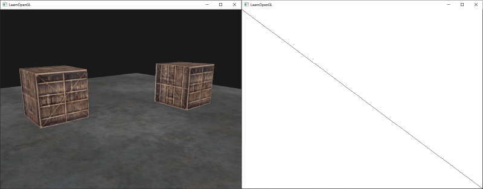

# Framebuffers
Jusqu'à présent, nous avons utilisé plusieurs types de tampons d'écran (screen buffers) : un tampon de couleur pour écrire les valeurs de couleur, un tampon de profondeur pour écrire et tester les informations de profondeur, et enfin un tampon de stencil qui nous permet d'écarter certains fragments en fonction d'une certaine condition. **La combinaison de ces tampons est stockée quelque part dans la mémoire du GPU et est appelée framebuffer**. OpenGL nous donne la possibilité de définir nos propres framebuffers et donc de définir notre propre tampon de couleur (et optionnellement un tampon de profondeur et de stencil).  
  
Les opérations de rendu que nous avons effectuées jusqu'à présent ont toutes été réalisées au-dessus des tampons de rendu attachés au framebuffer par défaut. **Le framebuffer par défaut est créé et configuré lorsque vous créez votre fenêtre (GLFW le fait pour nous)**. **En créant notre propre framebuffer, nous pouvons obtenir une cible supplémentaire pour le rendu.**  
  
L'application des framebuffers n'a peut-être pas de sens immédiat, mais **rendre votre scène dans un framebuffer différent nous permet d'utiliser ce résultat pour créer des miroirs dans une scène, ou faire des effets de post-traitement intéressants par exemple.**Nous verrons d'abord comment ils fonctionnent, puis nous les utiliserons en mettant en œuvre ces effets de post-traitement.

## Créer un framebuffer
Comme tout autre objet d'OpenGL, nous pouvons créer un objet framebuffer (abrégé en FBO) en utilisant une fonction appelée `glGenFramebuffers` : 
```cpp
unsigned int fbo;
glGenFramebuffers(1, &fbo);
```
Ce modèle de création et d'utilisation d'objets est quelque chose que nous avons vu des dizaines de fois maintenant, de sorte que leurs fonctions d'utilisation sont similaires à celles de tous les autres objets que nous avons vus : **nous créons d'abord un objet framebuffer, nous le lions en tant que framebuffer actif, nous effectuons quelques opérations et nous délions le framebuffer. Pour lier le framebuffer, nous utilisons `glBindFramebuffer` :** 
```cpp
glBindFramebuffer(GL_FRAMEBUFFER, fbo);  
```
En se liant à la cible `GL_FRAMEBUFFER`, toutes les prochaines opérations de lecture et d'écriture du framebuffer affecteront le framebuffer actuellement lié. Il est également possible de lier un framebuffer à une cible de lecture ou d'écriture spécifique en le liant à `GL_READ_FRAMEBUFFER` ou `GL_DRAW_FRAMEBUFFER` respectivement. Le framebuffer lié à `GL_READ_FRAMEBUFFER` est alors utilisé pour toutes les opérations de lecture comme `glReadPixels` et le framebuffer lié à `GL_DRAW_FRAMEBUFFER` est utilisé comme destination pour le rendu, l'effacement et d'autres opérations d'écriture. La plupart du temps, vous n'aurez pas besoin de faire cette distinction et vous liez généralement les deux avec `GL_FRAMEBUFFER`.

Malheureusement, nous ne pouvons pas encore utiliser notre framebuffer car il n'est pas complet. **Pour qu'un framebuffer soit complet, les conditions suivantes doivent être remplies :**  
  
- Nous devons **attacher au moins un tampon** (tampon de couleur, de profondeur ou de stencil).  
- Il doit y avoir **au moins un tampon de couleur.**  
- Toutes les pièces jointes doivent également être complètes (mémoire réservée).  
- Chaque tampon doit avoir **le même nombre d'échantillons.**

Ne vous inquiétez pas si vous ne savez pas ce que sont les échantillons (samples), nous y reviendrons dans un chapitre ultérieur.  
  
D'après les exigences, il devrait être clair que nous devons créer une sorte d'attachement pour le framebuffer et attacher cet attachement au framebuffer. Après avoir rempli toutes les conditions, nous pouvons vérifier si nous avons réussi à compléter le framebuffer en appelant `glCheckFramebufferStatus` avec `GL_FRAMEBUFFER`. Il vérifie alors le framebuffer actuellement lié et renvoie l'une des valeurs trouvées dans la spécification. S'il renvoie `GL_FRAMEBUFFER_COMPLETE`, nous sommes prêts :
```cpp
if(glCheckFramebufferStatus(GL_FRAMEBUFFER) == GL_FRAMEBUFFER_COMPLETE)
  // execute victory dance
```
Toutes les opérations de rendu ultérieures seront désormais effectuées sur les pièces jointes du framebuffer actuellement lié. Comme notre framebuffer n'est pas le framebuffer par défaut, les commandes de rendu n'auront aucun impact sur la sortie visuelle de votre fenêtre. **C'est pour cette raison que l'on parle de rendu hors écran lorsque le rendu est effectué vers un framebuffer différent**. **Si vous voulez que toutes les opérations de rendu aient à nouveau un impact visuel sur la fenêtre principale, nous devons rendre le framebuffer par défaut actif en le liant à 0 :**

```cpp
glBindFramebuffer(GL_FRAMEBUFFER, 0);   
```

 Lorsque nous avons terminé toutes les opérations sur le framebuffer, n'oubliez pas de supprimer l'objet framebuffer :
 
```cpp
glDeleteFramebuffers(1, &fbo);  
```
 Avant d'exécuter le contrôle de complétude, nous devons attacher une ou plusieurs pièces jointes au framebuffer. Un attachement est un emplacement de mémoire qui peut agir comme un tampon pour le framebuffer, pensez-y comme une image. Lors de la création d'un attachement, deux options s'offrent à nous : les textures ou les objets du tampon de rendu. 
## Texture attachments

Lorsqu'on attache une texture à un framebuffer, toutes les commandes de rendu écrivent dans la texture comme s'il s'agissait d'un tampon couleur/profondeur normal ou d'un tampon stencil. L'avantage d'utiliser des textures est que la sortie du rendu est stockée dans l'image de la texture que nous pouvons ensuite facilement utiliser dans nos shaders.  
  
La création d'une texture pour un framebuffer est à peu près la même que la création d'une texture normale :
```cpp
unsigned int texture;
glGenTextures(1, &texture);
glBindTexture(GL_TEXTURE_2D, texture);
  
glTexImage2D(GL_TEXTURE_2D, 0, GL_RGB, 800, 600, 0, GL_RGB, GL_UNSIGNED_BYTE, NULL);

glTexParameteri(GL_TEXTURE_2D, GL_TEXTURE_MIN_FILTER, GL_LINEAR);
glTexParameteri(GL_TEXTURE_2D, GL_TEXTURE_MAG_FILTER, GL_LINEAR);  
```
**Les principales différences sont que les dimensions sont égales à la taille de l'écran (bien que cela ne soit pas nécessaire) et que le paramètre de données de la texture est NULL.** Pour cette texture, nous ne faisons qu'allouer de la mémoire et nous ne la remplissons pas. Le remplissage de la texture se fera dès que nous effectuerons le rendu dans le framebuffer. Notez également que nous ne nous soucions pas des méthodes de wrapping ou de mipmapping puisque nous n'en aurons pas besoin dans la plupart des cas.

>Si vous voulez rendre tout votre écran dans une texture de taille plus petite ou plus grande, vous devez appeler à nouveau `glViewport` (avant d'effectuer le rendu dans votre framebuffer) avec les nouvelles dimensions de votre texture, sinon les commandes de rendu ne rempliront qu'une partie de la texture. 


Maintenant que nous avons créé une texture, la dernière chose à faire est de l'attacher au framebuffer : 

```cpp
glFramebufferTexture2D(GL_FRAMEBUFFER, GL_COLOR_ATTACHMENT0, GL_TEXTURE_2D, texture, 0);  
```

La fonction `glFrameBufferTexture2D` a les paramètres suivants :  
  
- `target` : le type de framebuffer que nous visons (draw, read ou les deux).  
- `attachment` : le type d'attachement que nous allons attacher. Pour l'instant, nous attachons un attachement de couleur. Notez que **le `0` à la fin suggère que nous pouvons attacher plus d'un attachement de couleur. Nous y reviendrons dans un chapitre ultérieur.**  
- `textarget` : le type de texture que vous voulez attacher.  
- `texture` : la texture à attacher.  
- `level` : le niveau de la mipmap. Nous le gardons à `0`.

Outre les attachements de couleur, nous pouvons également attacher une profondeur et une texture de stencil à l'objet framebuffer. Pour attacher une texture de profondeur, nous spécifions le type d'attachement comme `GL_DEPTH_ATTACHMENT`. Notez que le format de la texture et le type de format interne doivent alors devenir `GL_DEPTH_COMPONENT` pour refléter le format de stockage du tampon de profondeur. Pour attacher un tampon de stencil, utilisez `GL_STENCIL_ATTACHMENT` comme second argument et spécifiez les formats de la texture comme `GL_STENCIL_INDEX`.  
  
Il est également possible d'attacher à la fois un tampon de profondeur et un tampon de stencil en tant que texture unique. Chaque valeur de 32 bits de la texture contient alors 24 bits d'informations sur la profondeur et 8 bits d'informations sur le stencil. Pour attacher un tampon de profondeur et un tampon de stencil en tant que texture unique, nous utilisons le type `GL_DEPTH_STENCIL_ATTACHMENT` et configurons les formats de la texture pour qu'ils contiennent des valeurs combinées de profondeur et de stencil. Un exemple d'attachement d'un tampon de profondeur et de stencil en tant que texture au framebuffer est donné ci-dessous : 
```cpp
glTexImage2D(
  GL_TEXTURE_2D, 0, GL_DEPTH24_STENCIL8, 800, 600, 0, 
  GL_DEPTH_STENCIL, GL_UNSIGNED_INT_24_8, NULL
);

glFramebufferTexture2D(GL_FRAMEBUFFER, GL_DEPTH_STENCIL_ATTACHMENT, GL_TEXTURE_2D, texture, 0);
```
## Renderbuffer object attachments
Les objets renderbuffer ont été introduits dans OpenGL après les textures comme un type possible d'attachement au framebuffer. **Tout comme une image de texture, un objet renderbuffer est un tampon réel, par exemple un tableau d'octets, d'entiers, de pixels ou autre.** Cependant, il n'est pas possible de lire directement un objet renderbuffer. Cela lui confère l'avantage supplémentaire qu'OpenGL peut effectuer quelques optimisations de mémoire qui peuvent lui donner un avantage de performance par rapport aux textures pour le rendu hors écran vers un framebuffer.  
  
Les objets `Renderbuffer` stockent toutes les données de rendu directement dans leur tampon sans aucune conversion vers des formats spécifiques aux textures, ce qui les rend plus rapides en tant que support de stockage inscriptible. Il n'est pas possible de les lire directement, mais il est possible de les lire via la fonction lente `glReadPixels`. **Cette fonction renvoie une zone spécifiée de pixels à partir du framebuffer actuellement lié, mais pas directement à partir de l'attachement lui-même.**  
  
Comme leurs données sont dans un format natif, ils sont assez rapides lorsqu'il s'agit d'écrire des données ou de les copier dans d'autres tampons. Les opérations telles que le changement de tampon sont donc très rapides lors de l'utilisation d'objets renderbuffer. **La fonction `glfwSwapBuffers` que nous avons utilisée à la fin de chaque image peut tout aussi bien être implémentée avec des objets renderbuffer** : nous écrivons simplement dans une image renderbuffer, et nous passons à l'autre à la fin. Les objets renderbuffer sont parfaits pour ce genre d'opérations.  
  
La création d'un objet renderbuffer ressemble au code du framebuffer :
```cpp
unsigned int rbo;
glGenRenderbuffers(1, &rbo);
```
De même, nous voulons lier l'objet renderbuffer pour que toutes les opérations ultérieures sur le renderbuffer affectent le `rbo` actuel : 
```cpp
glBindRenderbuffer(GL_RENDERBUFFER, rbo);  
```
Comme les objets renderbuffer sont en écriture seule, ils sont souvent utilisés comme attachements pour la profondeur et le stencil, car la plupart du temps, nous n'avons pas vraiment besoin de lire les valeurs qu'ils contiennent, mais nous nous intéressons aux tests de profondeur et de stencil. Nous avons besoin des valeurs de profondeur et de stencil pour les tests, mais nous n'avons pas besoin d'échantillonner ces valeurs, donc un objet renderbuffer convient parfaitement. Lorsque nous n'échantillonnons pas à partir de ces tampons, un objet renderbuffer est généralement préféré.

La création d'un objet de tampon de rendu de profondeur et de stencil se fait en appelant la fonction `glRenderbufferStorage` :
```cpp
glRenderbufferStorage(GL_RENDERBUFFER, GL_DEPTH24_STENCIL8, 800, 600);
```
La création d'un objet renderbuffer est similaire à celle d'un objet texture, à la différence que cet objet est spécifiquement conçu pour être utilisé en tant qu'attachement à un framebuffer, au lieu d'un tampon de données à usage général comme une texture. Ici, nous avons choisi `GL_DEPTH24_STENCIL8` comme format interne, qui contient à la fois la profondeur et le tampon de stencil avec 24 et 8 bits respectivement.  
  
La dernière chose à faire est d'attacher l'objet renderbuffer :
```cpp
glFramebufferRenderbuffer(GL_FRAMEBUFFER, GL_DEPTH_STENCIL_ATTACHMENT, GL_RENDERBUFFER, rbo);  
```

Les objets renderbuffer peuvent être plus efficaces dans vos projets de rendu hors écran, mais il est important de savoir quand utiliser les objets renderbuffer et quand utiliser les textures. En règle générale, si vous n'avez jamais besoin d'échantillonner des données à partir d'un tampon spécifique, il est judicieux d'utiliser un objet renderbuffer pour ce tampon spécifique. Si vous avez besoin d'échantillonner des données à partir d'un tampon spécifique, comme des couleurs ou des valeurs de profondeur, vous devriez plutôt utiliser un attachement de texture.

## Rendre une texture
Maintenant que nous savons comment fonctionnent les framebuffers (en quelque sorte), il est temps de les utiliser à bon escient. Nous allons rendre la scène dans une texture de couleur attachée à un objet framebuffer que nous avons créé, puis dessiner cette texture sur un simple quad qui s'étend sur tout l'écran. La sortie visuelle est alors exactement la même que sans framebuffer, mais cette fois-ci, tout est imprimé sur un seul quad. Pourquoi est-ce utile ? Nous le verrons dans la section suivante.  
  
La première chose à faire est de créer un objet framebuffer et de le lier, ce qui est relativement simple : 
```cpp
unsigned int framebuffer;
glGenFramebuffers(1, &framebuffer);
glBindFramebuffer(GL_FRAMEBUFFER, framebuffer);    
```
Ensuite, nous créons une image de texture que nous attachons au framebuffer en tant qu'attachement de couleur. Les dimensions de la texture sont égales à la largeur et à la hauteur de la fenêtre et ses données ne sont pas initialisées : 
```cpp
// generate texture
unsigned int textureColorbuffer;
glGenTextures(1, &textureColorbuffer);
glBindTexture(GL_TEXTURE_2D, textureColorbuffer);
glTexImage2D(GL_TEXTURE_2D, 0, GL_RGB, 800, 600, 0, GL_RGB, GL_UNSIGNED_BYTE, NULL);
glTexParameteri(GL_TEXTURE_2D, GL_TEXTURE_MIN_FILTER, GL_LINEAR );
glTexParameteri(GL_TEXTURE_2D, GL_TEXTURE_MAG_FILTER, GL_LINEAR);
glBindTexture(GL_TEXTURE_2D, 0);

// attach it to currently bound framebuffer object
glFramebufferTexture2D(GL_FRAMEBUFFER, GL_COLOR_ATTACHMENT0, GL_TEXTURE_2D, textureColorbuffer, 0);
```
Nous voulons aussi nous assurer qu'OpenGL est capable de faire des tests de profondeur (et optionnellement des tests de stencils) donc nous devons nous assurer d'ajouter un attachement de profondeur (et de stencil) au framebuffer. Puisque nous n'échantillonnerons que le tampon de couleur et pas les autres tampons, nous pouvons créer un objet renderbuffer dans ce but.  
  
La création d'un objet renderbuffer n'est pas trop difficile. La seule chose dont nous devons nous souvenir est que nous le créons en tant qu'objet de rendu avec attachement de profondeur et de stencil. Nous définissons son format interne à `GL_DEPTH24_STENCIL8`, ce qui est suffisamment précis pour nos besoins :
```cpp
unsigned int rbo;
glGenRenderbuffers(1, &rbo);
glBindRenderbuffer(GL_RENDERBUFFER, rbo); 
glRenderbufferStorage(GL_RENDERBUFFER, GL_DEPTH24_STENCIL8, 800, 600);  
glBindRenderbuffer(GL_RENDERBUFFER, 0);
```

Une fois que nous avons alloué suffisamment de mémoire à l'objet renderbuffer, nous pouvons le délier.

Ensuite, comme dernière étape avant de terminer le framebuffer, nous attachons l'objet renderbuffer à l'attachement de profondeur et de stencil du framebuffer : 

```cpp
glFramebufferRenderbuffer(GL_FRAMEBUFFER, GL_DEPTH_STENCIL_ATTACHMENT, GL_RENDERBUFFER, rbo);
```
Ensuite, nous voulons vérifier si le framebuffer est complet et si ce n'est pas le cas, nous affichons un message d'erreur. 
```cpp
if(glCheckFramebufferStatus(GL_FRAMEBUFFER) != GL_FRAMEBUFFER_COMPLETE)
	std::cout << "ERROR::FRAMEBUFFER:: Framebuffer is not complete!" << std::endl;
glBindFramebuffer(GL_FRAMEBUFFER, 0);  
```

Veillez à délier le framebuffer pour vous assurer que nous ne rendons pas accidentellement vers le mauvais framebuffer.  
  
Maintenant que le framebuffer est complet, tout ce que nous avons à faire pour effectuer le rendu dans les tampons du framebuffer au lieu des tampons par défaut est simplement de lier l'objet framebuffer. Toutes les commandes de rendu suivantes influenceront alors le framebuffer actuellement lié. Toutes les opérations de profondeur et de stencil liront également les attachements de profondeur et de stencil du framebuffer actuellement lié, s'ils sont disponibles. Si vous deviez omettre un tampon de profondeur par exemple, toutes les opérations de test de profondeur ne fonctionneraient plus.  
  
Ainsi, pour dessiner la scène sur une seule texture, nous devrons suivre les étapes suivantes :  
  
1. Rendu de la scène comme d'habitude avec le nouveau framebuffer lié comme framebuffer actif.  
2. Lier au framebuffer par défaut.  
3. Dessinez un quad qui s'étend sur tout l'écran avec le tampon de couleur du nouveau framebuffer comme texture.  
  
Nous allons effectuer le rendu de la même scène que nous avons utilisée dans le chapitre [depth testing](00_depth_testing.md), mais cette fois-ci avec la texture [container](https://learnopengl.com/img/textures/container.jpg) de la vieille école.  
  
Pour effectuer le rendu du quad, nous allons créer un nouvel ensemble de shaders simples. Nous n'allons pas inclure de transformations matricielles fantaisistes puisque nous fournirons les coordonnées des sommets en tant que coordonnées normalisées du device afin de pouvoir les transmettre directement en sortie du shader de sommets. Le vertex shader ressemble à ceci :
```cpp
#version 330 core
layout (location = 0) in vec2 aPos;
layout (location = 1) in vec2 aTexCoords;

out vec2 TexCoords;

void main()
{
    gl_Position = vec4(aPos.x, aPos.y, 0.0, 1.0); 
    TexCoords = aTexCoords;
}  
```
Rien de bien compliqué. Le fragment shader est encore plus basique puisque la seule chose que nous avons à faire est d'échantillonner une texture : 
```cpp
#version 330 core
out vec4 FragColor;
  
in vec2 TexCoords;

uniform sampler2D screenTexture;

void main()
{ 
    FragColor = texture(screenTexture, TexCoords);
}
```
Il vous appartient ensuite de créer et de configurer un VAO pour le quad de l'écran. Une seule itération de rendu de la procédure framebuffer a la structure suivante : 
```cpp
// first pass
glBindFramebuffer(GL_FRAMEBUFFER, framebuffer);
glClearColor(0.1f, 0.1f, 0.1f, 1.0f);
glClear(GL_COLOR_BUFFER_BIT | GL_DEPTH_BUFFER_BIT); // we're not using the stencil buffer now
glEnable(GL_DEPTH_TEST);
DrawScene();	
  
// second pass
glBindFramebuffer(GL_FRAMEBUFFER, 0); // back to default
glClearColor(1.0f, 1.0f, 1.0f, 1.0f); 
glClear(GL_COLOR_BUFFER_BIT);
  
screenShader.use();  
glBindVertexArray(quadVAO);
glDisable(GL_DEPTH_TEST);
glBindTexture(GL_TEXTURE_2D, textureColorbuffer);
glDrawArrays(GL_TRIANGLES, 0, 6);  
```
Il y a quelques points à noter.
Tout d'abord, puisque chaque framebuffer que nous utilisons a son propre ensemble de tampons, nous voulons effacer chacun de ces tampons avec les bits appropriés en appelant `glClear`.
Deuxièmement, lorsque nous dessinons le quad, nous désactivons le test de profondeur car nous voulons nous assurer que le quad s'affiche toujours devant tout le reste ; nous devrons réactiver le test de profondeur lorsque nous dessinerons la scène normale.  
  
Il y a pas mal d'étapes qui peuvent mal se passer ici, donc si vous n'avez pas de résultat, essayez de déboguer là où c'est possible et relisez les sections pertinentes du chapitre. Si tout s'est déroulé correctement, vous obtiendrez un résultat visuel qui ressemble à ceci :


La partie gauche montre le résultat visuel, exactement le même que nous avons vu dans le chapitre sur les tests de profondeur, mais cette fois rendu sur un simple quad. Si nous rendons la scène en wireframe, il est évident que nous n'avons dessiné qu'un seul quad dans le framebuffer par défaut.  
  
Vous pouvez trouver le code source de l'application [ici](https://learnopengl.com/code_viewer_gh.php?code=src/4.advanced_opengl/5.1.framebuffers/framebuffers.cpp).  
  
Alors, à quoi cela sert-il encore ? Eh bien, parce que nous pouvons maintenant accéder librement à chacun des pixels de la scène entièrement rendue comme une seule image de texture, nous pouvons créer quelques effets intéressants dans le fragment shader.

## Post-processing
**Maintenant que la scène entière est rendue dans une texture unique, nous pouvons créer des effets de post-traitement intéressants en manipulant la texture de la scène**. Dans cette section, nous allons vous présenter quelques-uns des effets de post-traitement les plus populaires et vous montrer comment vous pouvez créer les vôtres avec un peu plus de créativité.  
  
Commençons par l'un des effets de post-traitement les plus simples.
### Inversion
Nous avons accès à chacune des couleurs de la sortie du rendu, il n'est donc pas difficile de retourner l'inverse de ces couleurs dans le fragment shader. Nous pouvons prendre la couleur de la texture de l'écran et l'inverser en la soustrayant de 1.0 : 

```cpp
void main()
{
    FragColor = vec4(vec3(1.0 - texture(screenTexture, TexCoords)), 1.0);
}  
```

Bien que l'inversion soit un effet de post-traitement relativement simple, elle permet déjà d'obtenir des résultats étonnants : 


La scène entière a maintenant toutes ses couleurs inversées avec une seule ligne de code dans le fragment shader. Plutôt cool, non ? 

### Niveaux de gris (grayscale)
Un autre effet intéressant consiste à supprimer toutes les couleurs de la scène à l'exception du blanc, du gris et du noir. Pour ce faire, il suffit de prendre toutes les composantes de couleur et de calculer la moyenne de leurs résultats : 

```cpp
void main()
{
    FragColor = texture(screenTexture, TexCoords);
    float average = (FragColor.r + FragColor.g + FragColor.b) / 3.0;
    FragColor = vec4(average, average, average, 1.0);
}   
```
Cela donne déjà d'assez bons résultats, mais l'œil humain a tendance à être plus sensible aux couleurs vertes et moins aux bleues. Pour obtenir les résultats les plus précis sur le plan physique, nous devons donc utiliser des canaux pondérés : 

```cpp
void main()
{
    FragColor = texture(screenTexture, TexCoords);
    float average = 0.2126 * FragColor.r + 0.7152 * FragColor.g + 0.0722 * FragColor.b;
    FragColor = vec4(average, average, average, 1.0);
}  
```


Vous ne remarquerez probablement pas la différence tout de suite, mais avec des scènes plus complexes, un tel effet d'échelle de gris pondérée tend à être plus réaliste. 

### Effets Kernel
Un autre avantage du post-traitement sur une seule image de texture est qu'il est possible d'échantillonner des valeurs de couleur à partir d'autres parties de la texture qui ne sont pas spécifiques à ce fragment. Nous pouvons par exemple prendre une petite zone autour de la coordonnée de texture actuelle et échantillonner plusieurs valeurs de texture autour de la valeur de texture actuelle. Nous pouvons ensuite créer des effets intéressants en les combinant de manière créative.  
  
Un kernel (ou matrice de convolution) est un petit tableau matriciel de valeurs centrées sur le pixel courant qui multiplie les valeurs des pixels environnants par ses valeurs de kernel et les additionne pour former une valeur unique. Nous ajoutons un petit décalage aux coordonnées de la texture dans les directions environnantes du pixel actuel et nous combinons les résultats en fonction du kernel. Un exemple de kernel est donné ci-dessous :
$$
\begin{bmatrix}
2 & 2 & 2 \\
2 & -15 & 2 \\
2 & 2 & 2 \\
\end{bmatrix}
$$
Ce kernel prend 8 valeurs de pixels environnants et les multiplie par 2 et le pixel actuel par -15. Cet exemple de kernel multiplie les pixels environnants par plusieurs poids déterminés dans le kernel et équilibre le résultat en multipliant le pixel actuel par un poids négatif important. 

**La plupart des kernels que vous trouverez sur Internet sont tous égaux à 1 si vous additionnez tous les poids. Si la somme n'est pas égale à 1, cela signifie que la couleur de la texture résultante est plus claire ou plus foncée que la valeur de la texture d'origine**. 

Les kernels sont un outil extrêmement utile pour le post-traitement car ils sont assez faciles à utiliser et à expérimenter, et de nombreux exemples peuvent être trouvés en ligne. Nous devons légèrement adapter le fragment shader pour qu'il prenne en charge les kernels. Nous supposons que chaque kernel que nous utiliserons est un kernel 3x3 (ce qui est le cas de la plupart des kernels) : 
```cpp
const float offset = 1.0 / 300.0;  

void main()
{
    vec2 offsets[9] = vec2[](
        vec2(-offset,  offset), // top-left
        vec2( 0.0f,    offset), // top-center
        vec2( offset,  offset), // top-right
        vec2(-offset,  0.0f),   // center-left
        vec2( 0.0f,    0.0f),   // center-center
        vec2( offset,  0.0f),   // center-right
        vec2(-offset, -offset), // bottom-left
        vec2( 0.0f,   -offset), // bottom-center
        vec2( offset, -offset)  // bottom-right    
    );

    float kernel[9] = float[](
        -1, -1, -1,
        -1,  9, -1,
        -1, -1, -1
    );
    
    vec3 sampleTex[9];
    for(int i = 0; i < 9; i++)
    {
        sampleTex[i] = vec3(texture(screenTexture, TexCoords.st + offsets[i]));
    }
    vec3 col = vec3(0.0);
    for(int i = 0; i < 9; i++)
        col += sampleTex[i] * kernel[i];
    
    FragColor = vec4(col, 1.0);
}  
```


Dans le fragment shader, nous créons d'abord un tableau de 9 décalages `vec2` pour chaque coordonnée de texture environnante. Le décalage est une valeur constante que vous pouvez personnaliser à votre guise. Ensuite, nous définissons le kernel, qui dans ce cas est un kernel d'accentuation qui accentue chaque valeur de couleur en échantillonnant tous les pixels environnants d'une manière intéressante. Enfin, nous ajoutons chaque décalage à la coordonnée de texture actuelle lors de l'échantillonnage et nous multiplions ces valeurs de texture avec les valeurs pondérées du kernel que nous additionnons.  
  
Ce kernel de netteté particulier se présente comme suit :


Cela peut être à la base d'effets intéressants lorsque votre joueur se lance dans une aventure narcotique. 

### Blur (flou)
Un kernel qui crée un effet de flou est défini comme suit : 
$$
\begin{bmatrix}
1 & 2 & 1 \\
2 & 4 & 2 \\
1 & 2 & 1 \\
\end{bmatrix}
/
16
$$
Comme toutes les valeurs sont égales à 16, le fait de renvoyer directement les couleurs échantillonnées combinées donnerait une couleur extrêmement brillante. Nous devons donc diviser chaque valeur du kernel par 16. Le tableau de kernel résultant devient alors : 

```cpp
float kernel[9] = float[](
    1.0 / 16, 2.0 / 16, 1.0 / 16,
    2.0 / 16, 4.0 / 16, 2.0 / 16,
    1.0 / 16, 2.0 / 16, 1.0 / 16  
);
```

En modifiant uniquement le tableau de kernel dans le shader de fragment, nous pouvons changer complètement l'effet de post-traitement. Il ressemble maintenant à ceci : 


Un tel effet de flou offre des possibilités intéressantes. Nous pourrions faire varier la quantité de flou dans le temps pour créer l'effet d'une personne ivre, ou augmenter le flou lorsque le personnage principal ne porte pas de lunettes. Le flou peut également être un outil utile pour lisser les valeurs de couleur, ce que nous verrons dans les chapitres suivants.  
  
Vous pouvez constater qu'une fois que nous avons mis en place un petit kernel, il est assez facile de créer des effets de post-traitement intéressants. Nous allons vous montrer un dernier effet populaire pour terminer cette discussion.

### Edge detection (détection des contours)
Vous trouverez ci-dessous un kernel de détection des contours qui est similaire au kernel d'affinage (sharpen kernel):

$$
\begin{bmatrix}
1 & 1 & 1 \\
1 & -8 & 1 \\
1 & 1 & 1 \\
\end{bmatrix}

$$

Ce kernel met en évidence tous les contours et assombrit le reste, ce qui est très utile lorsque l'on ne s'intéresse qu'aux contours d'une image.

Il n'est probablement pas surprenant que des kernels de ce type soient utilisés comme outils/filtres de manipulation d'images dans des outils tels que Photoshop. **Grâce à la capacité d'une carte graphique à traiter des fragments avec des capacités parallèles extrêmes, nous pouvons manipuler des images par pixel en temps réel avec une relative facilité. Les outils d'édition d'images ont donc tendance à utiliser des cartes graphiques pour le traitement des images.** 

