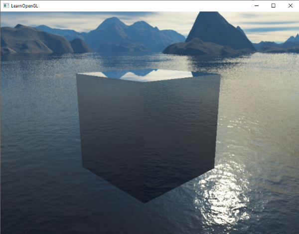

# Cubemaps
Nous utilisons des textures 2D depuis un certain temps, mais il existe d'autres types de textures que nous n'avons pas encore explorés. Dans ce chapitre, nous aborderons un type de texture qui est une combinaison de plusieurs textures mappées en une seule : une **cubemap**.

**Une cubemap est une texture qui contient 6 textures 2D individuelles qui forment chacune un côté d'un cube : un cube texturé**. Vous vous demandez peut-être quel est l'intérêt d'un tel cube ? **Pourquoi se donner la peine de combiner 6 textures individuelles en une seule entité au lieu d'utiliser simplement 6 textures individuelles ?** Eh bien, les cubemaps ont la propriété utile de pouvoir être indexées/échantillonnées à l'aide d'un vecteur de direction. Imaginons que nous ayons un cube de 1x1x1 unités avec l'origine d'un vecteur de direction résidant en son centre. L'échantillonnage d'une valeur de texture à partir de la carte du cube avec un vecteur de direction orange ressemble un peu à ceci :

>La magnitude du vecteur de direction n'a pas d'importance. Tant qu'une direction est fournie, OpenGL récupère les texels correspondants que la direction atteint (éventuellement) et renvoie la valeur de texture correctement échantillonnée.

Si nous imaginons que nous avons une forme de cube à laquelle nous attachons une telle cubemap, ce vecteur de direction serait similaire à la position locale (interpolée) des sommets du cube. De cette manière, nous pouvons échantillonner la cubemap en utilisant les vecteurs de position réels du cube tant que le cube est centré sur l'origine. Nous considérons donc que toutes les positions des sommets du cube sont ses coordonnées de texture lors de l'échantillonnage d'un cubemap. Le résultat est une coordonnée de texture qui accède à la texture de la face individuelle appropriée du cubemap.

## Créer une cubemap
Une cubemap est une texture comme une autre, donc pour en créer une, nous générons une texture et la lions à la cible de texture appropriée avant d'effectuer d'autres opérations de texture. Cette fois-ci, nous la lions à `GL_TEXTURE_CUBE_MAP` :
```cpp
unsigned int textureID;
glGenTextures(1, &textureID);
glBindTexture(GL_TEXTURE_CUBE_MAP, textureID);
```
Parce qu'une cubemap contient 6 textures, une pour chaque face, nous devons appeler `glTexImage2D` six fois avec des paramètres réglés de la même manière que dans les chapitres précédents. Cette fois-ci cependant, nous devons définir le paramètre de la cible de la texture pour qu'elle corresponde à une face spécifique du cubemap, indiquant à OpenGL pour quel côté du cubemap nous créons une texture. Cela signifie que nous devons appeler `glTexImage2D` une fois pour chaque face du cubemap.

Puisque nous avons 6 faces, OpenGL nous donne 6 cibles de texture spéciales pour cibler une face du cubemap :

|Texture target|Orientation|
|-|-|
|`GL_TEXTURE_CUBE_MAP_POSITIVE_X`|Right|
|`GL_TEXTURE_CUBE_MAP_NEGATIVE_X`|Left|
|`GL_TEXTURE_CUBE_MAP_POSITIVE_Y`|Top|
|`GL_TEXTURE_CUBE_MAP_NEGATIVE_Y`|Bottom|
|`GL_TEXTURE_CUBE_MAP_POSITIVE_Z`|Back|
|`GL_TEXTURE_CUBE_MAP_NEGATIVE_Z`|Front|

Comme beaucoup d'enums (énumérations) d'OpenGL, leur valeur `int` est incrémentée linéairement, donc si nous avions un tableau ou un vecteur d'emplacements de textures, nous pourrions les boucler en commençant par `GL_TEXTURE_CUBE_MAP_POSITIVE_X` et en incrémentant l'enum de 1 à chaque itération, bouclant effectivement à travers toutes les cibles de textures :
```cpp
int width, height, nrChannels;
unsigned char *data;  
for(unsigned int i = 0; i < textures_faces.size(); i++)
{
    data = stbi_load(textures_faces[i].c_str(), &width, &height, &nrChannels, 0);
    glTexImage2D(
        GL_TEXTURE_CUBE_MAP_POSITIVE_X + i, 
        0, GL_RGB, width, height, 0, GL_RGB, GL_UNSIGNED_BYTE, data
    );
}
```

Nous avons ici un vecteur appelé `textures_faces` qui contient les emplacements de toutes les textures requises pour le cubemap dans l'ordre indiqué dans le tableau. Cela génère une texture pour chaque face du cubemap actuellement lié.

Étant donné qu'une cubemap est une texture comme les autres, nous allons également spécifier ses méthodes de wrapping et de filtering (filtrage) :

```cpp
glTexParameteri(GL_TEXTURE_CUBE_MAP, GL_TEXTURE_MAG_FILTER, GL_LINEAR);
glTexParameteri(GL_TEXTURE_CUBE_MAP, GL_TEXTURE_MIN_FILTER, GL_LINEAR);
glTexParameteri(GL_TEXTURE_CUBE_MAP, GL_TEXTURE_WRAP_S, GL_CLAMP_TO_EDGE);
glTexParameteri(GL_TEXTURE_CUBE_MAP, GL_TEXTURE_WRAP_T, GL_CLAMP_TO_EDGE);
glTexParameteri(GL_TEXTURE_CUBE_MAP, GL_TEXTURE_WRAP_R, GL_CLAMP_TO_EDGE);
```

Ne soyez pas effrayé par `GL_TEXTURE_WRAP_R`, cela définit simplement la méthode de wrapping pour la coordonnée R de la texture qui correspond à la 3ème dimension de la texture (comme z pour les positions). Nous définissons la méthode de wrapping à `GL_CLAMP_TO_EDGE` puisque les coordonnées de la texture qui sont exactement entre deux faces peuvent ne pas atteindre une face exacte (en raison de certaines limitations matérielles). En utilisant `GL_CLAMP_TO_EDGE`, OpenGL renvoie toujours leurs valeurs de bord chaque fois que nous échantillonnons entre les faces.

Ensuite, avant de dessiner les objets qui utiliseront le cubemap, nous activons l'unité de texture correspondante et lions le cubemap avant le rendu ; ce n'est pas une grande différence par rapport aux textures 2D normales.

Dans le fragment shader, nous devons également utiliser un sampler différent du type `samplerCube` que nous échantillonnons à l'aide de la fonction texture, mais cette fois en utilisant un vecteur de direction `vec3` au lieu d'un `vec2`. Un exemple de fragment shader utilisant une cubemap ressemble à ceci :

```cpp
in vec3 textureDir; // direction vector representing a 3D texture coordinate
uniform samplerCube cubemap; // cubemap texture sampler

void main()
{             
    FragColor = texture(cubemap, textureDir);
}
```
C'est toujours très bien, mais pourquoi s'en préoccuper ? Eh bien, il se trouve qu'il y a quelques techniques intéressantes qui sont beaucoup plus faciles à mettre en œuvre avec une cubemap.
L'une de ces techniques est la création d'une **skybox**.

## Skybox

Une skybox est un (grand) cube qui englobe toute la scène et contient 6 images de l'environnement, donnant au joueur / à l'observateur l'illusion que l'environnement dans lequel il se trouve est en fait beaucoup plus grand qu'il ne l'est en réalité. Certains exemples de skybox utilisés dans les jeux vidéo sont des images de montagnes, de nuages ou d'un ciel étoilé. Un exemple de skybox, utilisant des images de ciel étoilé, peut être vu dans la capture d'écran suivante du troisième jeu Elder Scrolls :

Vous avez probablement deviné que les skyboxes comme celle-ci conviennent parfaitement aux cubemaps : nous avons un cube qui a 6 faces et qui doit être texturé par face. Dans l'image précédente, ils ont utilisé plusieurs images d'un ciel nocturne pour donner l'illusion que le joueur se trouve dans un grand univers alors qu'il est en fait à l'intérieur d'une toute petite boîte.

Il y a généralement suffisamment de ressources en ligne pour trouver des skyboxes de ce type. Ces images de skyboxes présentent généralement le schéma suivant :

Si vous pliez ces 6 faces dans un cube, vous obtiendrez un cube entièrement texturé qui simule un grand paysage. Certaines ressources fournissent la skybox dans un tel format, auquel cas vous devrez extraire manuellement les 6 images de face, mais dans la plupart des cas, elles sont fournies sous la forme de 6 images de texture unique.

Cette skybox particulière (de haute qualité) est celle que nous utiliserons pour notre scène et peut être téléchargée [ici](https://learnopengl.com/img/textures/skybox.zip).

## Charger une skybox
Puisqu'une skybox n'est en soi qu'un cubemap, le chargement d'une skybox n'est pas très différent de ce que nous avons vu au début de ce chapitre. Pour charger la skybox, nous allons utiliser la fonction suivante qui accepte un vecteur de 6 emplacements de texture :

```cpp
unsigned int loadCubemap(vector<std::string> faces)
{
    unsigned int textureID;
    glGenTextures(1, &textureID);
    glBindTexture(GL_TEXTURE_CUBE_MAP, textureID);

    int width, height, nrChannels;
    for (unsigned int i = 0; i < faces.size(); i++)
    {
        unsigned char *data = stbi_load(faces[i].c_str(), &width, &height, &nrChannels, 0);
        if (data)
        {
            glTexImage2D(GL_TEXTURE_CUBE_MAP_POSITIVE_X + i, 
                         0, GL_RGB, width, height, 0, GL_RGB, GL_UNSIGNED_BYTE, data
            );
            stbi_image_free(data);
        }
        else
        {
            std::cout << "Cubemap tex failed to load at path: " << faces[i] << std::endl;
            stbi_image_free(data);
        }
    }
    glTexParameteri(GL_TEXTURE_CUBE_MAP, GL_TEXTURE_MIN_FILTER, GL_LINEAR);
    glTexParameteri(GL_TEXTURE_CUBE_MAP, GL_TEXTURE_MAG_FILTER, GL_LINEAR);
    glTexParameteri(GL_TEXTURE_CUBE_MAP, GL_TEXTURE_WRAP_S, GL_CLAMP_TO_EDGE);
    glTexParameteri(GL_TEXTURE_CUBE_MAP, GL_TEXTURE_WRAP_T, GL_CLAMP_TO_EDGE);
    glTexParameteri(GL_TEXTURE_CUBE_MAP, GL_TEXTURE_WRAP_R, GL_CLAMP_TO_EDGE);

    return textureID;
}  
```

La fonction elle-même ne devrait pas être trop surprenante. Il s'agit essentiellement de tout le code cubemap que nous avons vu dans la section précédente, mais combiné dans une seule fonction gérable.

Avant d'appeler cette fonction, nous allons charger les chemins de texture appropriés dans un vecteur, dans l'ordre spécifié par les enums cubemap :
```cpp
vector<std::string> faces;
{
    "right.jpg",
    "left.jpg",
    "top.jpg",
    "bottom.jpg",
    "front.jpg",
    "back.jpg"
};
unsigned int cubemapTexture = loadCubemap(faces);  
```
Nous avons chargé la skybox en tant que cubemap avec `cubemapTexture` comme id. Nous pouvons maintenant la lier à un cube pour remplacer la couleur claire que nous avons utilisée pendant tout ce temps.
## Afficher une skybox
Comme la skybox est dessinée sur un cube, nous aurons besoin d'un autre `VAO`, d'un `VBO` et d'un nouveau ensemble de sommets, comme pour tout autre objet 3D. Vous pouvez obtenir ses données de vertex [ici](https://learnopengl.com/code_viewer.php?code=advanced/cubemaps_skybox_data).

Un cubemap utilisé pour texturer un cube 3D peut être échantillonné en utilisant les positions locales du cube comme coordonnées de texture. Lorsqu'un cube est centré sur l'origine (0,0,0), chacun de ses vecteurs de position est également un vecteur de direction à partir de l'origine. Ce vecteur de direction est exactement ce dont nous avons besoin pour obtenir la valeur de texture correspondante à la position spécifique de ce cube. **C'est pourquoi nous n'avons besoin que des vecteurs de position et non des coordonnées de texture.**

Pour rendre la skybox, nous aurons besoin d'un nouvel ensemble de shaders qui ne sont pas trop compliqués. Comme nous n'avons qu'un seul attribut de vertex, le vertex shader est assez simple :

```cpp
#version 330 core
layout (location = 0) in vec3 aPos;

out vec3 TexCoords;

uniform mat4 projection;
uniform mat4 view;

void main()
{
    TexCoords = aPos;
    gl_Position = projection * view * vec4(aPos, 1.0);
}  
```

La partie intéressante de ce shader de sommets est que nous définissons le vecteur de position entrant comme la coordonnée de texture sortante pour une utilisation (interpolée) dans le shaders de fragments. Le shader de fragment prend ensuite ces coordonnées en entrée pour échantillonner un `samplerCube` :
```cpp
#version 330 core
out vec4 FragColor;

in vec3 TexCoords;

uniform samplerCube skybox;

void main()
{    
    FragColor = texture(skybox, TexCoords);
}
```
Le fragment shader est relativement simple. Nous prenons le vecteur de position interpolé de l'attribut de sommet comme vecteur de direction de la texture et nous l'utilisons pour échantillonner les valeurs de la texture à partir de la cubemap.

Le rendu de la skybox est facile maintenant que nous avons une texture cubemap, nous lions simplement la texture cubemap et le sampler de la skybox est automatiquement rempli avec la cubemap de la skybox. Pour dessiner la skybox, nous allons la dessiner en tant que premier objet de la scène et désactiver l'écriture de la profondeur. De cette façon, la skybox sera toujours dessinée à l'arrière-plan de tous les autres objets puisque le cube de l'unité est probablement plus petit que le reste de la scène.

```cpp
glDepthMask(GL_FALSE);
skyboxShader.use();
// ... set view and projection matrix
glBindVertexArray(skyboxVAO);
glBindTexture(GL_TEXTURE_CUBE_MAP, cubemapTexture);
glDrawArrays(GL_TRIANGLES, 0, 36);
glDepthMask(GL_TRUE);
// ... draw rest of the scene
```

Si vous exécutez ce projet, vous rencontrerez des difficultés. Nous voulons que la skybox soit centrée autour du joueur, de sorte que peu importe la distance à laquelle le joueur se déplace, la skybox ne se rapproche pas, ce qui donne l'impression que l'environnement est extrêmement grand. La matrice de vue actuelle transforme cependant toutes les positions de la skybox en les faisant pivoter, en les mettant à l'échelle et en les translatant, de sorte que si le joueur se déplace, le cubemap se déplace également ! Nous voulons supprimer la partie translation de la matrice de vue afin que seule la rotation affecte les vecteurs de position de la skybox.

Vous vous souvenez peut-être du chapitre sur l'éclairage de base que nous pouvons supprimer la section de translation des matrices de transformation en prenant la matrice 3x3 supérieure gauche de la matrice 4x4. Nous pouvons y parvenir en convertissant la matrice de vue en une matrice 3x3 (en supprimant la translation) et en la reconvertissant en une matrice 4x4 :

```cpp
glm::mat4 view = glm::mat4(glm::mat3(camera.GetViewMatrix()));  
```
Cela supprime toute translation, mais conserve toutes les transformations de rotation afin que l'utilisateur puisse toujours regarder autour de la scène.

Le résultat est une scène qui semble instantanément énorme grâce à notre skybox. Si vous vous déplacez autour du conteneur (la caisse) de base, vous obtenez immédiatement une sensation d'échelle qui améliore considérablement le réalisme de la scène. Le résultat ressemble à ceci :

Essayez d'expérimenter différentes skyboxes et voyez comment elles peuvent avoir un impact énorme sur l'aspect et la sensation de votre scène.

## Une optimisation
Pour l'instant, nous avons rendu la skybox en premier avant de rendre tous les autres objets de la scène. Cela fonctionne très bien, mais n'est pas très efficace. Si nous rendons la skybox en premier, nous exécutons le shader de fragments pour chaque pixel de l'écran alors que seule une petite partie de la skybox sera finalement visible ; des fragments qui auraient pu être facilement éliminés en utilisant le test de profondeur précoce, ce qui nous a permis d'économiser une bande passante précieuse.

**Ainsi, pour améliorer légèrement les performances, nous allons effectuer le rendu de la skybox en dernier**. De cette façon, le tampon de profondeur est complètement rempli avec toutes les valeurs de profondeur de la scène, de sorte que nous n'avons qu'à rendre les fragments de la skybox chaque fois que le test de profondeur précoce réussit, ce qui réduit considérablement le nombre d'appels au shader de fragments. Le problème est que la skybox sera très probablement rendue au-dessus de tous les autres objets puisqu'elle n'est qu'un cube de 1x1x1, réussissant ainsi la plupart des tests de profondeur. Un simple rendu sans test de profondeur n'est pas une solution car la skybox écrasera tous les autres objets de la scène puisqu'elle est rendue en dernier. Nous devons faire croire au tampon de profondeur que la skybox a une valeur de profondeur maximale de 1,0 afin qu'elle échoue au test de profondeur chaque fois qu'un objet différent se trouve devant elle.

Dans le chapitre sur les systèmes de coordonnées, nous avons dit que la division de la perspective est effectuée après l'exécution du vertex shader, en divisant les coordonnées xyz de la `gl_Position` par sa composante w. Nous savons également, grâce au chapitre sur les tests de profondeur, que la division résultante est égale à la valeur de profondeur de ce vertex. Nous savons également, grâce au chapitre sur les tests de profondeur, que la composante z de la division résultante est égale à la valeur de profondeur de ce sommet. En utilisant ces informations, nous pouvons définir la composante z de la position de sortie comme étant égale à sa composante w, ce qui se traduira par une composante z toujours égale à 1,0, car lorsque la division de la perspective est appliquée, sa composante z se traduit par w / w = 1,0 :

```cpp
void main()
{
    TexCoords = aPos;
    vec4 pos = projection * view * vec4(aPos, 1.0);
    gl_Position = pos.xyww;
}  
```


Les coordonnées normalisées du device (NDC) qui en résultent auront toujours une valeur z égale à $1.0$ : la valeur de profondeur maximale. La boîte à ciel ne sera donc rendue que là où il n'y a pas d'objets visibles (ce n'est qu'à ce moment-là qu'elle passera le test de profondeur, tout le reste se trouvant devant la skybox).

Nous devons modifier légèrement la fonction de profondeur en la réglant sur `GL_LEQUAL` au lieu de `GL_LESS` par défaut. Le tampon de profondeur sera rempli avec des valeurs de 1.0 pour la skybox, nous devons donc nous assurer que la skybox passe les tests de profondeur avec des valeurs inférieures ou égales au tampon de profondeur au lieu de inférieures à.

Vous pouvez trouver la version optimisée du code source [ici](https://learnopengl.com/code_viewer_gh.php?code=src/4.advanced_opengl/6.1.cubemaps_skybox/cubemaps_skybox.cpp).

## Environment mapping

Nous disposons désormais de l'ensemble de l'environnement dans un seul objet de texture et nous pouvons utiliser ces informations pour bien plus qu'une simple skybox. En utilisant un cubemap avec un environnement, nous pouvons donner aux objets des propriétés de réflexion ou de réfraction. **Les techniques qui utilisent un cubemap d'environnement de cette manière sont appelées techniques de mappage d'environnement et les deux plus populaires sont la réflexion et la réfraction.**

## Réflexion
La réflexion est la propriété d'un objet (ou d'une partie d'un objet) de refléter son environnement, c'est-à-dire que les couleurs de l'objet sont plus ou moins égales à celles de son environnement en fonction de l'angle de vue de l'observateur. Un miroir, par exemple, est un objet réfléchissant : il reflète son environnement en fonction de l'angle de vue de l'observateur.

Les principes de base de la réflexion ne sont pas si difficiles à comprendre. L'image suivante montre comment nous pouvons calculer un vecteur de réflexion et utiliser ce vecteur pour échantillonner à partir d'un cubemap :


Nous calculons un vecteur de réflexion $$vec{R}$ autour du vecteur normal de l'objet $$vec{N}$ sur la base du vecteur de direction de vue $$vec{I}$. Nous pouvons calculer ce vecteur de réflexion à l'aide de la fonction `reflect` intégrée à GLSL. Le vecteur résultant $$vec{R}$ est ensuite utilisé comme vecteur de direction pour indexer/échantillonner le cubemap, ce qui renvoie une valeur de couleur de l'environnement. L'effet résultant est que l'objet semble refléter la skybox.

Puisque nous avons déjà une skybox dans notre scène, créer des reflets n'est pas trop difficile. Nous allons modifier le fragment shader utilisé par la caisse pour lui donner des propriétés réfléchissantes :

```cpp
#version 330 core
out vec4 FragColor;

in vec3 Normal;
in vec3 Position;

uniform vec3 cameraPos;
uniform samplerCube skybox;

void main()
{             
    vec3 I = normalize(Position - cameraPos);
    vec3 R = reflect(I, normalize(Normal));
    FragColor = vec4(texture(skybox, R).rgb, 1.0);
}
```
Nous calculons d'abord le vecteur de direction de la vue/caméra $$vec{I}$ et l'utilisons pour calculer le vecteur de réflexion $$vec{R}$ que nous utilisons ensuite pour échantillonner à partir de la cubemap de la skybox. Notez que nous avons à nouveau les variables `Normal` et `Position` interpolées du fragment, nous devrons donc également ajuster le vertex shader :

```cpp
#version 330 core
layout (location = 0) in vec3 aPos;
layout (location = 1) in vec3 aNormal;

out vec3 Normal;
out vec3 Position;

uniform mat4 model;
uniform mat4 view;
uniform mat4 projection;

void main()
{
    Normal = mat3(transpose(inverse(model))) * aNormal;
    Position = vec3(model * vec4(aPos, 1.0));
    gl_Position = projection * view * vec4(Position, 1.0);
}  
```
Nous utilisons des vecteurs normaux, nous devrons donc les transformer à nouveau à l'aide d'une matrice normale. Le vecteur de sortie `Position` est un vecteur de position dans l'espace monde. Cette sortie `Position` du vertex shader est utilisée pour calculer le vecteur de direction de la vue dans le fragment shader.

Comme nous utilisons des normales, vous devrez mettre à jour les données du vertex et les pointeurs d'attributs. Veillez également à définir l'uniforme `cameraPos`.

Ensuite, nous voulons lier la texture cubemap avant de rendre le conteneur :
```cpp
glBindVertexArray(cubeVAO);
glBindTexture(GL_TEXTURE_CUBE_MAP, skyboxTexture);  		
glDrawArrays(GL_TRIANGLES, 0, 36);
```
En compilant et en exécutant votre code, vous obtenez une caisse qui agit comme un miroir parfait. Le ciel environnant est parfaitement reflété sur le conteneur :


Vous pouvez trouver le code source complet [ici](https://learnopengl.com/code_viewer_gh.php?code=src/4.advanced_opengl/6.2.cubemaps_environment_mapping/cubemaps_environment_mapping.cpp).

Lorsque la réflexion est appliquée à un objet entier (comme la caisse), l'objet a l'air d'être fait d'un matériau très réfléchissant comme l'acier ou le chrome. Si nous devions charger un objet plus intéressant (comme le modèle de sac à dos des chapitres sur le chargement des modèles), nous obtiendrions l'effet que l'objet semble entièrement fait de chrome :


Cela semble assez impressionnant, mais en réalité, la plupart des modèles ne sont pas complètement réfléchissants. Nous pourrions par exemple introduire des maps de réflexion qui donneraient aux modèles un niveau de détail supplémentaire. Tout comme les maps diffuses et spéculaires, les maps de réflexion sont des images de texture que nous pouvons échantillonner pour déterminer la réflectivité d'un fragment. En utilisant ces maps de réflexion, nous pouvons déterminer quelles parties du modèle sont réfléchissantes et avec quelle intensité.

### Réfraction
Une autre forme de mapping de l'environnement est appelée **réfraction** et est similaire à la réflexion. **La réfraction est le changement de direction de la lumière dû à la modification du matériau qu'elle traverse. La réfraction est ce que l'on voit généralement avec les surfaces semblables à de l'eau, où la lumière n'entre pas directement, mais se courbe un peu**. C'est comme si vous regardiez votre bras à mi-chemin dans l'eau.

La réfraction est décrite par la [loi de Snell](http://en.wikipedia.org/wiki/Snell%27s_law) qui, avec les maps de l'environnement, ressemble un peu à ceci :


Nous avons à nouveau un vecteur de vue $$vec{I}$, un vecteur normal $$vec{N}$ et, cette fois, un vecteur de réfraction $$vec{R}$. Comme vous pouvez le voir, la direction du vecteur de vue est légèrement courbée. Ce vecteur courbé $$vec{R}$ est ensuite utilisé pour échantillonner le cubemap.

La réfraction est assez facile à mettre en œuvre grâce à la fonction `refract` intégrée de GLSL qui attend un vecteur normal, une direction de vue et un rapport entre les indices de réfraction des deux matériaux.

**L'indice de réfraction détermine le degré de déformation ou de courbure de la lumière dans un matériau, chaque matériau ayant son propre indice de réfraction.**
Une liste des indices de réfraction les plus courants est donnée dans le tableau suivant :

|Matériau|Indice de réfraction|
|-|-|
|Air|$1.0$|
|Eau|$1.33$|
|Glace|$1.309$|
|Verre|$1.52$|
|Diamant|$2.42$|
Nous utilisons ces indices de réfraction pour calculer le rapport entre les deux matériaux traversés par la lumière. Dans notre cas, le rayon lumineux passe de l'air au verre (si nous supposons que l'objet est en verre), le rapport est donc de :
$$
1.00/1.52=0.658
$$
Nous avons déjà délimité le cubemap, fourni les données de vertex avec des normales, et défini la position de la caméra comme un uniforme. La seule chose que nous devons changer est le fragment shader :
```cpp
void main()
{             
    float ratio = 1.00 / 1.52;
    vec3 I = normalize(Position - cameraPos);
    vec3 R = refract(I, normalize(Normal), ratio);
    FragColor = vec4(texture(skybox, R).rgb, 1.0);
}  
```
En modifiant les indices de réfraction, vous pouvez créer des résultats visuels complètement différents. La compilation de l'application et l'exécution des résultats sur l'objet conteneur n'est pas très intéressante car elle ne montre pas vraiment l'effet de la réfraction, hormis le fait qu'elle agit comme une loupe pour l'instant. En revanche, l'utilisation des mêmes shaders sur le modèle 3D chargé permet d'obtenir l'effet recherché : un objet ressemblant à du verre.


Vous pouvez imaginer qu'avec la bonne combinaison d'éclairage, de réflexion, de réfraction et de mouvement des vertex, vous pouvez créer des graphiques d'eau très soignés. Notez que pour obtenir des résultats physiquement exacts, nous devrions réfracter la lumière à nouveau lorsqu'elle quitte l'objet ; pour l'instant, nous avons simplement utilisé une réfraction unilatérale, ce qui convient à la plupart des usages.
## Maps d'environnement dynamiques

Pour l'instant, nous avons utilisé une combinaison statique d'images comme skybox, ce qui est très bien, mais cela n'inclut pas la scène 3D réelle avec des objets éventuellement en mouvement. Nous n'avons pas vraiment remarqué cela jusqu'à présent, car nous n'avons utilisé qu'un seul objet. Si nous avions un objet miroir avec plusieurs objets environnants, seule la skybox serait visible dans le miroir, comme si elle était le seul objet de la scène.

En utilisant les framebuffers, il est possible de créer une texture de la scène pour les 6 angles différents de l'objet en question et de les stocker dans un cubemap à chaque image. Nous pouvons ensuite utiliser ce cubemap (généré dynamiquement) pour créer des surfaces de réflexion et de réfraction réalistes qui incluent tous les autres objets. C'est ce qu'on appelle le mapping dynamique de l'environnement, car nous créons dynamiquement un cubemap de l'environnement d'un objet et l'utilisons comme map de l'environnement.

Bien que cette méthode soit très esthétique, elle présente un énorme inconvénient : nous devons effectuer le rendu de la scène six fois par objet utilisant une map d'environnement, ce qui représente une énorme pénalité en termes de performances pour votre application. Les applications modernes essaient d'utiliser la skybox autant que possible et, si possible, de pré-rendre les cubemaps chaque fois qu'elles le peuvent afin de créer des maps d'environnement dynamiques. Bien que le mapping dynamique de l'environnement soit une excellente technique, il faut beaucoup d'astuces pour la faire fonctionner dans une application de rendu sans trop de pertes de performances.
