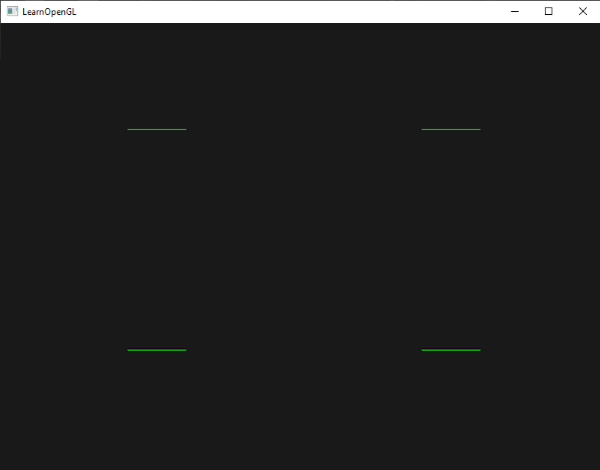
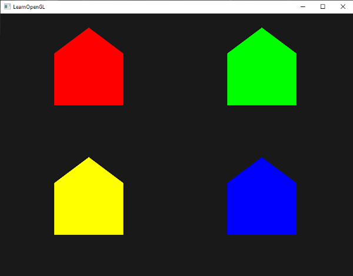

# Shader de géométrie
**Entre le shader de sommets et le shader de fragments, il existe une étape de shader optionnelle appelée shader de géométrie.** Un shader géométrique prend en entrée un ensemble de sommets qui forment une primitive unique, par exemple un point ou un triangle. Le shader géométrique peut ensuite transformer ces sommets comme il l'entend avant de les envoyer à l'étape suivante du shader. **Ce qui rend le shader géométrique intéressant, c'est qu'il est capable de convertir la primitive d'origine (ensemble de sommets) en des primitives complètement différentes, en générant éventuellement plus de sommets qu'il n'y en avait au départ.**

Nous allons vous plonger dans le bain en vous montrant un exemple de shader géométrique :
```cpp
#version 330 core
layout (points) in;
layout (line_strip, max_vertices = 2) out;

void main() {    
    gl_Position = gl_in[0].gl_Position + vec4(-0.1, 0.0, 0.0, 0.0); 
    EmitVertex();

    gl_Position = gl_in[0].gl_Position + vec4( 0.1, 0.0, 0.0, 0.0);
    EmitVertex();
    
    EndPrimitive();
}  
```
Au début d'un shader géométrique, nous devons déclarer le type d'entrée primitive que nous recevons du shader de sommets. Pour ce faire, nous déclarons un spécificateur de layout devant le mot-clé in. Ce qualificateur de layout d'entrée peut prendre n'importe laquelle des valeurs primitives suivantes :

- `points` : lorsque l'on dessine des primitives GL_POINTS (`1`).
- `lines` : lors du dessin des primitives GL_LINES ou GL_LINE_STRIP (`2`).
- `lines_adjacency` : GL_LINES_ADJACENCY ou GL_LINE_STRIP_ADJACENCY (`4`).
- `triangles` : GL_TRIANGLES, GL_TRIANGLE_STRIP ou GL_TRIANGLE_FAN (`3`).
- `triangles_adjacency` : GL_TRIANGLES_ADJACENCY ou GL_TRIANGLE_STRIP_ADJACENCY (`6`).

Ce sont presque toutes les primitives de rendu que nous pouvons donner aux appels de rendu comme `glDrawArrays`. Si nous avions choisi de dessiner les sommets en tant que `GL_TRIANGLES`, nous devrions définir le qualificateur d'entrée à triangles. Le nombre entre parenthèses représente le nombre minimal de sommets que peut contenir une primitive.

Nous devons également spécifier un type de primitive que le shader géométrique produira en sortie, ce que nous faisons par le biais d'un spécificateur d'agencement devant le mot-clé out. Tout comme le qualificateur de layout d'entrée, le qualificateur de disposition de sortie peut prendre plusieurs valeurs primitives :
- `points`
- `line_strip`
- `triangle_strip`
Avec ces trois spécificateurs de sortie, nous pouvons créer presque toutes les formes que nous voulons à partir des primitives d'entrée. Pour générer un simple triangle par exemple, nous devrions spécifier `triangle_strip` comme sortie et sortir 3 sommets.

Le shader géométrique s'attend également à ce que nous définissions un nombre maximum de sommets en sortie (si vous dépassez ce nombre, OpenGL ne dessinera pas les sommets supplémentaires), ce que nous pouvons également faire dans le qualificatif layout du mot-clé out. Dans ce cas particulier, nous allons sortir une `line strip` avec un nombre maximum de 2 sommets.

>Au cas où vous vous demanderiez ce qu'est une `line strip` : une **`line strip` relie un ensemble de points pour former une ligne continue entre eux avec un minimum de 2 points.** **Chaque point supplémentaire crée une nouvelle ligne entre le nouveau point et le point précédent, comme vous pouvez le voir dans l'image suivante avec des sommets à 5 points** :


Pour générer des résultats significatifs, nous avons besoin d'un moyen de récupérer la sortie de l'étape de shader précédente. GLSL nous donne une variable intégrée appelée `gl_in` qui, en interne, ressemble (probablement) à quelque chose comme ceci :
```cpp
in gl_Vertex
{
    vec4  gl_Position;
    float gl_PointSize;
    float gl_ClipDistance[];
} gl_in[];  
```
Ici, il est déclaré comme un bloc d'interface (comme discuté dans le chapitre précédent) qui contient quelques variables intéressantes dont la plus intéressante est `gl_Position` qui contient le vecteur que nous avons défini comme la sortie du vertex shader.

Notez qu'il est déclaré comme un tableau, car la plupart des primitives de rendu contiennent plus d'un sommet. Le shader de géométrie reçoit tous les sommets d'une primitive en entrée.

En utilisant les données de vertex de l'étape du shader de vertex, nous pouvons générer de nouvelles données avec deux fonctions du shader de géométrie appelées `EmitVertex` et `EndPrimitive`. Le shader géométrique s'attend à ce que vous génériez/sortiez au moins une des primitives que vous avez spécifiées en tant que sortie. Dans notre cas, nous voulons au moins générer une primitive de line strip.

```cpp
#version 330 core
layout (points) in;
layout (line_strip, max_vertices = 2) out;
  
void main() {    
    gl_Position = gl_in[0].gl_Position + vec4(-0.1, 0.0, 0.0, 0.0); 
    EmitVertex();

    gl_Position = gl_in[0].gl_Position + vec4( 0.1, 0.0, 0.0, 0.0);
    EmitVertex();
    
    EndPrimitive();
}    
```
Chaque fois que nous appelons `EmitVertex`, le vecteur actuellement défini dans `gl_Position` est ajouté à la primitive de sortie. Chaque fois que `EndPrimitive` est appelé, tous les sommets émis pour cette primitive sont combinés dans la primitive de rendu de sortie spécifiée. En appelant plusieurs fois `EndPrimitive`, après un ou plusieurs appels EmitVertex, il est possible de générer plusieurs primitives. Ce cas particulier émet deux vertices qui ont été translatés d'un petit décalage par rapport à la position originale du vertex, puis appelle `EndPrimitive`, combinant les deux vertices en une seule ligne de 2 vertices.

Maintenant que vous savez (en quelque sorte) comment fonctionnent les geometry shaders, vous pouvez probablement deviner ce que fait ce geometry shader. Ce shader géométrique prend une primitive de point comme entrée et crée une primitive de ligne horizontale avec le point d'entrée en son centre. Si nous devions effectuer un rendu, cela ressemblerait à quelque chose comme ceci :

Ce n'est pas encore très impressionnant, mais il est intéressant de considérer que cette sortie a été générée en utilisant seulement l'appel de rendu suivant :
```cpp
glDrawArrays(GL_POINTS, 0, 4);  
```
Bien qu'il s'agisse d'un exemple relativement simple, il montre comment nous pouvons utiliser les shaders géométriques pour générer (dynamiquement) de nouvelles formes à la volée. Plus loin dans ce chapitre, nous aborderons quelques effets intéressants que nous pouvons créer à l'aide des shaders géométriques, mais pour l'instant, nous allons commencer par un exemple simple.

## Utiliser les shaders de géométrie
Pour démontrer l'utilisation d'un shader géométrique, nous allons effectuer le rendu d'une scène très simple dans laquelle nous dessinons 4 points sur le plan z en coordonnées normalisées de l'appareil (NDC). Les coordonnées des points sont les suivantes:
```cpp
float points[] = {
	-0.5f,  0.5f, // top-left
	 0.5f,  0.5f, // top-right
	 0.5f, -0.5f, // bottom-right
	-0.5f, -0.5f  // bottom-left
};  
```
Le vertex shader doit dessiner les points sur le plan z. Nous allons donc créer un vertex shader de base :
```cpp
#version 330 core
layout (location = 0) in vec2 aPos;

void main()
{
    gl_Position = vec4(aPos.x, aPos.y, 0.0, 1.0); 
}
```
Et nous sortirons la couleur verte pour tous les points que nous codons directement dans le fragment shader :

```cpp
#version 330 core
out vec4 FragColor;

void main()
{
    FragColor = vec4(0.0, 1.0, 0.0, 1.0);   
}  
```
Génère un VAO et un VBO pour les données des sommets des points, puis les dessine via `glDrawArrays` :
```cpp
shader.use();
glBindVertexArray(VAO);
glDrawArrays(GL_POINTS, 0, 4); 
```
Le résultat est une scène sombre avec 4 points verts (difficiles à voir) :

Mais n'avons-nous pas déjà appris à faire tout cela ? Oui, et maintenant nous allons pimenter cette petite scène en y ajoutant la magie des shaders géométriques.

À des fins d'apprentissage, nous allons d'abord créer ce que l'on appelle un **shader géométrique pass-through** qui prend une primitive ponctuelle en entrée et la transmet au shader suivant sans la modifier :
```cpp
#version 330 core
layout (points) in;
layout (points, max_vertices = 1) out;

void main() {    
    gl_Position = gl_in[0].gl_Position; 
    EmitVertex();
    EndPrimitive();
}  
```
A présent, ce shader géométrique devrait être assez facile à comprendre. Il émet simplement la position non modifiée du vertex qu'il a reçue en entrée et génère une primitive de point.

Un shader géométrique doit être compilé et lié à un programme tout comme les shaders de sommets et de fragments, mais cette fois nous allons créer le shader en utilisant `GL_GEOMETRY_SHADER` comme type de shader :
```cpp
geometryShader = glCreateShader(GL_GEOMETRY_SHADER);
glShaderSource(geometryShader, 1, &gShaderCode, NULL);
glCompileShader(geometryShader);  
[...]
glAttachShader(program, geometryShader);
glLinkProgram(program);  
```
Le code de compilation des shaders est le même que celui des vertex et des fragment shaders. Vérifiez bien qu'il n'y a pas d'erreurs de compilation ou d'édition de liens !

Si vous compilez et exécutez maintenant, vous devriez obtenir un résultat qui ressemble un peu à celui-ci :

C'est exactement la même chose que sans le geometry shader ! C'est un peu ennuyeux, je l'admets, mais le fait que nous ayons pu dessiner les points signifie que le geometry shader fonctionne, alors maintenant il est temps de passer aux choses plus funky !
## Construisons des maisons
Dessiner des points et des lignes n'est pas très intéressant. Nous allons donc faire preuve d'un peu de créativité en utilisant le shader géométrique pour dessiner une maison à l'emplacement de chaque point.
Nous pouvons y parvenir en réglant la sortie du shader géométrique sur `triangle_strip` et en dessinant un total de trois triangles : deux pour la maison carrée et un pour le toit.

Un `triangle strip` en OpenGL est un moyen plus efficace de dessiner des triangles avec moins de sommets. Une fois le premier triangle dessiné, chaque sommet suivant génère un autre triangle à côté du premier : tous les trois sommets adjacents formeront un triangle. **Si nous avons un total de 6 sommets qui forment une bande de triangle, nous obtiendrons les triangles suivants : (1,2,3), (2,3,4), (3,4,5) et (4,5,6) ; formant un total de 4 triangles**.
**Un triangle strip nécessite au moins 3 sommets et génère N-2 triangles ; avec 6 sommets, nous avons créé 6-2 = 4 triangles.** L'image suivante illustre ce phénomène :

En utilisant un `triangle strip` comme sortie du shader géométrique, nous pouvons facilement créer la forme de maison que nous recherchons en générant 3 triangles adjacents dans le bon ordre.

L'image suivante montre dans quel ordre nous devons dessiner les sommets pour obtenir les triangles dont nous avons besoin, le point bleu étant le point d'entrée :

Cela se traduit par le shader géométrique suivant :
```cpp
#version 330 core
layout (points) in;
layout (triangle_strip, max_vertices = 5) out;

void build_house(vec4 position)
{    
    gl_Position = position + vec4(-0.2, -0.2, 0.0, 0.0);    // 1:bottom-left
    EmitVertex();   
    gl_Position = position + vec4( 0.2, -0.2, 0.0, 0.0);    // 2:bottom-right
    EmitVertex();
    gl_Position = position + vec4(-0.2,  0.2, 0.0, 0.0);    // 3:top-left
    EmitVertex();
    gl_Position = position + vec4( 0.2,  0.2, 0.0, 0.0);    // 4:top-right
    EmitVertex();
    gl_Position = position + vec4( 0.0,  0.4, 0.0, 0.0);    // 5:top
    EmitVertex();
    EndPrimitive();
}

void main() {    
    build_house(gl_in[0].gl_Position);
}  
```
Ce shader géométrique génère 5 sommets, chaque sommet étant la position du point plus un décalage pour former une grande bande triangulaire. La primitive résultante est ensuite rastérisée et le shader de fragments s'exécute sur l'ensemble du triangle strip, ce qui permet d'obtenir une maison verte pour chaque point rendu :

Vous pouvez voir que chaque maison est constituée de trois triangles, tous dessinés à partir d'un seul point dans l'espace. Les maisons vertes ont l'air un peu ennuyeuses, donc nous allons les animer un peu en donnant à chaque maison une couleur unique. Pour ce faire, nous allons ajouter un attribut de vertex supplémentaire dans le vertex shader avec des informations de couleur par vertex et le diriger vers le geometry shader qui le transmet ensuite au fragment shader.

Les données de vertex mises à jour sont indiquées ci-dessous :
```cpp
float points[] = {
    -0.5f,  0.5f, 1.0f, 0.0f, 0.0f, // top-left
     0.5f,  0.5f, 0.0f, 1.0f, 0.0f, // top-right
     0.5f, -0.5f, 0.0f, 0.0f, 1.0f, // bottom-right
    -0.5f, -0.5f, 1.0f, 1.0f, 0.0f  // bottom-left
};  
```
Nous mettons ensuite à jour le shader de sommets pour transmettre l'attribut de couleur au shader de géométrie à l'aide d'un bloc d'interface :
```cpp
#version 330 core
layout (location = 0) in vec2 aPos;
layout (location = 1) in vec3 aColor;

out VS_OUT {
    vec3 color;
} vs_out;

void main()
{
    gl_Position = vec4(aPos.x, aPos.y, 0.0, 1.0); 
    vs_out.color = aColor;
}  
```
Nous devons ensuite déclarer le même bloc d'interface (avec un nom d'interface différent) dans le shader géométrique :
```cpp
in VS_OUT {
    vec3 color;
} gs_in[];  
```

Étant donné que le shader de géométrie agit sur un ensemble de sommets, ses données d'entrée provenant du shader de sommets sont toujours représentées sous forme de tableaux de données de sommets, même si nous n'avons pour l'instant qu'un seul sommet.

>Nous n'avons pas nécessairement besoin d'utiliser des blocs d'interface pour transférer des données au shader de géométrie. Nous aurions également pu l'écrire comme suit
```cpp
in vec3 outColor[];
```
>Cela fonctionne si le shader de sommets a transmis le vecteur de couleur en tant que vec3 `outColor`. Cependant, les blocs d'interface sont plus faciles à utiliser dans les shaders tels que le shader de géométrie. En pratique, les entrées du shader de géométrie peuvent devenir assez volumineuses et les regrouper dans un grand tableau de blocs d'interface est beaucoup plus logique.


Nous devons également déclarer un vecteur de couleur de sortie pour l'étape suivante du shader de fragment :

```cpp
out vec3 fColor;  
```
Comme le fragment shader n'attend qu'une seule couleur (interpolée), cela n'a pas de sens de transmettre plusieurs couleurs. Le vecteur `fColor` n'est donc pas un tableau, mais un vecteur unique. Lors de l'émission d'un vertex, ce dernier stockera la dernière valeur stockée dans `fColor` en tant que valeur de sortie de ce vertex. Pour les maisons, nous pouvons remplir `fColor` une fois avec la couleur du vertex shader avant que le premier vertex ne soit émis pour colorer la maison entière :
```cpp
fColor = gs_in[0].color; // gs_in[0] since there's only one input vertex
gl_Position = position + vec4(-0.2, -0.2, 0.0, 0.0);    // 1:bottom-left   
EmitVertex();   
gl_Position = position + vec4( 0.2, -0.2, 0.0, 0.0);    // 2:bottom-right
EmitVertex();
gl_Position = position + vec4(-0.2,  0.2, 0.0, 0.0);    // 3:top-left
EmitVertex();
gl_Position = position + vec4( 0.2,  0.2, 0.0, 0.0);    // 4:top-right
EmitVertex();
gl_Position = position + vec4( 0.0,  0.4, 0.0, 0.0);    // 5:top
EmitVertex();
EndPrimitive();  
```
Tous les sommets émis auront la dernière valeur stockée dans `fColor` intégrée dans leurs données, qui est égale à la couleur du sommet d'entrée telle que nous l'avons définie dans ses attributs. Toutes les maisons auront désormais leur propre couleur :


Pour nous amuser, nous pourrions aussi prétendre que c'est l'hiver et donner un peu de neige à leurs toits en donnant au dernier sommet une couleur qui lui est propre :

```cpp
fColor = gs_in[0].color; 
gl_Position = position + vec4(-0.2, -0.2, 0.0, 0.0);    // 1:bottom-left   
EmitVertex();   
gl_Position = position + vec4( 0.2, -0.2, 0.0, 0.0);    // 2:bottom-right
EmitVertex();
gl_Position = position + vec4(-0.2,  0.2, 0.0, 0.0);    // 3:top-left
EmitVertex();
gl_Position = position + vec4( 0.2,  0.2, 0.0, 0.0);    // 4:top-right
EmitVertex();
gl_Position = position + vec4( 0.0,  0.4, 0.0, 0.0);    // 5:top
fColor = vec3(1.0, 1.0, 1.0);
EmitVertex();
EndPrimitive();  
```
Le résultat ressemble maintenant à ceci :

Vous pouvez comparer votre code source avec le code OpenGL [ici](https://learnopengl.com/code_viewer_gh.php?code=src/4.advanced_opengl/9.1.geometry_shader_houses/geometry_shader_houses.cpp).

Vous pouvez voir qu'avec les shaders géométriques, vous pouvez être très créatif, même avec les primitives les plus simples. Comme les formes sont générées dynamiquement sur le matériel ultra-rapide de votre GPU, cela peut être beaucoup plus puissant que de définir ces formes soi-même dans les tampons de vertex. Les shaders de géométrie sont un excellent outil pour les formes simples (qui se répètent souvent), comme les cubes dans un monde de voxels ou les feuilles d'herbe sur un grand terrain extérieur.

## Exploser les objets
L'avantage d'un tel effet de geometry shader est qu'il fonctionne sur tous les objets, quelle que soit leur complexité.

Comme nous allons traduire chaque sommet dans la direction du vecteur normal du triangle, nous devons d'abord calculer ce vecteur normal. Il s'agit de calculer un vecteur perpendiculaire à la surface d'un triangle, en utilisant uniquement les trois sommets auxquels nous avons accès. Vous vous souvenez peut-être que dans le chapitre sur les transformations, **nous pouvons retrouver un vecteur perpendiculaire à deux autres vecteurs en utilisant le produit vectoriel**. Si nous devions récupérer deux vecteurs $\vec{a}$ et $\vec{b}$ qui sont parallèles à la surface d'un triangle, nous pourrions récupérer son vecteur normal en effectuant un produit vectoriel sur ces vecteurs. La fonction de shader géométrique suivante fait exactement cela pour récupérer le vecteur normal en utilisant 3 coordonnées de vertex en entrée :
```cpp
vec3 GetNormal()
{
   vec3 a = vec3(gl_in[0].gl_Position) - vec3(gl_in[1].gl_Position);
   vec3 b = vec3(gl_in[2].gl_Position) - vec3(gl_in[1].gl_Position);
   return normalize(cross(a, b));
}  
```
Ici, nous retrouvons deux vecteurs $\vec{a}$ et $\vec{b}$ qui sont parallèles à la surface du triangle en utilisant la soustraction de vecteurs. En soustrayant deux vecteurs l'un de l'autre, on obtient un vecteur qui est la différence des deux vecteurs. Étant donné que les trois points se trouvent sur le plan du triangle, la soustraction de n'importe lequel de ses vecteurs l'un de l'autre donne un vecteur parallèle au plan. Notez que si nous intervertissons $\vec{a}$ et $\vec{b}$ dans la fonction de croisement, nous obtiendrons un vecteur normal qui pointe dans la direction opposée - **l'ordre est important ici !**

Maintenant que nous savons comment calculer un vecteur normal, nous pouvons créer une fonction `explode` qui prend ce vecteur normal avec un vecteur de position de sommet. La fonction renvoie un nouveau vecteur qui translate le vecteur position dans la direction du vecteur normal :

```cpp
vec4 explode(vec4 position, vec3 normal)
{
    float magnitude = 2.0;
    vec3 direction = normal * ((sin(time) + 1.0) / 2.0) * magnitude; 
    return position + vec4(direction, 0.0);
} 
```


La fonction elle-même ne devrait pas être trop compliquée. La fonction `sin` reçoit comme argument une variable temporelle uniforme qui, en fonction du temps, renvoie une valeur comprise entre $-1.0$ et $1.0$. Comme nous ne voulons pas faire imploser l'objet, nous transformons la valeur `sin` dans l'intervalle $[0,1]$. La valeur résultante est ensuite utilisée pour mettre à l'échelle le vecteur normal et le vecteur de direction résultant est ajouté au vecteur de position.

Le shader géométrique complet pour l'effet d'implosion, tout en dessinant un modèle chargé à l'aide de notre chargeur de modèle, ressemble un peu à ceci :
```cpp
#version 330 core
layout (triangles) in;
layout (triangle_strip, max_vertices = 3) out;

in VS_OUT {
    vec2 texCoords;
} gs_in[];

out vec2 TexCoords; 

uniform float time;

vec4 explode(vec4 position, vec3 normal) { ... }

vec3 GetNormal() { ... }

void main() {    
    vec3 normal = GetNormal();

    gl_Position = explode(gl_in[0].gl_Position, normal);
    TexCoords = gs_in[0].texCoords;
    EmitVertex();
    gl_Position = explode(gl_in[1].gl_Position, normal);
    TexCoords = gs_in[1].texCoords;
    EmitVertex();
    gl_Position = explode(gl_in[2].gl_Position, normal);
    TexCoords = gs_in[2].texCoords;
    EmitVertex();
    EndPrimitive();
}  
```
Notez que nous sortons également les coordonnées de texture appropriées avant d'émettre un vertex.

N'oubliez pas non plus de définir l'uniforme de temps dans votre code OpenGL :
```cpp
shader.setFloat("time", glfwGetTime());  
```
Le résultat est un modèle 3D qui semble continuellement exploser ses sommets au fil du temps, après quoi il revient à la normale. Bien qu'il ne soit pas vraiment super utile, il vous montre une utilisation plus avancée du geometry shader. Vous pouvez comparer votre code source avec le code source complet [ici](https://learnopengl.com/code_viewer_gh.php?code=src/4.advanced_opengl/9.2.geometry_shader_exploding/geometry_shader_exploding.cpp).

## Visualisation des vecteurs normaux

Pour faire bouger les choses, nous allons maintenant discuter d'**un exemple d'utilisation du shader géométrique qui est réellement utile : la visualisation des vecteurs normaux de n'importe quel objet**. Lorsque vous programmez des shaders d'éclairage, vous finirez par rencontrer des résultats visuels bizarres dont la cause est difficile à déterminer. **Les vecteurs normaux incorrects sont une cause fréquente d'erreurs d'éclairage**. Cela est dû soit à un chargement incorrect des données de vertex, soit à une mauvaise spécification des attributs de vertex, soit à une mauvaise gestion des vecteurs normaux dans les shaders. Ce que nous voulons, c'est un moyen de détecter si les vecteurs normaux que nous avons fournis sont corrects. Un excellent moyen de déterminer si vos vecteurs normaux sont corrects est de les visualiser, et il se trouve que le shader géométrique est un outil extrêmement utile à cette fin.

L'idée est la suivante : n**ous dessinons d'abord la scène comme une scène normale sans geometry shader, puis nous dessinons la scène une seconde fois, mais cette fois en affichant uniquement les vecteurs normaux que nous générons par le biais d'un geometry shader**. Le shader géométrique prend en entrée une primitive triangulaire et génère 3 lignes à partir d'elle dans les directions de leur normale - un vecteur de normale pour chaque vertex. Dans le code, cela ressemblera à quelque chose comme ceci :
```cpp
shader.use();
DrawScene();
normalDisplayShader.use();
DrawScene();
```
Cette fois-ci, nous créons un shader géométrique qui utilise les normales des vertex fournies par le modèle au lieu de les générer nous-mêmes. Pour tenir compte de la mise à l'échelle et des rotations (dues à la vue et à la matrice du modèle), nous transformerons les normales à l'aide d'une matrice normale. Le shader géométrique reçoit ses vecteurs de position en tant que coordonnées de l'espace de vue, nous devons donc également transformer les vecteurs normaux dans le même espace. Tout cela peut être fait dans le vertex shader :
```cpp
#version 330 core
layout (location = 0) in vec3 aPos;
layout (location = 1) in vec3 aNormal;

out VS_OUT {
    vec3 normal;
} vs_out;

uniform mat4 view;
uniform mat4 model;

void main()
{
    gl_Position = view * model * vec4(aPos, 1.0); 
    mat3 normalMatrix = mat3(transpose(inverse(view * model)));
    vs_out.normal = normalize(vec3(vec4(normalMatrix * aNormal, 0.0)));
}
```
Le vecteur normal transformé de l'espace visuel est ensuite transmis à l'étape suivante du shader par l'intermédiaire d'un bloc d'interface. Le shader de géométrie prend alors chaque sommet (avec une position et un vecteur normal) et dessine un vecteur normal à partir de chaque vecteur de position :
```cpp
#version 330 core
layout (triangles) in;
layout (line_strip, max_vertices = 6) out;

in VS_OUT {
    vec3 normal;
} gs_in[];

const float MAGNITUDE = 0.4;
  
uniform mat4 projection;

void GenerateLine(int index)
{
    gl_Position = projection * gl_in[index].gl_Position;
    EmitVertex();
    gl_Position = projection * (gl_in[index].gl_Position + 
                                vec4(gs_in[index].normal, 0.0) * MAGNITUDE);
    EmitVertex();
    EndPrimitive();
}

void main()
{
    GenerateLine(0); // first vertex normal
    GenerateLine(1); // second vertex normal
    GenerateLine(2); // third vertex normal
}  
```
Le contenu des shaders géométriques comme ceux-ci devrait être explicite maintenant. Notez que nous multiplions le vecteur normal par un vecteur `MAGNITUDE` pour limiter la taille des vecteurs normaux affichés (sinon ils seraient un peu trop grands).

Puisque la visualisation des normales est principalement utilisée à des fins de débogage, nous pouvons simplement les afficher sous forme de lignes monocolores (ou de lignes super fantaisistes si vous le souhaitez) avec l'aide du fragment shader :
```cpp
#version 330 core
out vec4 FragColor;

void main()
{
    FragColor = vec4(1.0, 1.0, 0.0, 1.0);
}  
```
Si vous rendez votre modèle d'abord avec les shaders normaux, puis avec le shader spécial de visualisation des normales, vous obtiendrez quelque chose comme ceci :

Outre le fait que notre sac à dos a maintenant l'air un peu poilu, cela nous donne une méthode très utile pour déterminer si les vecteurs normaux d'un modèle sont effectivement corrects. On peut imaginer que des shaders géométriques comme celui-ci pourraient également être utilisés pour ajouter de la fourrure aux objets.

Vous pouvez trouver le code source de l'OpenGL [ici](https://learnopengl.com/code_viewer_gh.php?code=src/4.advanced_opengl/9.3.geometry_shader_normals/normal_visualization.cpp).
