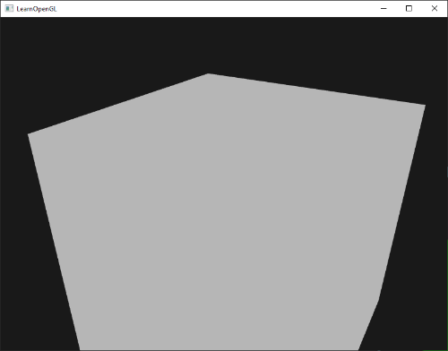

# Anti Aliasing (Anti-crénelage)
Au cours de votre aventure dans le domaine du rendu, vous avez probablement rencontré des motifs dentelés semblables à des scies sur les bords de vos modèles. La raison pour laquelle ces bords dentelés apparaissent est due à la façon dont le rasterizer transforme les données de vertex en fragments réels. Un exemple de ce à quoi ressemblent ces bords crénelés peut déjà être vu en dessinant un simple cube :

Bien que cela ne soit pas immédiatement visible, si vous regardez de plus près les bords du cube, vous verrez un motif crénelé. Si vous faites un zoom avant, vous verrez ce qui suit :

Ce n'est évidemment pas quelque chose que nous voulons dans la version finale d'une application. **Cet effet, qui consiste à voir clairement les formations de pixels dont un bord est composé, s'appelle l'aliasing**. Il existe un certain nombre de techniques appelées techniques d'anti aliasing qui changent ce comportement en produisant des bords plus lisses.

Au début, nous avions une technique appelée **super sample anti-aliasing (SSAA)** qui utilisait temporairement un tampon de rendu de résolution beaucoup plus élevée pour effectuer le rendu de la scène (super sampling). Ensuite, lorsque la scène complète est rendue, la résolution est ramenée à la résolution normale. Cette résolution supplémentaire a été utilisée pour éviter les bords irréguliers. **Bien qu'elle nous ait apporté une solution au problème de l'aliasing, elle s'accompagne d'un inconvénient majeur en termes de performances, puisque nous devons dessiner beaucoup plus de fragments qu'à l'accoutumée. Cette technique n'a donc connu qu'un bref moment de gloire.**

**Cette technique a donné naissance à une technique plus moderne appelée multisample anti-aliasing ou MSAA qui emprunte les concepts derrière le SSAA tout en mettant en œuvre une approche beaucoup plus efficace.** Dans ce chapitre, nous allons discuter en détail de cette technique MSAA qui est intégrée dans OpenGL.

# Multisampling
**Pour comprendre ce qu'est le multi-échantillonnage et comment il permet de résoudre le problème de l'aliasing, nous devons d'abord nous plonger un peu plus dans le fonctionnement interne du rasterizer d'OpenGL.**

Le rasterizer est la combinaison de tous les algorithmes et processus qui se situent entre les sommets traités et le fragment shader. **Le rasterizer prend tous les sommets appartenant à une primitive unique et les transforme en un ensemble de fragments**. **Les coordonnées des sommets peuvent théoriquement avoir n'importe quelle coordonnée, mais les fragments ne le peuvent pas puisqu'ils sont limités par la résolution de votre écran**. Il n'y aura presque jamais de correspondance un à un entre les coordonnées des sommets et les fragments, de sorte que **le rasterizer doit déterminer d'une manière ou d'une autre à quel fragment/coordonnée d'écran chaque sommet spécifique aboutira.**

Nous voyons ici une grille de pixels d'écran où le centre de chaque pixel contient un point d'échantillonnage qui est utilisé pour déterminer si un pixel est couvert par le triangle. Les points d'échantillonnage rouges sont couverts par le triangle et un fragment sera généré pour ce pixel couvert. Même si certaines parties des bords du triangle pénètrent encore dans certains pixels de l'écran, le point d'échantillonnage du pixel n'est pas couvert par l'intérieur du triangle et ce pixel ne sera donc pas influencé par un fragment shader.

Vous pouvez probablement déjà comprendre l'origine de l'aliasing. La version rendue complète du triangle ressemblerait à ceci sur votre écran :

En raison du nombre limité de pixels de l'écran, certains pixels seront rendus le long d'un bord et d'autres non. Le résultat est que nous rendons les primitives avec des bords non lisses, ce qui donne lieu aux bords crénelés que nous avons vus précédemment.

**Le multi-échantillonnage n'utilise pas un seul point d'échantillonnage pour déterminer la couverture du triangle, mais plusieurs points d'échantillonnage (devinez d'où vient son nom). Au lieu d'un seul point d'échantillonnage au centre de chaque pixel, nous allons placer 4 sous-échantillons dans un schéma général et les utiliser pour déterminer la couverture des pixels.**


La partie gauche de l'image montre comment nous déterminerions normalement la couverture d'un triangle. Ce pixel spécifique n'exécutera pas de shader de fragment (et restera donc vide) puisque son point d'échantillonnage n'était pas couvert par le triangle. **La partie droite de l'image montre une version multi-échantillonnée où chaque pixel contient 4 points d'échantillonnage. Ici, nous pouvons voir que seuls 2 des points d'échantillonnage couvrent le triangle.**

Le nombre de points d'échantillonnage peut être quelconque, un plus grand nombre d'échantillons permettant d'obtenir une meilleure précision de couverture.

C'est ici que le multi-échantillonnage devient intéressant. **Nous avons déterminé que deux sous-échantillons étaient couverts par le triangle. L'étape suivante consiste donc à déterminer une couleur pour ce pixel spécifique**. Notre première idée serait d'exécuter le fragment shader pour chaque sous-échantillon couvert et de faire ensuite la moyenne des couleurs de chaque sous-échantillon par pixel. Dans ce cas, nous exécuterions le fragment shader deux fois sur les données interpolées des sommets de chaque sous-échantillon et nous stockerions la couleur résultante dans ces points d'échantillonnage. Ce n'est (heureusement) pas ainsi que cela fonctionne, car cela signifierait que nous devrions exécuter beaucoup plus de fragment shaders que sans le multi-échantillonnage, ce qui réduirait drastiquement les performances.

Le fonctionnement réel de MSAA est le suivant : **le shader de fragment n'est exécuté qu'une seule fois par pixel (pour chaque primitive), quel que soit le nombre de sous-échantillons couverts par le triangle ; le shader de fragment s'exécute avec les données du sommet interpolées au centre du pixel. MSAA utilise ensuite un tampon de profondeur/stencil plus important pour déterminer la couverture des sous-échantillons. Le nombre de sous-échantillons couverts détermine la contribution de la couleur du pixel au framebuffer. Étant donné que seuls 2 des 4 échantillons ont été couverts dans l'image précédente, la moitié de la couleur du triangle est mélangée à la couleur du framebuffer (dans ce cas, la couleur claire), ce qui donne une couleur bleu clair.**

Le résultat est un tampon de plus haute résolution (avec une profondeur/un stencil de plus haute résolution) où tous les bords primitifs produisent maintenant un motif plus lisse. Voyons à quoi ressemble le multi-échantillonnage lorsque nous déterminons la couverture du triangle précédent :


Ici, chaque pixel contient 4 sous-échantillons (les échantillons non pertinents ont été cachés) où les sous-échantillons bleus sont couverts par le triangle et les points d'échantillonnage gris ne le sont pas. Dans la région intérieure du triangle, tous les pixels exécuteront une fois le fragment shader dont la couleur de sortie est stockée directement dans le framebuffer (en supposant qu'il n'y ait pas de mélange). Cependant, sur les bords intérieurs du triangle, tous les sous-échantillons ne seront pas couverts, de sorte que le résultat du fragment shader ne contribuera pas entièrement au framebuffer. En fonction du nombre d'échantillons couverts, une plus ou moins grande partie de la couleur du fragment de triangle aboutit à ce pixel.

**Pour chaque pixel, moins il y a de sous-échantillons dans le triangle, moins il prend la couleur du triangle**. Si nous remplissons les couleurs des pixels, nous obtenons l'image suivante :

**Les bords du triangle sont maintenant entourés de couleurs légèrement plus claires que la couleur réelle du bord, ce qui donne un aspect lisse au bord lorsqu'on le regarde de loin**.

Les valeurs de profondeur et de stencil sont stockées par sous-échantillon et, même si nous n'exécutons le shader de fragment qu'une seule fois, les valeurs de couleur sont également stockées par sous-échantillon dans le cas où plusieurs triangles se chevauchent sur un seul pixel. Pour les tests de profondeur, la valeur de profondeur du sommet est interpolée à chaque sous-échantillon avant d'exécuter le test de profondeur, et pour les tests de stencil, nous stockons les valeurs de stencil par sous-échantillon. **Cela signifie que la taille des tampons est maintenant augmentée par le nombre de sous-échantillons par pixel.**

Ce que nous avons vu jusqu'à présent est une vue d'ensemble de la manière dont l'anticrénelage multi-échantillonné fonctionne en coulisses. La logique réelle derrière le rasterizer est un peu plus compliquée, mais cette brève description devrait être suffisante pour comprendre le concept et la logique derrière l'anticrénelage multi-échantillonné ; suffisamment pour se plonger dans les aspects pratiques.

## MSAA dans OpenGL
Si nous voulons utiliser le MSAA dans OpenGL, nous devons utiliser un tampon capable de stocker plus d'une valeur d'échantillon par pixel. **Nous avons besoin d'un nouveau type de tampon capable de stocker une quantité donnée de multi-échantillons, appelé tampon multi-échantillons (multisample buffer).**

La plupart des systèmes de fenêtrage sont capables de nous fournir un tampon multi-échantillon au lieu d'un tampon par défaut. GLFW nous offre également cette fonctionnalité et tout ce que nous avons à faire est d'indiquer à GLFW que nous aimerions utiliser un tampon multi-échantillons avec N échantillons au lieu d'un tampon normal en appelant `glfwWindowHint` avant de créer la fenêtre :
```cpp
glfwWindowHint(GLFW_SAMPLES, 4);
```
Lorsque nous appelons maintenant `glfwCreateWindow`, nous créons une fenêtre de rendu, mais cette fois avec une mémoire tampon contenant 4 sous-échantillons par coordonnée d'écran. Cela signifie que la taille du tampon est augmentée de 4.

Maintenant que nous avons demandé à GLFW des tampons multi-échantillonnés, nous devons activer le multi-échantillonnage en appelant `glEnable` avec `GL_MULTISAMPLE`. Sur la plupart des pilotes OpenGL, le multi-échantillonnage est activé par défaut, donc cet appel est un peu redondant, mais c'est généralement une bonne idée de l'activer de toute façon. De cette façon, toutes les implémentations d'OpenGL ont le multi-échantillonnage activé.
```cpp
glEnable(GL_MULTISAMPLE);  
```
Comme les algorithmes de multi-échantillonnage sont implémentés dans le rasterizer de vos pilotes OpenGL, il n'y a pas grand-chose d'autre à faire. Si nous effectuons maintenant le rendu du cube vert du début de ce chapitre, nous devrions voir des bords plus lisses :
Le cube a effectivement l'air beaucoup plus lisse et il en va de même pour tout autre objet que vous dessinez dans votre scène.
Vous trouverez le code source de cet exemple simple [ici](https://learnopengl.com/code_viewer_gh.php?code=src/4.advanced_opengl/11.1.anti_aliasing_msaa/anti_aliasing_msaa.cpp).
## ## MSAA hors-écran
Comme GLFW se charge de créer les tampons multi-échantillonnés, il est assez facile d'activer le MSAA. **Cependant, si nous voulons utiliser nos propres framebuffers, nous devons générer nous-mêmes les tampons multi-échantillonnés ; nous devons donc nous occuper de la création des tampons multi-échantillonnés.**

**Il y a deux façons de créer des tampons multi-échantillonnés pour servir d'attachement aux framebuffers : les attachements de texture et les attachements de renderbuffer. Ces deux types d'attachements sont assez similaires aux attachements normaux dont nous avons parlé dans le chapitre sur les framebuffers.**
### Attachement de textures multi-échantillonnées
Pour créer une texture prenant en charge le stockage de plusieurs points d'échantillonnage, nous utilisons `glTexImage2DMultisample` au lieu de `glTexImage2D` qui accepte `GL_TEXTURE_2D_MULTISAMPLE` comme cible de texture :
```cpp
glBindTexture(GL_TEXTURE_2D_MULTISAMPLE, tex);
glTexImage2DMultisample(GL_TEXTURE_2D_MULTISAMPLE, samples, GL_RGB, width, height, GL_TRUE);
glBindTexture(GL_TEXTURE_2D_MULTISAMPLE, 0);  
```
Le deuxième argument définit le nombre d'échantillons que nous souhaitons pour la texture. Si le dernier argument vaut `GL_TRUE`, l'image utilisera des emplacements d'échantillons identiques et le même nombre de sous-échantillons pour chaque texel.

Pour attacher une texture multi-échantillonnée à un framebuffer, nous utilisons `glFramebufferTexture2D`, mais cette fois avec `GL_TEXTURE_2D_MULTISAMPLE` comme type de texture :
```cpp
glFramebufferTexture2D(GL_FRAMEBUFFER, GL_COLOR_ATTACHMENT0, GL_TEXTURE_2D_MULTISAMPLE, tex, 0); 
```
Le framebuffer actuellement lié dispose maintenant d'un tampon de couleurs multi-échantillonnées sous la forme d'une image de texture.
### Objets de tampon de rendu multi-échantillonnés
Comme pour les textures, la création d'un objet renderbuffer multi-échantillonné n'est pas difficile. C'est même assez facile puisqu'il suffit de changer `glRenderbufferStorage` en `glRenderbufferStorageMultisample` lorsque nous configurons la mémoire de stockage du tampon de rendu (actuellement lié) :
```cpp
glRenderbufferStorageMultisample(GL_RENDERBUFFER, 4, GL_DEPTH24_STENCIL8, width, height);  
```
La seule chose qui a changé ici est le second paramètre supplémentaire où nous définissons le nombre d'échantillons que nous souhaitons utiliser ; 4 dans ce cas particulier.

### Rendu dans un framebuffer multi-échantillonné
Le rendu dans un framebuffer multi-échantillonné est simple. Chaque fois que nous dessinons quelque chose alors que l'objet framebuffer est lié, le rasterizer se charge de toutes les opérations de multi-échantillonnage. Cependant, parce qu'un tampon multi-échantillonné est un peu spécial, nous ne pouvons pas utiliser directement le tampon pour d'autres opérations comme l'échantillonnage dans un shader.

**Une image multi-échantillonnée contient beaucoup plus d'informations qu'une image normale, c'est pourquoi nous devons réduire l'échelle ou résoudre l'image**. La résolution d'un framebuffer multi-échantillonné se fait généralement via `glBlitFramebuffer` qui copie une région d'un framebuffer à l'autre tout en résolvant les buffers multi-échantillonnés.

`glBlitFramebuffer` transfère une région source donnée, définie par 4 coordonnées d'espace-écran, vers une région cible donnée, également définie par 4 coordonnées d'espace-écran. Vous vous souvenez peut-être du chapitre sur les framebuffers que si nous nous lions à `GL_FRAMEBUFFER`, nous nous lions à la fois à la cible de lecture et à la cible de dessin du framebuffer. Nous pourrions également lier ces cibles individuellement en liant les framebuffers à `GL_READ_FRAMEBUFFER` et `GL_DRAW_FRAMEBUFFER` respectivement. La fonction `glBlitFramebuffer` lit ces deux cibles pour déterminer quel est le framebuffer source et quel est le framebuffer cible. Nous pouvons alors transférer la sortie du framebuffer multi-échantillonné vers l'écran réel en `blitant` (blitting?) l'image dans le framebuffer par défaut comme suit :
```cpp
glBindFramebuffer(GL_READ_FRAMEBUFFER, multisampledFBO);
glBindFramebuffer(GL_DRAW_FRAMEBUFFER, 0);
glBlitFramebuffer(0, 0, width, height, 0, 0, width, height, GL_COLOR_BUFFER_BIT, GL_NEAREST);
```
Si nous effectuons ensuite le rendu de la même application, nous devrions obtenir le même résultat : un cube vert tilleul affiché avec MSAA et présentant à nouveau des arêtes nettement moins irrégulières :

Vous pouvez trouver le code source [ici](https://learnopengl.com/code_viewer_gh.php?code=src/4.advanced_opengl/11.2.anti_aliasing_offscreen/anti_aliasing_offscreen.cpp).

Mais que se passe-t-il si nous voulons utiliser le résultat de la texture d'un framebuffer multi-échantillonné pour faire des choses comme du post-traitement ? Nous ne pouvons pas utiliser directement la (les) texture(s) multi-échantillonnée(s) dans le fragment shader. Ce que nous pouvons faire cependant, c'est blitter le(s) tampon(s) multi-échantillonné(s) vers un FBO différent avec un attachement de texture non multi-échantillonné. Nous utilisons ensuite cette texture de couleur ordinaire pour le post-traitement, ce qui revient à post-traiter une image rendue via le multi-échantillonnage. Cela signifie que nous devons générer un nouveau FBO qui agit uniquement comme un objet framebuffer intermédiaire pour résoudre le tampon multi-échantillonné en une texture 2D normale que nous pouvons utiliser dans le fragment shader. Ce processus ressemble un peu à ceci en pseudocode :
```cpp
unsigned int msFBO = CreateFBOWithMultiSampledAttachments();
// then create another FBO with a normal texture color attachment
[...]
glFramebufferTexture2D(GL_FRAMEBUFFER, GL_COLOR_ATTACHMENT0, GL_TEXTURE_2D, screenTexture, 0);
[...]
while(!glfwWindowShouldClose(window))
{
    [...]
    
    glBindFramebuffer(msFBO);
    ClearFrameBuffer();
    DrawScene();
    // now resolve multisampled buffer(s) into intermediate FBO
    glBindFramebuffer(GL_READ_FRAMEBUFFER, msFBO);
    glBindFramebuffer(GL_DRAW_FRAMEBUFFER, intermediateFBO);
    glBlitFramebuffer(0, 0, width, height, 0, 0, width, height, GL_COLOR_BUFFER_BIT, GL_NEAREST);
    // now scene is stored as 2D texture image, so use that image for post-processing
    glBindFramebuffer(GL_FRAMEBUFFER, 0);
    ClearFramebuffer();
    glBindTexture(GL_TEXTURE_2D, screenTexture);
    DrawPostProcessingQuad();  
  
    [...] 
```
Si nous implémentons ceci dans le code de post-traitement du chapitre sur les framebuffers, nous pouvons créer toutes sortes d'effets de post-traitement sympas sur une texture d'une scène qui n'a (presque) pas de bords irréguliers. Avec un filtre de post-traitement en niveaux de gris appliqué, cela ressemblera à quelque chose comme ceci :

>La texture de l'écran étant à nouveau une texture normale (non multi-échantillonnée), certains filtres de post-traitement tels que la détection des bords introduiront à nouveau des bords irréguliers. Pour y remédier, vous pouvez flouter la texture par la suite ou créer votre propre algorithme d'anticrénelage.

Vous pouvez voir que lorsque nous voulons combiner le multi-échantillonnage avec le rendu hors écran, nous devons suivre quelques étapes supplémentaires. Ces étapes en valent cependant la peine puisque le multi-échantillonnage améliore considérablement la qualité visuelle de votre scène. Notez que l'activation du multi-échantillonnage peut sensiblement réduire les performances au fur et à mesure que vous utilisez plus d'échantillons.
## Algorithme d'anti-crénelage personnalisé
Il est possible de transmettre directement une image de texture multi-échantillonnée à un shader de fragment au lieu de la résoudre d'abord. GLSL nous donne la possibilité d'échantillonner l'image de texture par sous-échantillon afin de créer nos propres algorithmes d'anticrénelage.

Pour obtenir une valeur de texture par sous-échantillon, vous devez définir l'échantillonneur uniforme de texture comme un `sampler2DMS` au lieu du `sampler2D` habituel :
```cpp
uniform sampler2DMS screenTextureMS;    
```
En utilisant la fonction `texelFetch`, il est alors possible de récupérer la valeur de la couleur par échantillon :
```cpp
vec4 colorSample = texelFetch(screenTextureMS, TexCoords, 3);  // 4th subsample
```
Nous n'entrerons pas ici dans les détails de la création de techniques d'anticrénelage personnalisées, mais cela peut suffire pour commencer à en créer une soi-même.
