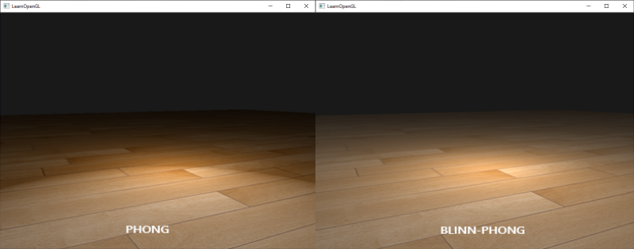
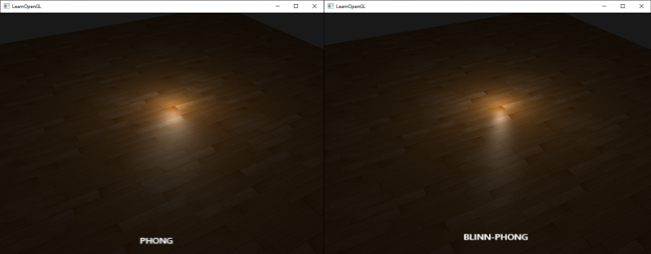

# Eclairage avancé
Dans les chapitres consacrés à l'éclairage, nous avons brièvement présenté le modèle d'éclairage Phong afin d'apporter un minimum de réalisme à nos scènes. Le modèle Phong est agréable à regarder, mais il présente quelques nuances sur lesquelles nous allons nous concentrer dans ce chapitre.
# Blinn-Phong
L'éclairage Phong est une excellente approximation très efficace de l'éclairage, mais ses réflexions spéculaires se dégradent dans certaines conditions, en particulier lorsque la propriété de brillance est faible, ce qui entraîne une grande zone spéculaire (rugueuse). L'image ci-dessous montre ce qui se passe lorsque nous utilisons un exposant de brillance spéculaire de 1,0 sur un plan texturé plat :

Vous pouvez voir sur les bords que la zone spéculaire est immédiatement coupée. La raison en est que l'angle entre le vecteur de vue et le vecteur de réflexion ne dépasse pas 90 degrés. Si l'angle est plus grand que 90 degrés, le produit pointé résultant devient négatif, ce qui se traduit par un exposant spéculaire de 0,0. Vous pensez probablement que cela ne pose pas de problème puisque nous ne devrions pas obtenir de lumière avec des angles supérieurs à 90 degrés, n'est-ce pas ?

C'est faux, cela ne s'applique qu'à la composante diffuse : un angle supérieur à 90 degrés entre la normale et la source lumineuse signifie que la source lumineuse se trouve sous la surface éclairée et que la contribution diffuse de la lumière doit donc être égale à 0,0. Cependant, avec l'éclairage spéculaire, nous ne mesurons pas l'angle entre la source lumineuse et la normale, mais entre le vecteur de vue et le vecteur de réflexion. Regardez les deux images suivantes :

Ici le problème devrait apparaître. L'image de gauche montre les réflexions de Phong telles qu'elles sont connues, avec un angle θ inférieur à 90 degrés. Dans l'image de droite, nous pouvons voir que l'angle θ entre la vue et le vecteur de réflexion est supérieur à 90 degrés, ce qui annule la contribution spéculaire. Ce n'est généralement pas un problème puisque la direction de la vue est éloignée de la direction de la réflexion, mais si nous utilisons un exposant spéculaire faible, le rayon spéculaire est suffisamment grand pour avoir une contribution dans ces conditions. Comme nous annulons cette contribution à des angles supérieurs à 90 degrés, nous obtenons l'artefact de la première image.

En 1977, le modèle d'ombrage Blinn-Phong a été introduit par James F. Blinn comme une extension de l'ombrage Phong que nous avons utilisé jusqu'à présent. Le modèle Blinn-Phong est largement similaire, mais aborde le modèle spéculaire de manière légèrement différente, ce qui permet de résoudre notre problème. Au lieu de s'appuyer sur un vecteur de réflexion, nous utilisons ce que l'on appelle un vecteur à mi-chemin, c'est-à-dire un vecteur unitaire situé exactement à mi-chemin entre la direction de la vue et la direction de la lumière. Plus ce vecteur intermédiaire est proche du vecteur normal de la surface, plus la contribution spéculaire est élevée.


Lorsque la direction de la vue est parfaitement alignée avec le vecteur de réflexion (maintenant imaginaire), le vecteur médian s'aligne parfaitement avec le vecteur normal. Plus la direction de la vue est proche de la direction de réflexion originale, plus l'accentuation spéculaire est forte.

Ici, vous pouvez constater que, quelle que soit la direction d'observation, l'angle entre le vecteur médian et la normale de la surface ne dépasse jamais 90 degrés (à moins que la lumière ne se trouve très en dessous de la surface, bien entendu). Les résultats sont légèrement différents des réflexions de Phong, mais ils sont généralement plus plausibles sur le plan visuel, en particulier lorsque l'exposant spéculaire est faible. Le modèle d'ombrage de Blinn-Phong est également le modèle d'ombrage exact utilisé dans l'ancien pipeline de fonctions fixes d'OpenGL.

Il est facile d'obtenir le vecteur de mi-chemin, nous ajoutons le vecteur de direction de la lumière et le vecteur de vue ensemble et nous normalisons le résultat :
$$
\vec{H} = { {\vec{L} + \vec{V}}\over{||\vec{L} + \vec{V}||} }
$$
Cela se traduit par le code GLSL suivant :
```cpp
vec3 lightDir   = normalize(lightPos - FragPos);
vec3 viewDir    = normalize(viewPos - FragPos);
vec3 halfwayDir = normalize(lightDir + viewDir);
```
Ensuite, le calcul du terme spéculaire devient un produit scalaire entre la normale de la surface et le vecteur de mi-chemin pour obtenir l'angle cosinus entre les deux que nous élevons à nouveau à un exposant de brillance spéculaire :
```cpp
float spec = pow(max(dot(normal, halfwayDir), 0.0), shininess);
vec3 specular = lightColor * spec;
```
Et il n'y a rien de plus à Blinn-Phong que ce que nous venons de décrire. La seule différence entre Blinn-Phong et la réflexion spéculaire Phong est que nous mesurons maintenant l'angle entre le vecteur normal et le vecteur médian au lieu de l'angle entre le vecteur de vue et le vecteur de réflexion.

Avec l'introduction du vecteur à mi-chemin, nous ne devrions plus avoir le problème de la coupure spéculaire de l'ombrage Phong. L'image ci-dessous montre la zone spéculaire des deux méthodes avec un exposant spéculaire de 0,5 :

Une autre différence subtile entre l'ombrage Phong et l'ombrage Blinn-Phong est que l'angle entre le vecteur à mi-chemin et la normale de la surface est souvent plus court que l'angle entre le vecteur de vue et le vecteur de réflexion. Par conséquent, pour obtenir des visuels similaires à l'ombrage de Phong, l'exposant de brillance spéculaire doit être réglé un peu plus haut. En règle générale, il faut le régler entre 2 et 4 fois l'exposant de brillance de Phong.

Voici une comparaison entre les deux modèles de réflexion spéculaire avec l'exposant de Phong fixé à 8,0 et la composante de Blinn-Phong fixée à 32,0 :

Vous pouvez voir que l'exposant spéculaire de Blinn-Phong est un peu plus net que celui de Phong. Il faut généralement un peu de doigté pour obtenir des résultats similaires à ceux que l'on obtenait avec l'ombrage Phong. Mais cela en vaut la peine car l'ombrage Blinn-Phong est généralement plus réaliste que l'ombrage Phong par défaut.

Ici, nous avons utilisé un simple fragment shader qui alterne entre les réflexions Phong classiques et les réflexions Blinn-Phong :
```cpp
void main()
{
    [...]
    float spec = 0.0;
    if(blinn)
    {
        vec3 halfwayDir = normalize(lightDir + viewDir);  
        spec = pow(max(dot(normal, halfwayDir), 0.0), 16.0);
    }
    else
    {
        vec3 reflectDir = reflect(-lightDir, normal);
        spec = pow(max(dot(viewDir, reflectDir), 0.0), 8.0);
    }
```
Vous pouvez trouver le code source de la démo simple [ici](https://learnopengl.com/code_viewer_gh.php?code=src/5.advanced_lighting/1.advanced_lighting/advanced_lighting.cpp). En appuyant sur la touche **b**, la démo passe de l'éclairage Phong à l'éclairage Blinn-Phong et vice versa.
