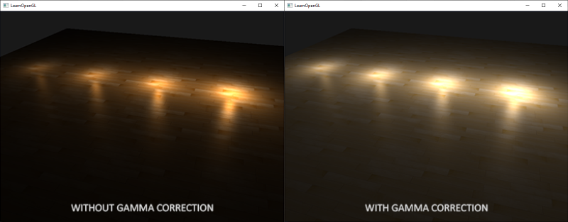

# Gamma Correction
Dès que nous avons calculé les couleurs des pixels de la scène, nous devons les afficher sur un moniteur. À l'époque de l'imagerie numérique, la plupart des moniteurs étaient des tubes cathodiques (CRT). Ces moniteurs avaient la propriété physique que le double de la tension d'entrée n'entraînait pas le double de la luminosité. Le doublement de la tension d'entrée se traduisait par une luminosité égale à une relation exponentielle d'environ 2,2, connue sous le nom de gamma d'un moniteur. Il se trouve que (par coïncidence) cela correspond étroitement à la façon dont les êtres humains mesurent la luminosité, car la luminosité est également affichée avec une relation de puissance similaire (inverse). Pour mieux comprendre ce que cela signifie, regardez l'image suivante :

La ligne supérieure ressemble à l'échelle de luminosité correcte pour l'œil humain. Si l'on double la luminosité (de 0,1 à 0,2 par exemple), on a effectivement l'impression que la lumière est deux fois plus brillante, avec de belles différences régulières. Cependant, lorsque nous parlons de la luminosité physique de la lumière, c'est-à-dire de la quantité de photons quittant une source lumineuse, l'échelle inférieure affiche en fait la luminosité correcte. Sur l'échelle inférieure, le doublement de la luminosité donne la luminosité physique correcte, mais comme nos yeux perçoivent la luminosité différemment (ils sont plus sensibles aux changements dans les couleurs sombres), l'aspect est bizarre.

Étant donné que les yeux humains préfèrent voir les couleurs de luminosité selon l'échelle supérieure, les moniteurs (encore aujourd'hui) utilisent une relation de puissance pour afficher les couleurs de sortie, de sorte que les couleurs de luminosité physiques d'origine sont mises en correspondance avec les couleurs de luminosité non linéaires de l'échelle supérieure.

Ce mappage non linéaire des moniteurs produit des résultats de luminosité plus agréables pour nos yeux, mais lorsqu'il s'agit de rendre des graphiques, il y a un problème : toutes les options de couleur et de luminosité que nous configurons dans nos applications sont basées sur ce que nous percevons à partir du moniteur et donc toutes les options sont en fait des options de luminosité/couleur non linéaires. Jetez un coup d'œil au graphique ci-dessous :

La ligne pointillée représente les valeurs de couleur/lumière dans l'espace linéaire et la ligne continue représente l'espace de couleur que les moniteurs affichent. Si l'on double une couleur dans l'espace linéaire, le résultat est effectivement le double de la valeur. Par exemple, prenons le vecteur de couleur d'une lumière (0,5, 0,0, 0,0) qui représente une lumière rouge semi-obscure. Si nous doublons cette lumière dans l'espace linéaire, elle deviendra (1,0, 0,0, 0,0) comme vous pouvez le voir sur le graphique. Cependant, la couleur d'origine est affichée à l'écran sous la forme (0,218, 0,0, 0,0), comme vous pouvez le voir sur le graphique. C'est ici que les problèmes commencent à se poser : une fois que nous avons doublé la lumière rouge sombre dans l'espace linéaire, elle devient en fait plus de 4,5 fois plus lumineuse sur l'écran !

Jusqu'à ce chapitre, nous avons supposé que nous travaillions dans l'espace linéaire, mais nous avons en fait travaillé dans l'espace de sortie du moniteur, de sorte que toutes les couleurs et variables d'éclairage que nous avons configurées n'étaient pas physiquement correctes, mais semblaient simplement (en quelque sorte) correctes sur notre moniteur. C'est pourquoi nous (et les artistes) définissons généralement des valeurs d'éclairage beaucoup plus lumineuses qu'elles ne devraient l'être (puisque le moniteur les assombrit), ce qui rend la plupart des calculs de l'espace linéaire incorrects. Notez que le moniteur (CRT) et le graphique linéaire commencent et finissent tous deux à la même position ; ce sont les valeurs intermédiaires qui sont assombries par l'écran.

Comme les couleurs sont configurées en fonction de la sortie de l'écran, tous les calculs intermédiaires (d'éclairage) dans l'espace linéaire sont physiquement incorrects. Cela devient de plus en plus évident à mesure que des algorithmes d'éclairage plus avancés sont mis au point. 


Vous pouvez voir qu'avec la correction gamma, les valeurs de couleur (mises à jour) s'accordent mieux et les zones plus sombres sont plus détaillées. Dans l'ensemble, la qualité de l'image s'est améliorée grâce à quelques petites modifications.

Si le gamma de ce moniteur n'est pas correctement corrigé, l'éclairage semblera incorrect et les artistes auront du mal à obtenir des résultats réalistes et attrayants. La solution consiste à appliquer une correction gamma.
## Correction gamma
**L'idée de la correction gamma est d'appliquer l'inverse du gamma de l'écran à la couleur de sortie finale avant de l'afficher à l'écran.** En regardant le graphique de la courbe gamma plus tôt dans ce chapitre, nous voyons une autre ligne en pointillés qui est l'inverse de la courbe gamma du moniteur. Nous multiplions chacune des couleurs de sortie linéaires par cette courbe gamma inverse (ce qui les rend plus lumineuses) et dès que les couleurs sont affichées sur le moniteur, la courbe gamma du moniteur est appliquée et les couleurs résultantes deviennent linéaires. Nous éclaircissons effectivement les couleurs intermédiaires de sorte que dès que l'écran les assombrit, tout s'équilibre.

Prenons un autre exemple. Supposons que nous ayons à nouveau la couleur rouge foncé $(0.5,0.0,0.0)$. Avant d'afficher cette couleur à l'écran, nous appliquons d'abord la courbe de correction gamma à la valeur de la couleur. Les couleurs linéaires affichées par un moniteur sont grossièrement mises à l'échelle à une puissance de $2.2$, de sorte que l'inverse nécessite une mise à l'échelle des couleurs à une puissance de $1/2.2$. La couleur rouge foncé corrigée par le gamma devient donc 
$$
(0.5,0.0,0.0)^{1/2.2}=
(0.5,0.0,0.0)^{0.45}=
(0.73,0.0,0.0)
$$Les couleurs corrigées sont ensuite transmises au moniteur et la couleur est affichée comme suit :
$$
(0,73,0.0,0.0)^{2.2}=(0.5,0.0,0.0)
$$

Vous pouvez constater qu'en utilisant la correction gamma, le moniteur affiche finalement les couleurs telles que nous les avons définies de manière linéaire dans l'application.
>Une valeur de gamma de 2.2 est une valeur de gamma par défaut qui estime grossièrement le gamma moyen de la plupart des écrans. L'espace colorimétrique résultant de ce gamma de 2.2 est appelé espace colorimétrique sRGB (il n'est pas exact à 100 %, mais il s'en rapproche). Chaque moniteur a ses propres courbes de gamma, mais une valeur de gamma de 2.2 donne de bons résultats sur la plupart des moniteurs. C'est pourquoi les jeux permettent souvent aux joueurs de modifier le paramètre gamma du jeu, qui varie légèrement d'un moniteur à l'autre.

Il y a deux façons d'appliquer la correction gamma à votre scène :

- En utilisant le framebuffer sRGB intégré à OpenGL.
- En effectuant la correction gamma nous-mêmes dans le(s) shader(s) de fragment.

La première option est probablement la plus simple, mais elle vous donne également moins de contrôle. En activant `GL_FRAMEBUFFER_SRGB`, vous indiquez à OpenGL que chaque commande de dessin suivante doit d'abord corriger les couleurs en fonction du gamma (à partir de l'espace colorimétrique sRGB) avant de les stocker dans le(s) tampon(s) de couleurs. Le sRGB est un espace de couleur qui correspond approximativement à un gamma de $2.2$ et un standard pour la plupart des appareils. Après avoir activé `GL_FRAMEBUFFER_SRGB`, OpenGL effectue automatiquement une correction gamma après chaque fragment shader pour tous les framebuffers suivants, y compris le framebuffer par défaut.

L'activation de `GL_FRAMEBUFFER_SRGB` est aussi simple que d'appeler `glEnable` :
```cpp
glEnable(GL_FRAMEBUFFER_SRGB); 
```
À partir de maintenant, vos images rendues seront corrigées en fonction du gamma et, comme cette opération est effectuée par le matériel, elle est totalement gratuite. Il convient de garder à l'esprit que cette approche (et l'autre approche) transforme (également) les couleurs de l'espace linéaire à l'espace non linéaire ; il est donc très important de n'effectuer la correction gamma qu'à la dernière étape. Si vous corrigez vos couleurs avant la sortie finale, toutes les opérations ultérieures sur ces couleurs utiliseront des valeurs incorrectes. Par exemple, si vous utilisez plusieurs framebuffers, vous voudrez probablement que les résultats intermédiaires transmis entre les framebuffers restent dans l'espace linéaire et que le dernier framebuffer applique la correction gamma avant d'être envoyé au moniteur.

La seconde approche nécessite un peu plus de travail, mais elle nous donne un contrôle total sur les opérations gamma. Nous appliquons la correction gamma à la fin de chaque exécution du shader de fragments afin que les couleurs finales soient corrigées avant d'être envoyées à l'écran :
```cpp
void main()
{
    // do super fancy lighting in linear space
    [...]
    // apply gamma correction
    float gamma = 2.2;
    FragColor.rgb = pow(fragColor.rgb, vec3(1.0/gamma));
}
```
La dernière ligne de code augmente effectivement chaque composante de couleur individuelle de `fragColor` à $1.0/gamma$, corrigeant ainsi la couleur de sortie de cette exécution du shader de fragment.

Le problème de cette approche est que pour être cohérent, vous devez appliquer la correction gamma à chaque shader de fragment qui contribue à la sortie finale. Si vous avez une douzaine de shaders de fragment pour plusieurs objets, vous devez ajouter le code de correction gamma à chacun de ces shaders. Une solution plus simple serait d'introduire une étape de post-traitement dans votre boucle de rendu et d'appliquer la correction gamma sur le quadrant post-traité en tant qu'étape finale que vous n'auriez à faire qu'une seule fois.

Cette ligne représente la mise en œuvre technique de la correction gamma. Ce n'est pas très impressionnant, mais il y a quelques éléments supplémentaires à prendre en compte lors de la correction gamma.

## Textures sRGB
Étant donné que les écrans affichent les couleurs en appliquant le gamma, chaque fois que vous dessinez, éditez ou coloriez une image sur votre ordinateur, vous choisissez les couleurs en fonction de ce que vous voyez sur l'écran. Cela signifie que toutes les images que vous créez ou modifiez ne sont pas dans l'espace linéaire, mais dans l'espace sRGB. Par exemple, doubler une couleur rouge foncé sur votre écran en se basant sur la luminosité perçue n'équivaut pas à doubler la composante rouge.

Par conséquent, lorsque les artistes des textures créent des œuvres d'art à l'œil, toutes les valeurs des textures sont dans l'espace sRGB ; si nous utilisons ces textures telles quelles dans notre application de rendu, nous devons en tenir compte. Avant que nous ne connaissions la correction gamma, ce n'était pas vraiment un problème, car les textures étaient belles dans l'espace sRGB, qui est le même espace que celui dans lequel nous travaillons ; les textures étaient affichées exactement comme elles sont, ce qui était très bien. Cependant, maintenant que nous affichons tout dans l'espace linéaire, les couleurs des textures seront faussées comme le montre l'image suivante :


L'image de la texture est beaucoup trop claire et cela est dû au fait qu'elle est en fait corrigée deux fois au niveau du gamma ! Lorsque nous créons une image sur la base de ce que nous voyons à l'écran, nous corrigeons effectivement les valeurs de couleur d'une image pour qu'elle s'affiche correctement à l'écran. Comme nous procédons ensuite à une nouvelle correction gamma dans le moteur de rendu, l'image finit par être beaucoup trop lumineuse.

Pour résoudre ce problème, nous devons nous assurer que les artistes de texture travaillent dans un espace linéaire. Cependant, comme il est plus facile de travailler dans l'espace sRGB et que la plupart des outils ne prennent même pas correctement en charge la texturation linéaire, ce n'est probablement pas la meilleure solution.

L'autre solution consiste à recorriger ou à transformer ces textures sRGB en espace linéaire avant d'effectuer des calculs sur leurs valeurs de couleur. Nous pouvons procéder de la manière suivante :
```cpp
float gamma = 2.2;
vec3 diffuseColor = pow(texture(diffuse, texCoords).rgb, vec3(gamma));
```

Faire cela pour chaque texture dans l'espace sRGB est assez difficile. Heureusement, OpenGL nous offre une autre solution à nos problèmes en nous donnant les formats de texture internes `GL_SRGB` et `GL_SRGB_ALPHA`.

Si nous créons une texture dans OpenGL avec l'un de ces deux formats de texture sRGB, OpenGL corrigera automatiquement les couleurs dans l'espace linéaire dès que nous les utiliserons, ce qui nous permettra de travailler correctement dans l'espace linéaire. Nous pouvons spécifier une texture en tant que texture sRGB comme suit :
```cpp
glTexImage2D(GL_TEXTURE_2D, 0, GL_SRGB, width, height, 0, GL_RGB, GL_UNSIGNED_BYTE, data);  
```
Si vous souhaitez également inclure des composants alpha dans votre texture, vous devrez spécifier le format interne de la texture en tant que `GL_SRGB_ALPHA`.

Vous devez être prudent lorsque vous spécifiez vos textures dans l'espace sRGB, car toutes les textures ne sont pas réellement dans l'espace sRGB. **Les textures utilisées pour colorer les objets (comme les textures diffuses) sont presque toujours dans l'espace sRGB. Les textures utilisées pour récupérer les paramètres d'éclairage (comme les cartes spéculaires et les cartes normales) sont presque toujours dans l'espace linéaire, de sorte que si vous les configurez comme des textures sRGB, l'éclairage sera étrange. Faites attention aux textures que vous spécifiez comme sRGB.**

Avec nos textures diffuses spécifiées en tant que textures sRGB, vous obtenez à nouveau le résultat visuel que vous attendez, mais cette fois-ci, tout le gamma est corrigé une seule fois.

## Attenuation
Une autre différence avec la correction gamma est l'atténuation de l'éclairage. Dans le monde physique réel, l'atténuation de l'éclairage est étroitement inversement proportionnelle au carré de la distance par rapport à la source lumineuse. En français, cela signifie simplement que l'intensité de la lumière est réduite en fonction du carré de la distance à la source lumineuse, comme ci-dessous :
```cpp
float attenuation = 1.0 / (distance * distance);
```
Cependant, lorsque l'on utilise cette équation, l'effet d'atténuation est généralement beaucoup trop fort, donnant aux lumières un petit rayon qui n'a pas l'air physiquement correct. C'est pourquoi d'autres fonctions d'atténuation ont été utilisées (comme nous l'avons vu dans le chapitre sur l'éclairage de base) qui permettent un meilleur contrôle, ou l'équivalent linéaire :
```cpp
float attenuation = 1.0 / distance;  
```
L'équivalent linéaire donne des résultats plus plausibles que sa variante quadratique sans correction gamma, mais lorsque nous activons la correction gamma, l'atténuation linéaire semble trop faible et l'atténuation quadratique physiquement correcte donne soudain de meilleurs résultats. L'image ci-dessous montre les différences :

La cause de cette différence est que les fonctions d'atténuation de la lumière modifient la luminosité, et comme nous ne visualisions pas notre scène dans un espace linéaire, nous avons choisi les fonctions d'atténuation qui semblaient les meilleures sur notre moniteur, mais qui n'étaient pas physiquement correctes. Pensez à la fonction d'atténuation au carré : si nous devions utiliser cette fonction sans correction gamma, la fonction d'atténuation devient en fait : $(1.0/distance^2)^{2.2}$ lorsqu'elle est affichée sur un moniteur. Cela crée une atténuation beaucoup plus importante que ce que nous avions prévu à l'origine. Cela explique également pourquoi l'équivalent linéaire est beaucoup plus logique sans correction gamma, car il devient en fait $(1.0/distance)^{2.2}=1.0/distance^{2.2}$, ce qui ressemble beaucoup plus à son équivalent physique.

>La fonction d'atténuation plus avancée dont nous avons parlé dans le chapitre sur l'éclairage de base a toujours sa place dans les scènes corrigées en fonction du gamma, car elle permet de mieux contrôler l'atténuation exacte (mais nécessite bien sûr des paramètres différents dans une scène corrigée en fonction du gamma).

Vous pouvez trouver le code source de cette scène de démonstration simple [ici](https://learnopengl.com/code_viewer_gh.php?code=src/5.advanced_lighting/2.gamma_correction/gamma_correction.cpp). En appuyant sur la barre d'espacement, nous passons d'une scène corrigée en fonction du gamma à une scène non corrigée, les deux scènes utilisant leurs équivalents en termes de texture et d'atténuation. Ce n'est pas la démo la plus impressionnante, mais elle montre comment appliquer toutes les techniques.

En résumé, la correction gamma nous permet d'effectuer tous nos calculs d'ombrage et d'éclairage dans l'espace linéaire. Comme l'espace linéaire a un sens dans le monde physique, la plupart des équations physiques donnent maintenant de bons résultats (comme l'atténuation réelle de la lumière). Plus votre éclairage est avancé, plus il est facile d'obtenir de bons résultats (et réalistes) avec la correction gamma. C'est également la raison pour laquelle il est conseillé de ne modifier réellement les paramètres d'éclairage que lorsque la correction gamma est en place.
