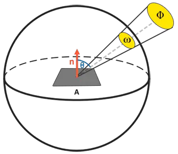

# Théorie
Le PBR, ou plus communément appelé rendu basé sur la physique (physically based renderer), est un ensemble de techniques de rendu plus ou moins basées sur la même théorie sous-jacente qui correspond plus étroitement à celle du monde physique.
Comme le rendu basé sur la physique vise à imiter la lumière d'une manière physiquement plausible, il semble généralement plus réaliste que nos algorithmes d'éclairage originaux tels que Phong et Blinn-Phong. Non seulement l'aspect est meilleur, mais comme il se rapproche de la physique réelle, nous (et surtout les artistes) pouvons créer des matériaux de surface basés sur des paramètres physiques sans avoir à recourir à des bidouillages et des ajustements bon marché pour que l'éclairage ait l'air correct.
L'un des principaux avantages de la création de matériaux basés sur des paramètres physiques est que ces matériaux sont corrects quelles que soient les conditions d'éclairage, ce qui n'est pas le cas dans les pipelines non-PBR.

Le rendu basé sur des paramètres physiques reste néanmoins une approximation de la réalité (basée sur les principes de la physique), c'est pourquoi on ne l'appelle pas shading physique, mais shading basé sur des paramètres physiques. Pour qu'un modèle d'éclairage PBR soit considéré comme basé sur la physique, il doit satisfaire aux trois conditions suivantes (ne vous inquiétez pas, nous y reviendrons bientôt) :

1. Se fonder sur le modèle de la surface de la microfacette.
2. Conserver l'énergie.
3. Utiliser une BRDF basée sur la physique.
Dans les prochains chapitres sur le PBR, nous nous concentrerons sur l'approche PBR telle qu'elle a été explorée à l'origine par Disney et adoptée pour l'affichage en temps réel par Epic Games. Leur approche, basée sur le flux de travail métallique, est bien documentée, largement adoptée sur la plupart des moteurs populaires, et est visuellement étonnante. À la fin de ces chapitres, nous aurons quelque chose qui ressemblera à ceci :

Gardez à l'esprit que les sujets abordés dans ces chapitres sont plutôt avancés et qu'il est donc conseillé d'avoir une bonne compréhension d'OpenGL et des shaders d'éclairage. Les connaissances les plus avancées dont vous aurez besoin pour cette série sont : les framebuffers, les cubemaps, la correction gamma, le HDR et le normal mapping. Nous nous plongerons également dans des mathématiques avancées, mais je ferai de mon mieux pour expliquer les concepts aussi clairement que possible.

# Le modèle de microfacettes
Toutes les techniques PBR sont basées sur la théorie des microfacettes. Selon cette théorie, toute surface à l'échelle microscopique peut être décrite par de minuscules petits miroirs parfaitement réfléchissants appelés microfacettes. En fonction de la rugosité de la surface, l'alignement de ces minuscules miroirs peut varier considérablement :

Plus une surface est rugueuse (rough), plus chaque microfacette est alignée de manière chaotique le long de la surface. L'effet de ces alignements de miroirs minuscules est que, lorsqu'on parle spécifiquement d'éclairage/réflexion spéculaire, les rayons lumineux entrants sont plus susceptibles de se disperser dans des directions complètement différentes sur les surfaces rugueuses, ce qui entraîne une réflexion spéculaire plus étendue. En revanche, sur une surface lisse, les rayons lumineux sont plus susceptibles de se refléter à peu près dans la même direction, ce qui donne des reflets plus petits et plus nets :

Aucune surface n'est complètement lisse au niveau microscopique, mais comme ces microfaces sont suffisamment petites pour que nous ne puissions pas les distinguer par pixel, nous obtenons une approximation statistique de la rugosité des microfaces de la surface à l'aide d'un paramètre de rugosité. Sur la base de la rugosité d'une surface, nous pouvons calculer le ratio de microfacettes grossièrement alignées sur un certain vecteur $h$. Ce vecteur $h$ est le vecteur médian qui se situe à mi-chemin entre le vecteur de la lumière $l$ et le vecteur de la vue $v$. Nous avons déjà discuté du vecteur médian dans le chapitre sur l'éclairage avancé, qui est calculé comme la somme de $l$ et de $v$ divisée par sa longueur :

$$
h = { {l + v} \over {||l + v||} }
$$

Plus les microfacettes sont alignées sur le vecteur médian, plus la réflexion spéculaire est nette et forte. Avec un paramètre de rugosité variant entre 0 et 1, nous pouvons obtenir une approximation statistique de l'alignement des microfacettes :

Nous pouvons constater que les valeurs de rugosité les plus élevées présentent une forme de réflexion spéculaire beaucoup plus grande, contrairement à la forme de réflexion spéculaire plus petite et plus nette des surfaces lisses.
# Conservation de l'énergie
L'approximation de la microfacette utilise une forme de conservation de l'énergie : **l'énergie lumineuse sortante ne doit jamais dépasser l'énergie lumineuse entrante** (à l'exclusion des surfaces émissives). L'image ci-dessus montre que la surface de réflexion spéculaire augmente, mais aussi que sa luminosité diminue lorsque les niveaux de rugosité augmentent. Si l'intensité spéculaire était la même à chaque pixel (quelle que soit la taille de la forme spéculaire), les surfaces plus rugueuses émettraient beaucoup plus d'énergie, ce qui violerait le principe de conservation de l'énergie. **C'est pourquoi les réflexions spéculaires sont plus intenses sur les surfaces lisses et plus faibles sur les surfaces rugueuses.**
Pour que la conservation de l'énergie soit possible, nous devons faire une distinction claire entre la lumière diffuse et la lumière spéculaire. **Dès qu'un rayon lumineux touche une surface, il se divise en deux parties, la réfraction et la réflexion**. **La partie réflexion est la lumière qui est directement réfléchie et qui ne pénètre pas dans la surface ; c'est ce que nous appelons l'éclairage spéculaire. La partie réfractée est le reste de la lumière qui pénètre dans la surface et qui est absorbée ; c'est ce que l'on appelle l'éclairage diffus**.
Il y a quelques nuances ici, car la lumière réfractée n'est pas immédiatement absorbée au contact de la surface. **En physique, nous savons que la lumière peut être modélisée comme un faisceau d'énergie qui continue à avancer jusqu'à ce qu'il perde toute son énergie ; la façon dont un faisceau de lumière perd de l'énergie est par collision**. Chaque matériau est constitué de minuscules particules qui peuvent entrer en collision avec le rayon lumineux, comme le montre l'image suivante. Les particules absorbent une partie ou la totalité de l'énergie de la lumière à chaque collision, ce qui est converti en chaleur.

En général, toute l'énergie n'est pas absorbée et la lumière continue à se disperser dans une direction (le plus souvent) aléatoire. **Elle entre alors en collision avec d'autres particules jusqu'à ce que son énergie soit épuisée ou qu'elle quitte à nouveau la surface. Les rayons lumineux qui ré-émergent de la surface contribuent à la couleur observée (diffuse) de la surface**. Cependant, dans le rendu basé sur la physique (PBR), nous faisons l'hypothèse simplificatrice que toute la lumière réfractée est absorbée et dispersée dans une très petite zone d'impact, en ignorant l'effet des rayons lumineux dispersés qui auraient quitté la surface à une certaine distance. Les techniques de shaders spécifiques qui tiennent compte de ce phénomène sont connues sous le nom de techniques de diffusion sous la surface (subsurface scattering). Elles améliorent considérablement la qualité visuelle de matériaux tels que la peau, le marbre ou la cire, mais au prix d'une baisse des performances.
**Les surfaces métalliques constituent une subtilité supplémentaire en matière de réflexion et de réfraction**. Les surfaces métalliques réagissent différemment à la lumière par rapport aux surfaces non métalliques (également connues sous le nom de diélectriques). **Les surfaces métalliques suivent les mêmes principes de réflexion et de réfraction, mais toute la lumière réfractée est directement absorbée sans être diffusée**. Cela signifie que les surfaces métalliques ne laissent que de la lumière réfléchie ou spéculaire ; **les surfaces métalliques ne présentent pas de couleurs diffuses**. **En raison de cette distinction apparente entre les métaux et les diélectriques, ils sont tous deux traités différemment dans le pipeline PBR,** que nous aborderons plus loin dans ce chapitre.
**Cette distinction entre la lumière réfléchie et la lumière réfractée nous amène à une autre observation concernant la conservation de l'énergie : elles s'excluent mutuellement**. L'énergie lumineuse réfléchie ne sera plus absorbée par le matériau lui-même. **Par conséquent, l'énergie qui pénètre dans la surface sous forme de lumière réfractée est directement l'énergie résultante après prise en compte de la réflexion.**
Nous préservons cette relation de conservation de l'énergie en calculant d'abord la fraction spéculaire qui représente le pourcentage de l'énergie de la lumière entrante qui est réfléchie. La fraction de lumière réfractée est alors directement calculée à partir de la fraction spéculaire comme suit :
```cpp
float kS = calculateSpecularComponent(...); // reflection/specular fraction
float kD = 1.0 - kS;  
```
De cette façon, nous connaissons à la fois la quantité de lumière réfléchie et la quantité de lumière réfractée, tout en respectant le principe de conservation de l'énergie. Avec cette approche, il est impossible que la contribution réfractée/diffuse et réfléchie/spéculaire soit supérieure à 1,0, ce qui garantit que l**a somme de leur énergie ne dépasse jamais l'énergie de la lumière entrante**. Un aspect que nous n'avons pas pris en compte dans les chapitres précédents sur l'éclairage.
## L'équation de la réflectance (reflectance equation)
Cela nous amène à ce que l'on appelle l'équation de rendu, une équation élaborée que des gens très intelligents ont mise au point et qui est actuellement le meilleur modèle dont nous disposons pour simuler les effets visuels de la lumière. Le rendu basé sur la physique suit fortement une version plus spécialisée de l'équation de rendu connue sous le nom d'équation de réflectance. Pour bien comprendre le PBR, il est important de commencer par acquérir une solide compréhension de l'équation de la réflectance :

$$
	L_o(p, w_o) = \int_{\Omega}^{}f_r(p,w_i,w_o)L_i(p,w_i)n \cdot w_idw_i 
$$

L'équation de la réflectance semble décourageante au premier abord, mais au fur et à mesure que nous la décortiquerons, vous verrez qu'elle prend peu à peu tout son sens. Pour comprendre l'équation, nous devons nous plonger dans un peu de **radiométrie**. La radiométrie est la mesure du rayonnement électromagnétique, y compris la lumière visible. Il existe plusieurs grandeurs radiométriques que l'on peut utiliser pour mesurer la lumière sur des surfaces et dans des directions différentes, mais nous n'en aborderons qu'une seule qui est pertinente pour l'équation de réflectance : la **radiance**, désignée ici par **L**. **La radiance est utilisée pour quantifier l'ampleur ou l'intensité de la lumière provenant d'une seule direction.** Il est un peu difficile à comprendre au début, car la radiance est une combinaison de plusieurs grandeurs physiques, c'est pourquoi nous nous concentrerons d'abord sur celles-ci :

**Flux radiant** (radiant flux) : **le flux radiant $\Phi$ est l'énergie transmise par une source lumineuse**, mesurée en watts. La lumière est une somme collective d'énergie répartie sur plusieurs longueurs d'onde différentes, chaque longueur d'onde étant associée à une couleur (visible) particulière. **L'énergie émise par une source lumineuse peut donc être considérée comme une fonction de toutes ses différentes longueurs d'onde**. Les longueurs d'onde comprises entre 390 nm et 700 nm (nanomètres) sont considérées comme faisant partie du spectre de la lumière visible, c'est-à-dire des longueurs d'onde que l'œil humain est capable de percevoir. Vous trouverez ci-dessous une image des différentes énergies par longueur d'onde de la lumière du jour :

Le flux radiant mesure la surface totale de cette fonction de différentes longueurs d'onde. Il n'est pas très pratique de prendre directement cette mesure des longueurs d'onde en entrée, c'est pourquoi nous simplifions souvent la représentation du flux radiant, non pas comme une fonction de différentes longueurs d'onde, mais comme un triplet de couleurs codé en RVB (ou comme nous l'appelons communément : couleur de la lumière). Ce codage s'accompagne d'une perte d'informations, mais celle-ci est généralement négligeable pour les aspects visuels.

**Angle solide** (solid angle): l'angle solide, noté $\omega$, **indique la taille ou la surface d'une forme projetée sur une sphère unitaire**. L'aire de la forme projetée sur cette sphère unitaire est connue sous le nom d'angle solide ; vous pouvez visualiser l'angle solide comme une direction avec un volume :

Imaginez que vous êtes un observateur au centre de cette sphère unitaire et que vous regardez dans la direction de la forme ; la taille de la silhouette que vous en faites est l'angle solide.

**Intensité rayonnante** (radiant intensity) : **l'intensité rayonnante mesure la quantité de flux rayonnant par angle solide**, ou l'intensité d'une source lumineuse sur une surface projetée sur la sphère unité. Par exemple, pour une lumière omnidirectionnelle qui rayonne de manière égale dans toutes les directions, l'intensité rayonnante peut nous donner son énergie sur une zone spécifique (angle solide) :

L'équation décrivant l'intensité du rayonnement est définie comme suit :

$$
I = { {d\Phi}\over{d\omega} }
$$

Où $I$ est le flux de rayonnement $Φ$ sur l'angle solide $ω$.

En connaissant le flux de rayonnement, l'intensité du rayonnement et l'angle solide, nous pouvons enfin décrire l'équation de la radiance. La radiance est décrite comme l'énergie totale observée dans une zone $A$ sur l'angle solide $ω$ d'une lumière d'intensité radiante $Φ$ :

$$
L = { {d^2\Phi}\over{dAd\omega cos(\theta)} }
$$



La radiance est une mesure radiométrique de la quantité de lumière dans une zone, mise à l'échelle par l'angle d'incidence (ou d'arrivée) θ de la lumière par rapport à la normale de la surface sous la forme de cosθ : la lumière est d'autant plus faible qu'elle rayonne moins directement sur la surface, et d'autant plus forte qu'elle est directement perpendiculaire à la surface. Ceci est similaire à notre perception de l'éclairage diffus dans le chapitre sur l'éclairage de base, car le cosθ correspond directement au produit scalaire entre le vecteur de direction de la lumière et la normale de la surface :
```cpp
float cosTheta = dot(lightDir, N);  
```
L'équation de la radiance est très utile car elle contient la plupart des quantités physiques qui nous intéressent. Si nous considérons que l'angle solide $ω$ et la surface $A$ sont infiniment petits, nous pouvons utiliser la radiance pour mesurer le flux d'un seul rayon de lumière frappant un seul point dans l'espace. Cette relation nous permet de calculer la radiance d'un seul rayon lumineux influençant un seul point (fragment) ; nous traduisons effectivement l'angle solide $ω$ en un vecteur de direction $ω$, et $A$ en un point $p$. De cette façon, nous pouvons directement utiliser la radiance dans nos shaders pour calculer la contribution d'un seul rayon lumineux par fragment.

En fait, lorsqu'il s'agit de radiance, nous nous intéressons généralement à l'ensemble de la lumière entrant en un point $p$, qui est la somme de toutes les radiances, connue sous le nom d'irradiance. En connaissant à la fois la radiance et l'irradiance, nous pouvons revenir à l'équation de la réflectance :

$$
	L_o(p, w_o) = \int_{\Omega}^{}f_r(p,w_i,w_o)L_i(p,w_i)n \cdot w_idw_i 
$$

Nous savons maintenant que $L$ dans l'équation de rendu représente la radiance d'un point $p$ et d'un angle solide infiniment petit $ω_i$, qui peut être considéré comme un vecteur de direction entrant $ω_i$. Rappelons que le $cos(θ)$ échelonne l'énergie en fonction de l'angle d'incidence de la lumière sur la surface, que l'on retrouve dans l'équation de réflectance sous la forme $n \cdot ω_i$. L'équation de réflectance calcule la somme de la radiance réfléchie $L_o(p,ω_o)$ d'un point $p$ dans la direction $ω_o$, qui est la direction de sortie vers l'observateur. En d'autres termes, $L_o$ mesure la somme réfléchie des lumières : $L_o$ mesure la somme réfléchie de l'irradiance des lumières sur le point $p$ vu depuis $ω_o$.

L'équation de la réflectance est basée sur l'irradiance, qui est la somme de toutes les radiations entrantes dont nous mesurons la lumière. Non seulement d'une seule direction de lumière entrante, mais de toutes les directions de lumière entrante à l'intérieur d'un hémisphère $\Omega$ centré sur le point $p$. Un hémisphère peut être décrit comme une demi-sphère alignée autour de la normale $n$ d'une surface :

Pour calculer le total des valeurs à l'intérieur d'une zone ou (dans le cas d'un hémisphère) d'un volume, nous utilisons une construction mathématique appelée intégrale, désignée dans l'équation de réflectance par $\int$ sur toutes les directions entrantes $dω_i$ à l'intérieur de l'hémisphère $Ω$ . Une intégrale mesure l'aire d'une fonction, qui peut être calculée analytiquement ou numériquement. Comme il n'existe pas de solution analytique à l'équation de rendu et de réflectance, nous voulons résoudre numériquement l'intégrale de façon discrète. Cela revient à prendre le résultat de petits pas discrets de l'équation de réflectance sur l'hémisphère $Ω$ et à faire la moyenne de leurs résultats sur la taille du pas. C'est ce que l'on appelle **la somme de Riemann**, que l'on peut grossièrement visualiser en code comme suit :
```cpp
int steps = 100;
float sum = 0.0f;
vec3 P    = ...;
vec3 Wo   = ...;
vec3 N    = ...;
float dW  = 1.0f / steps;
for(int i = 0; i < steps; ++i) 
{
    vec3 Wi = getNextIncomingLightDir(i);
    sum += Fr(P, Wi, Wo) * L(P, Wi) * dot(N, Wi) * dW;
}
```
En mettant à l'échelle les étapes par $dW$, la somme sera égale à la surface ou au volume total de la fonction intégrale. Le $dW$ pour mettre à l'échelle chaque étape discrète peut être considéré comme $dω_i$ dans l'équation de réflectance. Mathématiquement, $dω_i$ est le symbole continu sur lequel nous calculons l'intégrale et, bien qu'il ne soit pas directement lié à $dW$ dans le code (puisqu'il s'agit d'une étape discrète de la somme de Riemann), il est utile d'y penser de cette manière. Gardez à l'esprit que les étapes discrètes nous donneront toujours une approximation de l'aire totale de la fonction. Un lecteur attentif remarquera que nous pouvons augmenter la précision de la somme de Riemann en augmentant le nombre d'étapes.
L'équation de réflectance somme la radiance de toutes les directions de lumière entrante $ω_i$ sur l'hémisphère $Ω$ à l'échelle de $f_r$ qui ont atteint le point $p$ et renvoie la somme de la lumière réfléchie $L_o$ dans la direction de l'observateur. La radiance entrante peut provenir de sources lumineuses, comme nous le savons, ou d'une carte de l'environnement mesurant la radiance de chaque direction entrante, comme nous le verrons dans les chapitres consacrés à l'IBL.
La seule inconnue restante est le symbole $f_r$, connu sous le nom de BRDF (bidirectional reflective distribution function), qui gradue ou pondère la radiance entrante en fonction des propriétés des matériaux de la surface.
## BRDF
La BRDF, ou fonction de distribution bidirectionnelle de la réflexion, est une fonction qui prend en entrée la direction d'entrée (lumière) $ω_i$, la direction de sortie (vue) $ω_o$, la normale à la surface $n$ et un paramètre de surface $a$ qui représente la rugosité de la microsurface. La BRDF donne une approximation de la contribution de chaque rayon lumineux $ω_i$ à la lumière réfléchie finale d'une surface opaque, compte tenu de ses propriétés matérielles. Par exemple, si la surface est parfaitement lisse (comme un miroir), la fonction BRDF renvoie $0.0$ pour tous les rayons lumineux entrants $ω_i$, à l'exception du rayon qui a le même angle (réfléchi) que le rayon sortant $ω_o$ pour lequel la fonction renvoie $1.0$.

Une BRDF donne une approximation des propriétés de réflexion et de réfraction du matériau sur la base de la théorie des microfacettes discutée précédemment. Pour qu'une BRDF soit physiquement plausible, elle doit respecter la loi de conservation de l'énergie, c'est-à-dire que la somme de la lumière réfléchie ne doit jamais dépasser la quantité de lumière entrante. Techniquement, Blinn-Phong est considéré comme une BRDF prenant les mêmes $ω_i$ et $ω_o$ comme données d'entrée.
Cependant, Blinn-Phong n'est pas considéré comme physiquement fondé car il n'adhère pas au principe de conservation de l'énergie. Il existe plusieurs BRDF basées sur la physique qui permettent d'approximer la réaction de la surface à la lumière. Cependant, presque tous les pipelines de rendu PBR en temps réel utilisent une BRDF connue sous le nom de BRDF de Cook-Torrance.

La BRDF de Cook-Torrance contient une partie diffuse et une partie spéculaire :

$$
f_r = k_d * f_{lambert} + k_s * f_{cook-lambert}
$$

Ici, $k_d$ est le rapport mentionné précédemment entre l'énergie lumineuse entrante qui est réfractée et $k_s$ qui est réfléchie. Le côté gauche de la BRDF indique la partie diffuse de l'équation, désignée ici par $f_{lambert}$. C'est ce que l'on appelle la diffusion lambertienne, similaire à celle que nous utilisons pour l'ombrage diffus, qui est un facteur constant désigné par :

$$
f_{lambert} = {c \over \pi}
$$

$c$ étant l'albédo ou la couleur de la surface (pensez à la texture de la surface diffuse). La division par $\pi$ sert à normaliser la lumière diffuse, car l'intégrale susmentionnée qui contient la BRDF est mise à l'échelle par $\pi$ (nous y reviendrons dans les chapitres consacrés à l'IBL).

> Vous vous demandez peut-être quel est le rapport entre cette diffusion lambertienne et l'éclairage diffus que nous avons utilisé précédemment : la couleur de la surface multipliée par le produit scalaire entre la normale de la surface et la direction de la lumière. Le produit scalaire est toujours présent, mais il a été déplacé hors de la BRDF puisque nous trouvons $n*ω_i$ à la fin de l'intégrale de $L_o$.

Il existe différentes équations pour la partie diffuse de la BRDF qui tendent à être plus réalistes, mais qui sont également plus coûteuses en termes de calcul. Comme l'a conclu Epic Games, la diffusion lambertienne est suffisante pour la plupart des rendus en temps réel.

La partie spéculaire de la BRDF est un peu plus avancée et est décrite comme suit :

$$
f_{CookTorrance} = { DFG\over {4(w_o * n)(w_i * n)}}
$$

La BRDF spéculaire de Cook-Torrance est composée de trois fonctions et d'un facteur de normalisation au dénominateur.Chacun des symboles $D$, $F$ et $G$ représente un type de fonction qui approxime une partie spécifique des propriétés de réflexion de la surface. Il s'agit de la fonction de distribution normale, de l'équation de Fresnel et de la fonction géométrique :

- **Fonction de distribution normale** : approximation de l'alignement des microfaces de la surface par rapport au vecteur médian, influencée par la rugosité de la surface ; il s'agit de la principale fonction d'approximation des microfaces.
- **Fonction géométrique** : décrit la propriété d'auto-ombrage des microfaces. Lorsqu'une surface est relativement rugueuse, les microfaces de la surface peuvent éclipser d'autres microfaces, ce qui réduit la lumière réfléchie par la surface.
- **Équation de Fresnel** : L'équation de Fresnel décrit le rapport de réflexion de la surface à différents angles.

Chacune de ces fonctions est une approximation de leurs équivalents physiques et vous trouverez plus d'une version de chacune d'entre elles qui vise à approximer la physique sous-jacente de différentes manières ; certaines sont plus réalistes, d'autres plus efficaces. Vous pouvez tout à fait choisir la version approximative de ces fonctions que vous souhaitez utiliser.
Brian Karis d'Epic Games a fait de nombreuses recherches sur les différents types d'approximations. Nous allons choisir les mêmes fonctions que celles utilisées par l'Unreal Engine 4 d'Epic Game, à savoir le GGX de Trowbridge-Reitz pour $D$, l'approximation de Fresnel-Schlick pour $F$ et le GGX de Smith-Schlick pour $G$.

## Fonction de distribution normale
La fonction de distribution normale D donne une approximation statistique de la surface relative des microfacettes exactement alignées sur le vecteur (à mi-chemin) $\vec{h}$. Il existe une multitude de fonctions de distribution normale qui donnent une approximation statistique de l'alignement général des microfacettes en fonction d'un certain paramètre de rugosité ; celle que nous utiliserons est connue sous le nom de GGX de Trowbridge-Reitz:

$$
NDF_{GGXXTR}(n,h,\alpha)=
{
\alpha²
\over
{
\pi
(
(n*h)²
(\alpha²-1)
+1
)²
}
}
$$

Ici, $\vec{h}$ est le vecteur médian à mesurer par rapport aux microfacettes de la surface, $a$ étant une mesure de la rugosité de la surface. Si nous prenons $\vec{h}$ comme vecteur à mi-chemin entre la normale de la surface et la direction de la lumière pour différents paramètres de rugosité, nous obtenons le résultat visuel suivant :

Lorsque la rugosité est faible (la surface est donc lisse), un nombre très concentré de microfacettes est aligné sur des vecteurs à mi-chemin sur un petit rayon. En raison de cette forte concentration, le NDF affiche une tache très brillante. En revanche, sur une surface rugueuse, où les microfacettes sont alignées dans des directions beaucoup plus aléatoires, vous trouverez un nombre beaucoup plus important de vecteurs à mi-chemin $\vec{h}$ quelque peu alignés sur les microfacettes (mais moins concentrés), ce qui donne des résultats plus grisâtres.

En GLSL, la fonction de distribution normale de Trowbridge-Reitz GGX se traduit par le code suivant :
```cpp
float DistributionGGX(vec3 N, vec3 H, float a)
{
    float a2     = a*a;
    float NdotH  = max(dot(N, H), 0.0);
    float NdotH2 = NdotH*NdotH;
	
    float nom    = a2;
    float denom  = (NdotH2 * (a2 - 1.0) + 1.0);
    denom        = PI * denom * denom;
	
    return nom / denom;
}
```
## Fonction géométrique
La fonction géométrique donne une approximation statistique de la surface relative où ses micro-détails de surface se recouvrent les uns les autres, provoquant l'occultation des rayons lumineux.

À l'instar de la fonction NDF, la fonction Géométrie prend en compte le paramètre de rugosité d'un matériau, les surfaces plus rugueuses ayant une probabilité plus élevée d'éclipser les microfaces. La fonction géométrique que nous utiliserons est une combinaison de l'approximation GGX et Schlick-Beckmann, connue sous le nom de Schlick-GGX :

$$
G_{SchlickGGX}(n,v,k)=
{
n*v
\over
(n*v)(1-k)+k
}
$$

Ici, k est un remappage de $\alpha$ basé sur l'utilisation de la fonction géométrique pour l'éclairage direct ou l'éclairage IBL :

$$
k_{direct}=
{
(\alpha + 1)²
\over
8
}
$$

$$
k_{IBL} = 
{
\alpha²
\over
2
}
$$

Notez que la valeur de $\alpha$ peut varier en fonction de la façon dont votre moteur traduit la rugosité en $\alpha$.

Dans les chapitres suivants, nous examinerons en détail comment et où ce remappage devient pertinent.

Pour approximer efficacement la géométrie, nous devons prendre en compte à la fois la direction de la vue (obstruction de la géométrie) et le vecteur de direction de la lumière (ombrage de la géométrie). La méthode de Smith permet de prendre en compte ces deux éléments :

$$
G_{n,v,l,k}=
G_{sub}(n,v,k)G_{sub}(n,l,k)
$$

L'utilisation de la méthode de Smith avec Schlick-GGX comme $G_{sub}$ donne l'aspect visuel suivant pour différentes rugosités $R$ :

La fonction géométrique est un multiplicateur entre $[0.0, 1.0]$, $1.0$ (ou blanc) mesurant l'absence d'ombrage des microfaces et $0.0$ (ou noir) l'ombrage complet des microfaces.

En GLSL, la fonction géométrique se traduit par le code suivant :
```cpp
float GeometrySchlickGGX(float NdotV, float k)
{
    float nom   = NdotV;
    float denom = NdotV * (1.0 - k) + k;
	
    return nom / denom;
}
  
float GeometrySmith(vec3 N, vec3 V, vec3 L, float k)
{
    float NdotV = max(dot(N, V), 0.0);
    float NdotL = max(dot(N, L), 0.0);
    float ggx1 = GeometrySchlickGGX(NdotV, k);
    float ggx2 = GeometrySchlickGGX(NdotL, k);
	
    return ggx1 * ggx2;
}
```
## Equation de Fresnel
L'équation de Fresnel (prononcée Freh-nel) décrit le rapport entre la lumière réfléchie et la lumière réfractée, qui varie en fonction de l'angle d'observation d'une surface. Au moment où la lumière touche une surface, l'équation de Fresnel indique le pourcentage de lumière réfléchie en fonction de l'angle de vue de la surface. À partir de ce taux de réflexion et du principe de conservation de l'énergie, nous pouvons obtenir directement la partie réfractée de la lumière.

Chaque surface ou matériau possède un niveau de réflectivité de base lorsqu'on regarde sa surface en face, mais lorsqu'on regarde la surface sous un angle, toutes les réflexions deviennent plus apparentes par rapport à la réflectivité de base de la surface. Vous pouvez le vérifier par vous-même en regardant votre bureau (probablement) en bois ou en métal qui présente un certain niveau de réflectivité de base à partir d'un angle de vue perpendiculaire, mais en regardant votre bureau à partir d'un angle de près de 90 degrés, vous verrez que les reflets deviennent beaucoup plus apparents. En théorie, toutes les surfaces réfléchissent entièrement la lumière si elles sont observées sous un angle parfait de 90 degrés. Ce phénomène est connu sous le nom de Fresnel et est décrit par l'équation de Fresnel.

L'équation de Fresnel est une équation assez complexe, mais heureusement, elle peut être approximée à l'aide de l'approximation de Fresnel-Schlick :

$$
F_{Schlick}(h,v,F_0)=
F_0+
(1-F_0)
(1-(h*v))⁵
$$

$F_0$ représente la réflectivité de base de la surface, que nous calculons à l'aide de ce que l'on appelle les **indices de réfraction** ou IOR. Comme on peut le voir sur une surface sphérique, plus on regarde vers l'extérieur, plus les angles rasants de la surface sont importants:

L'équation de Fresnel comporte quelques subtilités. L'une d'entre elles est que l'approximation de Fresnel-Schlick n'est réellement définie que pour les surfaces diélectriques ou non métalliques. Pour les surfaces conductrices (métaux), le calcul de la réflectivité de base avec les indices de réfraction ne fonctionne pas correctement et nous devons utiliser une équation de Fresnel différente pour les conducteurs. Comme cela n'est pas pratique, nous procédons à une approximation supplémentaire en calculant au préalable la réponse de la surface à l'incidence normale ($F_0$) à un angle de 0 degré, comme si l'on regardait directement une surface. Nous interpolons cette valeur en fonction de l'angle de vue, conformément à l'approximation de Fresnel-Schlick, de sorte que nous pouvons utiliser la même équation pour les métaux et les non-métaux.

La réponse de la surface à l'incidence normale, ou la réflectivité de base, peut être trouvée dans de grandes bases de données comme celles-ci. Certaines des valeurs les plus courantes sont énumérées ci-dessous, d'après les notes de cours de Naty Hoffman :

Il est intéressant d'observer que pour toutes les surfaces diélectriques, la réflectivité de base ne dépasse jamais $0.17$, ce qui est l'exception plutôt que la règle, alors que pour les conducteurs, la réflectivité de base commence beaucoup plus haut et varie (le plus souvent) entre $0.5$ et $1.0$. En outre, pour les conducteurs (ou les surfaces métalliques), la réflectivité de base est teintée. C'est pourquoi $F_0$ est présenté comme un triplet RVB (la réflectivité à l'incidence normale peut varier selon la longueur d'onde) ; c'est quelque chose que l'on ne voit que sur les surfaces métalliques.

Ces attributs spécifiques des surfaces métalliques par rapport aux surfaces diélectriques ont donné naissance à ce que l'on appelle le flux de travail métallique. Dans le flux de travail métallique, nous créons des matériaux de surface avec un paramètre supplémentaire appelé "metalness" qui décrit si une surface est métallique ou non métallique.

> Théoriquement, la métallicité d'un matériau est binaire : il s'agit soit d'un métal, soit d'un non-métal ; il ne peut pas y avoir les deux. Cependant, la plupart des pipelines de rendu permettent de configurer la métallicité d'une surface de manière linéaire entre $0.0$ et $1.0$. Cela s'explique principalement par le manque de précision des textures des matériaux. Par exemple, une surface présentant de petites particules (non métalliques) de poussière, de sable ou d'éraflures sur une surface métallique est difficile à rendre avec des valeurs binaires de métallicité.

En calculant au préalable $F_0$ pour les diélectriques et les conducteurs, nous pouvons utiliser la même approximation de Fresnel-Schlick pour les deux types de surfaces, mais nous devons teinter la réflectivité de base si nous avons une surface métallique. Nous procédons généralement de la manière suivante :
```cpp
vec3 F0 = vec3(0.04);
F0      = mix(F0, surfaceColor.rgb, metalness);
```
Nous définissons une réflectivité de base qui est approximative pour la plupart des surfaces diélectriques. Il s'agit encore d'une autre approximation, car la moyenne de $F_0$ est calculée pour les diélectriques les plus courants. Une réflectivité de base de $0.04$ est valable pour la plupart des diélectriques et produit des résultats physiquement plausibles sans avoir à autoriser un paramètre de surface supplémentaire. Ensuite, en fonction du degré de métallisation d'une surface, nous prenons soit la réflectivité de base du diélectrique, soit $F_0$
créé en tant que couleur de surface. Comme les surfaces métalliques absorbent toute la lumière réfractée, elles n'ont pas de réflexions diffuses et nous pouvons directement utiliser la texture de la couleur de la surface comme réflectivité de base.

En code, l'approximation de Fresnel Schlick se traduit par :
```cpp
vec3 fresnelSchlick(float cosTheta, vec3 F0)
{
    return F0 + (1.0 - F0) * pow(1.0 - cosTheta, 5.0);
}
```
Avec `cosTheta` qui est le produit scalaire entre la normale n de la surface et la direction $\vec{h}$ (ou $\vec{v}$) de la demi-vue.

## Équation de réflectance Cook-Torrance
Chaque composante de la BRDF de Cook-Torrance étant décrite, nous pouvons inclure la BRDF physique dans l'équation de réflectance finale :

Cette équation n'est cependant pas tout à fait correcte d'un point de vue mathématique. Vous vous souvenez peut-être que le terme de Fresnel $F$ représente le rapport de la lumière qui est réfléchie sur une surface. Il s'agit en fait de notre rapport $k_s$, ce qui signifie que la partie spéculaire (BRDF) de l'équation de réflectance contient implicitement le rapport de réflectance $k_s$. Compte tenu de ce qui précède, notre équation de réflectance finale devient :

Cette équation décrit maintenant complètement un modèle de rendu basé sur la physique qui est généralement reconnu comme ce que nous appelons communément le rendu basé sur la physique, ou PBR. Ne vous inquiétez pas si vous n'avez pas encore bien compris comment nous allons devoir intégrer toutes les mathématiques discutées dans le code. Dans les prochains chapitres, nous étudierons comment utiliser l'équation de réflectance pour obtenir des résultats physiquement plus plausibles dans notre rendu d'éclairage et tous les éléments devraient commencer à s'emboîter.

## Authoring PBR materials
Avec la connaissance du modèle mathématique sous-jacent de la PBR, nous terminerons la discussion en décrivant comment les artistes créent généralement les propriétés physiques d'une surface que nous pouvons directement introduire dans les équations de la PBR. Chacun des paramètres de surface dont nous avons besoin pour un pipeline PBR peut être défini ou modélisé par des textures. L'utilisation de textures nous permet de contrôler par fragment la façon dont chaque point de la surface doit réagir à la lumière : si ce point est métallique, rugueux ou lisse, ou comment la surface réagit aux différentes longueurs d'onde de la lumière.

Vous trouverez ci-dessous une liste de textures que vous trouverez fréquemment dans un pipeline PBR, ainsi que leur résultat visuel s'il est fourni à un moteur de rendu PBR :

*Albédo* : la texture d'albédo spécifie pour chaque texel la couleur de la surface, ou la réflectivité de base si ce texel est métallique. Cette texture est en grande partie similaire à celle que nous avons utilisée précédemment comme texture diffuse, mais toutes les informations relatives à l'éclairage sont extraites de la texture. Les textures diffuses ont souvent de légères ombres ou des crevasses sombres à l'intérieur de l'image, ce qui n'est pas souhaitable pour une texture d'albédo ; *elle ne doit contenir que la couleur* (ou les coefficients d'absorption réfractée) de la surface.

*Normale* : la texture de la carte normale est exactement la même que celle que nous avons utilisée précédemment dans le chapitre sur le mapping de normale. Elle nous permet de spécifier, pour chaque fragment, une normale unique afin de donner l'illusion qu'une surface est plus bosselée que sa contrepartie plane.

*Métallique* : la carte métallique spécifie, par texel, si un texel est métallique ou non. En fonction de la configuration du moteur PBR, les artistes peuvent définir la métallicité sous la forme de valeurs en niveaux de gris ou de valeurs binaires (noir ou blanc).

*Rugosité* : la map de rugosité spécifie le degré de rugosité d'une surface par texel. La valeur échantillonnée de la rugosité influence les orientations statistiques des microfacettes de la surface. Une surface rugueuse produit des reflets plus larges et plus flous, tandis qu'une surface lisse produit des reflets clairs et précis. Certains moteurs PBR prévoient une carte de lissage au lieu d'une carte de rugosité, ce que certains artistes trouvent plus intuitif. Ces valeurs sont ensuite converties ($1.0$ - lissage) en rugosité au moment où elles sont échantillonnées.

*AO* : l'occlusion ambiante ou la carte AO spécifie un facteur d'ombrage supplémentaire de la surface et potentiellement de la géométrie environnante. Si nous avons une surface en briques par exemple, la texture d'albédo ne devrait pas contenir d'informations sur l'ombrage à l'intérieur des fissures de la brique. La carte d'AO spécifie cependant ces bords assombris car il est plus difficile pour la lumière de s'échapper. La prise en compte de l'occlusion ambiante à la fin de l'étape d'éclairage peut considérablement améliorer la qualité visuelle de votre scène. La map d'occlusion ambiante d'un mesh ou d'une surface est soit générée manuellement, soit pré calculée dans les programmes de modélisation 3D.

Les artistes définissent et ajustent ces valeurs d'entrée physiques par texel et peuvent baser leurs valeurs de texture sur les propriétés physiques de surface des matériaux du monde réel. C'est l'un des principaux avantages d'un pipeline de rendu PBR, car les propriétés physiques d'une surface restent les mêmes, quel que soit l'environnement ou la configuration de l'éclairage, ce qui permet aux artistes d'obtenir plus facilement des résultats physiquement plausibles. Les surfaces créées dans un pipeline PBR peuvent facilement être partagées entre différents moteurs de rendu PBR, elles auront l'air correct quel que soit l'environnement dans lequel elles se trouvent et, par conséquent, elles auront l'air beaucoup plus naturelles.

# Pour en savoir plus
- [Background : Physics and Math of Shading by Naty Hoffmann](http://blog.selfshadow.com/publications/s2013-shading-course/hoffman/s2013_pbs_physics_math_notes.pdf) : il y a trop de théorie pour en parler dans un seul article, donc la théorie ici ne fait qu'effleurer la surface ; si vous voulez en savoir plus sur la physique de la lumière et comment elle est liée à la théorie du PBR **c'est** la ressource que vous voulez lire.
- [Real shading in Unreal Engine 4](http://blog.selfshadow.com/publications/s2013-shading-course/karis/s2013_pbs_epic_notes_v2.pdf) : traite du modèle PBR adopté par Epic Games dans leur quatrième version d'Unreal Engine. Le système PBR sur lequel nous nous concentrerons dans ces chapitres est basé sur ce modèle PBR.
- [\[SH17C\] Physically Based Shading, by knarkowicz](https://www.shadertoy.com/view/4sSfzK) : excellente présentation de tous les éléments PBR individuels dans une démo ShaderToy interactive.
- [Marmoset : PBR Theory](https://www.marmoset.co/toolbag/learn/pbr-theory) : une introduction à la PBR principalement destinée aux artistes, mais néanmoins une bonne lecture.
- [Coding Labs : Physically based rendering](http://www.codinglabs.net/article_physically_based_rendering.aspx) : une introduction à l'équation de rendu et à son rapport avec le PBR.
- [Coding Labs : Physically Based Rendering - Cook-Torrance](http://www.codinglabs.net/article_physically_based_rendering_cook_torrance.aspx) : une introduction à la BRDF de Cook-Torrance.
- [Wolfire Games - Physically based rendering](http://blog.wolfire.com/2015/10/Physically-based-rende) : introduction à la BRDF de Cook-Torrance.
